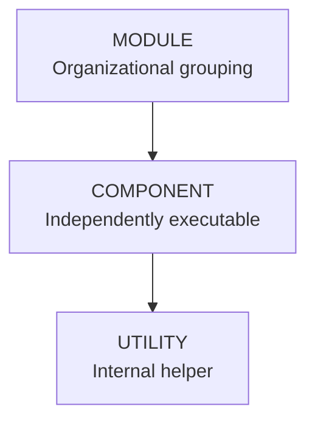
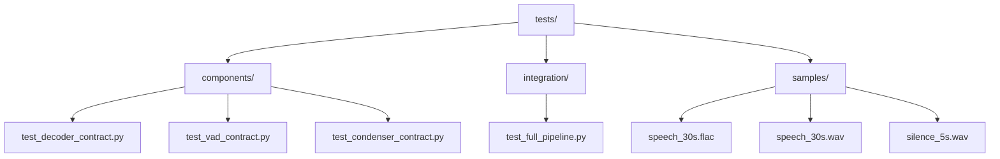
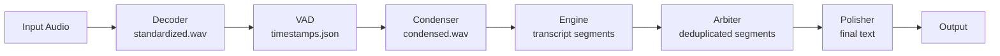
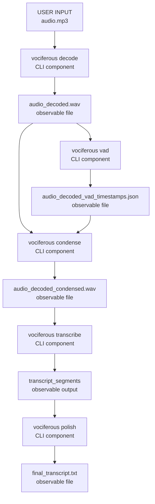

# Vociferous: Executive Architecture Philosophy & Design Principles

**Date:** December 2025  
**Version:** 1.0  
**Status:** Agreed & Implemented (Audio Module), In Progress (Engine Module)

---

## Core Philosophy

### **"Components, Not Monoliths"**

Vociferous is built on the principle that **every meaningful unit of functionality must be independently verifiable, composable, and debuggable.**

**Guiding Principle:**

> If you can't run it from the command line with real files and see real output, it's not a component—it's just code.

---

## Architectural Hierarchy

### **Three-Tier Structure**



### **Definitions**

| Term | Definition | CLI Accessible? | Example |
| --- | --- | --- | --- |
| **Module** | Collection of related components with unified purpose | No  | `audio`, `engines` |
| **Component** | Independently executable, testable, chainable unit | **Yes** | `vociferous decode`, `vociferous vad` |
| **Utility** | Internal helper used by components | No  | `VadWrapper`, `FFmpegHelper` |

---

## Component Design Principles

### **1. Independent Executability**

**Requirement:** Every component must be callable via CLI.

**Example:**

```bash
# Component: Decoder
vociferous decode audio.mp3
# ✅ Runs standalone, no dependencies on other components

# Component: VAD
vociferous vad audio_decoded.wav
# ✅ Runs standalone, operates on standardized input

# Component: Condenser
vociferous condense timestamps.json audio_decoded.wav
# ✅ Runs standalone, explicit dependencies
```

**Anti-pattern:**

```python
# ❌ This is NOT a component (no CLI interface)
class InternalAudioProcessor:
    def process(self, data): ... 
```

---

### **2. Observable Outputs**

**Requirement:** Components must produce real, inspectable files.

**Example:**

```bash
vociferous decode input.mp3
# → Creates:  input_decoded.wav (you can listen to it)

vociferous vad input_decoded.wav
# → Creates: input_decoded_vad_timestamps.json (you can read it)

vociferous condense timestamps.json input_decoded.wav
# → Creates: input_decoded_condensed.wav (you can verify quality)
```

**Why:** If output is only in memory or internal state, you can't verify correctness.

---

### **3. Manual Chainability**

**Requirement:** Components must be manually chainable for debugging.

**Example:**

```bash
# Debug by running each step manually
vociferous decode lecture.mp3
vociferous vad lecture_decoded.wav
vociferous condense lecture_decoded_vad_timestamps.json lecture_decoded.wav
vlc lecture_decoded_condensed. wav  # ← Listen to verify! 
vociferous transcribe lecture_decoded_condensed. wav
```

**Why:** When the pipeline fails, you can isolate exactly which component broke.

---

### **4. Automatic Composition**

**Requirement:** Provide convenience commands that chain components automatically.

**Example:**

```bash
# Convenience:  runs decode → vad → condense → transcribe → polish
vociferous transcribe-full lecture.mp3
```

**But:** Manual chaining must always remain possible.

---

### **5. Single Responsibility**

**Requirement:** Each component does exactly one thing.

| Component | Responsibility | NOT Responsible For |
| --- | --- | --- |
| **Decoder** | Normalize to PCM mono 16kHz | ❌ VAD, ❌ Transcription |
| **VAD** | Detect speech boundaries | ❌ Audio format, ❌ Silence removal |
| **Condenser** | Remove silence using timestamps | ❌ VAD detection, ❌ Decoding |
| **Recorder** | Capture microphone audio | ❌ Preprocessing, ❌ Transcription |
| **Engine** | Convert speech to text | ❌ Audio preprocessing, ❌ VAD |

**Anti-pattern:**

```python
# ❌ Engine doing VAD (violates single responsibility)
class WhisperEngine:
    def transcribe(self, audio):
        # Detect speech (❌ should be separate component)
        vad_segments = self.detect_speech(audio)
        # Remove silence (❌ should be separate component)
        clean_audio = self.remove_silence(audio, vad_segments)
        # Transcribe (✅ correct responsibility)
        return self.transcribe(clean_audio)
```

---

### **6. Fail Loudly**

**Requirement:** Components must fail with clear error messages, not silent failures.

**Example:**

```bash
$ vociferous condense missing. json audio.wav
❌ Error:  Timestamps file not found:  missing.json

$ vociferous decode invalid.txt
❌ Error: Not a valid audio file: invalid.txt
```

**Anti-pattern:**

```python
# ❌ Silent failure (returns empty, no error)
def detect_speech(audio):
    try:
        return vad.process(audio)
    except:
        return []  # ❌ Hides the problem! 
```

---

## Testing Philosophy

### **"No Mocks, Real Files Only"**

**Problem Identified:**

- Had 100+ mock-based unit tests
  
- All tests passed ✅
  
- Program was completely broken 🔴
  

**Root Cause:** Tests tested mocks, not real behavior.

---

### **New Testing Standard**

**Requirement:** Tests must use real files and subprocess calls.

**Example:**

```python
def test_vad_detects_speech():
    """VAD detects speech in real audio file."""

    # ✅ Real file
    audio_file = Path("samples/speech_30s.wav")

    # ✅ Real CLI call
    result = subprocess.run(
        ["vociferous", "vad", str(audio_file)],
        capture_output=True,
        timeout=30,  # ← Catches hangs! 
    )

    # ✅ Real output verification
    assert result.returncode == 0
    timestamps_file = Path("speech_30s_vad_timestamps.json")
    assert timestamps_file.exists()

    with open(timestamps_file) as f:
        timestamps = json.load(f)
    assert len(timestamps) > 0
```

**Why This Works:**

- If component hangs → timeout catches it
  
- If component fails → returncode ≠ 0
  
- If output wrong → file assertions fail
  
- **Tests prove real behavior, not mocked behavior**
  

---

### **Test Organization**



**Principle:** If a test passes, the component works. If it fails, the component is broken.

---

## Data Flow Architecture

### **Linear Pipeline, No Cycles**



**Key Principles:**

- Each stage produces a **file** (not just in-memory data)
  
- Each stage can be **run independently**
  
- No component depends on another component's **internal state**
  
- Data flows **forward only** (no backwards dependencies)
  

---

## Separation of Concerns

### **Audio Module vs Engine Module**

| Concern | Audio Module | Engine Module |
| --- | --- | --- |
| **Responsibility** | Prepare audio for transcription | Convert speech to text |
| **Operations** | Decode, VAD, condense, record | Transcribe, deduplicate |
| **Output** | Clean audio files | Text segments |
| **No Overlap** | ❌ No transcription | ❌ No audio preprocessing |

**Anti-pattern (Old Architecture):**

```python
# ❌ Engine doing audio preprocessing
class WhisperEngine:
    def __init__(self, vad_service):  # ❌ Shouldn't have VAD
        self.vad = vad_service

    def transcribe(self, audio):
        # ❌ Engine shouldn't do VAD
        segments = self.vad.detect_speech(audio)
        # ❌ Engine shouldn't remove silence
        clean = self.remove_silence(audio, segments)
        return self.whisper_model.transcribe(clean)
```

**Correct Architecture:**

```python
# ✅ Audio Module handles preprocessing
decoded = decoder.decode("audio.mp3")
timestamps = vad.detect_speech(decoded)
condensed = condenser.condense(decoded, timestamps)

# ✅ Engine only transcribes
segments = engine.transcribe(condensed)
```

---

## Batch vs Streaming

### **Design Decision: Batch Processing**

**Rationale:**

- Audio is **already fully preprocessed** (decoded, VAD'd, condensed)
  
- ML models (Whisper, Canary-Qwen) work best on **complete files**
  
- Streaming adds complexity without benefit
  

**Architecture:**

```python
# ✅ Simple batch interface
class TranscriptionEngine:
    def transcribe_file(self, audio_path:  Path) -> list[TranscriptSegment]:
        """Transcribe entire file in one operation."""
        ... 
```

**Anti-pattern (Old Architecture):**

```python
# ❌ Unnecessary streaming complexity
class TranscriptionEngine:
    def start(self): ...
    def push_audio(self, chunk:  bytes): ...  # Why chunks?
    def flush(): ...
    def poll_segments(): ...  # When to poll?
```

**Why Batch Wins:**

- Simpler (no buffering state)
  
- Matches model APIs
  
- Eliminates overlap/duplicate issues
  
- Easier to test
  

---

## Configuration Philosophy

### **Sane Defaults, Explicit Overrides**

**Principle:** System should work out-of-the-box, but allow customization.

**Example:**

```bash
# ✅ Works with defaults
vociferous transcribe audio.mp3

# ✅ Override when needed
vociferous transcribe audio.mp3 \
  --engine canary_qwen \
  --language es \
  --refine
```

**Configuration Hierarchy:**

1. **Hardcoded defaults** (in code)
  
2. **Config file** (`~/.config/vociferous/config.toml`)
  
3. **CLI flags** (highest priority)
  

---

## Error Handling Strategy

### **Fail Fast, Fail Clear**

**Principle:** Better to crash with a clear error than continue silently broken.

**Example:**

```python
# ✅ Explicit validation
def condense(audio_path:  Path, timestamps_path: Path):
    if not timestamps_path.exists():
        raise FileNotFoundError(
            f"Timestamps file not found: {timestamps_path}\n"
            f"Run 'vociferous vad {audio_path}' first."
        )

    timestamps = json.loads(timestamps_path.read_text())
    if not timestamps:
        raise ValueError(
            f"No speech detected in {audio_path}.\n"
            f"Audio may be silent or VAD threshold too high."
        )

    # ... proceed with condensation
```

**Anti-pattern:**

```python
# ❌ Silent failure
def condense(audio_path, timestamps_path):
    try:
        timestamps = json.loads(timestamps_path.read_text())
    except: 
        timestamps = []  # ❌ Hides the problem!

    if not timestamps:
        return audio_path  # ❌ No error, user doesn't know it failed
```

---

## Dependency Management

### **Components Declare Dependencies Explicitly**

**Principle:** If Component B needs Component A's output, it should **require the file**, not call Component A internally.

**Example:**

```bash
# ✅ Explicit dependency (user provides VAD output)
vociferous condense timestamps.json audio.wav

# ❌ Implicit dependency (condenser calls VAD internally)
# This would hide the VAD step and make debugging impossible
vociferous condense audio.wav  # Where are timestamps?
```

**Why:** Makes data flow visible and debuggable.

---

## Performance Optimization Strategy

### **Correctness First, Speed Second**

**Principle:** Optimize only after proving correctness.

**Workflow:**

1. Implement simple, correct version
  
2. Test thoroughly with real files
  
3. Profile to find bottlenecks
  
4. Optimize hot paths only
  
5. Re-test to ensure correctness preserved
  

**Example:**

```python
# Phase 1: Correct but slow
def condense(audio, timestamps):
    segments = []
    for start, end in timestamps:
        segment = extract_audio_range(audio, start, end)
        segments.append(segment)
    return concatenate(segments)

# Phase 2: Optimized (only after profiling showed this was slow)
def condense(audio, timestamps):
    # Use FFmpeg concat demuxer (O(n) instead of O(n²))
    return ffmpeg_concat_segments(audio, timestamps)
```

---

## Documentation Standards

### **Every Component Needs:**

1. **Purpose** - What does it do?
  
2. **CLI Usage** - How to run it?
  
3. **Input Format** - What does it expect?
  
4. **Output Format** - What does it produce?
  
5. **Example** - Real command with real files
  
6. **Error Cases** - What can go wrong?
  

**Example:**

````markdown
## Condenser Component

**Purpose:** Remove silence from audio using VAD timestamps.

**Usage:**
```bash
vociferous condense <timestamps.json> <audio.wav> [--output <path>]
````

**Input:**

- `timestamps.json`: Speech boundaries from VAD (format: `[{"start": 0.0, "end": 2.5}, ...]`)
  
- `audio.wav`: Decoded audio file (PCM mono 16kHz)
  

**Output:**

- Condensed WAV file with silence removed

**Example:**

```bash
vociferous vad lecture.wav
vociferous condense lecture_vad_timestamps.json lecture.wav
# → Creates lecture_condensed.wav
```

**Errors:**

- `FileNotFoundError`: Timestamps file doesn't exist
  
- `ValueError`: Timestamps list is empty (no speech detected)
  
---

## Version Control Strategy

### **Commit Message Standard**

**Format:**
Commit messages must follow this structure and be limited to a single affected file or logical change:

```markdown
[CREATE/UPDATE/DELETE]: file1, file2, ...
```

**Changes:**

- A bullet point description of what changed
- Why it changed
- Impact on system
  
**Testing:**

- A bullet point description of tests added/modified
- What scenarios are covered
- How it ensures correctness

**Example:**

```markdown
[CREATE]: vociferous/audio/components/vad.py, tests/components/test_vad_contract.py

**Changes:**

- Added VAD component with CLI interface
- Implements speech boundary detection using Silero
- Returns timestamps as JSON for downstream components

**Testing:**

- Added contract test using real 30s audio sample
- Verifies JSON output format and timestamp validity
- Includes timeout protection (catches hangs)
```

---

## Deprecation Policy

### **Don't Break, Replace**

**Principle:** When refactoring, keep old interface working until new interface proven.

**Workflow:**

1. Implement new interface
2. Add tests for new interface
3. Mark old interface as deprecated
4. Run both in parallel for one release
5. Remove old interface only after new one stable

**Example:**

```python
# Old interface (deprecated but still works)
@deprecated("Use transcribe_file() instead")
def push_audio(self, chunk: bytes):
    # ...code

# New interface
def transcribe_file(self, audio_path: Path):
    # ... code
```

## Summary: Core Tenets

1. **Components over monoliths** - Every meaningful unit must be independently executable
  
2. **Real files over mocks** - Tests must use actual I/O to prove correctness
  
3. **Observable outputs** - Every component produces inspectable files
  
4. **Manual chainability** - Pipeline must be debuggable step-by-step
  
5. **Single responsibility** - Each component does exactly one thing
  
6. **Fail loudly** - Explicit errors over silent failures
  
7. **Batch over streaming** - Simpler architecture for preprocessed audio
  
8. **Separation of concerns** - Audio preprocessing ≠ transcription
  
9. **Correctness first** - Optimize only after proving correctness
  
10. **Sane defaults** - Works out-of-the-box, customizable when needed
  

---

## Architecture Diagram



Each arrow (→) is: 
✅ Independently testable 
✅ Manually runnable 
✅ Produces observable output 
✅ Single responsibility

---

**This is the agreed architecture philosophy for Vociferous.** All future development must adhere to these principles.