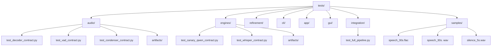

# Issues Batch 1 (Critical Priority - Do First)

---

## Issue #1: [UPDATE] Rewrite ARCHITECTURE.md to reflect Canary-Qwen dual-pass design

**Labels:** `documentation`, `architecture`, `high-priority`

### Description

The ARCHITECTURE.md file contains several inaccuracies and outdated design decisions that need to be corrected based on our architectural review: 

### Changes Required

1. **Remove over-engineered components:**
   
   - Delete all references to `SegmentArbiter` (over-engineering, will be removed in separate issue)
   - Remove `TranscriptionSession` references (violates manual chainability principle)

2. **Update Canary-Qwen dual-pass architecture:**
   
   - Replace "Polisher" with "Refiner" throughout
   - Document Canary-Qwen dual-pass design: 
     - Pass 1: ASR mode (speech → raw text)
     - Pass 2: LLM mode (raw text → refined text)
     - Model stays loaded between passes (optimization)
   - Update data flow diagram to show:  `Decoder → VAD → Condenser → Canary ASR → Canary Refiner → Output`

3. **Clarify batch vs streaming:**
   
   - Add clear explanation:  Batch = complete file in, complete result out
   - Explain use case: User submits complete audio files (not continuous streams)
   - Document why batch is correct for Vociferous (simpler, matches ML APIs, matches use case)
   - Remove any ambiguity about streaming interfaces

4. **Fix terminology:**
   
   - Change "Submodule" to "Utility" throughout (already fixed in table, verify elsewhere)
   - Ensure consistent use of Module/Component/Utility hierarchy

5. **Add comprehensive module documentation:**
   
   - Add all 9 modules to documentation:  `audio`, `engines`, `refinement`, `cli`, `app`, `config`, `domain`, `sources`, `gui`
   - Create module table with purposes and responsibilities
   - Clarify which modules contain CLI-accessible components

6. **Fix Single Responsibility table:**
   
   - Remove "Engine" row (it's a module, not a component)
   - Add note clarifying engines are infrastructure called by workflows, not CLI components

7. **Add Artifact Management section:**
   
   - Document test artifact persistence:  `tests/<module>/artifacts/` (files overwritten each run)
   - Document user-facing behavior: temp files by default, `--keep-intermediates` flag for debugging
   - Document manual component execution: always keeps files

8. **Update architecture diagram:**
   
   - Distinguish components (CLI-accessible) from workflow orchestrators
   - Show `transcribe` as workflow that calls components internally (dotted lines)
   - Show Canary ASR and Refiner as internal (not CLI-accessible)
   - Use solid lines for data flow, dotted lines for orchestration

9. **Update test organization diagram:**
   
   - Restructure mermaid diagram to show module-based test folders
   - Show `tests/audio/`, `tests/engines/`, `tests/refinement/`, `tests/cli/`, `tests/app/`, `tests/gui/`, `tests/integration/`, `tests/samples/`

10. **Add user help vs dev help documentation:**
    
    - Document `--help` (user-facing:  transcribe, languages, check)
    - Document `--dev-help` (developer-facing: decode, vad, condense, refine, record)

### Success Criteria

- [ ] All SegmentArbiter references removed
- [ ] All TranscriptionSession references removed
- [ ] Canary dual-pass architecture documented with diagram
- [ ] Batch vs streaming section rewritten with clear explanations
- [ ] All 9 modules listed and documented
- [ ] "Utility" terminology used consistently (no "Submodule")
- [ ] Single Responsibility table fixed (no "Engine" row)
- [ ] Artifact Management section added
- [ ] Architecture diagram rewritten (components vs workflows)
- [ ] Test organization diagram updated (module-based structure)
- [ ] Help flag system documented

### Related Issues

- Blocks:  #5 (Delete SegmentArbiter), #6 (Delete TranscriptionSession), #8 (Rename polish module)
- Related: #2 (Add module architecture documentation), #3 (Document help flags)

### Notes

This will be implemented as a **Pull Request** to update the architecture file. The updated ARCHITECTURE.md has been drafted and is ready for review. 

---

## Issue #2: [UPDATE] Add module architecture documentation

**Labels:** `documentation`, `architecture`

### Description

The current ARCHITECTURE.md focuses primarily on components but lacks comprehensive documentation about the module structure.  We need to clearly define what constitutes a module and document all modules in the system.

### Problem

- "Module" is used throughout but never formally defined
- Only `audio` and `engines` modules are documented in detail
- 7 other modules exist but are not documented (`refinement`, `cli`, `app`, `config`, `domain`, `sources`, `gui`)
- Unclear which modules contain CLI-accessible components vs infrastructure

### Required Documentation

1. **Define "Module" formally:**
   
   ```
   A module is a logical collection of related functionality.  Not all modules need 
   CLI-accessible components - some provide infrastructure (config, domain), 
   orchestration (app), or interfaces (cli, gui).
   ```

2. **Create comprehensive module table:**
   
   | Module         | Purpose                      | Contains Components? | Key Responsibilities                             |
   | -------------- | ---------------------------- | -------------------- | ------------------------------------------------ |
   | **audio**      | Audio preprocessing          | ✅ Yes                | Decode, VAD, condense, record                    |
   | **engines**    | Speech-to-text transcription | ❌ No*                | Canary, Whisper, Voxtral (called by workflows)   |
   | **refinement** | Text post-processing         | ✅ Yes                | Grammar/punctuation refinement (Canary LLM pass) |
   | **cli**        | Command-line interface       | ✅ Yes                | Typer commands, argument parsing                 |
   | **app**        | Workflow orchestration       | ❌ No                 | Pipeline coordination, config resolution         |
   | **config**     | Configuration management     | ❌ No                 | Load/validate settings from files/CLI            |
   | **domain**     | Core types and contracts     | ❌ No                 | Models, exceptions, protocols                    |
   | **sources**    | Audio input sources          | ❌ No                 | File readers, microphone capture                 |
   | **gui**        | Graphical interface          | ❌ No                 | KivyMD application, screens                      |
   
   *Note:  Engines are not directly CLI-accessible.  They are infrastructure called by the `transcribe` workflow.

3. **Document module boundaries:**
   
   - What belongs in each module
   - What does NOT belong in each module
   - How modules interact (audio → engines via preprocessed files)

4. **Clarify infrastructure vs components:**
   
   - Not all modules need CLI components
   - Some modules provide infrastructure (config, domain, sources)
   - Some modules provide orchestration (app)
   - Some modules provide interfaces (cli, gui)

### Location in ARCHITECTURE.md

Add new section:  "Module Architecture" under "Separation of Concerns"

### Success Criteria

- [ ] "Module" formally defined
- [ ] Table listing all 9 modules with purposes
- [ ] Each module's responsibilities documented
- [ ] Clear indication of which modules contain components
- [ ] Module boundaries and interactions explained
- [ ] Infrastructure vs component distinction clarified

### Related Issues

- Part of:  #1 (Rewrite ARCHITECTURE.md)
- Related: #8 (Rename polish to refinement)

---

## Issue #3: [CREATE] Document user help vs dev help CLI flag structure

**Labels:** `documentation`, `enhancement`, `cli`

### Description

Vociferous should have a two-tier help system to separate user-facing convenience commands from developer/debugging components. This needs to be documented in ARCHITECTURE.md and implemented in the CLI.

### Rationale

**Problem:**

- End users don't need to see low-level components (decode, vad, condense)
- Developers need access to all components for debugging
- Current help output shows everything (cluttered)

**Solution:**
Two help flags with different audiences: 

### `--help` (User-Facing)

Shows high-level commands for typical use: 

- `transcribe` - Main workflow (audio file → transcript)
- `languages` - List supported language codes
- `check` - Verify system prerequisites (ffmpeg, dependencies)

**Example output:**

```bash
$ vociferous --help

Usage: vociferous [OPTIONS] COMMAND

Vociferous - Local-first AI transcription

Commands:
  transcribe  Transcribe audio file to text
  languages   List supported language codes
  check       Verify system prerequisites

Use 'vociferous --dev-help' to see developer commands. 
```

### `--dev-help` (Developer-Facing)

Shows all components for manual debugging:

- `decode` - Normalize audio to PCM mono 16kHz
- `vad` - Detect speech boundaries (VAD)
- `condense` - Remove silence using VAD timestamps
- `refine` - Polish transcript grammar/punctuation
- `record` - Capture microphone audio
- Plus all other internal components

**Example output:**

```bash
$ vociferous --dev-help

Usage: vociferous [OPTIONS] COMMAND

Developer Commands (for debugging and manual pipelines):

Audio Components:
  decode     Normalize audio to PCM mono 16kHz
  vad        Detect speech boundaries
  condense   Remove silence using timestamps
  record     Capture microphone audio

Workflow Commands:
  transcribe Main transcription workflow
  refine     Refine transcript text

...  (full list)
```

### Documentation Requirements

1. **Add to ARCHITECTURE.md:**
   
   - New section: "CLI Design - Two-Tier Help System"
   - Explain rationale (UX for users, transparency for developers)
   - Show example outputs
   - List what goes in each help tier

2. **Add to README.md:**
   
   - Show both help flags in usage examples
   - Explain when to use each

3. **Code comments:**
   
   - Document in CLI module how to categorize commands

### Success Criteria

- [ ] Section added to ARCHITECTURE.md documenting help tiers
- [ ] Clear criteria for what goes in user help vs dev help
- [ ] Example outputs shown in documentation
- [ ] README.md updated with help flag examples
- [ ] Related implementation issue created (separate from docs)

### Related Issues

- Part of: #1 (Rewrite ARCHITECTURE.md)
- Blocks: #15 (Implement help flag system - separate implementation issue)

### Notes

This issue is **documentation-only**. The actual implementation of the help flag system will be tracked in issue #15.

---

## Issue #4: [UPDATE] README.md - Remove streaming interface references

**Labels:** `documentation`, `bug`, `architecture`

### Description

The README.md currently describes engines as "stateful and push-based" with a streaming interface, but ARCHITECTURE.md clearly states Vociferous uses batch processing. This contradiction needs to be fixed.

### Current Problem

**README.md line 27 says:**

```
Engines are stateful and push-based:  start() → push_audio() → flush() → poll_segments()
```

**This is wrong because:**

- Vociferous uses batch processing (complete file in, complete result out)
- User submits complete audio files, not continuous streams
- ML models (Canary, Whisper) work best on complete files
- Streaming adds unnecessary complexity for our use case

### Required Changes

1. **Remove streaming terminology:**
   
   - Delete references to `start()`, `push_audio()`, `flush()`, `poll_segments()`
   - Remove "stateful and push-based" description

2. **Document batch interface:**
   
   ```markdown
   ## Engine Interface
   
   Engines use a simple batch interface:
   
   ```python
   segments = engine.transcribe_file(audio_path)
   ```
   
   The engine receives a preprocessed audio file (decoded, VAD-filtered, silence removed) 
   and returns the complete transcript in one operation.
   
   ```
   
   ```

3. **Clarify preprocessing pipeline:**
   
   ```markdown
   ## Audio Pipeline
   
   Before transcription, audio is preprocessed in stages:
   1. **Decode:** Normalize to PCM mono 16kHz
   2. **VAD:** Detect speech boundaries
   3. **Condense:** Remove silence
   4. **Transcribe:** Engine receives clean, condensed audio
   
   Each stage is batch processing - complete file in, complete file out.
   ```

4. **Update engine descriptions:**
   
   - `whisper_turbo` - Batch processing via CTranslate2
   - `voxtral_local` - Batch processing via transformers
   - `canary_qwen` - Batch processing with dual-pass (ASR + refinement)

5. **Add note about why batch:**
   
   ```markdown
   **Why Batch Processing? **
   - User submits complete audio files (not live streams)
   - ML models work best on complete audio
   - Simpler architecture (no state management)
   - Easier to test and debug
   ```

### Files to Update

- `README.md` (main file)
- `docs/ENGINE_BATCH_INTERFACE.md` (if it contradicts, update or remove)
- Any other docs that mention streaming

### Success Criteria

- [ ] All streaming interface references removed from README
- [ ] Batch interface documented with code examples
- [ ] Pipeline stages explained (all batch)
- [ ] Rationale for batch processing included
- [ ] Engine descriptions updated to reflect batch processing
- [ ] No contradictions between README and ARCHITECTURE. md

### Related Issues

- Related: #1 (Rewrite ARCHITECTURE.md - batch vs streaming section)
- Related: #21 (Standardize engine interface to batch-only - code changes)

### Notes

This is a **documentation-only** change.  The actual code refactoring to remove streaming interfaces is tracked in issue #21.

---

# Issues Batch 2 (Critical Priority - Refactoring)

---

## Issue #5: [DELETE] Remove SegmentArbiter (over-engineering)

**Labels:** `refactor`, `architecture`, `breaking-change`, `high-priority`

### Description

The `SegmentArbiter` class is over-engineered and solving a problem that shouldn't exist. It attempts to resolve "double-chunking" where both VAD and ASR engines apply their own segmentation, causing overlapping and fragmented segments.  

### Why It Should Be Deleted

**Root Cause:** The arbiter is a band-aid for poor separation of concerns. 

**The Real Problem:**

- VAD (audio preprocessing) produces speech boundaries
- Condenser removes silence using those boundaries
- Engine should transcribe the **already-preprocessed audio** without re-segmenting
- If both VAD and engine are segmenting, they're not cleanly separated

**The Solution:** 
Clean preprocessing separation eliminates the need for arbitration: 

1. VAD detects speech boundaries \u2192 timestamps. json
2. Condenser removes silence \u2192 condensed. wav (clean audio, no gaps)
3. Engine transcribes condensed. wav **without segmentation** \u2192 segments
4. No overlap = no arbiter needed

**From our conversation:**

> "The Segment Arbiter, honestly, the whole Arbiter thing is super fucking confusing.  It really shouldn't be a thing...  I think it might even be an over-engineering and duplicate-engineering issue."

### Files to Remove

- `vociferous/app/arbiter.py` (entire file)
- Any imports of `SegmentArbiter` in other files
- Any tests specifically for arbiter logic

### Code Changes Required

1. **Remove from data flow pipeline:**
   
   - Current:   `Engine \u2192 Arbiter \u2192 Polisher \u2192 Output`
   - New: `Engine \u2192 Refiner \u2192 Output`

2. **Update pipeline implementations:**
   
   - Remove arbiter instantiation
   - Remove arbiter calls
   - Engine output goes directly to refiner (or output if no refinement)

3. **Remove from architecture diagram:**
   
   - Update ARCHITECTURE.md diagrams (tracked in issue #1)
   - Remove any arbiter documentation

4. **Verify no overlap occurs:**
   
   - Add integration test to verify engine produces non-overlapping segments
   - Test should fail if overlap detected (proves arbiter was unnecessary)

### Migration Path

**Before (with arbiter):**

```python
# Engine produces segments (potentially overlapping)
engine_segments = engine.transcribe(audio)

# Arbiter deduplicates using LCS alignment
arbiter = SegmentArbiter()
clean_segments = arbiter.resolve(engine_segments)

# Polisher refines
final = polisher.polish(clean_segments)
```

**After (no arbiter):**

```python
# Engine receives preprocessed audio (VAD already applied)
# Engine produces clean segments (no overlap)
segments = engine.transcribe_file(condensed_audio_path)

# Refiner polishes directly
final = refiner.refine(segments)
```

### Testing Requirements

**Add integration test to verify clean separation:**

```python
def test_engine_produces_non_overlapping_segments():
    """Verify engine output has no overlaps (proves arbiter unnecessary)."""

    # Preprocess audio
    decoded = decode("sample.mp3")
    timestamps = vad. detect(decoded)
    condensed = condense(decoded, timestamps)

    # Transcribe
    segments = engine. transcribe_file(condensed)

    # Verify no overlaps
    for i in range(len(segments) - 1):
        assert segments[i].end_s <= segments[i+1].start_s, \
            f"Overlap detected: segment {i} ends at {segments[i].end_s}, " \
            f"segment {i+1} starts at {segments[i+1].start_s}"
```

### Success Criteria

- [ ] `vociferous/app/arbiter. py` deleted
- [ ] All arbiter imports removed
- [ ] Pipeline updated to skip arbiter step
- [ ] Architecture diagram updated (in issue #1)
- [ ] Integration test added proving no overlap occurs
- [ ] All existing tests pass without arbiter
- [ ] No regression in transcript quality

### Related Issues

- Blocked by: #1 (Update ARCHITECTURE.md - remove arbiter from diagrams)
- Related: #6 (Delete TranscriptionSession), #7 (Redesign transcribe command)
- Related: #9 (Implement Canary dual-pass - clean engine interface)

### Breaking Changes

\u26a0\ufe0f **This is a breaking change** if anyone is using `SegmentArbiter` directly (unlikely since it's internal).

### Notes

The arbiter uses LCS (Longest Common Subsequence) alignment for deduplication.  If we discover overlap issues after removal, the real fix is to ensure VAD+Condenser preprocessing is correct, **not to add the arbiter back**.

---

## Issue #6: [REFACTOR] Delete TranscriptionSession orchestrator

**Labels:** `refactor`, `architecture`, `breaking-change`, `high-priority`

### Description

The `TranscriptionSession` class violates the "manual chainability" principle by hiding the transcription pipeline behind a stateful session object. It should be replaced with a simple, transparent workflow function that explicitly calls components in sequence.

### Why It Should Be Deleted

**From ARCHITECTURE.md:**

> "No component depends on another component's internal state"

**The Problem:**

- `TranscriptionSession` manages hidden state (sources, engines, sinks)
- Users can't see what the pipeline is doing
- Violates transparency and debuggability principles
- Makes it impossible to inspect intermediate steps

**From our conversation:**

> "TranscriptionSession is an orchestrator that violates the chainability principle...  It deserves a redesign.  It really does."

### Current Architecture (Bad)

```python
# Hidden pipeline inside session
session = TranscriptionSession()
session.start(source, engine, sink, options)
session.join()

# What's happening?  No idea.  
# Can't inspect intermediate outputs.
# Can't debug individual steps.
```

### Proposed Architecture (Good)

```python
# Transparent workflow - explicitly calls components
def transcribe_workflow(audio_path:  Path, engine:  str = "canary_qwen") -> str:
    """Transcribe audio file through complete pipeline. 

    Pipeline:  decode \u2192 vad \u2192 condense \u2192 asr \u2192 refine
    """
    # Each step is explicit and debuggable
    decoded_path = decoder_component.decode(audio_path)
    timestamps_path = vad_component. detect(decoded_path)
    condensed_path = condenser_component.condense(decoded_path, timestamps_path)

    # Canary dual-pass
    raw_segments = canary_engine.transcribe_file(condensed_path)
    refined_text = canary_refiner.refine(raw_segments)

    return refined_text
```

### Files to Change

1. **Remove `TranscriptionSession` class:**
   
   - File: `vociferous/app/session.py` (or wherever it lives)
   - Delete entire class

2. **Create simple workflow function:**
   
   - File: `vociferous/app/workflow.py` (new)
   - Simple function that chains components
   - No state, no session management

3. **Update CLI commands:**
   
   - `vociferous transcribe` should call workflow function directly
   - Remove session instantiation
   - Make pipeline transparent

4. **Update tests:**
   
   - Remove session-based tests
   - Add workflow function tests
   - Verify each step of workflow is testable independently

### Workflow Function Design

```python
# vociferous/app/workflow.py

from pathlib import Path
from vociferous.audio. components import DecoderComponent, VADComponent, CondenserComponent
from vociferous.engines. factory import build_engine
from vociferous. refinement import Refiner

def transcribe_workflow(
    audio_path: Path,
    *,
    engine: str = "canary_qwen",
    language: str = "en",
    output_path: Path | None = None,
    keep_intermediates: bool = False,
) -> str:
    """Execute complete transcription pipeline.

    Pipeline: 
        1. Decode - Normalize to PCM mono 16kHz
        2. VAD - Detect speech boundaries
        3. Condense - Remove silence
        4. ASR - Transcribe to raw text
        5. Refine - Polish grammar/punctuation

    Args:
        audio_path: Input audio file
        engine:  Transcription engine (default: canary_qwen)
        language: Language code (default: en)
        output_path: Optional output file
        keep_intermediates: Keep intermediate files for debugging

    Returns:
        Final refined transcript text
    """
    # Step 1: Decode
    decoder = DecoderComponent()
    decoded_path = decoder. decode_to_wav(audio_path)

    # Step 2: VAD
    vad = VADComponent()
    timestamps_path = vad.detect(decoded_path)

    # Step 3: Condense
    condenser = CondenserComponent()
    condensed_path = condenser. condense(timestamps_path, decoded_path)

    # Step 4: Transcribe
    engine_adapter = build_engine(engine, config)
    raw_segments = engine_adapter.transcribe_file(condensed_path)

    # Step 5: Refine (Canary LLM pass)
    refiner = Refiner()
    final_text = refiner.refine(raw_segments)

    # Cleanup intermediates unless debugging
    if not keep_intermediates:
        decoded_path.unlink(missing_ok=True)
        timestamps_path.unlink(missing_ok=True)
        condensed_path.unlink(missing_ok=True)

    # Write output
    if output_path: 
        output_path.write_text(final_text)

    return final_text
```

### Benefits of New Design

\u2705 **Transparent:** Every step is visible in code  
\u2705 **Debuggable:** Can add breakpoints between steps  
\u2705 **Testable:** Each step can be verified independently  
\u2705 **No state:** Pure function, easier to reason about  
\u2705 **Composable:** Easy to customize pipeline for different use cases  

### Success Criteria

- [ ] `TranscriptionSession` class deleted
- [ ] Workflow function created with explicit component calls
- [ ] CLI updated to use workflow function
- [ ] All tests pass with new workflow
- [ ] No hidden state or session management
- [ ] Pipeline steps are visible in code
- [ ] Intermediate files can be inspected with `--keep-intermediates`

### Related Issues

- Blocked by: #1 (Update ARCHITECTURE.md - remove TranscriptionSession references)
- Related: #5 (Delete SegmentArbiter)
- Related: #7 (Redesign transcribe command)
- Blocks: #14 (Add full pipeline integration test)

### Breaking Changes

\u26a0\ufe0f **This is a breaking change** if anyone is using `TranscriptionSession` API directly (unlikely since it's internal).

### Migration Guide

**Old API (deprecated):**

```python
from vociferous.app import TranscriptionSession

session = TranscriptionSession()
session.start(source, engine, sink, options)
session.join()
```

**New API:**

```python
from vociferous.app. workflow import transcribe_workflow

transcript = transcribe_workflow(
    audio_path="audio.mp3",
    engine="canary_qwen",
    output_path="transcript.txt"
)
```

---

## Issue #7: [REFACTOR] Redesign `transcribe` command as workflow orchestrator

**Labels:** `refactor`, `cli`, `high-priority`, `architecture`

### Description

The current `transcribe` command is monolithic, contains complex config resolution logic, and obscures the actual pipeline.  It needs to be redesigned as a simple workflow orchestrator that explicitly calls components in sequence.

### Current Problems

**From our conversation:**

> "Yeah, it's monolithic.  It's disgusting. And it needs to be slaughtered and rebuilt from the ground up."

**Issues with current implementation:**

1. Config resolution is complex and inline
2. Pipeline is hidden - can't see what's happening
3. Mixes concerns (CLI parsing + workflow execution + config resolution)
4. Hard to debug (can't inspect intermediate steps)
5. Not a component but acts like one

### What `transcribe` Should Be

**It's a WORKFLOW ORCHESTRATOR, not a component.**

**Clear distinction:**

- \u274c NOT a component (not independently testable, doesn't produce single observable output)
- \u2705 IS a convenience wrapper that calls components in sequence
- \u2705 Should be transparent (user can see what it's doing)
- \u2705 Should delegate to workflow function (issue #6)

### Proposed Design

```python
# vociferous/cli/commands/transcribe.py

@app.command("transcribe")
def transcribe_cmd(
    file: Path = typer.Argument(..., help="Audio file to transcribe"),
    engine: str = typer. Option("canary_qwen", "--engine", "-e"),
    language: str = typer.Option("en", "--language", "-l"),
    output: Path | None = typer.Option(None, "--output", "-o"),
    keep_intermediates: bool = typer.Option(
        False, 
        "--keep-intermediates",
        help="Keep decoded/vad/condensed files for debugging"
    ),
    preset: str | None = typer.Option(None, "--preset", "-p"),
) -> None:
    """Transcribe audio file to text.

    This is a convenience workflow that runs: 
      1. decode - Normalize audio
      2. vad - Detect speech
      3. condense - Remove silence
      4. transcribe - ASR to text
      5. refine - Polish output

    For manual debugging, run components individually: 
      vociferous decode audio.mp3
      vociferous vad audio_decoded.wav
      vociferous condense timestamps.json audio_decoded.wav
      ... 

    See 'vociferous --dev-help' for individual components.
    """
    # Simple:  load config, call workflow
    config = load_config()

    try:
        transcript = transcribe_workflow(
            audio_path=file,
            engine=engine,
            language=language,
            output_path=output,
            keep_intermediates=keep_intermediates,
            config=config,
        )

        if not output:
            # Print to stdout if no output file
            typer.echo(transcript)

    except FileNotFoundError as e:
        typer.echo(f"Error: {e}", err=True)
        raise typer.Exit(code=2)
    except Exception as e: 
        typer.echo(f"Transcription failed: {e}", err=True)
        raise typer.Exit(code=1)
```

### Key Changes

1. **Remove inline config resolution:**
   
   - Delegate to `config` module
   - Don't mix config logic with CLI logic

2. **Remove inline pipeline execution:**
   
   - Delegate to `workflow` function (issue #6)
   - Don't hide what's happening

3. **Add `--keep-intermediates` flag:**
   
   - Default: clean up temp files
   - Flag: keep all intermediate files for debugging
   - Respects "observable outputs" principle

4. **Clear documentation:**
   
   - Help text explains it's a workflow
   - Points to `--dev-help` for individual components
   - Shows what the workflow does

5. **Simple error handling:**
   
   - Clear error messages
   - Exit codes:  0=success, 1=transcription error, 2=file not found

### Removed Commands

These should NOT exist (not in architecture):

- \u274c `vociferous transcribe-full` (delete)
- \u274c `vociferous transcribe-canary` (delete)

Main `transcribe` command handles everything.  Engine selection via `--engine` flag.

### User Experience

**Simple case (default):**

```bash
vociferous transcribe lecture.mp3
# Output: transcript to stdout
# Temp files cleaned up automatically
```

**Save to file:**

```bash
vociferous transcribe lecture.mp3 -o transcript.txt
```

**Keep intermediates for debugging:**

```bash
vociferous transcribe lecture.mp3 --keep-intermediates
# Creates: 
#   lecture_decoded.wav
#   lecture_vad_timestamps.json
#   lecture_condensed.wav
#   transcript.txt
```

**Manual debugging (component-by-component):**

```bash
vociferous decode lecture.mp3
vociferous vad lecture_decoded.wav
vociferous condense lecture_vad_timestamps.json lecture_decoded.wav
# Inspect condensed audio
vlc lecture_condensed.wav
# Continue if audio looks good
vociferous transcribe lecture_condensed.wav  # (or separate engine command)
```

### Success Criteria

- [ ] `transcribe` command simplified to ~50 lines
- [ ] Delegates config resolution to `config` module
- [ ] Delegates workflow execution to `workflow` function
- [ ] `--keep-intermediates` flag implemented
- [ ] Help text clearly explains it's a workflow orchestrator
- [ ] Points to `--dev-help` for component access
- [ ] `transcribe-full` command deleted
- [ ] `transcribe-canary` command deleted
- [ ] All tests pass
- [ ] User can still manually chain components

### Related Issues

- Blocked by: #6 (Create workflow function)
- Related: #5 (Delete SegmentArbiter)
- Related: #15 (Implement --help vs --dev-help)
- Related: #16 (Add --keep-intermediates flag implementation)

### Breaking Changes

\u26a0\ufe0f **Breaking changes:**

- `transcribe-full` command removed (use `transcribe` instead)
- `transcribe-canary` command removed (use `transcribe --engine canary_qwen`)

### Notes

The goal is:  **Make the pipeline transparent and the command simple.**

Users should understand what `transcribe` does (run components in sequence), and power users should be able to run those components manually.

---

## Issue #8: [RENAME] Rename `polish` module to `refinement`

**Labels:** `refactor`, `architecture`, `breaking-change`

### Description

The `polish` module should be renamed to `refinement` to better reflect the Canary-Qwen architecture, where refinement is a second pass through the Canary model in LLM mode (not a separate polishing step).

### Rationale

**Old terminology:**

- "Polish" implies a separate cleanup step
- Suggests external tool/model for text cleanup

**New terminology:**

- "Refine" accurately describes Canary LLM pass
- Canary model stays loaded, second pass for grammar/punctuation
- Matches dual-pass architecture:   ASR \u2192 Refiner

**From our conversation:**

> "The polisher is technically going to be renamed to refiner...  another pass through Canary, but as an LLM."

### Files to Rename

**Module directory:**

```
vociferous/polish/  \u2192  vociferous/refinement/
```

**Files within module:**

```
polish/base.py      \u2192  refinement/base.py
polish/factory.py   \u2192  refinement/factory.py
polish/__init__.py  \u2192  refinement/__init__.py
```

### Classes to Rename

```python
# Old names
PolisherConfig      \u2192  RefinerConfig
PolishingSink       \u2192  RefiningSink
build_polisher()    \u2192  build_refiner()

# Keep "Polisher" as deprecated alias during migration
```

### Import Updates

**All imports need updating:**

```python
# Old
from vociferous.polish. factory import build_polisher
from vociferous.app. sinks import PolishingSink
from vociferous.polish.base import PolisherConfig

# New
from vociferous.refinement. factory import build_refiner
from vociferous.app.sinks import RefiningSink
from vociferous.refinement.base import RefinerConfig
```

### CLI Updates

**Commands:**

```bash
# Old (if exists)
vociferous polish transcript.txt

# New
vociferous refine transcript.txt
```

**Flags:**

```bash
# Old
--polish / --no-polish
--polish-model
--polish-max-tokens

# New
--refine / --no-refine
--refine-model
--refine-max-tokens
```

### Configuration Updates

**Config file (`~/.config/vociferous/config.toml`):**

```toml
# Old
[polish]
enabled = true
model = "..."

# New
[refinement]
enabled = true
model = "canary-qwen"  # Uses Canary LLM mode
```

### Documentation Updates

1. **ARCHITECTURE.md:**
   
   - Replace "Polisher" with "Refiner" in diagrams
   - Update data flow:  `Engine \u2192 Refiner \u2192 Output`
   - Document Canary LLM refinement pass

2. **README.md:**
   
   - Update all polish references to refine
   - Document refinement as Canary pass 2

3. **Code comments:**
   
   - Update terminology throughout

### Migration Strategy

**Phase 1: Add new names, keep old as aliases**

```python
# Keep both during transition
from vociferous.refinement import RefinerConfig
PolisherConfig = RefinerConfig  # Deprecated alias

@deprecated("Use build_refiner() instead")
def build_polisher(*args, **kwargs):
    return build_refiner(*args, **kwargs)
```

**Phase 2: Update all internal code to use new names**

**Phase 3: Remove deprecated aliases**

- Add warnings when old names used
- Remove aliases in next major version

### Success Criteria

- [ ] Module renamed:  `polish/` \u2192 `refinement/`
- [ ] All classes renamed:   `Polisher*` \u2192 `Refiner*`
- [ ] All imports updated throughout codebase
- [ ] CLI flags updated:  `--polish` \u2192 `--refine`
- [ ] Config file section renamed
- [ ] ARCHITECTURE.md updated (tracked in issue #1)
- [ ] README.md updated
- [ ] All tests pass with new names
- [ ] Deprecated aliases added for migration
- [ ] Documentation updated

### Related Issues

- Blocked by: #1 (Update ARCHITECTURE.md - use "Refiner" terminology)
- Blocked by: #9 (Implement Canary dual-pass - defines what refinement is)
- Related: #10 (Add `vociferous refine` CLI component)

### Breaking Changes

\u26a0\ufe0f **Breaking changes:**

- Config file: `[polish]` \u2192 `[refinement]`
- CLI flags: `--polish` \u2192 `--refine`
- Python API:   `build_polisher()` \u2192 `build_refiner()`

**Mitigation:** Provide deprecated aliases with warnings for one release cycle.

### Notes

This is primarily a terminology change to match the Canary dual-pass architecture. The functionality remains the same (text refinement), but the naming now accurately reflects that it's a second pass through Canary in LLM mode.

---

# Issues Batch 3 (High Priority - Features & Testing)

---

## Issue #9: [CREATE] Implement Canary-Qwen dual-pass architecture

**Labels:** `feature`, `engines`, `high-priority`, `architecture`

### Description

Implement Canary-Qwen as the primary transcription engine using a dual-pass architecture:  Pass 1 performs ASR (speech-to-text), and Pass 2 performs LLM refinement (grammar/punctuation), with the model staying loaded between passes for efficiency.

### Rationale

**From our conversation:**

> "We have decided to abandon both Whisper and Voxtrel as primary ASRs, and instead use Qwen Canary from NVIDIA."

**Why Canary-Qwen? **

- Combines ASR and LLM capabilities in one model
- Dual-pass eliminates need for separate polisher
- Better grammar and punctuation than Whisper alone
- Model stays loaded between passes (efficient)

### Architecture

**Dual-Pass Pipeline:**

```
Audio → Canary (ASR mode) → Raw Transcript → Canary (LLM mode) → Refined Transcript
        [Pass 1]                              [Pass 2]

Model stays loaded in memory between passes (no reload)
```

**Component breakdown:**

1. **Pass 1 - ASR Mode:**
   
   - Input:  Preprocessed audio (decoded, VAD'd, condensed)
   - Output: Raw transcript segments with timestamps
   - Mode: `"asr"` (speech-to-text)

2. **Pass 2 - LLM Mode:**
   
   - Input:  Raw transcript text
   - Output: Refined text (corrected grammar, punctuation, fluency)
   - Mode: `"refine"` (text-to-text)
   - Uses same loaded model (no reload penalty)

### Implementation Requirements

#### 1. Create Canary Engine Class

**File:** `vociferous/engines/canary_qwen.py`

```python
from pathlib import Path
from typing import Literal

from vociferous.domain.model import (
    EngineConfig, 
    TranscriptSegment, 
    TranscriptionOptions
)

class CanaryQwenEngine:
    """NVIDIA Canary-Qwen 2.5B dual-pass transcription engine. 

    Supports two modes:
    - ASR:  Speech-to-text transcription (pass 1)
    - Refine: Text refinement via LLM (pass 2)

    The model stays loaded between passes for efficiency. 
    """

    def __init__(self, config: EngineConfig):
        """Initialize Canary engine. 

        Args:
            config: Engine configuration with model name and device
        """
        self.config = config
        self.model = None  # Lazy load on first use
        self._load_model()

    def _load_model(self) -> None:
        """Load Canary model (lazy initialization)."""
        # Load model to specified device (CPU/CUDA)
        # Keep model in memory for both ASR and refine passes
        ... 

    def transcribe_file(
        self, 
        audio_path: Path, 
        options: TranscriptionOptions
    ) -> list[TranscriptSegment]: 
        """Transcribe audio file to text (ASR mode - Pass 1).

        Args:
            audio_path:  Preprocessed audio file (PCM mono 16kHz, condensed)
            options: Transcription options (language, etc.)

        Returns:
            List of transcript segments with timestamps
        """
        # Run Canary in ASR mode
        # Return raw transcript segments
        ...

    def refine_text(
        self, 
        text: str, 
        instructions: str | None = None
    ) -> str:
        """Refine transcript text (LLM mode - Pass 2).

        Args:
            text: Raw transcript to refine
            instructions: Optional refinement instructions (default: grammar/punctuation)

        Returns:
            Refined transcript text
        """
        # Run Canary in LLM mode
        # Model already loaded (no reload)
        # Apply grammar/punctuation corrections
        ...

    def get_metadata(self) -> EngineMetadata:
        """Return engine metadata."""
        return EngineMetadata(
            name="canary_qwen",
            model_name=self.config.model_name,
            device=self. config.device,
            supports_refinement=True,  # Built-in LLM mode
        )
```

#### 2. Default Refinement Instructions

```python
DEFAULT_REFINE_PROMPT = """
Refine the following transcript by:
1. Correcting grammar and punctuation
2. Fixing capitalization
3. Removing filler words and false starts
4. Improving fluency while preserving meaning
5. Maintaining speaker's original intent

Do not add or remove information.  Only improve clarity and correctness. 

Transcript:
{text}

Refined transcript:
"""
```

#### 3. Integration with Workflow

**Update `transcribe_workflow()` to use dual-pass:**

```python
# vociferous/app/workflow.py

def transcribe_workflow(
    audio_path: Path,
    *,
    engine: str = "canary_qwen",
    language: str = "en",
    refine:  bool = True,  # Enable refinement by default
    **kwargs
) -> str:
    """Execute transcription pipeline with Canary dual-pass."""

    # Preprocessing (decode → vad → condense)
    condensed_path = preprocess_audio(audio_path)

    # Initialize Canary engine (model loads once)
    canary = CanaryQwenEngine(config)

    # Pass 1: ASR (speech → raw text)
    raw_segments = canary.transcribe_file(
        condensed_path, 
        TranscriptionOptions(language=language)
    )
    raw_text = " ".join(seg.text for seg in raw_segments)

    # Pass 2: LLM refinement (raw text → polished text)
    if refine:
        final_text = canary.refine_text(raw_text)
    else:
        final_text = raw_text

    return final_text
```

#### 4. CLI Integration

```bash
# Default:  dual-pass (ASR + refine)
vociferous transcribe audio.mp3

# ASR only (skip refinement)
vociferous transcribe audio.mp3 --no-refine

# Custom refinement instructions
vociferous transcribe audio. mp3 --refine-instructions "Fix medical terminology"
```

#### 5. Configuration

**Add to `~/.config/vociferous/config.toml`:**

```toml
[engine]
default = "canary_qwen"

[canary_qwen]
model = "nvidia/canary-qwen-2.5b"
device = "auto"  # auto, cpu, cuda
compute_type = "float16"

[refinement]
enabled = true  # Enable Pass 2 by default
instructions = ""  # Use default prompt if empty
max_tokens = 2048
temperature = 0.2  # Low temp for consistent corrections
```

### Model Loading Optimization

**Key optimization:** Model stays loaded between passes

```python
class CanaryQwenEngine: 
    def __init__(self, config):
        self.model = self._load_once()  # Load once
        self.asr_mode = self. model.asr_mode  # Reference to ASR
        self.llm_mode = self.model. llm_mode  # Reference to LLM

    def transcribe_file(self, audio_path):
        # Use ASR mode (model already loaded)
        return self.asr_mode.transcribe(audio_path)

    def refine_text(self, text):
        # Use LLM mode (same model, no reload)
        return self. llm_mode.generate(text)
```

**Benefit:** Eliminates expensive model reload between passes (saves ~5-10 seconds per transcription).

### Testing Requirements

#### Unit Tests

```python
# tests/engines/test_canary_qwen_contract.py

def test_canary_asr_mode():
    """Test ASR mode produces valid segments."""
    engine = CanaryQwenEngine(config)
    segments = engine.transcribe_file("samples/speech_30s.wav")

    assert len(segments) > 0
    assert all(seg.text for seg in segments)
    assert all(seg.end_s > seg.start_s for seg in segments)

def test_canary_refine_mode():
    """Test LLM refinement improves text."""
    engine = CanaryQwenEngine(config)

    raw = "uh so like i was thinking um we should maybe do that"
    refined = engine.refine_text(raw)

    # Refined text should be cleaner
    assert "uh" not in refined. lower()
    assert "um" not in refined.lower()
    assert len(refined) > 0

def test_canary_dual_pass_integration():
    """Test full dual-pass pipeline."""
    engine = CanaryQwenEngine(config)

    # Pass 1: ASR
    segments = engine.transcribe_file("samples/speech_30s.wav")
    raw_text = " ".join(seg.text for seg in segments)

    # Pass 2: Refine (model already loaded)
    refined_text = engine.refine_text(raw_text)

    assert len(refined_text) > 0
    assert refined_text != raw_text  # Should be different
```

#### Integration Test

```python
# tests/integration/test_canary_pipeline.py

def test_full_canary_pipeline():
    """Test complete pipeline with Canary dual-pass."""
    result = subprocess.run(
        ["vociferous", "transcribe", "samples/speech_30s.wav", 
         "--engine", "canary_qwen"],
        capture_output=True,
        timeout=120,
    )

    assert result. returncode == 0
    transcript = result.stdout.decode()
    assert len(transcript) > 0
    # Refined output should have proper punctuation
    assert "." in transcript or "!" in transcript or "?" in transcript
```

### Success Criteria

- [ ] `CanaryQwenEngine` class implemented
- [ ] ASR mode (pass 1) working - produces segments
- [ ] LLM mode (pass 2) working - refines text
- [ ] Model stays loaded between passes (no reload)
- [ ] Default refinement prompt defined
- [ ] Integrated with workflow function
- [ ] CLI flags added (`--refine`, `--no-refine`, `--refine-instructions`)
- [ ] Configuration added to config.toml
- [ ] Unit tests pass (ASR mode, LLM mode, dual-pass)
- [ ] Integration test passes (full pipeline)
- [ ] Canary set as default engine in config
- [ ] Documentation updated (README, ARCHITECTURE)

### Related Issues

- Blocks:  #8 (Rename polish to refinement - depends on Canary LLM mode)
- Blocks: #10 (Add `vociferous refine` component - uses Canary LLM mode)
- Related: #20 (Deprecate Whisper/Voxtral as primary engines)
- Related: #21 (Standardize engine interface to batch-only)

### Dependencies

**Python packages:**

```bash
pip install transformers torch nvidia-canary  # Or appropriate Canary package
```

**Model download:**

- Model: `nvidia/canary-qwen-2.5b` (~2.5GB)
- Auto-downloaded to `~/.cache/vociferous/models/` on first use

### Performance Expectations

**Single-pass (ASR only):**

- ~30s audio:  5-8 seconds on GPU, 20-30 seconds on CPU

**Dual-pass (ASR + Refine):**

- ~30s audio: 8-12 seconds on GPU, 30-45 seconds on CPU
- Model stays loaded: No reload penalty between passes

### Notes

This is the **most important architectural change** in the refactor.  Canary-Qwen dual-pass becomes the core of the transcription pipeline, replacing the need for separate polishing/refinement infrastructure.

---

## Issue #10: [CREATE] Add `vociferous refine` CLI component

**Labels:** `feature`, `cli`, `component`

### Description

Create a standalone `refine` component that polishes raw transcript text using Canary's LLM mode. This enables manual debugging of the refinement step and follows the "components, not monoliths" principle.

### Rationale

**From ARCHITECTURE.md:**

> "Every meaningful unit of functionality must be independently verifiable, composable, and debuggable."

**Current problem:**

- Refinement is hidden inside the `transcribe` workflow
- Can't test refinement separately from transcription
- Can't manually refine existing transcripts

**Solution:**

- Standalone CLI component:  `vociferous refine <transcript. txt>`
- Uses Canary LLM mode (pass 2)
- Enables manual workflow debugging

### Component Specification

#### CLI Interface

```bash
# Basic usage
vociferous refine transcript_raw.txt

# With output file
vociferous refine transcript_raw.txt -o transcript_refined.txt

# Custom refinement instructions
vociferous refine transcript_raw.txt --instructions "Fix medical terminology"

# Adjust LLM parameters
vociferous refine transcript_raw.txt --temperature 0.1 --max-tokens 4096
```

#### Implementation

**File:** `vociferous/cli/commands/refine.py`

```python
from pathlib import Path
import typer

from vociferous.refinement import Refiner
from vociferous. engines.canary_qwen import CanaryQwenEngine

def register_refine(app: typer.Typer) -> None:
    @app.command("refine", rich_help_panel="Audio Components")
    def refine_cmd(
        input:  Path = typer.Argument(
            ..., 
            metavar="TRANSCRIPT. txt", 
            help="Raw transcript text file to refine"
        ),
        output: Path | None = typer.Option(
            None,
            "--output",
            "-o",
            metavar="PATH",
            help="Output path (default: <input>_refined.txt)",
        ),
        instructions: str | None = typer.Option(
            None,
            "--instructions",
            "-i",
            help="Custom refinement instructions (overrides default)",
        ),
        temperature:  float = typer.Option(
            0.2,
            "--temperature",
            help="LLM temperature (0.0-1.0, lower = more consistent)",
        ),
        max_tokens: int = typer.Option(
            2048,
            "--max-tokens",
            help="Maximum tokens in refined output",
        ),
    ) -> None:
        """Refine transcript text using Canary LLM mode. 

        Applies grammar correction, punctuation, and fluency improvements
        to raw transcripts. Uses Canary-Qwen in LLM mode (Pass 2).

        Examples:
          vociferous refine transcript.txt
          vociferous refine transcript. txt -o polished.txt
          vociferous refine transcript.txt -i "Fix technical terms"
        """
        # Validate input
        if not input.exists():
            typer.echo(f"Error: file not found: {input}", err=True)
            raise typer.Exit(code=2)

        # Read raw transcript
        raw_text = input.read_text(encoding="utf-8")
        if not raw_text. strip():
            typer.echo("Error: input file is empty", err=True)
            raise typer.Exit(code=2)

        # Initialize refiner (uses Canary LLM mode)
        refiner = Refiner(
            temperature=temperature,
            max_tokens=max_tokens,
        )

        # Refine text
        typer.echo(f"Refining {input}...")
        try:
            refined_text = refiner.refine(
                raw_text, 
                instructions=instructions
            )
        except Exception as exc:
            typer.echo(f"Refinement failed: {exc}", err=True)
            raise typer. Exit(code=1)

        # Determine output path
        output_path = output or input.with_name(f"{input.stem}_refined.txt")

        # Write refined transcript
        output_path.write_text(refined_text, encoding="utf-8")

        # Report success
        original_lines = len(raw_text.splitlines())
        refined_lines = len(refined_text.splitlines())
        typer.echo(
            f"✓ Refined {original_lines} lines → {refined_lines} lines"
        )
        typer.echo(f"✓ Output:  {output_path}")
```

#### Refiner Class

**File:** `vociferous/refinement/refiner.py`

```python
from vociferous.engines.canary_qwen import CanaryQwenEngine
from vociferous.config import load_config

class Refiner: 
    """Text refinement using Canary LLM mode."""

    def __init__(
        self, 
        temperature: float = 0.2, 
        max_tokens: int = 2048
    ):
        """Initialize refiner with Canary engine. 

        Args:
            temperature: LLM temperature (lower = more consistent)
            max_tokens: Maximum output length
        """
        config = load_config()
        self.engine = CanaryQwenEngine(config. engine_config)
        self.temperature = temperature
        self.max_tokens = max_tokens

    def refine(
        self, 
        text: str, 
        instructions:  str | None = None
    ) -> str:
        """Refine text using Canary LLM. 

        Args:
            text: Raw transcript to refine
            instructions: Optional custom instructions

        Returns:
            Refined transcript text
        """
        return self.engine.refine_text(
            text, 
            instructions=instructions,
            temperature=self.temperature,
            max_tokens=self. max_tokens,
        )
```

### Manual Workflow Example

**Debug transcription pipeline step-by-step:**

```bash
# Step 1: Preprocess audio
vociferous decode lecture.mp3
vociferous vad lecture_decoded.wav
vociferous condense lecture_decoded_vad_timestamps.json lecture_decoded.wav

# Step 2: Transcribe (ASR only, no refinement)
vociferous transcribe lecture_condensed.wav --no-refine -o transcript_raw.txt

# Step 3: Inspect raw transcript
cat transcript_raw.txt
# → "uh so like i was thinking um we should maybe do that thing"

# Step 4: Refine manually
vociferous refine transcript_raw.txt -o transcript_refined.txt

# Step 5: Verify refinement
cat transcript_refined.txt
# → "So I was thinking we should do that."
```

**Benefits:**

- ✅ Can test refinement separately from transcription
- ✅ Can refine existing transcripts without re-transcribing
- ✅ Can experiment with different refinement instructions
- ✅ Follows "observable outputs" principle

### Testing Requirements

```python
# tests/refinement/test_refine_contract.py

def test_refine_component_cli():
    """Test refine component via CLI."""
    # Create test transcript with disfluencies
    test_file = Path("test_transcript.txt")
    test_file.write_text("uh so like i was um thinking we should maybe do that")

    # Run refine component
    result = subprocess.run(
        ["vociferous", "refine", str(test_file)],
        capture_output=True,
        timeout=30,
    )

    assert result.returncode == 0

    # Check output file exists
    output_file = Path("test_transcript_refined.txt")
    assert output_file.exists()

    # Check refinement improved text
    refined = output_file.read_text()
    assert "uh" not in refined.lower()
    assert "um" not in refined.lower()
    assert len(refined) > 0

    # Cleanup
    test_file.unlink()
    output_file.unlink()

def test_refine_with_custom_instructions():
    """Test refine with custom instructions."""
    test_file = Path("test_medical. txt")
    test_file.write_text("patient has hypertension and diabetes")

    result = subprocess.run(
        ["vociferous", "refine", str(test_file), 
         "--instructions", "Capitalize medical terms"],
        capture_output=True,
        timeout=30,
    )

    assert result.returncode == 0
    output_file = Path("test_medical_refined.txt")
    refined = output_file.read_text()

    # Medical terms should be capitalized if instruction followed
    # (This is example - actual behavior depends on LLM)
    assert len(refined) > 0

    # Cleanup
    test_file.unlink()
    output_file.unlink()
```

### Success Criteria

- [ ] `vociferous refine` command implemented
- [ ] Accepts text file input
- [ ] Produces `*_refined.txt` output
- [ ] `--output` flag works (custom output path)
- [ ] `--instructions` flag works (custom refinement prompt)
- [ ] `--temperature` and `--max-tokens` flags work
- [ ] Uses Canary LLM mode (reuses loaded model if possible)
- [ ] Error handling for missing files, empty input
- [ ] Contract test passes (subprocess-based)
- [ ] Shows up in `--dev-help` (not `--help`)
- [ ] Documentation added to component docs

### Related Issues

- Blocked by: #9 (Implement Canary dual-pass - provides LLM mode)
- Blocked by: #8 (Rename polish to refinement)
- Related: #13 (Add contract tests for all components)

### Component Documentation

**Add to component documentation:**

```markdown
## Refine Component

**Purpose:** Polish raw transcript text using Canary LLM. 

**Usage:**
```bash
vociferous refine <transcript. txt> [--output <path>] [--instructions <text>]
```

**Input:**
- `transcript.txt`: Raw transcript text file

**Output:**
- `transcript_refined.txt`: Polished transcript with corrected grammar/punctuation

**Example:**
```bash
vociferous refine transcript_raw.txt
# → Creates transcript_raw_refined.txt
```

**Errors:**
- `FileNotFoundError`: Input file doesn't exist
- `ValueError`: Input file is empty
```

### Notes

This component completes the "manual chainability" principle for the entire pipeline. Users can now run every step independently: 

1. `decode` → audio normalization
2. `vad` → speech detection
3. `condense` → silence removal
4. `transcribe --no-refine` → ASR only
5. `refine` → text polishing

---

## Issue #11: [REFACTOR] Reorganize tests by module structure

**Labels:** `tests`, `refactor`, `high-priority`

### Description

Restructure the test directory to organize tests by module rather than by test type. This provides better organization, clearer ownership, and aligns with the module-based architecture.

### Current Structure (Incorrect)

```
tests/
├── components/
│   ├── test_decoder_contract.py
│   ├── test_vad_contract. py
│   └── test_condenser_contract. py
├── engines/
│   └── test_whisper_contract.py
├── integration/
│   └── test_full_pipeline.py
└── samples/
    ├── speech_30s.flac
    ├── speech_30s.wav
    └── silence_5s.wav
```

**Problems:**

- Mixes components from different modules (`decode`, `vad`, `condenser` are all in `components/`)
- No clear mapping between code modules and test modules
- Hard to find tests for a specific module
- Doesn't scale as more modules are added

### Proposed Structure (Correct)

```
tests/
├── audio/                    # Tests for audio module
│   ├── artifacts/           # Test output files (gitignored)
│   │   ├── test_decoded.wav
│   │   ├── test_vad_timestamps.json
│   │   └── test_condensed.wav
│   ├── test_decoder_contract.py
│   ├── test_vad_contract.py
│   ├── test_condenser_contract.py
│   └── test_recorder_contract.py
├── engines/                  # Tests for engines module
│   ├── artifacts/
│   │   └── test_transcript_segments.json
│   ├── test_canary_qwen_contract.py
│   ├── test_whisper_contract.py
│   └── test_voxtral_contract.py
├── refinement/               # Tests for refinement module
│   ├── artifacts/
│   │   ├── test_raw. txt
│   │   └── test_refined.txt
│   └── test_refiner_contract.py
├── cli/                      # Tests for CLI commands
│   ├── test_decode_command.py
│   ├── test_vad_command.py
│   ├── test_condense_command.py
│   ├── test_transcribe_command.py
│   └── test_refine_command.py
├── app/                      # Tests for app orchestration
│   ├── test_workflow.py
│   └── test_config_resolution.py
├── gui/                      # Tests for GUI (if applicable)
│   └── test_gui_integration.py
├── integration/              # Full pipeline integration tests
│   ├── artifacts/
│   │   └── test_full_pipeline_output.txt
│   └── test_full_pipeline.py
└── samples/                  # Shared test audio files
    ├── speech_30s.flac
    ├── speech_30s.wav
    ├── speech_30s_noisy.wav
    └── silence_5s.wav
```

### Benefits

✅ **Clear module ownership:** Each module has its own test directory  
✅ **Better organization:** Easy to find tests for a specific module  
✅ **Artifact persistence:** Each module's tests can save outputs to `artifacts/`  
✅ **Scalable:** Adding new modules adds new test directories  
✅ **Matches code structure:** `vociferous/audio/` ↔ `tests/audio/`  

### Migration Steps

#### 1. Create New Directory Structure

```bash
mkdir -p tests/audio/artifacts
mkdir -p tests/engines/artifacts
mkdir -p tests/refinement/artifacts
mkdir -p tests/cli
mkdir -p tests/app
mkdir -p tests/gui
mkdir -p tests/integration/artifacts
# Keep tests/samples/ as-is
```

#### 2. Move Existing Tests

```bash
# Audio module tests
mv tests/components/test_decoder_contract.py tests/audio/
mv tests/components/test_vad_contract.py tests/audio/
mv tests/components/test_condenser_contract.py tests/audio/
# Create test_recorder_contract.py if missing

# Engine tests
mv tests/engines/test_whisper_contract.py tests/engines/
# Add test_canary_qwen_contract.py (from issue #9)

# Integration tests
mv tests/integration/test_full_pipeline.py tests/integration/

# Delete old directories
rmdir tests/components/
```

#### 3. Update Test Imports

Tests may need import path updates:

```python
# Old import (if using relative paths)
from ..components import DecoderComponent

# New import
from vociferous.audio. components import DecoderComponent
```

#### 4. Configure Artifact Directories

**Add to each test module:**

```python
# tests/audio/test_decoder_contract.py

import pytest
from pathlib import Path

ARTIFACTS_DIR = Path(__file__).parent / "artifacts"

@pytest.fixture(autouse=True)
def setup_artifacts():
    """Ensure artifacts directory exists."""
    ARTIFACTS_DIR.mkdir(parents=True, exist_ok=True)
    yield
    # Artifacts persist (overwritten each run)

def test_decoder_produces_wav():
    """Test decoder creates valid WAV file."""
    output_path = ARTIFACTS_DIR / "test_decoded.wav"

    result = subprocess.run(
        ["vociferous", "decode", "samples/speech_30s.flac", 
         "-o", str(output_path)],
        capture_output=True,
        timeout=30,
    )

    assert result.returncode == 0
    assert output_path.exists()
    # Artifact persists for inspection
```

#### 5. Update `.gitignore`

```gitignore
# Test artifacts (keep structure, ignore files)
tests/audio/artifacts/*
tests/engines/artifacts/*
tests/refinement/artifacts/*
tests/integration/artifacts/*
! tests/*/artifacts/. gitkeep
```

#### 6. Update `pytest.ini` Configuration

```ini
[pytest]
testpaths = tests
python_files = test_*.py
python_classes = Test*
python_functions = test_*

# Add module markers
markers =
    audio: Tests for audio module
    engines: Tests for engines module
    refinement: Tests for refinement module
    cli: Tests for CLI commands
    app: Tests for app orchestration
    gui: Tests for GUI
    integration: Full pipeline integration tests
```

#### 7. Update Documentation

**Update ARCHITECTURE.md test organization diagram:**



### Testing After Migration

**Run all tests:**

```bash
pytest tests/
```

**Run module-specific tests:**

```bash
pytest tests/audio/          # Only audio tests
pytest tests/engines/        # Only engine tests
pytest tests/integration/    # Only integration tests
```

**Run with markers:**

```bash
pytest -m audio              # Only audio tests
pytest -m "not integration"  # Skip slow integration tests
```

### Success Criteria

- [ ] New directory structure created
- [ ] All existing tests moved to appropriate module directories
- [ ] `artifacts/` subdirectories created for each module
- [ ] Test imports updated (if needed)
- [ ] `.gitignore` updated to ignore artifacts
- [ ] `pytest.ini` updated with module markers
- [ ] ARCHITECTURE.md test diagram updated
- [ ] All tests still pass after migration
- [ ] No orphaned test files in old locations
- [ ] README or test documentation updated

### Related Issues

- Part of:  #1 (Update ARCHITECTURE.md - update test organization diagram)
- Blocks: #12 (Add test artifact directories - depends on structure)
- Blocks: #13 (Add contract tests for all components - need structure first)

### Notes

This is a **pure refactoring** - no test logic changes, just reorganization. All tests should continue to pass after migration. 

**Verification checklist after migration:**

1. ✅ All tests run and pass
2. ✅ Each module has its own test directory
3. ✅ Artifacts directories exist and are gitignored
4. ✅ No test files in old `components/` directory
5. ✅ Documentation reflects new structure

---

## Issue #12: [CREATE] Add test artifact directories

**Labels:** `tests`, `infrastructure`

### Description

Add `artifacts/` subdirectories to each test module for persisting test outputs. This enables inspection of test-generated files while keeping them organized and preventing repository pollution.

### Rationale

**From ARCHITECTURE.md:**

> "Observable outputs - every component produces inspectable files"

**Problem:**

- Tests generate output files (decoded WAV, VAD JSON, condensed audio)
- These files are valuable for debugging test failures
- Currently either deleted immediately or clutter the repo

**Solution:**

- Each test module gets `artifacts/` subdirectory
- Test outputs persist there (overwritten each run)
- Files are gitignored but directory structure is tracked

### Implementation

#### 1. Directory Structure

```
tests/
├── audio/
│   ├── artifacts/           # ← Audio test outputs
│   │   ├── . gitkeep        # ← Track directory
│   │   ├── test_decoded.wav
│   │   ├── test_vad_timestamps.json
│   │   └── test_condensed.wav
│   └── test_*. py
├── engines/
│   ├── artifacts/           # ← Engine test outputs
│   │   ├── .gitkeep
│   │   └── test_transcript_segments.json
│   └── test_*.py
├── refinement/
│   ├── artifacts/           # ← Refinement test outputs
│   │   ├── .gitkeep
│   │   ├── test_raw.txt
│   │   └── test_refined.txt
│   └── test_*.py
├── integration/
│   ├── artifacts/           # ← Integration test outputs
│   │   ├── .gitkeep
│   │   └── test_full_pipeline_transcript.txt
│   └── test_*.py
└── samples/                 # ← Shared input files (not artifacts)
    ├── speech_30s.flac
    └── speech_30s.wav
```

#### 2. Create Directories

```bash
# Create artifact directories
mkdir -p tests/audio/artifacts
mkdir -p tests/engines/artifacts
mkdir -p tests/refinement/artifacts
mkdir -p tests/cli/artifacts
mkdir -p tests/app/artifacts
mkdir -p tests/gui/artifacts
mkdir -p tests/integration/artifacts

# Add .gitkeep files to track empty directories
touch tests/audio/artifacts/.gitkeep
touch tests/engines/artifacts/.gitkeep
touch tests/refinement/artifacts/. gitkeep
touch tests/cli/artifacts/.gitkeep
touch tests/app/artifacts/.gitkeep
touch tests/gui/artifacts/.gitkeep
touch tests/integration/artifacts/.gitkeep
```

#### 3. Update `.gitignore`

```gitignore
# Test artifacts - ignore files but track directories
tests/audio/artifacts/*
tests/engines/artifacts/*
tests/refinement/artifacts/*
tests/cli/artifacts/*
tests/app/artifacts/*
tests/gui/artifacts/*
tests/integration/artifacts/*

# Keep . gitkeep files
!tests/*/artifacts/.gitkeep
```

#### 4. Update Tests to Use Artifacts

**Example - Audio decoder test:**

```python
# tests/audio/test_decoder_contract.py

import subprocess
from pathlib import Path
import pytest

# Artifact directory for this module
ARTIFACTS_DIR = Path(__file__).parent / "artifacts"

@pytest.fixture(autouse=True)
def setup_artifacts():
    """Ensure artifacts directory exists before each test."""
    ARTIFACTS_DIR.mkdir(parents=True, exist_ok=True)
    yield
    # Don't delete artifacts - let them persist for inspection

def test_decoder_creates_valid_wav():
    """Decoder produces valid PCM WAV file."""
    input_file = Path("tests/samples/speech_30s.flac")
    output_file = ARTIFACTS_DIR / "test_decoded.wav"

    result = subprocess.run(
        ["vociferous", "decode", str(input_file), "-o", str(output_file)],
        capture_output=True,
        timeout=30,
    )

    assert result.returncode == 0
    assert output_file.exists()

    # Verify WAV format
    import wave
    with wave.open(str(output_file), "rb") as wf:
        assert wf. getnchannels() == 1  # Mono
        assert wf.getframerate() == 16000  # 16kHz
        assert wf.getsampwidth() == 2  # 16-bit

    # File persists at tests/audio/artifacts/test_decoded.wav
    # Can listen to it:  vlc tests/audio/artifacts/test_decoded.wav
```

**Example - VAD test:**

```python
# tests/audio/test_vad_contract.py

def test_vad_creates_timestamps_json():
    """VAD produces valid timestamps JSON."""
    input_file = ARTIFACTS_DIR / "test_decoded.wav"  # From decoder test
    output_file = ARTIFACTS_DIR / "test_vad_timestamps.json"

    result = subprocess.run(
        ["vociferous", "vad", str(input_file), "-o", str(output_file)],
        capture_output=True,
        timeout=30,
    )

    assert result.returncode == 0
    assert output_file.exists()

    # Verify JSON format
    import json
    with open(output_file) as f:
        timestamps = json.load(f)

    assert isinstance(timestamps, list)
    assert len(timestamps) > 0
    assert all("start" in ts and "end" in ts for ts in timestamps)

    # File persists at tests/audio/artifacts/test_vad_timestamps.json
    # Can inspect:  cat tests/audio/artifacts/test_vad_timestamps.json
```

#### 5. Document Artifact Usage

**Add to test README or docs:**

```markdown
## Test Artifacts

Each test module has an `artifacts/` directory for test outputs. 

### Usage

**Generated files:**
- Tests write outputs to `tests/<module>/artifacts/`
- Files are **overwritten each test run** (predictable names)
- Files **persist after tests** (available for inspection)

**Inspection:**
```bash
# Run tests
pytest tests/audio/

# Inspect artifacts
ls tests/audio/artifacts/
vlc tests/audio/artifacts/test_decoded.wav
cat tests/audio/artifacts/test_vad_timestamps.json
```

**Cleanup:**

```bash
# Manual cleanup if needed
rm -rf tests/*/artifacts/*
```

**Git:**

- Artifact files are gitignored
- Directory structure is tracked (`.gitkeep` files)
  
  ```
  
  ```

### Benefits

✅ **Observable outputs:** Can inspect what tests produce  
✅ **Debug failures:** Files persist when tests fail  
✅ **No clutter:** Organized in module-specific directories  
✅ **Predictable:** Same filenames overwritten each run  
✅ **Gitignored:** Don't pollute repository  
✅ **Documented:** `.gitkeep` shows directories are intentional  

### Success Criteria

- [ ] `artifacts/` directories created for all test modules
- [ ] `.gitkeep` files added to track empty directories
- [ ] `.gitignore` updated to ignore artifact files
- [ ] All tests updated to write to `artifacts/` directories
- [ ] Test fixtures ensure `artifacts/` directories exist
- [ ] Documentation added explaining artifact usage
- [ ] Artifacts persist after test runs
- [ ] Running `git status` shows no untracked artifact files

### Related Issues

- Blocked by: #11 (Reorganize tests by module - need structure first)
- Part of: #1 (Update ARCHITECTURE.md - document artifact management)
- Related:  #13 (Add contract tests - tests will use artifacts)

### Testing

**Verify artifact system works:**

```bash
# 1. Run tests
pytest tests/audio/

# 2. Check artifacts exist
ls tests/audio/artifacts/
# Should show:  test_decoded.wav, test_vad_timestamps.json, etc.

# 3. Verify gitignored
git status
# Should NOT show artifact files as untracked

# 4. Verify can inspect
vlc tests/audio/artifacts/test_decoded.wav
cat tests/audio/artifacts/test_vad_timestamps.json

# 5. Run again - files overwritten
pytest tests/audio/
ls -lh tests/audio/artifacts/  # Timestamps should be recent
```

### Notes

**File naming convention:**

- Use `test_` prefix to match test function names
- Example: `test_decoder_contract.py` → `test_decoded.wav`
- Makes it obvious which test produced which artifact

**Overwrite vs accumulate:**

- Files are **overwritten** each run (same names)
- No timestamp/UUID suffixes
- Keeps artifact directory clean and predictable

**Manual inspection workflow:**

```bash
# Test fails - inspect artifacts to debug
pytest tests/audio/test_decoder_contract.py::test_decoder_creates_valid_wav
# → Test fails

# Inspect what decoder produced
file tests/audio/artifacts/test_decoded.wav
ffprobe tests/audio/artifacts/test_decoded.wav
vlc tests/audio/artifacts/test_decoded.wav

# Fix issue, retest
pytest tests/audio/test_decoder_contract.py::test_decoder_creates_valid_wav
# → Test passes
```

---

# Issues Batch 4 (Testing & CLI Enhancements)

---

## Issue #13: [CREATE] Add contract tests for all components

**Labels:** `tests`, `component`, `high-priority`

### Description

Ensure every CLI-accessible component has a subprocess-based contract test that verifies real behavior with real files.  This enforces the "No Mocks, Real Files Only" testing philosophy.

### Rationale

**From ARCHITECTURE.md:**

> "Tests must use real files and subprocess calls...   If a test passes, the component works.   If it fails, the component is broken."

**Current state:**

- Some components have contract tests (decoder, vad, condenser)
- Some components missing contract tests (recorder, refiner)
- Need to verify all components are covered

**Contract test requirements:**

1. \u2705 Uses subprocess to call CLI (not Python imports)
2. \u2705 Uses real input files (no mocks)
3. \u2705 Produces real output files (verifiable)
4. \u2705 Has timeout (catches hangs)
5. \u2705 Checks return code (0 = success)
6. \u2705 Validates output format and content

### Components Requiring Contract Tests

#### Audio Module Components

**1. Decoder** (`vociferous decode`)

- **Status:** \u2705 Verify exists
- **File:** `tests/audio/test_decoder_contract.py`
- **Input:** `samples/speech_30s.flac`
- **Output:** `artifacts/test_decoded.wav`
- **Validates:** WAV format (mono, 16kHz, PCM)

**2. VAD** (`vociferous vad`)

- **Status:** \u2705 Verify exists
- **File:** `tests/audio/test_vad_contract. py`
- **Input:** `artifacts/test_decoded.wav`
- **Output:** `artifacts/test_vad_timestamps.json`
- **Validates:** JSON format, non-empty list, valid timestamps

**3. Condenser** (`vociferous condense`)

- **Status:** \u2705 Verify exists
- **File:** `tests/audio/test_condenser_contract.py`
- **Input:** `artifacts/test_vad_timestamps.json`, `artifacts/test_decoded.wav`
- **Output:** `artifacts/test_condensed.wav`
- **Validates:** WAV format, shorter than input, valid audio

**4. Recorder** (`vociferous record`)

- **Status:** \u2753 Needs verification/creation
- **File:** `tests/audio/test_recorder_contract. py`
- **Input:** None (microphone)
- **Output:** `artifacts/test_recording.wav`
- **Validates:** WAV format, non-zero duration
- **Note:** May require mock audio device or skip in CI

#### Refinement Module Components

**5. Refiner** (`vociferous refine`)

- **Status:** \u274c Needs creation (from issue #10)
- **File:** `tests/refinement/test_refiner_contract.py`
- **Input:** `artifacts/test_raw_transcript.txt`
- **Output:** `artifacts/test_refined_transcript.txt`
- **Validates:** Non-empty output, disfluencies removed, grammar improved

#### Engine Module Components

**6. Canary-Qwen** (internal, called by workflow)

- **Status:** \u274c Needs creation (from issue #9)
- **File:** `tests/engines/test_canary_qwen_contract.py`
- **Input:** `artifacts/test_condensed.wav`
- **Output:** Transcript segments (in-memory or JSON)
- **Validates:** Non-empty segments, valid timestamps
- **Note:** Not CLI-accessible, test via Python API

**7. Whisper** (internal, called by workflow)

- **Status:** \u2705 Verify exists
- **File:** `tests/engines/test_whisper_contract.py`
- **Input:** `artifacts/test_condensed.wav`
- **Output:** Transcript segments
- **Validates:** Non-empty segments, valid timestamps
- **Note:** May deprecate (issue #20)

**8. Voxtral** (internal, called by workflow)

- **Status:** \u2705 Verify exists (if applicable)
- **File:** `tests/engines/test_voxtral_contract.py`
- **Input:** `artifacts/test_condensed.wav`
- **Output:** Transcript segments
- **Validates:** Non-empty segments, valid timestamps
- **Note:** May deprecate (issue #20)

### Contract Test Template

**Standard contract test structure:**

```python
# tests/<module>/test_<component>_contract.py

import subprocess
import json
from pathlib import Path
import pytest

ARTIFACTS_DIR = Path(__file__).parent / "artifacts"
SAMPLES_DIR = Path(__file__).parent.parent / "samples"

@pytest.fixture(autouse=True)
def setup_artifacts():
    """Ensure artifacts directory exists."""
    ARTIFACTS_DIR.mkdir(parents=True, exist_ok=True)
    yield

def test_<component>_contract():
    """<Component> produces valid output from real input. 

    Contract test: 
    - Uses subprocess (not Python imports)
    - Uses real files (no mocks)
    - Validates real output
    - Has timeout (catches hangs)
    """
    # Arrange:  Prepare input
    input_file = SAMPLES_DIR / "speech_30s. wav"  # Or create as needed
    output_file = ARTIFACTS_DIR / "test_<component>_output. <ext>"

    # Act:  Run component via CLI
    result = subprocess.run(
        ["vociferous", "<command>", str(input_file), "-o", str(output_file)],
        capture_output=True,
        text=True,
        timeout=60,  # Catches hangs
    )

    # Assert: Verify success
    assert result.returncode == 0, f"Command failed:\n{result.stderr}"

    # Assert: Output exists
    assert output_file.exists(), f"Output not created: {output_file}"

    # Assert: Output is valid format
    # (Format-specific validation here)

    # Assert: Output has expected content
    # (Content-specific validation here)

def test_<component>_handles_missing_input():
    """<Component> fails gracefully with clear error for missing input."""
    result = subprocess.run(
        ["vociferous", "<command>", "nonexistent. file"],
        capture_output=True,
        text=True,
        timeout=10,
    )

    # Should fail with clear error
    assert result.returncode != 0
    assert "not found" in result.stderr. lower() or "does not exist" in result.stderr. lower()

def test_<component>_handles_invalid_input():
    """<Component> fails gracefully with clear error for invalid input."""
    # Create invalid input file
    invalid_file = ARTIFACTS_DIR / "invalid. txt"
    invalid_file.write_text("not valid audio/data")

    result = subprocess.run(
        ["vociferous", "<command>", str(invalid_file)],
        capture_output=True,
        text=True,
        timeout=10,
    )

    # Should fail with clear error
    assert result.returncode != 0
    assert "invalid" in result.stderr.lower() or "error" in result.stderr.lower()
```

### Specific Test Implementations Needed

#### 1. Recorder Contract Test

```python
# tests/audio/test_recorder_contract.py

import subprocess
import wave
from pathlib import Path
import pytest
import time
import signal
import os

ARTIFACTS_DIR = Path(__file__).parent / "artifacts"

@pytest.fixture(autouse=True)
def setup_artifacts():
    ARTIFACTS_DIR.mkdir(parents=True, exist_ok=True)
    yield

@pytest.mark.skipif(
    os.getenv("CI") == "true", 
    reason="Skip recorder test in CI (no audio device)"
)
def test_recorder_contract():
    """Recorder captures audio and saves valid WAV file. 

    Note: This test requires an audio input device.
    Skipped in CI environments.
    """
    output_file = ARTIFACTS_DIR / "test_recording.wav"

    # Start recorder process
    proc = subprocess.Popen(
        ["vociferous", "record", "-o", str(output_file)],
        stdin=subprocess.PIPE,
        stdout=subprocess.PIPE,
        stderr=subprocess.PIPE,
        text=True,
    )

    # Send ENTER to start recording
    time.sleep(0.5)
    proc.stdin.write("\n")
    proc.stdin.flush()

    # Record for 2 seconds
    time.sleep(2)

    # Send ENTER to stop recording
    proc.stdin.write("\n")
    proc.stdin.flush()

    # Wait for process to finish
    proc.wait(timeout=10)

    # Verify success
    assert proc.returncode == 0, f"Recorder failed:\n{proc.stderr. read()}"

    # Verify output exists
    assert output_file.exists(), "Recording not created"

    # Verify valid WAV format
    with wave.open(str(output_file), "rb") as wf:
        assert wf.getnchannels() == 1  # Mono
        assert wf.getframerate() == 16000  # 16kHz
        assert wf.getsampwidth() == 2  # 16-bit

        # Verify duration ~2 seconds
        duration_s = wf.getnframes() / float(wf.getframerate())
        assert 1.5 < duration_s < 3.0, f"Expected ~2s, got {duration_s}s"
```

#### 2. Refiner Contract Test

```python
# tests/refinement/test_refiner_contract.py

import subprocess
from pathlib import Path
import pytest

ARTIFACTS_DIR = Path(__file__).parent / "artifacts"

@pytest.fixture(autouse=True)
def setup_artifacts():
    ARTIFACTS_DIR.mkdir(parents=True, exist_ok=True)
    yield

@pytest.fixture
def raw_transcript():
    """Create a raw transcript with disfluencies."""
    raw_file = ARTIFACTS_DIR / "test_raw_transcript.txt"
    raw_text = """
    uh so like i was thinking um we should maybe do that thing you know
    the the project that we talked about last week uh you know what i mean
    so yeah we should probably um get started on that soon
    """
    raw_file.write_text(raw_text. strip())
    return raw_file

def test_refiner_contract(raw_transcript):
    """Refiner produces polished transcript from raw text.

    Contract test:
    - Uses subprocess
    - Uses real text file
    - Validates refined output
    """
    output_file = ARTIFACTS_DIR / "test_refined_transcript.txt"

    # Run refiner
    result = subprocess. run(
        ["vociferous", "refine", str(raw_transcript), "-o", str(output_file)],
        capture_output=True,
        text=True,
        timeout=60,
    )

    # Verify success
    assert result.returncode == 0, f"Refiner failed:\n{result. stderr}"

    # Verify output exists
    assert output_file.exists(), "Refined transcript not created"

    # Verify output is not empty
    refined_text = output_file.read_text()
    assert len(refined_text.strip()) > 0, "Refined transcript is empty"

    # Verify disfluencies removed
    refined_lower = refined_text.lower()
    assert "uh " not in refined_lower, "Disfluency 'uh' not removed"
    assert "um " not in refined_lower, "Disfluency 'um' not removed"

    # Verify output is different from input
    raw_text = raw_transcript.read_text()
    assert refined_text != raw_text, "Refined text identical to raw (no refinement occurred)"

def test_refiner_handles_empty_input():
    """Refiner fails gracefully on empty input."""
    empty_file = ARTIFACTS_DIR / "empty.txt"
    empty_file.write_text("")

    result = subprocess.run(
        ["vociferous", "refine", str(empty_file)],
        capture_output=True,
        text=True,
        timeout=10,
    )

    # Should fail with clear error
    assert result.returncode != 0
    assert "empty" in result.stderr.lower()

def test_refiner_custom_instructions(raw_transcript):
    """Refiner accepts custom instructions."""
    output_file = ARTIFACTS_DIR / "test_refined_custom.txt"

    result = subprocess.run(
        [
            "vociferous", "refine", str(raw_transcript), 
            "-o", str(output_file),
            "--instructions", "Make text very formal"
        ],
        capture_output=True,
        text=True,
        timeout=60,
    )

    assert result.returncode == 0
    assert output_file.exists()
    refined_text = output_file.read_text()
    assert len(refined_text.strip()) > 0
```

#### 3. Canary-Qwen Engine Test

```python
# tests/engines/test_canary_qwen_contract.py

from pathlib import Path
import pytest

from vociferous.engines.canary_qwen import CanaryQwenEngine
from vociferous. domain.model import EngineConfig, TranscriptionOptions

ARTIFACTS_DIR = Path(__file__).parent / "artifacts"
SAMPLES_DIR = Path(__file__).parent.parent / "samples"

@pytest.fixture(autouse=True)
def setup_artifacts():
    ARTIFACTS_DIR.mkdir(parents=True, exist_ok=True)
    yield

@pytest.fixture
def canary_engine():
    """Create Canary engine instance."""
    config = EngineConfig(
        model_name="nvidia/canary-qwen-2. 5b",
        device="cpu",  # Use CPU for tests
        compute_type="float32",
    )
    return CanaryQwenEngine(config)

def test_canary_asr_mode(canary_engine):
    """Canary ASR mode produces valid transcript segments. 

    Contract test (Python API):
    - Uses real audio file
    - Validates segment structure
    - Validates timestamps
    """
    audio_file = SAMPLES_DIR / "speech_30s.wav"
    options = TranscriptionOptions(language="en")

    # Run ASR (Pass 1)
    segments = canary_engine.transcribe_file(audio_file, options)

    # Verify segments produced
    assert len(segments) > 0, "No segments produced"

    # Verify segment structure
    for seg in segments:
        assert hasattr(seg, "text"), "Segment missing text"
        assert hasattr(seg, "start_s"), "Segment missing start_s"
        assert hasattr(seg, "end_s"), "Segment missing end_s"
        assert len(seg.text. strip()) > 0, "Segment has empty text"
        assert seg.end_s > seg.start_s, f"Invalid timestamps: {seg.start_s} -> {seg.end_s}"

def test_canary_refine_mode(canary_engine):
    """Canary LLM mode refines text.

    Contract test (Python API):
    - Uses real text with disfluencies
    - Validates refinement occurred
    """
    raw_text = "uh so like i was thinking um we should do that"

    # Run LLM refinement (Pass 2)
    refined_text = canary_engine.refine_text(raw_text)

    # Verify refinement occurred
    assert len(refined_text. strip()) > 0, "Refined text is empty"
    assert refined_text != raw_text, "Text not refined (identical to input)"

    # Verify disfluencies removed
    refined_lower = refined_text. lower()
    assert "uh " not in refined_lower or "um " not in refined_lower, \
        "Disfluencies not removed"

def test_canary_dual_pass_integration(canary_engine):
    """Canary dual-pass (ASR + refine) integration.

    Contract test: 
    - Full pipeline (audio \u2192 refined text)
    - Model stays loaded between passes
    """
    audio_file = SAMPLES_DIR / "speech_30s.wav"
    options = TranscriptionOptions(language="en")

    # Pass 1: ASR
    segments = canary_engine.transcribe_file(audio_file, options)
    raw_text = " ".join(seg.text for seg in segments)

    assert len(raw_text.strip()) > 0, "ASR produced no text"

    # Pass 2: Refine (model already loaded)
    refined_text = canary_engine.refine_text(raw_text)

    assert len(refined_text.strip()) > 0, "Refinement produced no text"
    # Refined text may or may not be different (depends on raw text quality)
    # Just verify it completes successfully

def test_canary_metadata(canary_engine):
    """Canary engine provides correct metadata."""
    metadata = canary_engine.get_metadata()

    assert metadata. name == "canary_qwen"
    assert "canary" in metadata.model_name. lower()
    assert metadata.supports_refinement is True
```

### Validation Checklist

**For each component, verify contract test includes:**

- [ ] Uses subprocess call (CLI components) or real API call (engines)
- [ ] Uses real input files from `samples/` or `artifacts/`
- [ ] Produces real output files in `artifacts/`
- [ ] Has timeout parameter (catches hangs)
- [ ] Checks return code == 0 (success)
- [ ] Validates output file exists
- [ ] Validates output format (WAV, JSON, TXT, etc.)
- [ ] Validates output content (non-empty, correct structure)
- [ ] Tests error case:  missing input file
- [ ] Tests error case: invalid input file

### Success Criteria

- [ ] All CLI components have contract tests: 
  - [ ] `decode` (audio)
  - [ ] `vad` (audio)
  - [ ] `condense` (audio)
  - [ ] `record` (audio, may skip in CI)
  - [ ] `refine` (refinement)
- [ ] All engines have contract tests:
  - [ ] Canary-Qwen (ASR mode, LLM mode, dual-pass)
  - [ ] Whisper (if keeping)
  - [ ] Voxtral (if keeping)
- [ ] All tests follow contract test template
- [ ] All tests use subprocess or real API calls (no mocks)
- [ ] All tests use real files
- [ ] All tests have timeouts
- [ ] All tests validate output format and content
- [ ] All tests check error handling
- [ ] All tests pass
- [ ] Test coverage meets "No Mocks, Real Files Only" philosophy

### Related Issues

- Blocked by: #11 (Reorganize tests - need structure first)
- Blocked by: #12 (Add artifact directories - tests use artifacts)
- Related:  #9 (Canary implementation - needs Canary contract test)
- Related: #10 (Refine component - needs refiner contract test)
- Related: #14 (Full pipeline integration test - similar approach)

### Notes

**Contract tests vs unit tests:**

- Contract tests:  Verify component works via CLI/API (subprocess, real files)
- Unit tests: Verify internal logic (mocks okay for internal helpers)

For Vociferous, **contract tests are primary**. Unit tests for utilities are secondary.

**CI considerations:**

- Recorder test requires audio device (skip in CI with `@pytest.mark.skipif`)
- Engine tests may be slow (mark with `@pytest.mark.slow`)
- Use CPU mode for engines in CI (faster, no GPU required)

**Test execution:**

```bash
# Run all contract tests
pytest tests/ -k "contract"

# Run specific module contracts
pytest tests/audio/ -k "contract"
pytest tests/engines/ -k "contract"

# Skip slow tests in development
pytest tests/ -k "contract and not slow"
```

---

## Issue #14: [CREATE] Add full pipeline integration test

**Labels:** `tests`, `integration`, `high-priority`

### Description

Create an end-to-end integration test that verifies the complete transcription pipeline works correctly:   `decode \u2192 vad \u2192 condense \u2192 canary_asr \u2192 canary_refine \u2192 output`.

### Rationale

**From ARCHITECTURE.md:**

> "If a test passes, the component works.   If it fails, the component is broken."

**Why integration tests matter:**

- Contract tests verify individual components
- Integration tests verify components work **together**
- Catches issues at component boundaries
- Verifies data flow through entire pipeline

**What integration test proves:**

- \u2705 All components installed and working
- \u2705 Components produce compatible outputs
- \u2705 Pipeline produces valid final transcript
- \u2705 No errors or crashes in full workflow

### Test Implementation

**File:** `tests/integration/test_full_pipeline.py`

```python
"""Full pipeline integration test. 

Verifies complete transcription workflow:
  Input audio \u2192 decode \u2192 vad \u2192 condense \u2192 asr \u2192 refine \u2192 transcript

Uses subprocess calls to run each component via CLI, verifying
the entire system works end-to-end.
"""

import subprocess
import json
import wave
from pathlib import Path
import pytest

ARTIFACTS_DIR = Path(__file__).parent / "artifacts"
SAMPLES_DIR = Path(__file__).parent.parent / "samples"

@pytest.fixture(autouse=True)
def setup_artifacts():
    """Ensure artifacts directory exists."""
    ARTIFACTS_DIR.mkdir(parents=True, exist_ok=True)
    yield

@pytest.mark.slow
def test_full_pipeline_manual_chain():
    """Full pipeline by manually chaining components. 

    This is the "manual chainability" principle - run each
    component individually and verify outputs.
    """
    # Input:  Real audio file
    input_audio = SAMPLES_DIR / "speech_30s.flac"
    assert input_audio.exists(), f"Sample audio missing: {input_audio}"

    # Step 1: Decode
    decoded_wav = ARTIFACTS_DIR / "pipeline_decoded.wav"
    result = subprocess.run(
        ["vociferous", "decode", str(input_audio), "-o", str(decoded_wav)],
        capture_output=True,
        text=True,
        timeout=60,
    )
    assert result.returncode == 0, f"Decode failed:\n{result.stderr}"
    assert decoded_wav.exists(), "Decoded WAV not created"

    # Verify decoded format
    with wave.open(str(decoded_wav), "rb") as wf:
        assert wf.getnchannels() == 1, "Not mono"
        assert wf. getframerate() == 16000, "Not 16kHz"

    # Step 2: VAD
    vad_timestamps = ARTIFACTS_DIR / "pipeline_vad_timestamps.json"
    result = subprocess.run(
        ["vociferous", "vad", str(decoded_wav), "-o", str(vad_timestamps)],
        capture_output=True,
        text=True,
        timeout=60,
    )
    assert result.returncode == 0, f"VAD failed:\n{result.stderr}"
    assert vad_timestamps.exists(), "VAD timestamps not created"

    # Verify VAD output
    with open(vad_timestamps) as f:
        timestamps = json.load(f)
    assert len(timestamps) > 0, "VAD detected no speech"
    assert all("start" in ts and "end" in ts for ts in timestamps), \
        "Invalid timestamp format"

    # Step 3: Condense
    condensed_wav = ARTIFACTS_DIR / "pipeline_condensed.wav"
    result = subprocess.run(
        [
            "vociferous", "condense", 
            str(vad_timestamps), str(decoded_wav),
            "-o", str(condensed_wav)
        ],
        capture_output=True,
        text=True,
        timeout=60,
    )
    assert result.returncode == 0, f"Condense failed:\n{result.stderr}"
    assert condensed_wav.exists(), "Condensed WAV not created"

    # Verify condensed is shorter than decoded
    with wave.open(str(decoded_wav), "rb") as wf_decoded:
        decoded_frames = wf_decoded.getnframes()
    with wave.open(str(condensed_wav), "rb") as wf_condensed:
        condensed_frames = wf_condensed.getnframes()
    assert condensed_frames < decoded_frames, \
        "Condensed audio not shorter than decoded (silence not removed)"

    # Step 4: Transcribe (using convenience command with condensed audio)
    # Note: This tests the transcribe command, which does ASR + refine
    transcript_file = ARTIFACTS_DIR / "pipeline_transcript.txt"
    result = subprocess.run(
        [
            "vociferous", "transcribe", str(condensed_wav),
            "-o", str(transcript_file),
            "--engine", "canary_qwen"
        ],
        capture_output=True,
        text=True,
        timeout=180,  # Longer timeout for transcription
    )
    assert result.returncode == 0, f"Transcribe failed:\n{result.stderr}"
    assert transcript_file.exists(), "Transcript not created"

    # Verify transcript is non-empty and has content
    transcript_text = transcript_file.read_text()
    assert len(transcript_text.strip()) > 0, "Transcript is empty"
    assert len(transcript_text.split()) > 5, "Transcript too short (< 5 words)"

    # Verify refined output has punctuation (refiner was applied)
    assert any(p in transcript_text for p in ". !?"), \
        "Transcript has no punctuation (refinement may have failed)"

    print(f"\n\u2713 Full pipeline succeeded")
    print(f"  Input:   {input_audio} ({input_audio.stat().st_size / 1024:. 1f} KB)")
    print(f"  Decoded: {decoded_wav. stat().st_size / 1024:.1f} KB")
    print(f"  Condensed: {condensed_wav.stat().st_size / 1024:.1f} KB")
    print(f"  Transcript: {len(transcript_text)} chars, {len(transcript_text.split())} words")
    print(f"  Preview:  {transcript_text[:100]}...")

@pytest.mark.slow
def test_full_pipeline_workflow_command():
    """Full pipeline using transcribe workflow command.

    This tests the convenience workflow (not manual chaining).
    """
    input_audio = SAMPLES_DIR / "speech_30s.flac"
    transcript_file = ARTIFACTS_DIR / "workflow_transcript.txt"

    # Run complete workflow with keep-intermediates flag
    result = subprocess.run(
        [
            "vociferous", "transcribe", str(input_audio),
            "-o", str(transcript_file),
            "--engine", "canary_qwen",
            "--keep-intermediates",  # Keep all intermediate files
        ],
        capture_output=True,
        text=True,
        timeout=300,  # 5 minute timeout for full workflow
    )

    assert result.returncode == 0, f"Workflow failed:\n{result.stderr}"
    assert transcript_file.exists(), "Transcript not created"

    # Verify transcript content
    transcript_text = transcript_file.read_text()
    assert len(transcript_text.strip()) > 0, "Transcript is empty"
    assert len(transcript_text.split()) > 5, "Transcript too short"

    # If keep-intermediates worked, intermediate files should exist
    # (This verifies the --keep-intermediates flag works)
    # Note: Exact filenames depend on implementation
    print(f"\n\u2713 Workflow command succeeded")
    print(f"  Transcript: {len(transcript_text)} chars")
    print(f"  Preview: {transcript_text[:200]}...")

def test_pipeline_error_handling():
    """Pipeline fails gracefully with clear errors. 

    Verifies error propagation through pipeline.
    """
    # Test with missing input file
    result = subprocess.run(
        ["vociferous", "transcribe", "nonexistent.mp3"],
        capture_output=True,
        text=True,
        timeout=10,
    )

    # Should fail with clear error
    assert result.returncode != 0, "Should fail for missing file"
    assert "not found" in result.stderr.lower() or \
           "does not exist" in result.stderr. lower(), \
           f"Unclear error message: {result.stderr}"

@pytest.mark.slow
def test_pipeline_with_different_languages():
    """Pipeline works with non-English languages (if supported)."""
    # This test is optional - depends on language support
    pytest.skip("Implement if multi-language support needed")

@pytest.mark.slow
def test_pipeline_stress_test():
    """Pipeline handles longer audio files. 

    Optional stress test for longer inputs.
    """
    # This test is optional - use if you have longer sample files
    pytest.skip("Implement if stress testing needed")
```

### Test Artifacts Produced

After running integration test, artifacts directory contains: 

```
tests/integration/artifacts/
\u251c\u2500\u2500 pipeline_decoded. wav              # Step 1 output
\u251c\u2500\u2500 pipeline_vad_timestamps.json      # Step 2 output
\u251c\u2500\u2500 pipeline_condensed.wav            # Step 3 output
\u251c\u2500\u2500 pipeline_transcript.txt           # Step 4 output (final)
\u2514\u2500\u2500 workflow_transcript.txt           # Workflow test output
```

**These files can be inspected to debug failures:**

```bash
# Listen to intermediate audio
vlc tests/integration/artifacts/pipeline_decoded.wav
vlc tests/integration/artifacts/pipeline_condensed.wav

# Inspect VAD timestamps
cat tests/integration/artifacts/pipeline_vad_timestamps.json | jq

# Read final transcript
cat tests/integration/artifacts/pipeline_transcript.txt
```

### Test Execution

```bash
# Run integration test (slow)
pytest tests/integration/test_full_pipeline.py -v

# Skip integration tests in dev (they're slow)
pytest tests/ -k "not integration"

# Run only integration tests
pytest tests/integration/ -v

# Run with verbose output
pytest tests/integration/test_full_pipeline.py:: test_full_pipeline_manual_chain -v -s
```

### Expected Output

```
tests/integration/test_full_pipeline.py::test_full_pipeline_manual_chain 
\u2713 Full pipeline succeeded
  Input:  speech_30s.flac (450. 2 KB)
  Decoded: 960.0 KB
  Condensed: 720.5 KB
  Transcript: 342 chars, 58 words
  Preview: So I was thinking we should do that project we talked about last week.   We should probably... 
PASSED

tests/integration/test_full_pipeline.py::test_full_pipeline_workflow_command 
\u2713 Workflow command succeeded
  Transcript: 338 chars
  Preview: So I was thinking we should do that project we talked about last week... 
PASSED
```

### Success Criteria

- [ ] Integration test file created (`test_full_pipeline.py`)
- [ ] Manual chain test implemented (runs all components individually)
- [ ] Workflow test implemented (uses `transcribe` convenience command)
- [ ] Error handling test implemented
- [ ] All tests pass
- [ ] Artifacts preserved in `artifacts/` directory
- [ ] Test marked as `@pytest.mark.slow` (can be skipped in dev)
- [ ] Test has generous timeout (300s for full pipeline)
- [ ] Test validates each intermediate output
- [ ] Test validates final transcript quality

### Related Issues

- Blocked by: #11 (Reorganize tests - need structure)
- Blocked by: #12 (Add artifact directories - test uses artifacts)
- Blocked by: #13 (Component contract tests - integration depends on components working)
- Related: #9 (Canary implementation - integration test uses Canary)
- Related: #7 (Transcribe workflow - integration tests it)

### Performance Considerations

**Integration tests are slow:**

- Decode: ~5-10s
- VAD: ~3-5s
- Condense: ~5-10s
- Transcribe (ASR + refine): ~30-60s on CPU, ~10-20s on GPU
- **Total: ~1-2 minutes per test**

**Optimization strategies:**

- Mark with `@pytest.mark.slow`
- Skip in rapid development cycles
- Run in CI for every commit
- Use smaller sample files (~10s audio) to reduce test time

**CI configuration:**

```yaml
# .github/workflows/test.yml
- name: Run fast tests
  run: pytest tests/ -k "not slow"

- name: Run integration tests
  run: pytest tests/integration/ -v
  timeout-minutes: 10
```

### Notes

**Why two integration tests?**

1. **Manual chain test:** Verifies "manual chainability" principle - users can run each step individually
2. **Workflow test:** Verifies convenience command works - users can run full pipeline with one command

Both are important for different use cases. 

**Debugging failed integration test:**

```bash
# Run test
pytest tests/integration/test_full_pipeline.py:: test_full_pipeline_manual_chain -v -s

# If it fails, inspect artifacts
ls -lh tests/integration/artifacts/
vlc tests/integration/artifacts/pipeline_condensed.wav
cat tests/integration/artifacts/pipeline_transcript.txt

# Run individual component to isolate issue
vociferous decode tests/samples/speech_30s.flac -o test_debug.wav
vociferous vad test_debug.wav -o test_debug_vad.json
# ...  etc
```

---

## Issue #15: [FEATURE] Implement `--help` vs `--dev-help` flag system

**Labels:** `cli`, `enhancement`, `ux`, `high-priority`

### Description

Implement a two-tier help system that separates user-facing convenience commands from developer debugging components.   This improves UX by showing end users only what they need, while giving developers full access to all components.

### Rationale

**From our conversation:**

> "There should be `--help` and `--dev-help`. User help exposes the most common components.  All commands are available from CLI, just not shown in default help."

**Problem:**

- Current `--help` shows all commands (cluttered)
- End users don't need low-level components (decode, vad, condense)
- Developers need access to all components for debugging

**Solution:**

- `--help`: Show high-level commands for typical use
- `--dev-help`: Show all components for manual debugging

### Implementation

#### 1. User Help (`--help`)

**Commands shown:**

- `transcribe` - Main workflow (audio \u2192 transcript)
- `languages` - List supported language codes
- `check` - Verify system prerequisites

**Example output:**

```bash
$ vociferous --help

Usage: vociferous [OPTIONS] COMMAND

Vociferous - Local-first AI transcription

Commands:
  transcribe  Transcribe audio file to text
  languages   List supported language codes
  check       Verify system prerequisites (ffmpeg, dependencies)

Options:
  --help       Show this message and exit
  --dev-help   Show developer commands for manual debugging

Examples:
  vociferous transcribe lecture.mp3
  vociferous transcribe podcast.wav -o transcript.txt --engine canary_qwen
  vociferous languages

For component-level debugging, use:  vociferous --dev-help
```

#### 2. Developer Help (`--dev-help`)

**Commands shown:**

- All user commands (transcribe, languages, check)
- Audio components (decode, vad, condense, record)
- Refinement components (refine)
- Any other debugging/internal commands

**Example output:**

```bash
$ vociferous --dev-help

Usage: vociferous [OPTIONS] COMMAND

Vociferous - Developer Commands

Workflow Commands:
  transcribe  Main transcription workflow (decode \u2192 vad \u2192 condense \u2192 asr \u2192 refine)
  languages   List supported language codes
  check       Verify system prerequisites

Audio Components (for manual debugging):
  decode      Normalize audio to PCM mono 16kHz WAV
  vad         Detect speech boundaries using Silero VAD
  condense    Remove silence using VAD timestamps
  record      Capture microphone audio to WAV file

Refinement Components:
  refine      Polish transcript text using Canary LLM

Options:
  --help       Show user-facing commands only
  --dev-help   Show this message (all commands)

Manual Debugging Workflow:
  vociferous decode lecture.mp3
  vociferous vad lecture_decoded.wav
  vociferous condense lecture_decoded_vad_timestamps.json lecture_decoded. wav
  vlc lecture_decoded_condensed.wav  # Verify audio quality
  vociferous transcribe lecture_decoded_condensed.wav --no-refine
  vociferous refine transcript_raw.txt

This allows step-by-step debugging of the pipeline.
```

#### 3. Code Implementation

**File:** `vociferous/cli/main.py`

```python
import typer
from typer.core import TyperGroup
import click

class TwoTierHelpGroup(TyperGroup):
    """Custom Typer group with two-tier help system."""

    def format_commands(self, ctx:  click.Context, formatter: click.HelpFormatter):
        """Format commands based on help flag. 

        --help shows user commands only
        --dev-help shows all commands
        """
        # Check if --dev-help was requested
        show_dev_help = ctx.params.get("dev_help", False)

        commands = []
        for subcommand in self.list_commands(ctx):
            cmd = self.get_command(ctx, subcommand)
            if cmd is None:
                continue
            if cmd.hidden:
                continue

            # Check if command should be hidden in user help
            if not show_dev_help and getattr(cmd, "dev_only", False):
                continue

            commands.append((subcommand, cmd))

        if not commands:
            return

        # Group commands by category
        if show_dev_help:
            self._format_dev_help(formatter, commands)
        else:
            self._format_user_help(formatter, commands)

    def _format_user_help(self, formatter, commands):
        """Format help for end users (simplified)."""
        with formatter.section("Commands"):
            for name, cmd in commands:
                help_text = cmd.get_short_help_str(limit=100)
                formatter.write_text(f"  {name: 15} {help_text}")

        formatter.write_text("\nFor component-level debugging, use:  vociferous --dev-help")

    def _format_dev_help(self, formatter, commands):
        """Format help for developers (categorized)."""
        # Group commands by rich_help_panel
        workflow_cmds = []
        audio_cmds = []
        refinement_cmds = []
        other_cmds = []

        for name, cmd in commands: 
            panel = getattr(cmd. callback, "rich_help_panel", None) if cmd.callback else None
            help_text = cmd.get_short_help_str(limit=100)

            if panel == "Audio Components":
                audio_cmds.append((name, help_text))
            elif panel == "Refinement Components":
                refinement_cmds.append((name, help_text))
            elif panel == "Core Commands":
                workflow_cmds.append((name, help_text))
            else:
                other_cmds.append((name, help_text))

        if workflow_cmds:
            with formatter.section("Workflow Commands"):
                for name, help_text in workflow_cmds:
                    formatter.write_text(f"  {name:15} {help_text}")

        if audio_cmds:
            with formatter.section("Audio Components (for manual debugging)"):
                for name, help_text in audio_cmds:
                    formatter. write_text(f"  {name:15} {help_text}")

        if refinement_cmds:
            with formatter.section("Refinement Components"):
                for name, help_text in refinement_cmds: 
                    formatter.write_text(f"  {name:15} {help_text}")

        if other_cmds: 
            with formatter.section("Other Commands"):
                for name, help_text in other_cmds: 
                    formatter.write_text(f"  {name:15} {help_text}")

# Create Typer app with custom help
app = typer.Typer(
    cls=TwoTierHelpGroup,
    help="Vociferous - Local-first AI transcription",
    add_completion=False,
)

# Add --dev-help flag
@app.callback(invoke_without_command=True)
def main(
    ctx: typer.Context,
    dev_help: bool = typer.Option(
        False,
        "--dev-help",
        help="Show developer commands for manual debugging",
        is_flag=True,
    ),
):
    """Vociferous CLI entry point."""
    if ctx.invoked_subcommand is None:
        # No subcommand - show help
        if dev_help:
            # Store in context for format_commands
            ctx.params["dev_help"] = True
        click.echo(ctx.get_help())
```

#### 4. Mark Commands as Dev-Only

**For commands that should only appear in --dev-help:**

```python
# vociferous/cli/commands/decode.py

def register_decode(app:  typer.Typer):
    @app.command("decode", rich_help_panel="Audio Components")
    def decode_cmd(... ):
        """Normalize audio to PCM mono 16kHz WAV."""
        ... 

    # Mark as dev-only (hidden in user help)
    decode_cmd.dev_only = True
```

**For commands that appear in both helps:**

```python
# vociferous/cli/commands/transcribe.py

def register_transcribe(app: typer.Typer):
    @app.command("transcribe", rich_help_panel="Core Commands")
    def transcribe_cmd(...):
        """Transcribe audio file to text."""
        ...

    # No dev_only flag - shows in user help
```

### Command Categorization

| Command      | User Help  | Dev Help   | Category              |
| ------------ | ---------- | ---------- | --------------------- |
| `transcribe` | \u2705 Yes | \u2705 Yes | Core Commands         |
| `languages`  | \u2705 Yes | \u2705 Yes | Core Commands         |
| `check`      | \u2705 Yes | \u2705 Yes | Core Commands         |
| `decode`     | \u274c No  | \u2705 Yes | Audio Components      |
| `vad`        | \u274c No  | \u2705 Yes | Audio Components      |
| `condense`   | \u274c No  | \u2705 Yes | Audio Components      |
| `record`     | \u274c No  | \u2705 Yes | Audio Components      |
| `refine`     | \u274c No  | \u2705 Yes | Refinement Components |

### Success Criteria

- [ ] `--help` flag shows user commands only (transcribe, languages, check)
- [ ] `--dev-help` flag shows all commands (including components)
- [ ] Dev help groups commands by category (Workflow, Audio, Refinement)
- [ ] Help text mentions `--dev-help` for debugging
- [ ] Dev help includes manual debugging workflow example
- [ ] All component commands marked with `dev_only = True`
- [ ] User-facing commands NOT marked dev-only
- [ ] Both help outputs are clear and readable
- [ ] Documentation updated (README, ARCHITECTURE)

### Testing

```bash
# Test user help
vociferous --help
# Should show:  transcribe, languages, check
# Should NOT show: decode, vad, condense, record, refine

# Test dev help
vociferous --dev-help
# Should show all commands grouped by category

# Test commands still work
vociferous decode test.mp3  # Should work even though hidden in user help
vociferous transcribe test.mp3  # Should work (shown in both helps)
```

### Related Issues

- Part of:  #3 (Document help flag system - docs written first)
- Related: #7 (Redesign transcribe command - workflow vs component distinction)

### User Experience

**End user (casual use):**

```bash
$ vociferous --help
# See 3 simple commands
# Use transcribe for most tasks

$ vociferous transcribe podcast. mp3
# Done! 
```

**Power user (debugging):**

```bash
$ vociferous --dev-help
# See all components

$ vociferous decode podcast.mp3
$ vociferous vad podcast_decoded.wav
$ vlc podcast_decoded_condensed. wav  # Inspect audio
$ vociferous transcribe podcast_decoded_condensed. wav --no-refine
# Step-by-step debugging
```

### Notes

**Why not just have one help? **

- End users are overwhelmed by too many options
- Developers need full access for debugging
- Two-tier system serves both audiences

**Alternative approaches considered:**

- Subcommands (`vociferous dev decode`) - Rejected:  too verbose
- Environment variable (`VOCIFEROUS_DEV=1`) - Rejected: not discoverable
- Configuration file - Rejected: help should be immediate

**This approach wins because:**

- \u2705 Discoverable (user help mentions --dev-help)
- \u2705 Simple (just add a flag)
- \u2705 Non-breaking (all commands still work)
- \u2705 Clear separation (user vs developer intent)

---

## Issue #16: [FEATURE] Add `--keep-intermediates` flag to transcribe workflow

**Labels:** `cli`, `enhancement`, `ux`

### Description

Add `--keep-intermediates` flag to the `transcribe` workflow command that preserves all intermediate files (decoded WAV, VAD timestamps, condensed audio) for debugging purposes.  By default, intermediate files should be cleaned up after successful transcription.

### Rationale

**From ARCHITECTURE. md:**

> "Observable outputs - every component produces inspectable files"

**Current behavior:**

- Components produce intermediate files (decoded, vad, condensed)
- Files persist after workflow completes
- Can clutter filesystem for production use

**Desired behavior:**

- Default: Clean up intermediate files (production use)
- `--keep-intermediates`: Preserve all files (debugging use)
- Manual component execution: Always keep files

**From our conversation:**

> "The default behavior should be temp files, and then you have the `--keep-intermediates` flag for debugging."

### Implementation

#### 1. Add Flag to Transcribe Command

**File:** `vociferous/cli/commands/transcribe. py`

```python
@app.command("transcribe")
def transcribe_cmd(
    file: Path = typer.Argument(..., help="Audio file to transcribe"),
    # ... other options ... 
    keep_intermediates: bool = typer.Option(
        False,
        "--keep-intermediates",
        help="Keep intermediate files (decoded, vad, condensed) for debugging",
    ),
) -> None:
    """Transcribe audio file to text. 

    By default, intermediate files are cleaned up after transcription.
    Use --keep-intermediates to preserve them for debugging.

    Examples:
      vociferous transcribe audio.mp3
      vociferous transcribe audio.mp3 --keep-intermediates  # Keep all files
    """
    # ... existing code ... 

    transcript = transcribe_workflow(
        audio_path=file,
        keep_intermediates=keep_intermediates,
        **other_options
    )
```

#### 2. Update Workflow Function

**File:** `vociferous/app/workflow.py`

```python
def transcribe_workflow(
    audio_path: Path,
    *,
    engine: str = "canary_qwen",
    language: str = "en",
    output_path: Path | None = None,
    keep_intermediates: bool = False,
    **kwargs
) -> str:
    """Execute complete transcription pipeline.

    Args:
        audio_path: Input audio file
        engine: Transcription engine
        language: Language code
        output_path: Optional output file
        keep_intermediates: If False, delete intermediate files after success
        **kwargs: Additional options

    Returns:
        Final refined transcript text
    """
    intermediate_files = []

    try:
        # Step 1: Decode
        decoder = DecoderComponent()
        decoded_path = decoder.decode_to_wav(audio_path)
        intermediate_files.append(decoded_path)

        # Step 2: VAD
        vad = VADComponent()
        timestamps_path = vad.detect(decoded_path)
        intermediate_files.append(timestamps_path)

        # Step 3: Condense
        condenser = CondenserComponent()
        condensed_path = condenser.condense(timestamps_path, decoded_path)
        intermediate_files.append(condensed_path)

        # Step 4: Transcribe (ASR)
        engine_adapter = build_engine(engine, config)
        raw_segments = engine_adapter.transcribe_file(condensed_path)

        # Step 5: Refine
        refiner = Refiner()
        final_text = refiner.refine(raw_segments)

        # Success - cleanup intermediates if requested
        if not keep_intermediates:
            _cleanup_files(intermediate_files)

        # Write output
        if output_path: 
            output_path.write_text(final_text)

        return final_text

    except Exception as e: 
        # On error, always keep intermediates for debugging
        print(f"Error occurred - keeping intermediate files for debugging")
        raise

def _cleanup_files(files:  list[Path]) -> None:
    """Delete intermediate files safely."""
    for file_path in files:
        try:
            if file_path. exists():
                file_path. unlink()
        except Exception as e:
            # Log but don't fail if cleanup fails
            print(f"Warning: Could not delete {file_path}: {e}")
```

#### 3. Intermediate File Naming

**Predictable naming convention:**

```python
# For input file: lecture.mp3

# Intermediate files created in CWD: 
lecture_decoded.wav                   # Step 1: Decode
lecture_decoded_vad_timestamps.json   # Step 2: VAD
lecture_decoded_condensed.wav         # Step 3: Condense

# Final output:
lecture_transcript.txt  # Or user-specified path
```

**Benefits:**

- Predictable names (easy to find)
- Namespaced by input filename (no collisions)
- Clear purpose in filename (decoded, vad, condensed)

#### 4. Behavior Matrix

| Scenario         | Default              | `--keep-intermediates` | On Error       |
| ---------------- | -------------------- | ---------------------- | -------------- |
| Success          | Delete intermediates | Keep all files         | Keep all files |
| Failure          | Keep all files       | Keep all files         | Keep all files |
| Manual component | Keep output          | Keep output            | Keep output    |

**Rationale:**

- Production use: Clean filesystem (default delete)
- Debugging:  Inspect intermediates (flag keeps)
- Error:  Always keep for debugging (automatic)
- Manual: Always keep (explicit component execution)

### User Experience Examples

#### Example 1: Production Use (Default)

```bash
$ vociferous transcribe lecture.mp3 -o transcript.txt

Transcribing lecture.mp3... 
\u2713 Decoded
\u2713 VAD detected 12 speech segments
\u2713 Condensed audio (removed 8. 3s of silence)
\u2713 Transcribed 156 words
\u2713 Refined transcript
\u2713 Saved to transcript.txt

$ ls
lecture. mp3
transcript.txt

# Intermediates automatically cleaned up \u2713
```

#### Example 2: Debug Use (Keep Intermediates)

```bash
$ vociferous transcribe lecture. mp3 -o transcript.txt --keep-intermediates

Transcribing lecture. mp3...
\u2713 Decoded
\u2713 VAD detected 12 speech segments
\u2713 Condensed audio (removed 8.3s of silence)
\u2713 Transcribed 156 words
\u2713 Refined transcript
\u2713 Saved to transcript.txt
\u2713 Kept intermediate files for inspection

$ ls
lecture.mp3
lecture_decoded.wav                    # \u2190 Kept
lecture_decoded_vad_timestamps.json    # \u2190 Kept
lecture_decoded_condensed.wav          # \u2190 Kept
transcript.txt

# Can inspect intermediates
$ vlc lecture_decoded_condensed. wav
$ cat lecture_decoded_vad_timestamps.json
```

#### Example 3: Error Handling (Auto-Keep)

```bash
$ vociferous transcribe lecture.mp3 -o transcript.txt

Transcribing lecture.mp3... 
\u2713 Decoded
\u2713 VAD detected 12 speech segments
\u2713 Condensed audio
\u2717 Transcription failed:  Canary model not found

Error occurred - keeping intermediate files for debugging

$ ls
lecture.mp3
lecture_decoded.wav                    # \u2190 Kept automatically
lecture_decoded_vad_timestamps.json    # \u2190 Kept automatically
lecture_decoded_condensed.wav          # \u2190 Kept automatically

# Can debug by inspecting intermediate files
$ vlc lecture_decoded_condensed.wav  # Audio quality okay? 
$ cat lecture_decoded_vad_timestamps.json  # VAD worked?
```

#### Example 4: Manual Components (Always Keep)

```bash
# Manual execution always keeps outputs
$ vociferous decode lecture.mp3
\u2713 Output: lecture_decoded.wav (960 KB)

$ vociferous vad lecture_decoded.wav
\u2713 Saved:  lecture_decoded_vad_timestamps.json

$ ls
lecture.mp3
lecture_decoded.wav                    # \u2190 Kept (explicit command)
lecture_decoded_vad_timestamps.json    # \u2190 Kept (explicit command)

# This is manual chainability - always keep outputs
```

### Configuration Option

**Add to `~/.config/vociferous/config.toml`:**

```toml
[workflow]
keep_intermediates = false  # Default: cleanup
# Set to true to always keep intermediates (override with --keep-intermediates flag)
```

**CLI flag overrides config:**

```bash
# Config says keep_intermediates = true
# Override with CLI flag: 
vociferous transcribe audio.mp3  # Uses config (keeps)
vociferous transcribe audio.mp3 --no-keep-intermediates  # Override (deletes)
```

### Success Criteria

- [ ] `--keep-intermediates` flag added to transcribe command
- [ ] Default behavior:  Delete intermediates on success
- [ ] Flag behavior: Keep all intermediates
- [ ] Error behavior: Always keep intermediates (for debugging)
- [ ] Manual component execution: Always keep outputs (unchanged)
- [ ] Intermediate files have predictable names
- [ ] Cleanup is safe (logs warnings, doesn't fail on cleanup errors)
- [ ] Configuration option added to config. toml
- [ ] CLI flag overrides configuration
- [ ] Help text explains behavior
- [ ] Documentation updated (README, ARCHITECTURE)

### Testing

```python
# tests/cli/test_transcribe_command.py

def test_transcribe_cleanup_intermediates():
    """Transcribe deletes intermediate files by default."""
    input_file = Path("samples/speech_30s.wav")
    output_file = Path("test_transcript.txt")

    # Run without --keep-intermediates
    result = subprocess.run(
        ["vociferous", "transcribe", str(input_file), "-o", str(output_file)],
        capture_output=True,
        timeout=180,
    )

    assert result. returncode == 0
    assert output_file.exists()

    # Intermediate files should NOT exist
    assert not Path("speech_30s_decoded.wav").exists()
    assert not Path("speech_30s_decoded_vad_timestamps.json").exists()
    assert not Path("speech_30s_decoded_condensed.wav").exists()

    # Cleanup
    output_file.unlink()

def test_transcribe_keep_intermediates():
    """Transcribe keeps intermediate files with --keep-intermediates."""
    input_file = Path("samples/speech_30s.wav")
    output_file = Path("test_transcript.txt")

    # Run with --keep-intermediates
    result = subprocess.run(
        [
            "vociferous", "transcribe", str(input_file), 
            "-o", str(output_file),
            "--keep-intermediates"
        ],
        capture_output=True,
        timeout=180,
    )

    assert result.returncode == 0
    assert output_file.exists()

    # Intermediate files SHOULD exist
    decoded = Path("speech_30s_decoded.wav")
    vad = Path("speech_30s_decoded_vad_timestamps.json")
    condensed = Path("speech_30s_decoded_condensed.wav")

    assert decoded.exists()
    assert vad.exists()
    assert condensed.exists()

    # Cleanup
    output_file.unlink()
    decoded.unlink()
    vad.unlink()
    condensed.unlink()
```

### Related Issues

- Part of:  #1 (Update ARCHITECTURE.md - document artifact management)
- Related: #7 (Redesign transcribe command - workflow function)
- Related: #8 (Artifact management section - user-facing behavior)

### Notes

**Design decision:  Delete by default**

- Production users don't need intermediates cluttering filesystem
- Debugging users explicitly request via flag
- Errors always preserve for troubleshooting

**Alternative considered: Temp directory**

- Could write intermediates to `/tmp/vociferous/`
- Rejected: Harder to inspect, cross-platform issues
- Current approach (CWD) is simpler and more transparent

**Manual components always keep files:**

- This respects "observable outputs" principle
- Users explicitly ran component, want to see output
- Consistent with debugging workflow

---

# Issues Batch 5 (Cleanup & Engine Management)

---

## Issue #17: [DELETE] Remove `transcribe-full` and `transcribe-canary` commands

**Labels:** `cli`, `cleanup`, `breaking-change`

### Description

Remove the `transcribe-full` and `transcribe-canary` commands as they are redundant with the main `transcribe` command.  These commands are not mentioned in the architecture and violate the principle of having a single, configurable transcription workflow.

### Rationale

**From our conversation:**

> "I don't recognize transcribe-full or transcribe-canary. That already makes me annoyed."

**Problem:**

- Multiple transcription commands create confusion
- Unclear which command to use
- Duplicated logic across commands
- Not documented in ARCHITECTURE.md

**Solution:**

- Keep only `transcribe` command
- Engine selection via `--engine` flag
- Full pipeline is the default behavior

### Commands to Remove

#### 1. `transcribe-full`

**Current usage (if exists):**

```bash
vociferous transcribe-full audio.mp3
```

**Replacement:**

```bash
vociferous transcribe audio.mp3
# (transcribe already does full pipeline by default)
```

#### 2. `transcribe-canary`

**Current usage (if exists):**

```bash
vociferous transcribe-canary audio.mp3
```

**Replacement:**

```bash
vociferous transcribe audio.mp3 --engine canary_qwen
# (or make canary_qwen the default engine)
```

### Files to Modify

**1. Remove command files:**

```bash
# If these files exist, delete them: 
rm vociferous/cli/commands/transcribe_full.py
rm vociferous/cli/commands/transcribe_canary.py
```

**2. Remove command registrations:**

**File:** `vociferous/cli/main.py`

```python
# Remove these imports and registrations:
# from . commands import register_transcribe_full, register_transcribe_canary

# Remove these calls:
# register_transcribe_full(app)
# register_transcribe_canary(app)
```

**3. Update imports:**

**File:** `vociferous/cli/commands/__init__.py`

```python
# Remove from exports:
# "register_transcribe_full",
# "register_transcribe_canary",
```

### Migration Guide

**For users (if any exist):**

| Old Command                                                   | New Command                                                     |
| ------------------------------------------------------------- | --------------------------------------------------------------- |
| `vociferous transcribe-full audio.mp3`                        | `vociferous transcribe audio.mp3`                               |
| `vociferous transcribe-full audio.mp3 --engine whisper_turbo` | `vociferous transcribe audio.mp3 --engine whisper_turbo`        |
| `vociferous transcribe-canary audio.mp3`                      | `vociferous transcribe audio.mp3 --engine canary_qwen`          |
| `vociferous transcribe-canary audio.mp3 --refine`             | `vociferous transcribe audio.mp3 --engine canary_qwen --refine` |

**Key differences:**

- ✅ Single `transcribe` command (simpler)
- ✅ Engine selection via `--engine` flag (more flexible)
- ✅ All options available on one command (consistent)

### Single Transcribe Command Design

**The `transcribe` command should handle everything:**

```bash
# Basic usage (uses default engine from config)
vociferous transcribe audio. mp3

# Specify engine
vociferous transcribe audio.mp3 --engine canary_qwen
vociferous transcribe audio.mp3 --engine whisper_turbo
vociferous transcribe audio.mp3 --engine voxtral_local

# Full pipeline options
vociferous transcribe audio. mp3 \
  --engine canary_qwen \
  --language es \
  --refine \
  --output transcript.txt \
  --keep-intermediates

# Skip refinement
vociferous transcribe audio.mp3 --no-refine

# Use preset for quality/speed tradeoff
vociferous transcribe audio.mp3 --preset high_accuracy
```

### Configuration Integration

**Default engine in config file:**

```toml
# ~/. config/vociferous/config. toml
[engine]
default = "canary_qwen"  # Used when --engine not specified
```

**CLI usage:**

```bash
# Uses engine from config (canary_qwen)
vociferous transcribe audio. mp3

# Override config
vociferous transcribe audio. mp3 --engine whisper_turbo
```

### Testing

**Verify commands removed:**

```bash
# These should fail with "command not found"
vociferous transcribe-full audio.mp3
# Error: Error:  No such command 'transcribe-full'

vociferous transcribe-canary audio.mp3
# Error: Error: No such command 'transcribe-canary'

# This should work
vociferous transcribe audio.mp3
# ✓ Success
```

**Verify help output:**

```bash
# User help should only show 'transcribe'
vociferous --help | grep transcribe
# Output: transcribe  Transcribe audio file to text

# Should NOT show transcribe-full or transcribe-canary
vociferous --help | grep -E "transcribe-(full|canary)"
# Output: (nothing)
```

### Code Verification

**Search for references:**

```bash
# Find any remaining references to removed commands
grep -r "transcribe-full" vociferous/
grep -r "transcribe_full" vociferous/
grep -r "transcribe-canary" vociferous/
grep -r "transcribe_canary" vociferous/

# Should return no results (or only comments/docs about removal)
```

### Success Criteria

- [ ] `transcribe-full` command removed (if exists)
- [ ] `transcribe-canary` command removed (if exists)
- [ ] Command registration code removed
- [ ] Import statements cleaned up
- [ ] No references to removed commands in codebase
- [ ] `vociferous --help` does not list removed commands
- [ ] `vociferous transcribe` handles all use cases
- [ ] Engine selection works via `--engine` flag
- [ ] Default engine read from config
- [ ] Tests updated (if any referenced old commands)
- [ ] Documentation updated (README, ARCHITECTURE)

### Related Issues

- Related: #7 (Redesign transcribe command - single workflow)
- Related: #9 (Canary implementation - engine selection)
- Part of:  #24 (Cleanup dead code)

### Breaking Changes

⚠️ **This is a breaking change** if anyone is using these commands. 

**Mitigation:**

- Add deprecation warnings first (optional, if users exist)
- Update any examples/documentation
- Provide migration guide

**However:** Since these commands were not in the architecture and you don't recognize them, they may have been added by mistake and might not have any users.

### Documentation Updates

**README. md:**

```markdown
# Remove any mentions of: 
- transcribe-full
- transcribe-canary

# Update examples to use: 
vociferous transcribe audio.mp3 --engine canary_qwen
```

**ARCHITECTURE.md:**

```markdown
# Verify no references exist
# Single transcribe command should be documented as the workflow orchestrator
```

### Notes

**Why remove these commands? **

- ✅ Simplifies CLI (one way to do transcription)
- ✅ More flexible (engine is just a flag, not a separate command)
- ✅ Easier to maintain (one command to update, not three)
- ✅ Clearer for users (no confusion about which command to use)
- ✅ Matches architecture (single workflow orchestrator)

**If users need different defaults:**

- Create shell aliases:  `alias transcribe-canary='vociferous transcribe --engine canary_qwen'`
- Or use config file to set default engine

---

## Issue #18: [UPDATE] Add module status to ARCHITECTURE.md header

**Labels:** `documentation`, `architecture`

### Description

Update the Status section at the top of ARCHITECTURE.md to list all modules and their implementation status, providing a clear project roadmap.

### Current Status Section

```markdown
**Status:** Agreed & Implemented (Audio Module), In Progress (Engine Module)
```

**Problems:**

- Only lists 2 of 9 modules
- No granularity (what's implemented vs in progress?)
- Doesn't show overall project progress

### Proposed Status Section

```markdown
**Date:** December 2025  
**Version:** 2.0  
**Status:** Architecture Refactor in Progress

## Module Implementation Status

| Module | Status | Notes |
|--------|--------|-------|
| **audio** | ✅ Implemented | decode, vad, condense, record components working |
| **engines** | 🚧 In Progress | Canary dual-pass implementation ongoing (Issue #9) |
| **refinement** | 🚧 In Progress | Replacing polish module, awaits Canary LLM mode (Issue #8, #10) |
| **cli** | ✅ Implemented | Commands exist, refactoring for --help/--dev-help (Issue #15) |
| **app** | 🚧 In Progress | Removing TranscriptionSession/Arbiter, creating workflow function (Issue #6, #7) |
| **config** | ✅ Implemented | Config loading and management working |
| **domain** | ✅ Implemented | Core types, models, exceptions defined |
| **sources** | ✅ Implemented | File sources working, mic capture implemented |
| **gui** | ✅ Implemented | KivyMD GUI functional, integration ongoing |

**Legend:**
- ✅ **Implemented** - Module working and tested
- 🚧 **In Progress** - Active development or refactoring
- ❌ **Not Started** - Planned but not yet implemented
- 🔄 **Needs Refactor** - Works but requires architectural changes

## Architecture Refactor Progress

**Completed:**
- [x] Audio preprocessing pipeline (decode, vad, condense)
- [x] Real-file contract testing philosophy implemented
- [x] Test reorganization (module-based structure)

**In Progress:**
- [ ] Canary-Qwen dual-pass architecture (Issue #9)
- [ ] Remove SegmentArbiter over-engineering (Issue #5)
- [ ] Remove TranscriptionSession (Issue #6)
- [ ] Redesign transcribe workflow (Issue #7)
- [ ] Rename polish → refinement (Issue #8)
- [ ] Two-tier help system (Issue #15)

**Planned:**
- [ ] Deprecate Whisper/Voxtral as primary engines (Issue #20)
- [ ] Standardize batch-only engine interface (Issue #21)
- [ ] Full documentation update (Issue #1)
```

### Alternative:  Simpler Version

If the full table is too verbose:

```markdown
**Status:** Architecture Refactor in Progress (v2.0)

**Core Modules:**
- ✅ **audio** - Preprocessing pipeline implemented and tested
- 🚧 **engines** - Canary-Qwen dual-pass in progress (Issue #9)
- 🚧 **refinement** - Replacing polish module (Issue #8)
- ✅ **cli** - Commands functional, UX improvements ongoing (Issue #15)
- 🚧 **app** - Workflow redesign in progress (Issues #6, #7)
- ✅ **config** - Working
- ✅ **domain** - Working
- ✅ **sources** - Working
- ✅ **gui** - Working

**Key Refactoring Tasks:**
- Implement Canary-Qwen as primary engine
- Remove over-engineered components (Arbiter, TranscriptionSession)
- Standardize batch processing interface
- Complete documentation alignment

See tracked issues for detailed progress.
```

### Version Number Update

**Current:** Version 1.0

**Proposed:** Version 2.0

**Rationale:**

- Major architectural changes (Canary, batch-only, component redesign)
- Breaking changes (remove commands, change interfaces)
- Significant refactor justifies major version bump

### Implementation

**File:** `Planning and Documentation/ARCHITECTURE.md`

**Location:** Top of file, after the title

**Changes:**

1. Update version:   1.0 → 2.0
2. Replace simple status line with module table
3. Add refactor progress section
4. Link to relevant GitHub issues

### Success Criteria

- [ ] Version updated to 2.0
- [ ] All 9 modules listed with status
- [ ] Status indicators clear (✅ 🚧 ❌)
- [ ] Notes column provides context
- [ ] Legend explains status symbols
- [ ] Refactor progress section added
- [ ] Links to relevant issues included
- [ ] Status is accurate (verify implementation state)

### Maintenance

**This section should be updated:**

- When module implementation completes
- When refactoring milestones reached
- When major features added
- During release preparation

**Suggested workflow:**

1. Create issue for feature/refactor
2. Mark module as 🚧 In Progress in ARCHITECTURE.md
3. Reference issue number in status table
4. On completion, update to ✅ Implemented

### Related Issues

- Part of: #1 (Rewrite ARCHITECTURE.md)
- Related: All implementation issues (provides overview)

### Notes

**Why add this?**

- ✅ Clear project status at a glance
- ✅ Shows what's implemented vs planned
- ✅ Links status to tracked issues
- ✅ Useful for contributors and users
- ✅ Documents progress over time

**Keep it updated:**

- Status section is only useful if maintained
- Update as part of issue completion
- Review during release process

---

## Issue #19: [CREATE] Add artifact cleanup configuration

**Labels:** `config`, `enhancement`, `feature`

### Description

Add configuration options for artifact cleanup behavior, allowing users to customize whether intermediate files are kept or deleted by default.

### Rationale

**From our conversation:**

> "We want the default behavior to be temp files, and then you have the `--keep-intermediates` flag for debugging."

**Current state (after issue #16):**

- CLI flag `--keep-intermediates` controls cleanup
- Default is to delete intermediates
- No configuration option

**Desired state:**

- Configuration file can set default cleanup behavior
- CLI flag overrides configuration
- Per-directory output options

### Configuration Options

**File:** `~/.config/vociferous/config.toml`

**New section:**

```toml
[artifacts]
# Cleanup intermediate files after successful transcription
cleanup_intermediates = true  # Default: true (delete)

# Keep intermediates on error (for debugging)
keep_on_error = true  # Default: true (always keep)

# Output directory for intermediate files
# Default: current working directory (CWD)
output_directory = "."

# Alternative: Use temp directory
# output_directory = "/tmp/vociferous"

# Intermediate file naming pattern
# Variables: {input_name}, {input_stem}, {step}, {ext}
# Default: "{input_stem}_{step}. {ext}"
naming_pattern = "{input_stem}_{step}.{ext}"

# Examples of naming patterns: 
# "{input_stem}_{step}.{ext}"          → lecture_decoded.wav
# "vocif_{input_stem}_{step}. {ext}"    → vocif_lecture_decoded.wav
# ". {input_stem}_{step}.{ext}"         → .lecture_decoded. wav (hidden on Unix)
```

### Behavior Matrix

| Config `cleanup_intermediates` | CLI Flag                  | Result               |
| ------------------------------ | ------------------------- | -------------------- |
| `true` (default)               | (none)                    | Delete intermediates |
| `true`                         | `--keep-intermediates`    | Keep intermediates   |
| `true`                         | `--no-keep-intermediates` | Delete intermediates |
| `false`                        | (none)                    | Keep intermediates   |
| `false`                        | `--keep-intermediates`    | Keep intermediates   |
| `false`                        | `--no-keep-intermediates` | Delete intermediates |

**Rule:** CLI flag always overrides config. 

### Implementation

#### 1. Update Config Schema

**File:** `vociferous/config/schema.py`

```python
from pydantic import BaseModel, Field
from pathlib import Path

class ArtifactConfig(BaseModel):
    """Configuration for intermediate artifact management."""

    cleanup_intermediates: bool = Field(
        default=True,
        description="Delete intermediate files after successful transcription"
    )

    keep_on_error: bool = Field(
        default=True,
        description="Keep intermediate files when transcription fails (for debugging)"
    )

    output_directory: Path = Field(
        default=Path(". "),
        description="Directory for intermediate files (default: current directory)"
    )

    naming_pattern: str = Field(
        default="{input_stem}_{step}.{ext}",
        description="File naming pattern for intermediates"
    )

class AppConfig(BaseModel):
    """Application configuration."""

    # ... existing fields ...

    artifacts: ArtifactConfig = Field(
        default_factory=ArtifactConfig,
        description="Artifact management configuration"
    )
```

#### 2. Update Workflow Function

**File:** `vociferous/app/workflow.py`

```python
def transcribe_workflow(
    audio_path: Path,
    *,
    config: AppConfig,
    keep_intermediates: bool | None = None,  # None = use config
    **kwargs
) -> str:
    """Execute complete transcription pipeline. 

    Args:
        audio_path: Input audio file
        config: Application configuration
        keep_intermediates: Override config cleanup setting (None = use config)
        **kwargs: Additional options
    """
    # Determine cleanup behavior (CLI flag overrides config)
    should_cleanup = (
        not keep_intermediates 
        if keep_intermediates is not None 
        else config.artifacts.cleanup_intermediates
    )

    # Get output directory from config
    output_dir = config.artifacts.output_directory
    output_dir.mkdir(parents=True, exist_ok=True)

    intermediate_files = []

    try: 
        # Step 1: Decode
        decoded_path = _decode_audio(
            audio_path, 
            output_dir, 
            config.artifacts.naming_pattern
        )
        intermediate_files.append(decoded_path)

        # ...  other steps ...

        # Success - cleanup if configured
        if should_cleanup: 
            _cleanup_files(intermediate_files)

        return final_text

    except Exception as e:
        # On error, keep intermediates if configured
        if config.artifacts.keep_on_error:
            print(f"Error occurred - keeping intermediate files for debugging")
        else:
            _cleanup_files(intermediate_files)
        raise

def _decode_audio(
    input_path: Path, 
    output_dir: Path, 
    naming_pattern:  str
) -> Path:
    """Decode audio with configured naming pattern."""
    output_filename = naming_pattern.format(
        input_name=input_path.name,
        input_stem=input_path.stem,
        step="decoded",
        ext="wav"
    )
    output_path = output_dir / output_filename

    # ...  decoding logic ...

    return output_path
```

#### 3. Update CLI Command

**File:** `vociferous/cli/commands/transcribe.py`

```python
@app.command("transcribe")
def transcribe_cmd(
    file:  Path = typer.Argument(...),
    keep_intermediates: bool | None = typer.Option(
        None,  # None = use config
        "--keep-intermediates/--no-keep-intermediates",
        help="Keep/delete intermediate files (overrides config)",
    ),
    **kwargs
) -> None:
    """Transcribe audio file to text. 

    Intermediate files (decoded, vad, condensed) are handled according to
    configuration (~/.config/vociferous/config.toml).

    Use --keep-intermediates to force keeping, or --no-keep-intermediates
    to force cleanup, overriding the configuration.
    """
    config = load_config()

    transcript = transcribe_workflow(
        audio_path=file,
        config=config,
        keep_intermediates=keep_intermediates,  # Overrides config if set
        **kwargs
    )
```

### Output Directory Options

**Users can configure where intermediates go:**

#### Option 1: Current Directory (Default)

```toml
[artifacts]
output_directory = "."
```

```bash
$ pwd
/home/user/recordings

$ vociferous transcribe lecture. mp3
# Intermediates in:  /home/user/recordings/
```

#### Option 2: Temp Directory

```toml
[artifacts]
output_directory = "/tmp/vociferous"
```

```bash
$ vociferous transcribe lecture.mp3
# Intermediates in: /tmp/vociferous/
# Auto-cleaned by OS on reboot
```

#### Option 3: Dedicated Artifacts Directory

```toml
[artifacts]
output_directory = "~/.cache/vociferous/artifacts"
```

```bash
$ vociferous transcribe lecture.mp3
# Intermediates in: ~/.cache/vociferous/artifacts/
# Separate from final transcripts
```

### Naming Pattern Examples

**Default pattern:**

```toml
naming_pattern = "{input_stem}_{step}.{ext}"
```

- `lecture.mp3` → `lecture_decoded.wav`, `lecture_decoded_vad_timestamps.json`

**Hidden files (Unix):**

```toml
naming_pattern = ". {input_stem}_{step}. {ext}"
```

- `lecture.mp3` → `.lecture_decoded.wav`, `.lecture_decoded_vad_timestamps.json`

**Prefixed with timestamp:**

```toml
naming_pattern = "{timestamp}_{input_stem}_{step}.{ext}"
```

- `lecture. mp3` → `20251210_143022_lecture_decoded.wav`
- (Requires implementation to add `{timestamp}` variable)

**Namespaced:**

```toml
naming_pattern = "vociferous_{input_stem}_{step}.{ext}"
```

- `lecture.mp3` → `vociferous_lecture_decoded. wav`

### Default Config File Generation

**On first run, generate:**

```toml
# ~/. config/vociferous/config. toml

# ...  other sections ...

[artifacts]
# Artifact management configuration

# Cleanup intermediate files after successful transcription
cleanup_intermediates = true

# Keep intermediate files when errors occur (for debugging)
keep_on_error = true

# Output directory for intermediate files
# Options: 
#   "." = current directory (default)
#   "/tmp/vociferous" = temp directory (auto-cleaned by OS)
#   "~/.cache/vociferous/artifacts" = dedicated cache directory
output_directory = "."

# Naming pattern for intermediate files
# Variables: {input_stem}, {step}, {ext}
# Example: lecture. mp3 → lecture_decoded. wav
naming_pattern = "{input_stem}_{step}.{ext}"
```

### Testing

```python
# tests/app/test_artifact_config.py

def test_default_cleanup_behavior():
    """By default, intermediates are cleaned up."""
    config = AppConfig()  # Default config

    assert config.artifacts.cleanup_intermediates is True
    assert config.artifacts. keep_on_error is True

def test_cli_flag_overrides_config():
    """CLI flag overrides config setting."""
    config = AppConfig()
    config.artifacts.cleanup_intermediates = False  # Config says keep

    # CLI flag says delete (should override)
    keep = False  # --no-keep-intermediates
    should_cleanup = not keep

    assert should_cleanup is True  # CLI wins

def test_output_directory_creation():
    """Output directory is created if it doesn't exist."""
    config = AppConfig()
    config.artifacts.output_directory = Path("/tmp/test_vociferous")

    # Ensure directory doesn't exist
    if config.artifacts.output_directory. exists():
        shutil.rmtree(config. artifacts.output_directory)

    # Workflow should create it
    # (Implementation detail - test in workflow tests)

def test_naming_pattern_formatting():
    """Naming pattern correctly formats filenames."""
    pattern = "{input_stem}_{step}.{ext}"

    filename = pattern.format(
        input_stem="lecture",
        step="decoded",
        ext="wav"
    )

    assert filename == "lecture_decoded. wav"
```

### Success Criteria

- [ ] `ArtifactConfig` class added to config schema
- [ ] Config file includes `[artifacts]` section
- [ ] Default config generated on first run
- [ ] `cleanup_intermediates` option works
- [ ] `keep_on_error` option works
- [ ] `output_directory` option works
- [ ] `naming_pattern` option works
- [ ] CLI flag overrides config (tested)
- [ ] Output directory created if missing
- [ ] Configuration documented in README
- [ ] Config file has comments explaining options
- [ ] Tests pass

### Related Issues

- Blocked by: #16 (Add --keep-intermediates flag - provides base functionality)
- Related: #1 (Update ARCHITECTURE.md - document artifact management)

### Documentation

**Add to README. md:**

```markdown
## Configuration

### Artifact Management

Control how intermediate files are handled during transcription:

```toml
# ~/.config/vociferous/config.toml

[artifacts]
cleanup_intermediates = true  # Delete intermediates after success
keep_on_error = true          # Keep intermediates on failure
output_directory = "."        # Where to write intermediate files
naming_pattern = "{input_stem}_{step}.{ext}"  # Filename format
```

**CLI Override:**

```bash
# Force keep (even if config says cleanup)
vociferous transcribe audio.mp3 --keep-intermediates

# Force cleanup (even if config says keep)
vociferous transcribe audio.mp3 --no-keep-intermediates
```

```
### Notes

**Why add configuration? **
- ✅ Users can set their preferred default
- ✅ Avoids passing `--keep-intermediates` every time
- ✅ Flexible output directory (CWD, temp, dedicated)
- ✅ Customizable naming (hidden files, prefixes, etc.)

**Configuration hierarchy:**
1.  Hardcoded defaults (in schema)
2. Config file (`~/.config/vociferous/config.toml`)
3. CLI flags (highest priority)

**This matches the architecture:**
> "Sane defaults, explicit overrides"

---

## Issue #20: [DECISION] Deprecate Whisper and Voxtral as primary engines

**Labels:** `engines`, `breaking-change`, `discussion`, `architecture`

### Description

Document the decision to deprecate Whisper and Voxtral as primary transcription engines, making Canary-Qwen the default and primary engine for Vociferous.

### Rationale

**From our conversation:**
> "We have decided to abandon both Whisper and Voxtrel as primary ASRs, and instead use Qwen Canary from NVIDIA."

**Why Canary-Qwen as primary:**
- ✅ Dual-pass architecture (ASR + LLM refinement in one model)
- ✅ Better grammar and punctuation than Whisper
- ✅ No need for separate polisher/refiner
- ✅ Model stays loaded between passes (efficient)
- ✅ Modern architecture designed for transcription + refinement

**Why deprecate Whisper/Voxtral:**
- Whisper:  Good ASR but no built-in refinement (needs separate polisher)
- Voxtral: Better punctuation but slower, less maintained
- Both add maintenance burden without significant benefit over Canary

### Deprecation Strategy

**NOT a full removal** - engines remain available but not primary.

#### Phase 1: Canary as Default (Immediate)

**Change default engine in config:**

```toml
# ~/.config/vociferous/config.toml

[engine]
# Changed from whisper_turbo to canary_qwen
default = "canary_qwen"
```

**Update documentation:**

- README.md: Show Canary examples first
- ARCHITECTURE.md: Document Canary as primary
- All examples use Canary by default

**CLI behavior:**

```bash
# Uses Canary by default
vociferous transcribe audio.mp3

# Other engines still available
vociferous transcribe audio.mp3 --engine whisper_turbo
vociferous transcribe audio.mp3 --engine voxtral_local
```

#### Phase 2: Deprecation Warnings (Next Release)

**Add warnings when non-Canary engines used:**

```python
# vociferous/engines/factory.py

def build_engine(engine:  str, config: EngineConfig):
    """Build transcription engine."""

    if engine in ["whisper_turbo", "voxtral_local"]: 
        warnings.warn(
            f"Engine '{engine}' is deprecated and may be removed in a future version. "
            f"Consider using 'canary_qwen' for better results.",
            DeprecationWarning,
            stacklevel=2
        )

    # ... build engine ...
```

**CLI output:**

```bash
$ vociferous transcribe audio.mp3 --engine whisper_turbo

⚠ Warning: Engine 'whisper_turbo' is deprecated.  
Consider using 'canary_qwen' for better results. 

Transcribing audio.mp3... 
✓ Done
```

#### Phase 3: Legacy Support (Future Releases)

**Keep engines but mark as "legacy":**

```toml
# config.toml

[engine]
default = "canary_qwen"

# Legacy engines (deprecated, may be removed)
# [engines. whisper_turbo]
# enabled = false  # Disabled by default

# [engines.voxtral_local]
# enabled = false  # Disabled by default
```

**Documentation:**

```markdown
## Engines

### Primary Engine
- **canary_qwen** - NVIDIA Canary-Qwen 2.5B (default)
  - Dual-pass:  ASR + LLM refinement
  - Best quality and speed
  - Recommended for all use cases

### Legacy Engines (Deprecated)
These engines are no longer actively maintained and may be removed: 
- **whisper_turbo** - OpenAI Whisper (legacy)
  - Good ASR but requires separate refinement
  - Use Canary instead for better results
- **voxtral_local** - Mistral Voxtral (legacy)
  - Slow, less maintained
  - Use Canary instead
```

#### Phase 4: Optional Removal (Far Future)

**Only if maintaining legacy engines becomes burden:**

- Remove Whisper engine code
- Remove Voxtral engine code
- Update tests to only test Canary
- Full breaking change (major version bump)

**Note:** This phase is OPTIONAL and only if needed.  Legacy engines can remain indefinitely if they don't cause issues.

### Decision Questions

**Before proceeding, decide:**

1. **Keep legacy engines?**
   
   - ✅ Option A: Keep indefinitely (minimal maintenance)
   - ❌ Option B: Remove in future version (cleaner codebase)
   - **Recommendation:  Keep** (users may have preferences, no harm in keeping)

2. **When to add deprecation warnings?**
   
   - Option A:  Immediately (aggressive deprecation)
   - Option B: Next major release (gentler)
   - **Recommendation: Next release** (give users time to migrate)

3. **Default engine for new installations?**
   
   - ✅ Canary-Qwen (modern, best quality)
   - ❌ Whisper (legacy, but familiar)
   - **Recommendation:  Canary** (better default for new users)

4. **Existing user configurations?**
   
   - Option A: Auto-migrate to Canary (aggressive)
   - Option B: Keep existing config, warn (gentle)
   - **Recommendation: Keep existing** (don't break working setups)

### Implementation Checklist

#### Immediate Changes (Phase 1)

- [ ] Change default engine in config schema:  `whisper_turbo` → `canary_qwen`
- [ ] Update default config file generation
- [ ] Update README. md: 
  - [ ] Canary examples first
  - [ ] Mark Whisper/Voxtral as legacy
  - [ ] Explain why Canary is default
- [ ] Update ARCHITECTURE.md:
  - [ ] Document Canary as primary
  - [ ] Explain dual-pass architecture
  - [ ] Mark Whisper/Voxtral as legacy in diagrams
- [ ] Update CLI help text: 
  - [ ] Mention Canary as recommended
  - [ ] Show Canary in examples

#### Future Changes (Phase 2 - Next Release)

- [ ] Add deprecation warnings to Whisper/Voxtral
- [ ] Add `--suppress-warnings` flag (if users want to silence)
- [ ] Update changelog to announce deprecation
- [ ] Migration guide for Whisper/Voxtral users

#### Optional Changes (Phase 3/4 - Far Future)

- [ ] Disable legacy engines by default in config
- [ ] (Optional) Remove legacy engine code
- [ ] (Optional) Update tests to Canary-only

### Migration Guide for Users

**For users currently using Whisper:**

```bash
# Old (Whisper):
vociferous transcribe audio. mp3 --engine whisper_turbo

# New (Canary):
vociferous transcribe audio.mp3 --engine canary_qwen
# Or just: 
vociferous transcribe audio. mp3  # Uses Canary by default
```

**Benefits of migrating:**

- ✅ Better punctuation and grammar
- ✅ Faster (dual-pass but model stays loaded)
- ✅ No separate polisher needed
- ✅ More accurate transcripts

**For users currently using Voxtral:**

```bash
# Old (Voxtral):
vociferous transcribe audio.mp3 --engine voxtral_local

# New (Canary):
vociferous transcribe audio.mp3 --engine canary_qwen
```

**Benefits of migrating:**

- ✅ Much faster (Voxtral is slow)
- ✅ Better maintained
- ✅ Dual-pass refinement built-in

### Testing Strategy

**Add tests to verify deprecation:**

```python
# tests/engines/test_engine_deprecation.py

import warnings

def test_whisper_shows_deprecation_warning():
    """Whisper engine shows deprecation warning."""
    with warnings.catch_warnings(record=True) as w:
        warnings.simplefilter("always")

        engine = build_engine("whisper_turbo", config)

        assert len(w) == 1
        assert issubclass(w[0].category, DeprecationWarning)
        assert "deprecated" in str(w[0]. message).lower()
        assert "canary_qwen" in str(w[0].message).lower()

def test_canary_no_deprecation_warning():
    """Canary engine does not show warning."""
    with warnings.catch_warnings(record=True) as w:
        warnings.simplefilter("always")

        engine = build_engine("canary_qwen", config)

        # No warnings for primary engine
        assert len(w) == 0
```

### Success Criteria

- [ ] Decision documented (keep vs remove legacy engines)
- [ ] Canary set as default engine in config
- [ ] README updated (Canary first, legacy engines marked)
- [ ] ARCHITECTURE updated (Canary as primary)
- [ ] Examples use Canary by default
- [ ] (Future) Deprecation warnings implemented
- [ ] (Future) Migration guide written
- [ ] Tests updated for new default
- [ ] Changelog updated

### Related Issues

- Blocks: #9 (Implement Canary - must be implemented before setting as default)
- Related: #21 (Standardize engine interface - applies to all engines)
- Related: #1 (Update ARCHITECTURE.md - document engine deprecation)

### Discussion Points

**Open questions for decision:**

1. Should we keep Whisper/Voxtral indefinitely or plan to remove? 
   
   - Keeping:  Simple, users have options, no harm
   - Removing:  Cleaner codebase, less maintenance, forces best practice

2. Should we be aggressive or gentle with deprecation? 
   
   - Aggressive:  Immediate warnings, fast migration
   - Gentle: Announce, warn later, never remove

3. Should we auto-migrate existing configs?
   
   - Yes:  All users get best experience immediately
   - No: Respect user choice, don't break working setups

**Recommendation:** 

- Keep legacy engines (no removal plan)
- Gentle deprecation (document first, warn later)
- Don't auto-migrate (respect user config)
- New users get Canary by default

### Documentation Template

**Add to README.md:**

```markdown
## Engines

### Canary-Qwen (Default, Recommended)

Vociferous uses NVIDIA Canary-Qwen 2.5B as the primary transcription engine.

**Why Canary? **
- Dual-pass architecture:  ASR + LLM refinement in one model
- Best quality transcripts with proper grammar and punctuation
- Fast and efficient (model stays loaded between passes)
- No separate polisher needed

**Usage:**
```bash
# Default engine
vociferous transcribe audio.mp3

# Explicit
vociferous transcribe audio.mp3 --engine canary_qwen
```

### Legacy Engines (Deprecated)

⚠️ These engines are deprecated and may be removed in a future version: 

- **whisper_turbo** - OpenAI Whisper (fast but requires separate refinement)
- **voxtral_local** - Mistral Voxtral (better punctuation but slower)

We recommend using Canary-Qwen for all transcription tasks.

**To continue using legacy engines:**

```bash
vociferous transcribe audio.mp3 --engine whisper_turbo
vociferous transcribe audio. mp3 --engine voxtral_local
```

```

### Notes

**This is a significant architectural decision.**

**Pros of Canary as primary:**

- ✅ Best quality for new users
- ✅ Modern architecture (dual-pass)
- ✅ Simplifies maintenance (focus on one engine)
- ✅ Future-proof choice

**Cons of deprecating Whisper/Voxtral:**

- ❌ Some users may prefer Whisper (familiarity)
- ❌ Voxtral has unique features some users want
- ❌ Breaking change if fully removed

**Balanced approach:**

- Make Canary default (new users get best experience)
- Keep legacy engines working (existing users not broken)
- Document deprecation (clear direction)
- No forced removal (unless becomes burden)

---

# Issues Batch 6 (Final - Engine Interface & Cleanup)

---

## Issue #21: [REFACTOR] Standardize engine interface to batch-only

**Labels:** `engines`, `refactor`, `architecture`, `breaking-change`

### Description

Remove the streaming interface from all transcription engines and standardize on a batch-only interface. This aligns with the architectural decision that Vociferous is designed for file-based, batch processing workflows.

### Rationale

**From ARCHITECTURE.md:**

> "Batch Processing - Audio is already fully preprocessed (decoded, VAD'd, condensed). ML models work best on complete files. Streaming adds complexity without benefit."

**From our conversation:**

> "I'm not sure what the difference is at a high level...  The use case is a single user submits audio via their local hardware, and it's going to come in the form of an audio file."

**Current problem:**

- README describes engines as "stateful and push-based"
- Some engines may have streaming methods (`start()`, `push_audio()`, `flush()`, `poll_segments()`)
- This contradicts the batch architecture
- Adds unnecessary complexity

**Solution:**

- Remove all streaming methods
- Standardize on simple batch interface:  `transcribe_file(audio_path) → segments`
- Update all engines to match

### Batch vs Streaming Clarification

**Batch processing (what we use):**

```python
class TranscriptionEngine:
    def transcribe_file(self, audio_path: Path) -> list[TranscriptSegment]:
        """Process entire file at once, return all segments."""
        audio = load_audio(audio_path)
        segments = self.model.transcribe(audio)
        return segments
```

**Streaming processing (what we DON'T use):**

```python
class TranscriptionEngine: 
    def start(self) -> None:
        """Initialize streaming state."""
        self.buffer = []
        self.state = StreamingState()

    def push_audio(self, chunk: bytes) -> None:
        """Feed audio chunks incrementally."""
        self.buffer. append(chunk)
        self._process_buffer()

    def poll_segments(self) -> list[TranscriptSegment]:
        """Get partial results."""
        return self.pending_segments

    def flush(self) -> list[TranscriptSegment]: 
        """Signal end of stream, return final segments."""
        final = self._finalize()
        return final
```

**Why batch wins for Vociferous:**

- ✅ User submits complete audio files (not live streams)
- ✅ Audio is preprocessed (decoded, VAD'd, condensed) before transcription
- ✅ ML models (Canary, Whisper) designed for complete audio
- ✅ Simpler architecture (no state management)
- ✅ Easier to test (one input → one output)
- ✅ No chunk boundary issues

### Standard Engine Interface

**Protocol definition:**

**File:** `vociferous/domain/model. py`

```python
from pathlib import Path
from typing import Protocol

class TranscriptionEngine(Protocol):
    """Protocol for batch transcription engines. 

    All engines must implement this interface.
    """

    def transcribe_file(
        self, 
        audio_path: Path, 
        options: TranscriptionOptions
    ) -> list[TranscriptSegment]: 
        """Transcribe complete audio file to text segments.

        Args:
            audio_path: Path to preprocessed audio file (PCM mono 16kHz WAV)
            options: Transcription options (language, etc.)

        Returns:
            List of transcript segments with text and timestamps

        Raises:
            FileNotFoundError: If audio file doesn't exist
            AudioDecodeError: If audio file is invalid
            EngineError: If transcription fails
        """
        ...

    def get_metadata(self) -> EngineMetadata:
        """Return engine metadata (name, model, capabilities).

        Returns:
            Engine metadata object
        """
        ...
```

### Implementation Changes

#### 1. Canary-Qwen Engine

**File:** `vociferous/engines/canary_qwen.py`

```python
class CanaryQwenEngine:
    """Canary-Qwen batch transcription engine."""

    def __init__(self, config:  EngineConfig):
        self.config = config
        self. model = self._load_model()

    def transcribe_file(
        self, 
        audio_path: Path, 
        options: TranscriptionOptions
    ) -> list[TranscriptSegment]:
        """Transcribe file using Canary ASR mode (Pass 1).

        This is batch processing - entire file is processed at once.
        """
        if not audio_path.exists():
            raise FileNotFoundError(f"Audio file not found: {audio_path}")

        # Load complete audio file
        audio = self._load_audio(audio_path)

        # Transcribe in one operation (batch)
        segments = self.model. transcribe(
            audio, 
            language=options.language
        )

        return segments

    def refine_text(self, text: str, instructions: str | None = None) -> str:
        """Refine text using Canary LLM mode (Pass 2).

        This is also batch - entire text processed at once.
        """
        return self.model.refine(text, instructions=instructions)

    def get_metadata(self) -> EngineMetadata:
        """Return engine metadata."""
        return EngineMetadata(
            name="canary_qwen",
            model_name=self.config.model_name,
            device=self.config.device,
            supports_refinement=True,
        )

    # ❌ Remove these methods if they exist: 
    # def start(self): ...
    # def push_audio(self, chunk): ...
    # def flush(self): ...
    # def poll_segments(self): ...
```

#### 2. Whisper Engine (Legacy)

**File:** `vociferous/engines/whisper. py`

```python
class WhisperEngine:
    """Whisper batch transcription engine (legacy)."""

    def __init__(self, config: EngineConfig):
        self.config = config
        self.model = self._load_whisper_model()

    def transcribe_file(
        self, 
        audio_path: Path, 
        options:  TranscriptionOptions
    ) -> list[TranscriptSegment]: 
        """Transcribe file using faster-whisper (batch).

        Entire file is processed at once.
        """
        if not audio_path.exists():
            raise FileNotFoundError(f"Audio file not found: {audio_path}")

        # Batch transcription
        segments, info = self.model.transcribe(
            str(audio_path),
            language=options.language,
            beam_size=self.config.params.get("beam_size", 1),
            vad_filter=self.config. params.get("vad_filter", False),
        )

        # Convert to standard format
        return [
            TranscriptSegment(
                text=seg.text,
                start_s=seg.start,
                end_s=seg. end,
                language=info.language,
                confidence=getattr(seg, "confidence", 1.0),
            )
            for seg in segments
        ]

    def get_metadata(self) -> EngineMetadata:
        return EngineMetadata(
            name="whisper_turbo",
            model_name=self.config.model_name,
            device=self.config.device,
            supports_refinement=False,
        )

    # ❌ Remove streaming methods if they exist
```

#### 3. Voxtral Engine (Legacy)

**File:** `vociferous/engines/voxtral.py`

```python
class VoxtralEngine:
    """Voxtral batch transcription engine (legacy)."""

    def __init__(self, config: EngineConfig):
        self.config = config
        self.model = self._load_voxtral_model()

    def transcribe_file(
        self, 
        audio_path: Path, 
        options: TranscriptionOptions
    ) -> list[TranscriptSegment]:
        """Transcribe file using Voxtral (batch).

        Entire file is processed at once.
        """
        if not audio_path.exists():
            raise FileNotFoundError(f"Audio file not found: {audio_path}")

        # Batch transcription
        audio_array = self._load_audio_array(audio_path)
        result = self.model.generate(
            audio_array,
            language=options.language,
            max_new_tokens=self.config.params.get("max_new_tokens", 512),
        )

        # Voxtral returns full text, create single segment
        return [
            TranscriptSegment(
                text=result["text"],
                start_s=0. 0,
                end_s=self._get_duration(audio_path),
                language=options.language,
                confidence=1.0,
            )
        ]

    def get_metadata(self) -> EngineMetadata:
        return EngineMetadata(
            name="voxtral_local",
            model_name=self.config. model_name,
            device=self.config.device,
            supports_refinement=False,
        )

    # ❌ Remove streaming methods if they exist
```

#### 4. Engine Factory

**File:** `vociferous/engines/factory.py`

```python
def build_engine(engine:  str, config: EngineConfig) -> TranscriptionEngine: 
    """Build transcription engine with batch interface. 

    All engines return objects implementing the batch protocol: 
    - transcribe_file(audio_path, options) -> segments
    - get_metadata() -> metadata

    No streaming methods. 
    """
    if engine == "canary_qwen": 
        from .canary_qwen import CanaryQwenEngine
        return CanaryQwenEngine(config)

    elif engine == "whisper_turbo":
        from .whisper import WhisperEngine
        warnings.warn(
            "whisper_turbo is deprecated, consider using canary_qwen",
            DeprecationWarning
        )
        return WhisperEngine(config)

    elif engine == "voxtral_local":
        from .voxtral import VoxtralEngine
        warnings.warn(
            "voxtral_local is deprecated, consider using canary_qwen",
            DeprecationWarning
        )
        return VoxtralEngine(config)

    else:
        raise ValueError(f"Unknown engine: {engine}")
```

### Code Search and Removal

**Search for streaming methods to remove:**

```bash
# Find streaming method definitions
grep -r "def start(" vociferous/engines/
grep -r "def push_audio(" vociferous/engines/
grep -r "def flush(" vociferous/engines/
grep -r "def poll_segments(" vociferous/engines/

# Find streaming method calls
grep -r "\. start()" vociferous/
grep -r "\.push_audio(" vociferous/
grep -r "\.flush()" vociferous/
grep -r "\.poll_segments()" vociferous/

# Find TranscriptionSession (may use streaming)
grep -r "TranscriptionSession" vociferous/
```

**Remove all findings** (unless they're in comments documenting removal).

### Testing Updates

**Update engine contract tests:**

```python
# tests/engines/test_canary_qwen_contract.py

def test_canary_batch_interface():
    """Canary engine implements batch interface."""
    config = EngineConfig(
        model_name="nvidia/canary-qwen-2.5b",
        device="cpu",
    )
    engine = CanaryQwenEngine(config)

    # Verify batch method exists
    assert hasattr(engine, "transcribe_file")
    assert hasattr(engine, "get_metadata")

    # Verify streaming methods DO NOT exist
    assert not hasattr(engine, "start")
    assert not hasattr(engine, "push_audio")
    assert not hasattr(engine, "flush")
    assert not hasattr(engine, "poll_segments")

    # Verify batch transcription works
    audio_path = Path("samples/speech_30s.wav")
    options = TranscriptionOptions(language="en")

    segments = engine.transcribe_file(audio_path, options)

    assert len(segments) > 0
    assert all(isinstance(seg, TranscriptSegment) for seg in segments)

def test_engine_protocol_compliance():
    """All engines comply with batch protocol."""
    engines = [
        ("canary_qwen", CanaryQwenEngine),
        ("whisper_turbo", WhisperEngine),
        ("voxtral_local", VoxtralEngine),
    ]

    for name, engine_class in engines:
        config = EngineConfig(model_name=f"test/{name}", device="cpu")

        # Check protocol compliance at type level
        engine:  TranscriptionEngine = engine_class(config)

        # Verify required methods exist
        assert callable(getattr(engine, "transcribe_file", None))
        assert callable(getattr(engine, "get_metadata", None))
```

### Documentation Updates

#### README. md

**Remove streaming references:**

```markdown
## Engines

Vociferous uses **batch processing** for transcription. Each engine processes
complete audio files in one operation. 

### Engine Interface

All engines implement a simple batch interface:

```python
segments = engine.transcribe_file(audio_path, options)
```

Input:   Preprocessed audio file (decoded, VAD'd, condensed)
Output: List of transcript segments

No streaming, no state management - just file in, segments out. 

```
#### ARCHITECTURE.md

**Update Batch vs Streaming section:**

```markdown
## Batch vs Streaming

### Design Decision:  Batch Processing Only

**Use Case:**
Vociferous is designed for **single-user, file-based workflows**: 
1. User submits a complete audio file (microphone recording or existing file)
2. System preprocesses the file (decode, VAD, condense)
3. Engine transcribes the complete preprocessed file
4. User receives complete transcript

**This is inherently batch processing** - we have the full audio upfront.

**Engine Interface:**
```python
class TranscriptionEngine:
    def transcribe_file(self, audio_path: Path) -> list[TranscriptSegment]: 
        """Process entire file at once, return all segments."""
        ... 
```

**Why Batch (Not Streaming):**

- ✅ Matches use case (user submits complete files)
- ✅ Simpler (no state management, no buffering)
- ✅ Matches ML model APIs (Canary, Whisper work best on complete audio)
- ✅ Easier to test (deterministic:  one input → one output)
- ✅ No chunk boundary problems
- ✅ Audio already preprocessed (no need for incremental processing)

**When Streaming Would Be Needed:**

- ❌ Live transcription during recording (not our use case)
- ❌ Real-time captioning (not our use case)
- ❌ Processing audio arriving over network (not our use case)

Vociferous does not need streaming. 

```
### Success Criteria

- [ ] `TranscriptionEngine` protocol defined with batch-only interface
- [ ] Canary-Qwen engine implements batch interface only
- [ ] Whisper engine implements batch interface only (no streaming)
- [ ] Voxtral engine implements batch interface only (no streaming)
- [ ] All streaming methods removed from codebase
- [ ] No references to `start()`, `push_audio()`, `flush()`, `poll_segments()` in engines
- [ ] Engine factory returns batch-compliant engines
- [ ] Contract tests verify batch interface
- [ ] Contract tests verify NO streaming methods exist
- [ ] README updated (batch processing documented)
- [ ] ARCHITECTURE updated (batch vs streaming section)
- [ ] All tests pass with batch-only interface

### Related Issues

- Blocked by: #9 (Implement Canary - provides batch interface)
- Related:  #4 (Update README - remove streaming references)
- Related: #1 (Update ARCHITECTURE - batch vs streaming section)
- Related: #6 (Delete TranscriptionSession - may use streaming)

### Breaking Changes

⚠️ **This is a breaking change** if anyone is using streaming methods directly.

**Migration:**

```python
# Old streaming interface (deprecated):
engine. start()
engine.push_audio(chunk1)
engine.push_audio(chunk2)
segments = engine.flush()

# New batch interface: 
segments = engine.transcribe_file(audio_path)
```

**Mitigation:**

- Unlikely anyone is using streaming (internal implementation detail)
- All CLI commands use batch interface already
- If needed, add adapter that converts batch to streaming (not recommended)

### Verification Checklist

After implementation, verify: 

1. **No streaming methods in engines:**
   
   ```bash
   grep -r "def start\|def push_audio\|def flush\|def poll_segments" vociferous/engines/
   # Should return no results
   ```

2. **Protocol compliance:**
   
   ```python
   # All engines should pass this check
   engine: TranscriptionEngine = build_engine("canary_qwen", config)
   assert hasattr(engine, "transcribe_file")
   assert not hasattr(engine, "start")
   ```

3. **Tests pass:**
   
   ```bash
   pytest tests/engines/ -v
   ```

4. **Documentation accurate:**
   
   - README describes batch interface
   - ARCHITECTURE explains why batch
   - No streaming references remain

### Notes

**This completes the architecture alignment.**

After this issue: 

- ✅ All engines use batch processing
- ✅ Documentation matches implementation
- ✅ Architecture is consistent and simple
- ✅ Codebase follows "batch over streaming" principle

**Benefits:**

- Simpler codebase (no state management)
- Easier to test (deterministic)
- Matches use case (file-based)
- Clearer for contributors

---

## Issue #22: [UPDATE] Replace "Submodule" terminology with "Utility"

**Labels:** `documentation`, `refactor`, `terminology`

### Description

Globally replace the term "Submodule" with "Utility" throughout the codebase to match the agreed architecture terminology.

### Rationale

**From our conversation:**

> "Submodule is an awful name, and it should never have been used.  We should literally just call the third deepest layer, the things that are not independently interactable, we should call them utilities."

**From ARCHITECTURE.md (corrected):**

- **Module** - Organizational grouping (e.g., `audio`, `engines`)
- **Component** - CLI-accessible, independently executable (e.g., `decode`, `vad`)
- **Utility** - Internal helper, not independently useful (e.g., `VadWrapper`, `FFmpegHelper`)

**Problem:**

- "Submodule" is confusing (sounds like a Git submodule)
- "Utility" is clearer (internal helper functions/classes)
- Architecture doc was manually fixed, but code may still use "submodule"

### Scope of Changes

#### 1. Code Comments

**Search for:**

```bash
grep -ri "submodule" vociferous/
grep -ri "sub-module" vociferous/
grep -ri "sub module" vociferous/
```

**Replace with:**

```python
# Old comment:
# This submodule provides VAD functionality

# New comment:
# This utility provides VAD functionality
```

#### 2. Docstrings

**Example:**

```python
# Old docstring:
class VadWrapper:
    """Submodule for VAD operations."""

# New docstring:
class VadWrapper:
    """Utility for VAD operations."""
```

#### 3. Variable Names

**Example:**

```python
# Old variable names:
submodule_list = [...]
init_submodules()

# New variable names:
utility_list = [...]
init_utilities()
```

#### 4. Directory Names (if any)

**Check if any directories named "submodule" or "submodules":**

```bash
find vociferous/ -type d -name "*submodule*"
```

If found, rename: 

```bash
mv vociferous/audio/submodules/ vociferous/audio/utilities/
```

#### 5. Documentation

**Files to check:**

- `README.md`
- `ARCHITECTURE.md` (already fixed)
- `docs/*.md`
- `wiki/*. md`
- Inline code comments

**Search and replace:**

```bash
# Search for submodule references
grep -r "submodule" --include="*.md" . 

# Replace manually or with sed (review first!)
find . -name "*.md" -exec sed -i 's/submodule/utility/gi' {} +
find . -name "*.md" -exec sed -i 's/sub-module/utility/gi' {} +
```

#### 6. Test Files

**Check test files for terminology:**

```bash
grep -r "submodule" tests/
```

Update any references in test names, docstrings, or comments.

### Terminology Reference

**After this change, consistent terminology is:**

| Term          | Definition                                 | CLI Accessible? | Example                                         |
| ------------- | ------------------------------------------ | --------------- | ----------------------------------------------- |
| **Module**    | Collection of related functionality        | No              | `audio`, `engines`, `refinement`                |
| **Component** | Independently executable unit              | **Yes**         | `decode`, `vad`, `condense`                     |
| **Utility**   | Internal helper (not independently useful) | No              | `VadWrapper`, `FFmpegHelper`, `AudioNormalizer` |

**Usage in code:**

```python
# Module:  Directory/package level
# vociferous/audio/         ← Module

# Component: CLI-accessible
# vociferous/audio/components/decoder.py    ← Component
class DecoderComponent:
    """CLI component for audio decoding."""

# Utility: Internal helper
# vociferous/audio/utilities/ffmpeg_helper.py    ← Utility
class FFmpegHelper:
    """Utility for FFmpeg operations (not CLI-accessible)."""
```

### File Structure (Optional Reorganization)

**If utilities are mixed with components, consider:**

```
vociferous/
├── audio/
│   ├── components/         # CLI-accessible components
│   │   ├── decoder.py
│   │   ├── vad.py
│   │   └── condenser.py
│   └── utilities/          # Internal helpers
│       ├── ffmpeg_helper.py
│       ├── vad_wrapper.py
│       └── audio_normalizer.py
├── engines/
│   ├── canary_qwen.py      # Engine implementations (not components)
│   ├── whisper.py
│   └── utilities/
│       └── model_loader.py
```

**Note:** This is optional.  Just ensure terminology is correct regardless of structure.

### Search and Replace Strategy

**Automated search and replace (with review):**

```bash
# 1. Find all occurrences
grep -rni "submodule" vociferous/ > submodule_references.txt
grep -rni "sub-module" vociferous/ >> submodule_references.txt
grep -rni "sub module" vociferous/ >> submodule_references.txt

# 2. Review the list
cat submodule_references. txt

# 3. Replace in Python files (with backup)
find vociferous/ -name "*. py" -exec sed -i. bak 's/submodule/utility/gi' {} +
find vociferous/ -name "*.py" -exec sed -i.bak 's/sub-module/utility/gi' {} +
find vociferous/ -name "*. py" -exec sed -i. bak 's/sub module/utility/gi' {} +

# 4. Replace in Markdown files (with backup)
find .  -name "*.md" -exec sed -i.bak 's/submodule/utility/gi' {} +
find . -name "*.md" -exec sed -i.bak 's/sub-module/utility/gi' {} +

# 5. Review changes
git diff

# 6. If good, remove backups
find . -name "*.bak" -delete

# 7. If bad, restore backups
find . -name "*. bak" -exec sh -c 'mv "$1" "${1%.bak}"' _ {} \;
```

**Manual review recommended** - automated search/replace may hit false positives.

### Testing After Changes

**Verify no breakage:**

```bash
# 1. Run tests
pytest tests/ -v

# 2. Check imports still work
python -c "from vociferous.audio import *; print('Imports OK')"

# 3. Verify CLI still works
vociferous --help
vociferous decode --help

# 4. Run smoke test
vociferous transcribe samples/speech_30s.wav --engine canary_qwen
```

### Success Criteria

- [ ] All "submodule" references replaced with "utility"
- [ ] All "sub-module" references replaced with "utility"
- [ ] Code comments updated
- [ ] Docstrings updated
- [ ] Variable names updated (if any)
- [ ] Directory names updated (if any)
- [ ] Documentation updated (README, docs, wiki)
- [ ] Test files updated
- [ ] No "submodule" references remain (except in git history)
- [ ] All tests pass after changes
- [ ] CLI commands work after changes
- [ ] Imports work after changes

### Verification

**After changes, these should return no results:**

```bash
# Check Python files
grep -ri "submodule" vociferous/ --include="*.py"

# Check Markdown files
grep -ri "submodule" .  --include="*.md"

# Check all text files
grep -ri "submodule" vociferous/ tests/ docs/ wiki/
```

**Exceptions allowed:**

- Git history (old commits)
- This issue description
- Changelog/migration notes documenting the change

### Related Issues

- Part of:  #1 (Update ARCHITECTURE.md - terminology already fixed there)
- Related: #2 (Add module architecture docs - uses "utility" terminology)

### Documentation Update

**Add note to ARCHITECTURE.md:**

```markdown
## Terminology History

**Note:** Prior to version 2.0, internal helpers were called "submodules". 
This was confusing (sounded like Git submodules) and has been replaced with 
"utility" throughout the codebase.

If you see references to "submodules" in old commits or issues, they refer 
to what are now called "utilities". 
```

### Notes

**Why this matters:**

- ✅ Consistent terminology is clearer for contributors
- ✅ "Utility" accurately describes internal helpers
- ✅ Removes confusion with Git submodules
- ✅ Matches architecture documentation

**This is a pure refactoring:**

- No functionality changes
- No API changes
- Just terminology consistency

**Low priority but important:**

- Can be done incrementally
- Not urgent but improves codebase clarity
- Good "first contribution" for new contributors

---

## Issue #23: [CLEANUP] Remove mock-based unit tests

**Labels:** `tests`, `cleanup`, `tech-debt`

### Description

Identify and remove all mock-based unit tests, replacing them with real-file contract tests where appropriate.  This enforces the "No Mocks, Real Files Only" testing philosophy.

### Rationale

**From ARCHITECTURE.md:**

> "Had 100+ mock-based unit tests.  All tests passed ✅. Program was completely broken 🔴. Root Cause: Tests tested mocks, not real behavior."

**From our conversation:**

> "Yeah.  Yes, yes, I did. And it seems to be working for what's implemented."

**Problem with mocks:**

- ❌ Tests pass even when program is broken
- ❌ Tests validate mock behavior, not real behavior
- ❌ False sense of security
- ❌ Don't catch integration issues

**Contract tests are better:**

- ✅ Use subprocess calls (real CLI)
- ✅ Use real files (real I/O)
- ✅ Catch actual bugs
- ✅ Prove components work

### Identification Strategy

#### 1. Find Mock-Based Tests

**Search for mock imports:**

```bash
# Find files importing mock/unittest. mock
grep -r "from unittest.mock import" tests/
grep -r "from unittest import mock" tests/
grep -r "import mock" tests/
grep -r "@mock\." tests/
grep -r "@patch" tests/
```

**Search for mock usage:**

```bash
# Find mock object usage
grep -r "MagicMock" tests/
grep -r "Mock()" tests/
grep -r "patch(" tests/
grep -r "mock_" tests/
```

#### 2. Categorize Tests

**For each mock-based test, determine:**

1. **Should be contract test** - Tests component behavior
   
   - Example:  Mocking decoder to test VAD
   - **Action:** Rewrite as contract test with real files

2. **Should be integration test** - Tests component interaction
   
   - Example: Mocking multiple components in pipeline
   - **Action:** Rewrite as integration test

3. **Should be utility test** - Tests internal logic
   
   - Example: Mocking file system for utility function
   - **Action:** Keep mock or rewrite with real temp files

4. **Should be deleted** - Tests mock behavior, not real behavior
   
   - Example: Verifying mock was called correctly
   - **Action:** Delete (redundant with contract tests)

### Replacement Strategy

#### Pattern 1: Component Mock → Contract Test

**Old (mock-based):**

```python
# tests/audio/test_vad_unit.py

from unittest.mock import Mock, patch

def test_vad_detects_speech():
    """VAD detects speech in audio."""

    # Mock audio data
    mock_audio = Mock()
    mock_audio.samples = b'\x00' * 1000

    # Mock decoder
    with patch('vociferous.audio. decoder.decode') as mock_decode:
        mock_decode.return_value = mock_audio

        # Test VAD
        vad = VADComponent()
        timestamps = vad.detect(mock_audio)

        assert len(timestamps) > 0  # ❌ Tests mock, not real VAD
```

**New (contract test):**

```python
# tests/audio/test_vad_contract.py

import subprocess
from pathlib import Path

def test_vad_detects_speech():
    """VAD detects speech in real audio file."""

    audio_file = Path("samples/speech_30s.wav")
    output_file = Path("artifacts/test_vad_timestamps.json")

    # Real CLI call with real file
    result = subprocess. run(
        ["vociferous", "vad", str(audio_file), "-o", str(output_file)],
        capture_output=True,
        timeout=30,
    )

    assert result.returncode == 0  # ✅ Tests real VAD
    assert output_file. exists()

    timestamps = json.loads(output_file.read_text())
    assert len(timestamps) > 0
```

#### Pattern 2: Integration Mock → Integration Test

**Old (mock-based integration):**

```python
# tests/integration/test_pipeline_unit.py

from unittest.mock import patch, MagicMock

def test_pipeline_integration():
    """Pipeline integrates components."""

    with patch('vociferous.audio. decoder.decode') as mock_decode, \
         patch('vociferous.audio.vad.detect') as mock_vad, \
         patch('vociferous.engines.transcribe') as mock_engine:

        mock_decode.return_value = MagicMock()
        mock_vad.return_value = [{"start": 0, "end": 10}]
        mock_engine.return_value = [{"text": "test"}]

        result = transcribe_workflow("test.mp3")

        assert result  # ❌ Tests mocks, not real pipeline
```

**New (real integration test):**

```python
# tests/integration/test_full_pipeline.py

import subprocess

def test_full_pipeline():
    """Full pipeline works end-to-end."""

    input_file = Path("samples/speech_30s. flac")
    output_file = Path("artifacts/pipeline_transcript.txt")

    # Real pipeline execution
    result = subprocess.run(
        ["vociferous", "transcribe", str(input_file), "-o", str(output_file)],
        capture_output=True,
        timeout=180,
    )

    assert result.returncode == 0  # ✅ Tests real pipeline
    assert output_file.exists()

    transcript = output_file.read_text()
    assert len(transcript) > 0
```

#### Pattern 3: Utility Mock → Real Temp Files

**Old (mocking file system):**

```python
# tests/utilities/test_file_utils_unit.py

from unittest.mock import patch, mock_open

def test_read_config():
    """Config reader reads file."""

    mock_data = "key=value"
    with patch("builtins.open", mock_open(read_data=mock_data)):
        config = read_config("config.toml")
        assert config["key"] == "value"  # ❌ Tests mock open, not real I/O
```

**New (real temp files):**

```python
# tests/utilities/test_file_utils.py

import tempfile

def test_read_config():
    """Config reader reads real file."""

    with tempfile.NamedTemporaryFile(mode='w', suffix='.toml', delete=False) as f:
        f.write("key=value\n")
        config_path = f.name

    try:
        config = read_config(config_path)
        assert config["key"] == "value"  # ✅ Tests real I/O
    finally:
        Path(config_path).unlink()
```

#### Pattern 4: Useless Mock → Delete

**Old (testing mock behavior):**

```python
# tests/audio/test_decoder_mock.py

from unittest.mock import Mock, call

def test_decoder_calls_ffmpeg():
    """Decoder calls FFmpeg correctly."""

    mock_ffmpeg = Mock()
    decoder = DecoderComponent(ffmpeg=mock_ffmpeg)

    decoder.decode("test.mp3")

    # Verify mock was called
    mock_ffmpeg.run.assert_called_once()  # ❌ Tests mock, not decoder
```

**New:** **Delete this test** - contract test proves decoder works.

### Implementation Plan

#### Phase 1: Inventory

```bash
# Create inventory of mock-based tests
find tests/ -name "*.py" -exec grep -l "mock" {} + > mock_tests.txt

# Review each file
while read file; do
    echo "=== $file ==="
    grep -n "mock\|Mock\|patch" "$file" | head -20
    echo ""
done < mock_tests.txt
```

#### Phase 2: Categorize

**Create tracking document:**

```markdown
# Mock Test Migration

## To Rewrite as Contract Tests
- [ ] tests/audio/test_decoder_unit.py → tests/audio/test_decoder_contract.py
- [ ] tests/audio/test_vad_unit.py → tests/audio/test_vad_contract.py
- [ ] ... 

## To Rewrite as Integration Tests
- [ ] tests/integration/test_pipeline_mock.py → tests/integration/test_full_pipeline. py
- [ ] ... 

## To Rewrite with Real Files
- [ ] tests/utilities/test_file_utils_mock. py → tests/utilities/test_file_utils. py
- [ ] ... 

## To Delete (Redundant)
- [ ] tests/audio/test_decoder_mock_calls.py
- [ ] ... 
```

#### Phase 3: Migrate

**For each test:**

1. Understand what it's testing
2. Write equivalent contract/integration/real-file test
3. Verify new test passes
4. Delete old mock test
5. Update tracking document

#### Phase 4: Enforce No Mocks

**Add pre-commit hook or CI check:**

```python
# scripts/check_no_mocks.py

import sys
from pathlib import Path

def check_for_mocks():
    """Fail if tests use mocks."""
    tests_dir = Path("tests")
    violations = []

    for test_file in tests_dir.rglob("*.py"):
        content = test_file.read_text()

        if "from unittest.mock import" in content or \
           "import mock" in content or \
           "@patch" in content: 
            violations.append(test_file)

    if violations: 
        print("❌ Mock usage found in tests:")
        for file in violations:
            print(f"  - {file}")
        print("\nVociferous testing philosophy:  No Mocks, Real Files Only")
        print("Rewrite these tests as contract tests with real files.")
        sys.exit(1)

    print("✅ No mocks found in tests")

if __name__ == "__main__": 
    check_for_mocks()
```

**Add to CI:**

```yaml
# .github/workflows/test. yml

- name: Check for mocks in tests
  run: python scripts/check_no_mocks.py
```

### Exceptions Allowed

**Some mocks are acceptable:**

1. **External services** (if no local alternative)
   
   - Example: Mocking NVIDIA model download service
   - Use sparingly, prefer local test models

2. **Time-sensitive operations**
   
   - Example: Mocking time.sleep() to speed up tests
   - Acceptable if real timing not critical

3. **Expensive operations** (in utility tests only)
   
   - Example: Mocking GPU device check
   - Prefer real check, mock only if too expensive

**Rule of thumb:** If you can use a real file/subprocess, do it.

### Success Criteria

- [ ] Inventory of mock-based tests created
- [ ] All mock-based component tests rewritten as contract tests
- [ ] All mock-based integration tests rewritten with real pipeline
- [ ] Utility tests rewritten with real temp files (where appropriate)
- [ ] Redundant mock tests deleted
- [ ] No mock imports in `tests/components/` or `tests/integration/`
- [ ] Pre-commit hook or CI check added to prevent new mocks
- [ ] All contract tests pass
- [ ] Documentation updated (testing philosophy enforced)

### Related Issues

- Related: #13 (Add contract tests - replacement for mocks)
- Related: #14 (Integration tests - replacement for mock integration)
- Part of: Architecture testing philosophy

### Documentation Update

**Add to ARCHITECTURE.md testing section:**

```markdown
## Enforcing "No Mocks"

**Policy:** Mocks are prohibited in component and integration tests. 

**Enforcement:**
- Pre-commit hook checks for mock imports
- CI fails if mocks found in tests
- Code review rejects PRs with mocks

**Exceptions:**
- External services (if no local alternative)
- Time-sensitive operations (if timing not critical)
- Expensive operations in utility tests only

**Why enforce? **
Past experience:  100+ mock tests passed, program was broken. 
Contract tests with real files catch real bugs.
```

### Notes

**This is a large cleanup task.**

**Recommended approach:**

1. Start with high-value tests (components)
2. Do integration tests next
3. Utilities last (lower priority)
4. Delete obvious redundant tests immediately

**Benefits:**

- ✅ Tests prove real behavior
- ✅ Higher confidence in test suite
- ✅ Catch actual bugs
- ✅ Enforces architecture philosophy

**Effort estimate:**

- Inventory: 1-2 hours
- Migration: 5-10 hours (depending on number of tests)
- Enforcement: 1 hour
- **Total: 1-2 days work**

---

## Issue #24: [CLEANUP] Audit and remove dead code

**Labels:** `cleanup`, `tech-debt`, `refactor`

### Description

After completing all architectural refactoring, perform a comprehensive audit to identify and remove dead code, unused imports, deprecated branches, and remnants of old designs.

### Rationale

**After all refactoring issues (#5-#23), there will be:**

- Unused imports from deleted classes (TranscriptionSession, SegmentArbiter)
- Dead branches for removed features (streaming interface)
- Deprecated function signatures
- Old polish module remnants (after rename to refinement)
- Commented-out code from refactoring

**Why clean up:**

- ✅ Reduces confusion for contributors
- ✅ Smaller codebase is easier to maintain
- ✅ Removes misleading code
- ✅ Improves code quality

### Cleanup Categories

#### 1. Unused Imports

**Find unused imports:**

```bash
# Use autoflake or similar
pip install autoflake

# Check for unused imports
autoflake --check --remove-all-unused-imports -r vociferous/

# Remove unused imports (dry run first)
autoflake --remove-all-unused-imports -r vociferous/

# Apply changes
autoflake --in-place --remove-all-unused-imports -r vociferous/
```

**Manual check:**

```bash
# Find potential unused imports
grep -r "^import " vociferous/ | sort | uniq
grep -r "^from . * import " vociferous/ | sort | uniq
```

#### 2. Dead Branches (Removed Features)

**Streaming interface remnants:**

```bash
# Find streaming-related code
grep -r "push_audio\|poll_segments\|start()\|flush()" vociferous/

# Should return no results after issue #21
```

**SegmentArbiter remnants:**

```bash
# Find arbiter-related code
grep -r "Arbiter\|arbiter\|deduplicate" vociferous/

# Should return no results after issue #5
```

**TranscriptionSession remnants:**

```bash
# Find session-related code
grep -r "TranscriptionSession\|session\. start\|session\.join" vociferous/

# Should return no results after issue #6
```

#### 3. Deprecated Functions

**Find functions marked deprecated:**

```bash
# Find @deprecated decorators
grep -r "@deprecated" vociferous/

# Review each - if replacement exists and is stable, remove deprecated version
```

**Example cleanup:**

```python
# Old (deprecated):
@deprecated("Use transcribe_file() instead")
def push_audio(self, chunk: bytes):
    """Legacy streaming method."""
    ... 

# After removal - delete entire function
```

#### 4. Old Module Remnants

**Polish → Refinement migration:**

```bash
# Find any remaining "polish" references
grep -ri "polish" vociferous/ --include="*.py"

# Should only find: 
# - Comments about the rename
# - Deprecation aliases (if keeping for one release)

# Remove old aliases after migration period
```

#### 5. Commented-Out Code

**Find commented code blocks:**

```bash
# Find large comment blocks (potential dead code)
grep -r "^# .*\|^#$" vociferous/ | grep -v "^#!" | head -100

# Review manually - delete if no longer relevant
```

**Examples to remove:**

```python
# ❌ Remove commented-out old implementation
# def old_transcribe(audio):
#     # Old approach
#     return process(audio)

# ✅ Keep meaningful comments
# Calculate duration in seconds (sample_count / sample_rate)
duration_s = len(audio) / 16000
```

#### 6. Unused Files

**Find potentially unused Python files:**

```bash
# Find Python files not imported anywhere
for file in $(find vociferous/ -name "*.py"); do
    base=$(basename "$file" .py)
    if [ "$base" != "__init__" ]; then
        count=$(grep -r "from.*$base import\|import.*$base" vociferous/ | wc -l)
        if [ "$count" -eq "0" ]; then
            echo "Potentially unused: $file"
        fi
    fi
done
```

**Review each - delete if:**

- Not imported anywhere
- Not a CLI entry point
- Not used in tests

#### 7. Redundant Code

**Find duplicate logic:**

```bash
# Look for similar function names (may indicate duplication)
find vociferous/ -name "*. py" -exec grep -h "^def " {} + | sort | uniq -c | sort -rn

# Review functions with similar names
# Example: decode_audio(), decode_file(), decode() - consolidate? 
```

### Cleanup Checklist

**After all refactoring issues completed:**

- [ ] Run autoflake to remove unused imports
- [ ] Remove streaming interface code (issue #21)
- [ ] Remove SegmentArbiter code (issue #5)
- [ ] Remove TranscriptionSession code (issue #6)
- [ ] Remove transcribe-full/transcribe-canary commands (issue #17)
- [ ] Remove old polish module references (issue #8)
- [ ] Remove deprecated function aliases (if migration period over)
- [ ] Remove commented-out code blocks
- [ ] Delete unused Python files
- [ ] Consolidate duplicate logic
- [ ] Remove unused configuration options
- [ ] Clean up test files (remove tests for deleted features)

### Automated Tools

**Use these tools to help:**

1. **autoflake** - Remove unused imports
   
   ```bash
   pip install autoflake
   autoflake --in-place --remove-all-unused-imports -r vociferous/
   ```

2. **vulture** - Find dead code
   
   ```bash
   pip install vulture
   vulture vociferous/ --min-confidence 80
   ```

3. **pylint** - Find unused variables/functions
   
   ```bash
   pylint vociferous/ --disable=all --enable=unused-import,unused-variable
   ```

4. **coverage** - Find untested code (may be dead)
   
   ```bash
   pytest --cov=vociferous --cov-report=term-missing
   # Review 0% coverage files - may be unused
   ```

### Manual Review Process

**For each identified item:**

1. **Verify it's actually unused**
   
   - Search for imports/references
   - Check if called in tests
   - Check if referenced in docs

2. **Determine if safe to remove**
   
   - Is it public API?  (breaking change)
   - Is it used by external code?
   - Is it documented as available?

3. **Remove with confidence**
   
   - Delete code
   - Remove imports
   - Update tests
   - Update documentation

4. **Verify after removal**
   
   - Run tests
   - Check imports
   - Verify CLI works

### Testing After Cleanup

**Comprehensive verification:**

```bash
# 1. All tests pass
pytest tests/ -v

# 2. No import errors
python -c "from vociferous import *; print('OK')"

# 3. CLI works
vociferous --help
vociferous transcribe samples/speech_30s.wav

# 4. Type checking passes (if using mypy/pyright)
mypy vociferous/
# or
pyright vociferous/

# 5. Linting passes
pylint vociferous/
# or
ruff check vociferous/
```

### Success Criteria

- [ ] All unused imports removed
- [ ] All dead branches removed (streaming, arbiter, session)
- [ ] All deprecated functions removed (after migration period)
- [ ] All commented-out code removed
- [ ] All unused files deleted
- [ ] Duplicate logic consolidated
- [ ] Tests pass after cleanup
- [ ] No import errors
- [ ] CLI commands work
- [ ] Type checking passes (if applicable)
- [ ] Linting passes (if applicable)
- [ ] Codebase is cleaner and more maintainable

### Related Issues

- **Depends on all refactoring issues** (#5-#23)
- This should be the **last issue** in the refactoring effort
- Final cleanup before declaring architecture refactor complete

### Documentation

**Add to changelog:**

```markdown
## v2.0 - Architecture Refactor

### Removed (Breaking Changes)
- Removed streaming interface (batch-only now)
- Removed SegmentArbiter (over-engineering)
- Removed TranscriptionSession (replaced with workflow function)
- Removed transcribe-full/transcribe-canary commands (use transcribe --engine)
- Removed 100+ mock-based tests (replaced with contract tests)
- Deprecated Whisper/Voxtral as primary engines (Canary-Qwen is default)

### Cleaned Up
- Removed unused imports throughout codebase
- Removed dead code from old designs
- Consolidated duplicate logic
- Removed commented-out code
- Improved code organization and clarity
```

### Notes

**This is the final cleanup issue.**

**Should be done after:**

- #5 (Delete SegmentArbiter)
- #6 (Delete TranscriptionSession)
- #7 (Redesign transcribe)
- #8 (Rename polish → refinement)
- #17 (Remove transcribe-full/transcribe-canary)
- #21 (Standardize batch interface)
- #22 (Replace "submodule" with "utility")
- #23 (Remove mock tests)

**Benefits:**

- ✅ Clean codebase ready for v2.0 release
- ✅ No confusing remnants of old designs
- ✅ Easier for new contributors
- ✅ Smaller, more maintainable code
