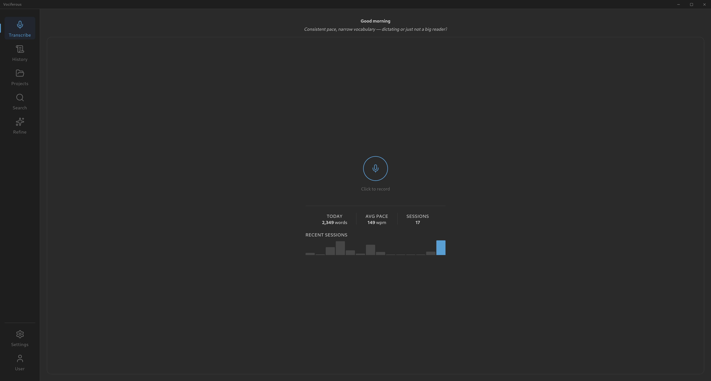
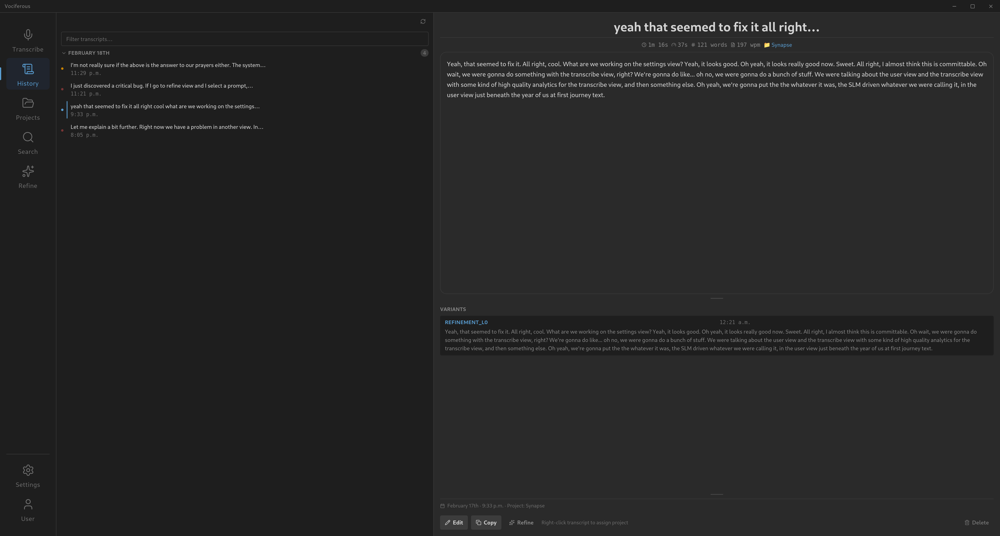
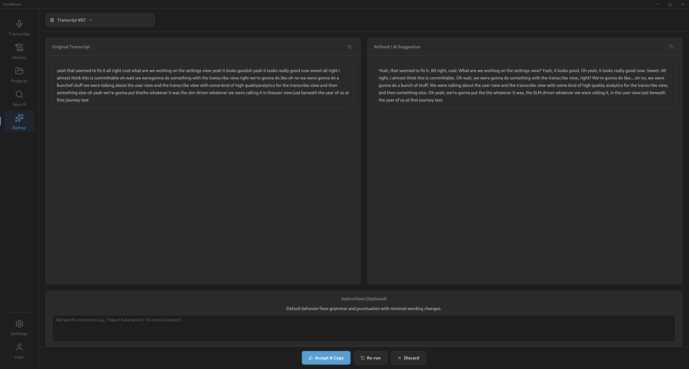
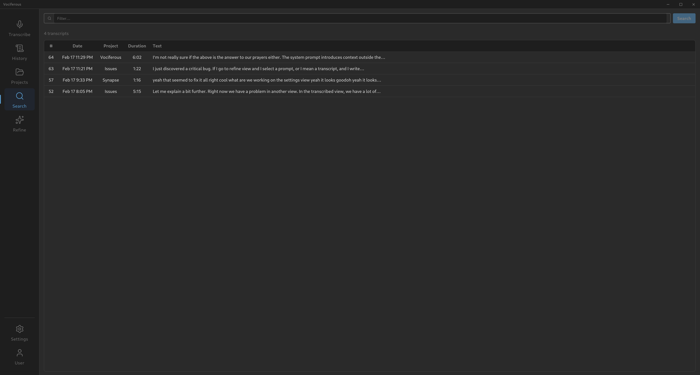
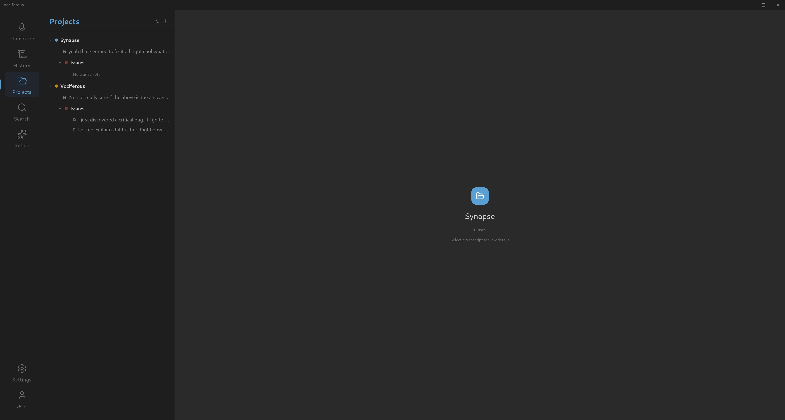
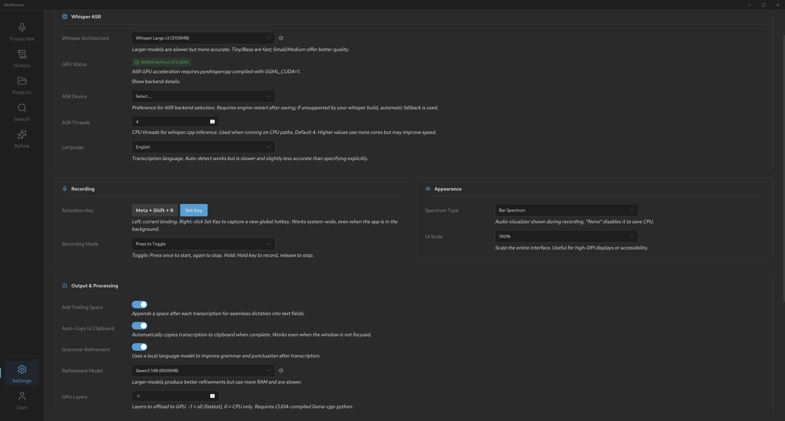
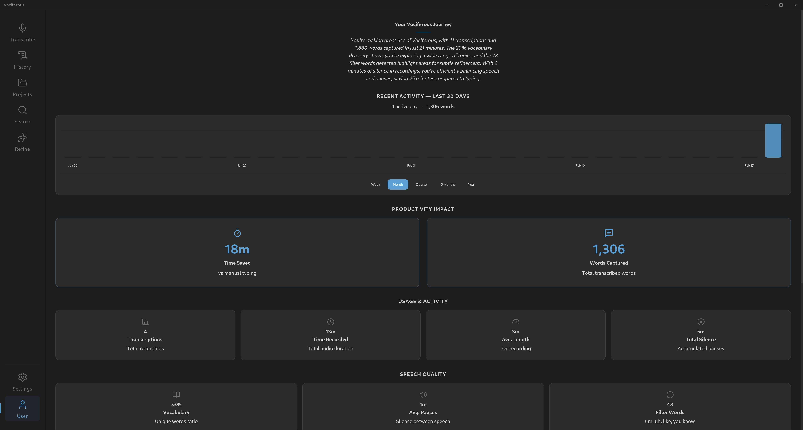

# Vociferous

**Cross-platform, offline speech-to-text with local AI refinement.**

Vociferous captures audio from your microphone, transcribes it in real-time using
[whisper.cpp](https://github.com/ggerganov/whisper.cpp), and optionally refines the
output with a local Small Language Model via [llama.cpp](https://github.com/ggerganov/llama.cpp).
Everything runs on your hardware — no cloud, no API keys, no data leaves your machine.

**License:** AGPL-3.0-or-later

---

## Screenshots

<table>
  <tr>
    <td align="center"><strong>Transcribe</strong></td>
    <td align="center"><strong>History</strong></td>
  </tr>
  <tr>
    <td></td>
    <td></td>
  </tr>
  <tr>
    <td align="center"><strong>Refine</strong></td>
    <td align="center"><strong>Search</strong></td>
  </tr>
  <tr>
    <td></td>
    <td></td>
  </tr>
  <tr>
    <td align="center"><strong>Projects</strong></td>
    <td align="center"><strong>Settings</strong></td>
  </tr>
  <tr>
    <td></td>
    <td></td>
  </tr>
  <tr>
    <td align="center" colspan="2"><strong>User</strong></td>
  </tr>
  <tr>
    <td colspan="2" align="center"></td>
  </tr>
</table>

---

## Platform Support

| Platform | Shell                         | Status                           |
|:-------- |:----------------------------- |:-------------------------------- |
| Linux    | GTK + WebKitGTK (pywebview)   | **Primary** — actively developed |
| macOS    | Cocoa + WebKit (pywebview)    | Supported                        |
| Windows  | EdgeChromium (pywebview)      | Supported                        |

## Stack

| Layer | Technology |
| ----- | ---------- |
| Window Shell | [pywebview](https://pywebview.flowrl.com/)      |
| Frontend | Svelte 5 + Tailwind CSS v4 + Vite 6  |
| Backend API | Litestar (REST + WebSocket)   |
| ASR Engine  | pywhispercpp (whisper.cpp, GGML models) |
| SLM Engine  | llama-cpp-python (llama.cpp, GGUF models) |
| Database    | SQLite with WAL mode          |
| Config      | Pydantic Settings (JSON persistence, atomic)  |

---

## Development Environment

Primary development is done on the following system. Other configurations should work but are not continuously tested.

| Component | Value |
|-----------|-------|
| Distro | Debian 13 (Trixie) |
| Kernel | 6.12.x (amd64) |
| Desktop | GNOME (Wayland) |
| GPU | NVIDIA GeForce RTX 3090 |
| Driver | 550.163.01 |
| CUDA | 12.4 |
| Python | 3.13.x |
| Node.js | 22.x LTS |

---

## Quick Start

### Prerequisites

- Python 3.12 or 3.13
- Node.js 18+ and npm
- System audio packages (`libportaudio2`, `xclip`)
- For GPU acceleration: NVIDIA driver 550+ and CUDA toolkit

### Linux (Debian/Ubuntu)

```bash
# Install system dependencies and create venv
bash scripts/install.sh

# Download ASR and SLM models (~2–4 GB)
make provision

# Optional: install desktop launcher (.desktop entry)
make install-desktop

# Run the application
./vociferous.sh
```

### macOS

```bash
# Requires Homebrew
bash scripts/install_mac.sh
make provision

# Optional: install launcher shortcut
make install-shortcut-mac

./vociferous.sh
```

### Windows

```powershell
# Run from PowerShell as Administrator
.\scripts\install_windows.ps1

# Optional: install Desktop + Start Menu shortcuts
powershell -ExecutionPolicy Bypass -File .\scripts\install_windows_shortcut.ps1

# Then from cmd or PowerShell
.\vociferous.bat
```

### Desktop Launcher / App Shortcut

- **Linux**: `make install-desktop` (or `make install-shortcut-linux`) installs `vociferous.desktop` into `~/.local/share/applications/`.
- **macOS**: `make install-shortcut-mac` creates `~/Applications/Vociferous.command` and a Desktop shortcut.
- **Windows**: `powershell -ExecutionPolicy Bypass -File .\scripts\install_windows_shortcut.ps1` creates Desktop + Start Menu shortcuts.

To remove shortcuts:

```bash
# Linux
make uninstall-desktop

# macOS
make uninstall-shortcut-mac
```

```powershell
# Windows
powershell -ExecutionPolicy Bypass -File .\scripts\uninstall_windows_shortcut.ps1
```

### Docker (Linux only — requires X11/Wayland)

```bash
# Build the image (multi-stage: frontend + Python runtime)
docker compose build

# Provision models on first run (persisted in named volume — only needed once)
# NOTE: --entrypoint is required to override the default ENTRYPOINT
docker compose run --rm --entrypoint python3 vociferous scripts/provision_models.py install large-v3-turbo-q5_0
docker compose run --rm --entrypoint python3 vociferous scripts/provision_models.py install qwen14b

# CPU mode
docker compose up

# NVIDIA GPU mode (requires nvidia-container-toolkit)
docker compose --profile gpu up
```

> **Notes:** Docker containerization requires a Wayland or X11 display server, PulseAudio
> (or PipeWire with PulseAudio compat) for microphone access, and `input` group membership
> for global hotkeys via evdev. Model files are stored in a named volume and persist across
> container restarts. See `docker-compose.yml` for available environment overrides.

---

## NVIDIA GPU Troubleshooting

If GPU inference fails with CUDA errors, the NVIDIA UVM (Unified Virtual Memory)
kernel module may not be loaded. This is a **known issue on Debian with the
550.x driver series**, especially after kernel updates or cold boots.

### Symptoms

- `pywhispercpp` or `llama-cpp-python` fails with CUDA initialization errors
- `/dev/nvidia-uvm` device node is missing
- `nvidia-uvm` kernel module is not loaded (`lsmod | grep nvidia_uvm` returns nothing)

### Fix

```bash
# Run the bundled fix script (requires sudo)
sudo bash scripts/fix_gpu.sh
# or
make fix-gpu
```

This script:

1. Detects the correct module name (handles Debian's `nvidia-current-uvm` naming)
2. Loads the `nvidia-uvm` kernel module via `modprobe` (or `nvidia-modprobe`)
3. Creates `/dev/nvidia-uvm` device node if missing (via `nvidia-modprobe -u`
or manual `mknod`)
4. Fixes device permissions (`chmod 666`)
5. Hardens `pywhispercpp`'s libcuda linkage by symlinking its bundled `libcuda`
stub to the system driver's `libcuda.so.1` — prevents version mismatch crashes
6. Verifies CUDA availability from Python

### WebKitGTK + NVIDIA DRM Workaround

The `vociferous.sh` launcher sets two environment variables to prevent a **kernel
panic** caused by the NVIDIA 550.x DRM driver conflicting with WebKitGTK's GPU
compositing on Wayland:

```bash
export WEBKIT_DISABLE_COMPOSITING_MODE=1
export WEBKIT_DISABLE_DMABUF_RENDERER=1
```

This disables WebKitGTK's GPU-accelerated rendering (which isn't needed — the GPU
is reserved for inference). Without these flags, `nv_drm_revoke_modeset_permission`
can crash the kernel on concurrent WebKit + CUDA GPU access.

---

## Project Structure

```
src/
├── api/              # Litestar REST + WebSocket controllers
├── core/             # Application plumbing
│   ├── application_coordinator.py  # Composition Root
│   ├── command_bus.py              # Intent dispatch
│   ├── event_bus.py                # Pub/sub event system
│   ├── settings.py                 # Pydantic configuration
│   └── intents/                    # Intent dataclass definitions
├── database/         # SQLite with raw sqlite3 + dataclasses
├── input_handler/    # Global hotkey detection (pynput/evdev)
├── provisioning/     # Model download from HuggingFace Hub
├── refinement/       # SLM inference engine
└── services/         # Audio capture, transcription, SLM runtime

frontend/
├── src/
│   ├── lib/          # Shared utilities, API client, components
│   └── views/        # Page-level Svelte components
└── public/           # Static assets

scripts/              # Install, provisioning, GPU fix scripts
tests/                # Unit + integration tests (374 tests)
```

## Architecture

State changes follow the **H-Pattern** (Intent-Driven Interaction):

```
Frontend UI → POST /api/intents → CommandBus → Service Logic → EventBus → WebSocket → Frontend Store
```

- API handlers dispatch Intents — they never call services directly
- The `ApplicationCoordinator` is the Composition Root (owns all lifecycle)
- ASR inference runs in a dedicated background thread (`pywhispercpp`)
- SLM inference runs in a dedicated background thread with a mutex lock (`llama-cpp-python`)
- The main/UI thread runs `pywebview` — zero blocking operations allowed

---

## Development

```bash
# Run linters
make lint                    # Ruff + frontend type check

# Auto-format
make format                  # Ruff format + frontend format

# Run tests
make test                    # pytest (374 tests)

# Build frontend only
make build                   # Vite production build

# Clean build artifacts
make clean
```

### Manual Commands

```bash
# Ruff
.venv/bin/ruff check src/ tests/ scripts/

# MyPy
.venv/bin/mypy src/ tests/

# Pytest with coverage
.venv/bin/pytest --cov=src

# Frontend dev server (hot reload)
cd frontend && npm run dev
```

---

## Model Provisioning

Vociferous uses GGML models for ASR and GGUF models for SLM refinement. Models
are downloaded from HuggingFace Hub via the provisioning system.

```bash
# Interactive provisioning (select models)
.venv/bin/python scripts/provision_models.py

# Or use the Make target
make provision
```

Default models:

- **ASR**: `ggml-large-v3-turbo-q5_0.bin` (~1 GB) from `ggerganov/whisper.cpp`
- **SLM**: `Qwen3-1.7B-Q8_0.gguf` (~2 GB) from `Qwen/Qwen3-1.7B-GGUF`

Models are cached in `~/.cache/vociferous/models/` (XDG-compliant).

---

## Features

- **Real-time transcription** with configurable ASR model quality
- **SLM-powered refinement** with multi-level profiles (minimal → aggressive cleanup)
- **Project organization** — assign transcripts to hierarchical projects with color coding
- **Multi-select** — Ctrl+Click, Shift+Click, Ctrl+A across History, Search, and Projects views
- **Batch operations** — assign/delete multiple transcripts at once
- **Global hotkey** — configurable push-to-talk key binding
- **Search** — full-text search across all transcripts
- **Transcript variants** — immutable raw captures with editable refinement variants
- **Voice calibration** — ambient noise profiling for better VAD
- **Audio spectrum visualization** — real-time frequency display during recording
- **Offline-only** — no network access required after model provisioning

---

## Contributing

This project is maintained by a single developer. Process ceremony is minimal by design.

- Fork, branch, PR — standard GitHub workflow
- Ensure `make lint` and `make test` pass
- Follow the H-Pattern for new features (see `docs/copilot-instructions.md` for full architectural invariants)

---

## Changelog

See [CHANGELOG.md](CHANGELOG.md) for version history.
