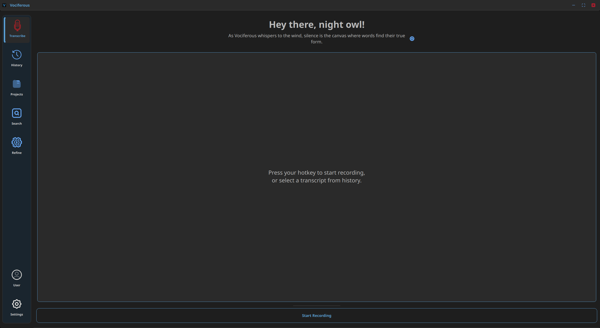
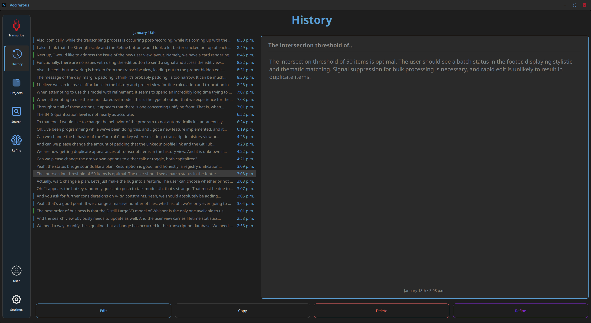
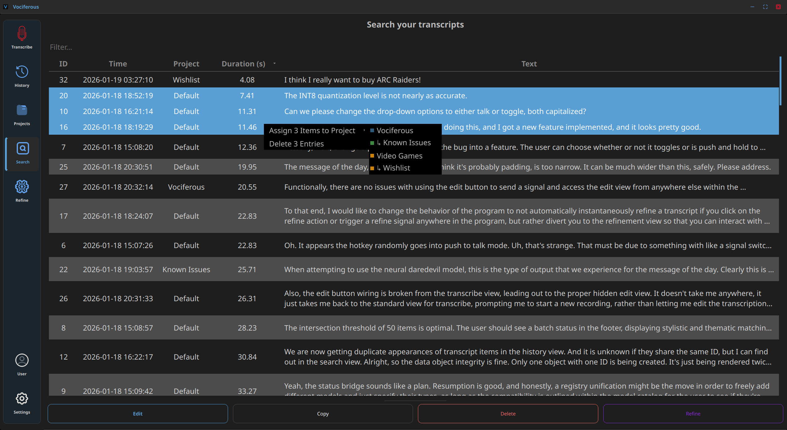
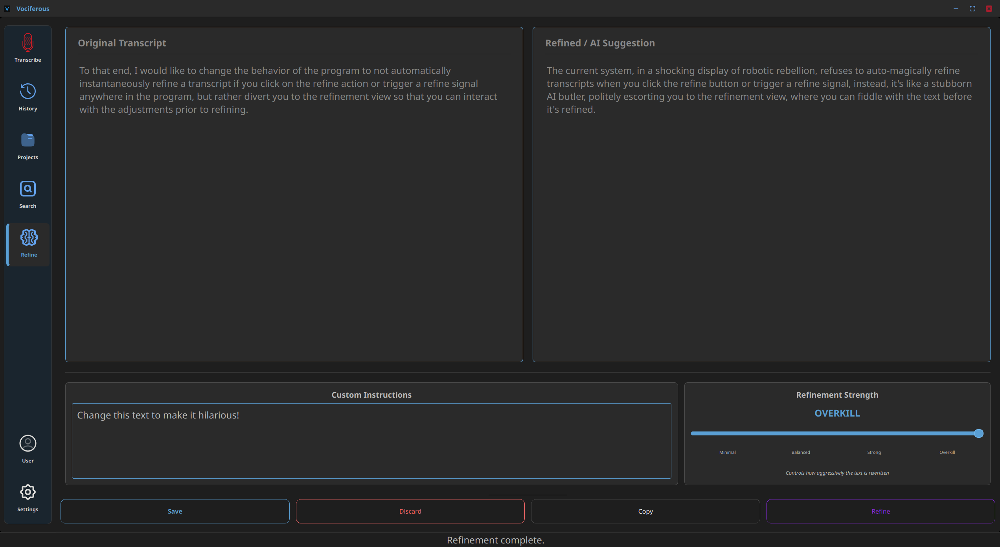
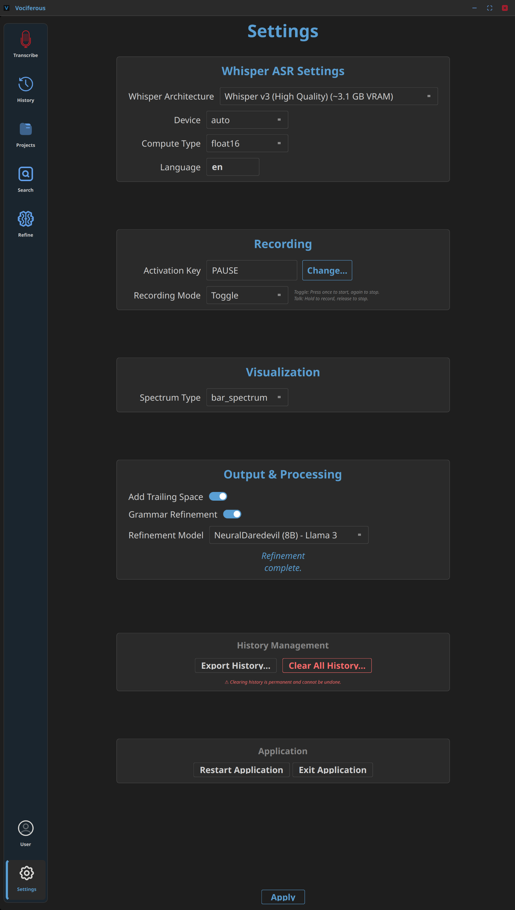
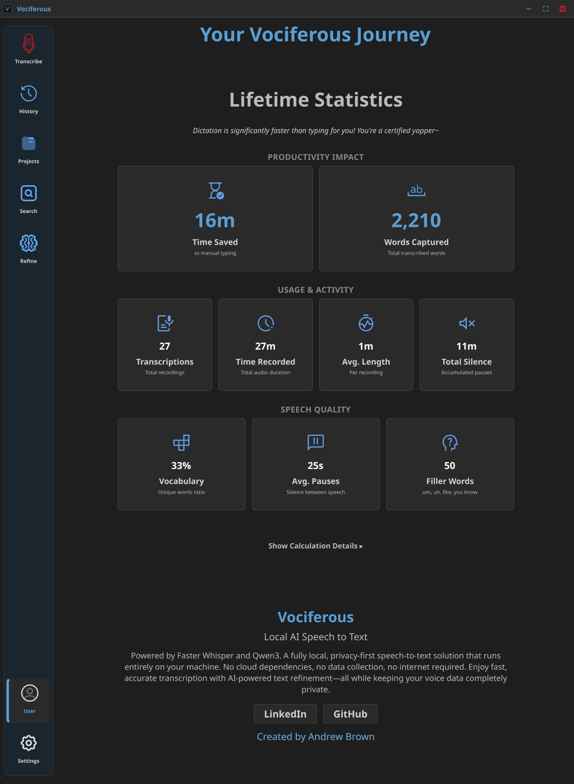
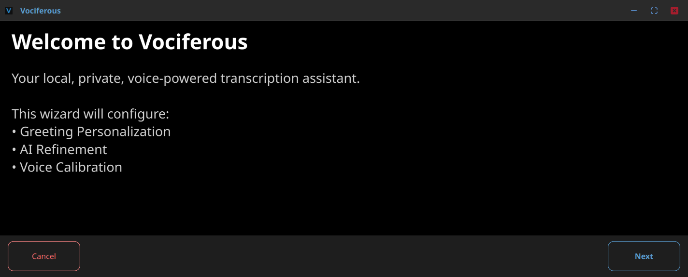
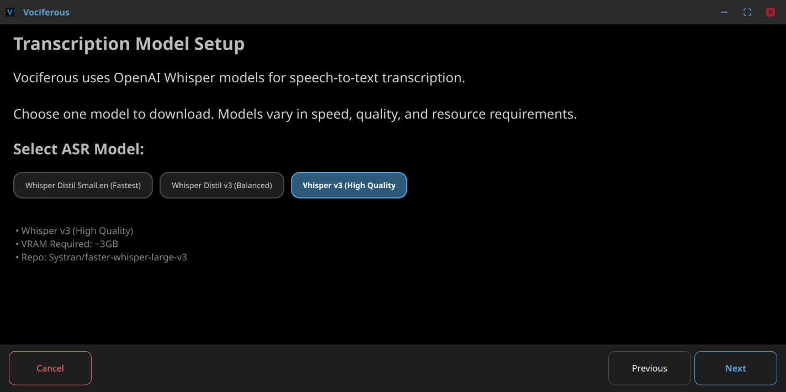
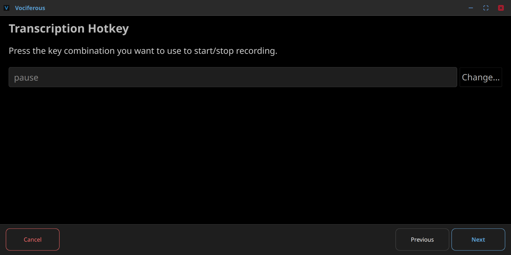

<!DOCTYPE html>
<html lang="en">
<head>
    <meta charset="utf-8">
    <title>Vociferous — Privacy-First Speech-to-Text for Linux</title>
</head>
<body>

    <h1>Vociferous</h1>
    
<strong>Privacy-First Speech-to-Text for Linux</strong>

    
Your voice. Your machine. Your data.

    

    

        Features • Installation • Quick Start • Documentation • Architecture
    

<h2>🎯 What is Vociferous?</h2>

    Vociferous is a production-grade, local-first dictation system that transforms speech into text entirely on your machine.
    Built with architectural rigor and attention to user experience, it leverages OpenAI's Whisper for state-of-the-art
    transcription and offers optional AI-powered refinement to polish your text with grammar correction and formatting.

    Unlike cloud-based alternatives, Vociferous processes everything locally—your voice never leaves your computer.
    No subscriptions, no usage limits, no privacy compromises.

<h2>✨ Features</h2>

<h3>Core Capabilities</h3>
<ul>
    <li>🔒 <strong>Complete Privacy</strong> — All transcription and refinement happens on-device using local models</li>
    <li>🎯 <strong>Whisper ASR</strong> — OpenAI's state-of-the-art speech recognition via faster-whisper</li>
    <li>✨ <strong>AI Refinement</strong> — Optional SLM-powered text improvement (grammar, punctuation, formatting)</li>
    <li>🐧 <strong>Native Linux Support</strong> — First-class Wayland integration with global hotkey support</li>
    <li>📚 <strong>Persistent History</strong> — SQLite-backed transcript storage with full-text search and organization</li>
    <li>⚡ <strong>GPU Acceleration</strong> — CUDA support for real-time transcription and refinement</li>
    <li>🎨 <strong>Modern UI</strong> — Sleek PyQt6 interface with polished design system</li>
</ul>

<h3>Technical Highlights</h3>
<ul>
    <li><strong>Intent-Driven Architecture</strong> — Clean separation between user intent and execution logic</li>
    <li><strong>Dual-Text Model</strong> — Preserves raw Whisper output while allowing user edits</li>
    <li><strong>Pluggable Backends</strong> — Modular input handling, model selection, and audio processing</li>
    <li><strong>Production-Ready</strong> — Comprehensive test suite, type safety, and architectural guardrails</li>
    <li><strong>Fully Offline</strong> — No internet connection required after initial model download</li>
</ul>

<h2>🖼️ Screenshots</h2>

    
<strong>📸 View Gallery (Click to expand)</strong>

    <table>
        <tr>
            <td align="center">
                 
                <em>Transcribe View — Live dictation and recording</em>
            </td>
            <td align="center">
                 
                <em>History View — Browse and manage transcripts</em>
            </td>
        </tr>
        <tr>
            <td align="center">
                 
                <em>Search &amp; Manage — Filter and organize</em>
            </td>
            <td align="center">
                 
                <em>Refine View — AI-powered text improvement</em>
            </td>
        </tr>
        <tr>
            <td align="center">
                 
                <em>Settings View — Configure transcription and refinement</em>
            </td>
            <td align="center">
                 
                <em>User View — Metrics and documentation</em>
            </td>
        </tr>
    </table>

    <h4>Onboarding Experience</h4>

    <table>
        <tr>
            <td align="center">
                 
                <em>Welcome screen</em>
            </td>
            <td align="center">
                 
                <em>Model selection</em>
            </td>
            <td align="center">
                 
                <em>Hotkey configuration</em>
            </td>
        </tr>
    </table>

<h2>🚀 Installation</h2>

<h3>Prerequisites</h3>

<table border="1" cellpadding="6" cellspacing="0">
    <tr>
        <th>Requirement</th>
        <th>Minimum</th>
        <th>Recommended</th>
    </tr>
    <tr>
        <td>OS</td>
        <td>Linux (X11/Wayland)</td>
        <td>Linux (Wayland)</td>
    </tr>
    <tr>
        <td>Python</td>
        <td>3.12+</td>
        <td>3.12</td>
    </tr>
    <tr>
        <td>RAM</td>
        <td>4 GB</td>
        <td>8 GB</td>
    </tr>
    <tr>
        <td>GPU</td>
        <td>None (CPU mode)</td>
        <td>NVIDIA CUDA</td>
    </tr>
    <tr>
        <td>VRAM</td>
        <td>N/A</td>
        <td>4+ GB (for refinement)</td>
    </tr>
</table>

<h3>Wayland Setup</h3>

For global hotkeys on Wayland, add your user to the input group:

<pre><code>sudo usermod -a -G input $USER</code></pre>

Log out and back in for changes to take effect.

<h3>Install Steps</h3>

<ol>
    <li>
        Clone the repository
        <pre><code>git clone https://github.com/yourusername/Vociferous.git
cd Vociferous</code></pre>
    </li>
    <li>
        Create virtual environment
        <pre><code>python3 -m venv .venv</code></pre>
    </li>
    <li>
        Install dependencies
        <pre><code>.venv/bin/pip install -r requirements.txt</code></pre>
    </li>
    <li>
        Launch Vociferous
        <pre><code>./vociferous</code></pre>
    </li>
</ol>

<blockquote>
    ⚠️ <strong>Important:</strong> Always use the <code>./vociferous</code> launcher script.
    Running <code>python src/main.py</code> directly bypasses GPU library configuration.
</blockquote>

<h2>🎬 Quick Start</h2>

<h3>Your First Recording</h3>

<ol>
    <li>Launch the application with <code>./vociferous</code></li>
    <li>Press Right Alt (default hotkey) to start recording</li>
    <li>Speak clearly into your microphone</li>
    <li>Press Right Alt again to stop recording</li>
    <li>Wait for Whisper to transcribe your speech</li>
    <li>Review your transcript in the main panel</li>
</ol>

<h3>Default Configuration</h3>

<table border="1" cellpadding="6" cellspacing="0">
    <tr>
        <th>Setting</th>
        <th>Default Value</th>
    </tr>
    <tr>
        <td>Whisper Model</td>
        <td>distil-large-v3 (~1.5 GB)</td>
    </tr>
    <tr>
        <td>Device</td>
        <td>Auto-detect (GPU if available)</td>
    </tr>
    <tr>
        <td>Language</td>
        <td>English (en)</td>
    </tr>
    <tr>
        <td>Recording Mode</td>
        <td>Push-to-talk</td>
    </tr>
    <tr>
        <td>Hotkey</td>
        <td>Right Alt</td>
    </tr>
    <tr>
        <td>Refinement</td>
        <td>Disabled (optional)</td>
    </tr>
</table>

<h3>Available Actions</h3>

<ul>
    <li>Copy — Copy text to clipboard</li>
    <li>Edit — Modify the transcript</li>
    <li>Delete — Remove the transcript</li>
    <li>Refine — Polish with AI (if enabled)</li>
    <li>Save — Persist to history database</li>
</ul>

<h2>🧠 Optional AI Refinement</h2>

    Vociferous includes an optional text refinement system powered by local language models.

<h3>What Does Refinement Do?</h3>

<ul>
    <li>Fixes grammar and punctuation errors</li>
    <li>Improves sentence structure and flow</li>
    <li>Applies consistent formatting</li>
    <li>Preserves original intent and meaning</li>
</ul>

<h3>Enabling Refinement</h3>

<ol>
    <li>Open Settings (⚙️ icon)</li>
    <li>Toggle Enable AI Refinement to ON</li>
    <li>Select your preferred SLM Model (e.g., Qwen3-4B-Instruct)</li>
    <li>Click Apply</li>
</ol>

    On first use, Vociferous will download and convert the model (~4 GB).
    This happens once per model and takes several minutes.

<h3>GPU Requirements</h3>

<ul>
    <li>CUDA-capable NVIDIA GPU with 4+ GB VRAM (recommended)</li>
    <li>CPU fallback supported (slower, ~8+ GB RAM recommended)</li>
</ul>

<h2>📜 License</h2>

    This project is licensed under the MIT License — see the LICENSE file for details.

    
<strong>Built with ❤️ for the Linux community</strong>

    
⬆ Back to Top

</body>
</html>