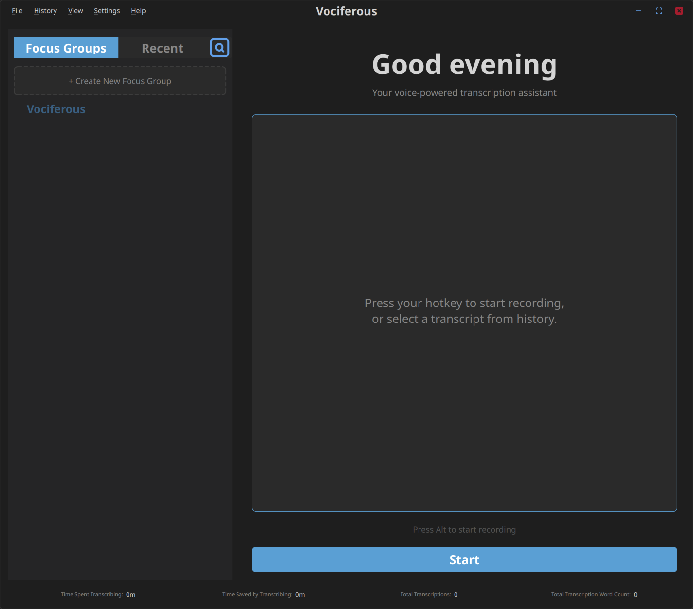
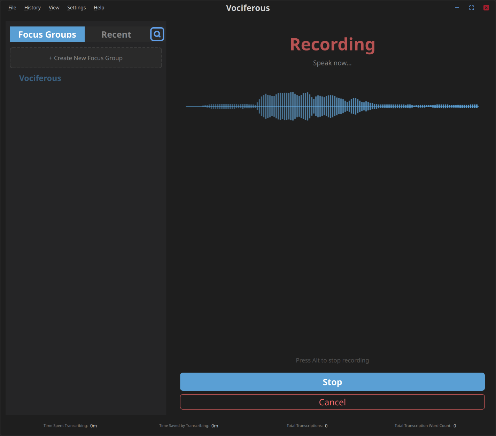

# Vociferous

**Version 2.0.0-beta.2** — Architecture Stabilization Release

Vociferous is a fast, local speech-to-text dictation application for Linux. It transcribes your voice using OpenAI's Whisper model (via faster-whisper) and copies the result directly to your clipboard. No cloud services, no account required—just press a hotkey, speak, and paste.

[](docs/images/main_window.png)

---

## What Changed in Beta 2.0

**Beta 2.0 introduces no new user-facing features.** Its value lies entirely in correctness, safety, and long-term maintainability.

This release stabilizes the interaction architecture:

- **Predictable behavior**: All user actions follow a single, validated path through the system
- **Edit safety**: You cannot accidentally lose unsaved edits—the application enforces this
- **Clear feedback**: The system tells you *why* an action was rejected, not just that it failed
- **Architectural guardrails**: Automated tests prevent future changes from breaking these guarantees

Beta 2.0 is a foundation release. Feature development resumes in version 2.1.

---

## Features

### Core Transcription
- Fast local transcription using faster-whisper (CTranslate2 backend)
- GPU acceleration (NVIDIA CUDA) with automatic CPU fallback
- Voice Activity Detection filters silence automatically
- Clipboard-first workflow—no input injection or typing simulation

### User Interface
- Modern PyQt6 frameless window with dark theme
- Collapsible sidebar with focus groups, recent transcripts, and search
- Real-time waveform visualization during recording
- Metrics showing recording time, words/minute, and time saved

### History & Organization
- SQLite-backed persistent history
- Focus groups for organizing transcripts by topic
- Editable transcriptions (original preserved, edits saved separately)
- Export to TXT, CSV, or Markdown

[](docs/images/recording_state.png)

---

## How It Works

Vociferous follows a simple, predictable interaction model:

1. **You act** — Press a hotkey or click a button
2. **The system validates** — Can this action happen right now?
3. **State changes** — If valid, the workspace transitions (idle → recording → transcribing → viewing)
4. **You see feedback** — Success is silent; problems are explained in the status bar

This model is intentionally rigid. The application will not let you start recording while editing unsaved changes, switch transcripts without saving, or delete content you're actively modifying. These constraints exist to protect your work.

---

## Quick Start

### Installation

```bash
chmod +x scripts/install.sh
./scripts/install.sh
```

### Running

**GPU (recommended):**
```bash
./vociferous.sh
```

**CPU fallback:**
```bash
python scripts/run.py
```

### Basic Usage

1. Press **Right Alt** (default hotkey) or click **Record**
2. Speak naturally—the waveform shows your audio
3. Press **Right Alt** again or click **Stop**
4. Your transcription appears and is copied to the clipboard
5. Paste anywhere with **Ctrl+V**

---

## System Requirements

- **Python**: 3.12+
- **OS**: Linux (Wayland or X11)
- **Audio**: Working microphone
- **GPU** (optional): CUDA-compatible NVIDIA GPU for fast transcription

### Dependencies

See `requirements.txt` for the full list. Key dependencies:

- `faster-whisper` / `ctranslate2` — Whisper inference
- `PyQt6` — User interface
- `sounddevice` / `webrtcvad` — Audio capture and VAD
- `pynput` / `evdev` — Hotkey detection

---

## Configuration

Settings are managed through the Settings dialog (accessible via the menu).

Key options include:
- **Device**: `auto`, `cuda`, or `cpu`
- **Compute type**: `float16`, `float32`, or `int8`
- **Language**: Transcription language (default: English)
- **Activation key**: Hotkey to start/stop recording

All settings take effect immediately.

---

## Documentation

### User Documentation

- [Installation Guide](docs/wiki/Installation-Guide.md) — Complete setup instructions
- [Recording](docs/wiki/Recording.md) — How recording and transcription work
- [Hotkey System](docs/wiki/Hotkey-System.md) — evdev/pynput backends
- [Troubleshooting](docs/wiki/Troubleshooting.md) — Common issues and solutions

### Developer Documentation

- [Backend Architecture](docs/wiki/Backend-Architecture.md) — Module structure and design patterns
- [Threading Model](docs/wiki/Threading-Model.md) — Qt signals/slots and worker threads
- [Configuration Schema](docs/wiki/Configuration-Schema.md) — YAML-based settings

---

## For Developers

### Architecture Overview

Vociferous uses an **intent-driven interaction model**. User actions are represented as explicit intent objects, validated against the current application state, and either accepted or rejected with a clear reason. This architecture is documented and frozen as of Beta 2.0.

### Frozen Architecture Documents

The interaction core is semantically sealed. These documents define how the system works:

- [Interaction Core Freeze Declaration](docs/dev/interaction-core-frozen.md) — What is frozen and why
- [Intent Catalog](docs/dev/intent-catalog.md) — Complete vocabulary of user intents
- [Authority Invariants](docs/dev/authority-invariants.md) — Who owns state transitions
- [Edit Invariants](docs/dev/edit-invariants.md) — Transactional editing guarantees

### Contributing

Changes that violate the architectural guardrail tests are invalid and will not be accepted. Before contributing:

1. Read the [Interaction Core Freeze Declaration](docs/dev/interaction-core-frozen.md)
2. Run `pytest tests/test_architecture_guardrails.py` to verify compliance
3. Follow the extension pattern documented in the freeze declaration

### Versioning Policy

- **2.0.x** — Stabilization releases (no new features, bug fixes only)
- **2.1.x** — Feature development resumes (local SLM integration planned)

---

## License

See [LICENSE](LICENSE) for details.
