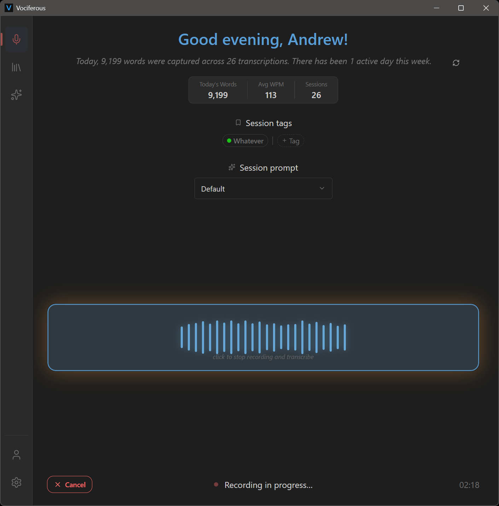
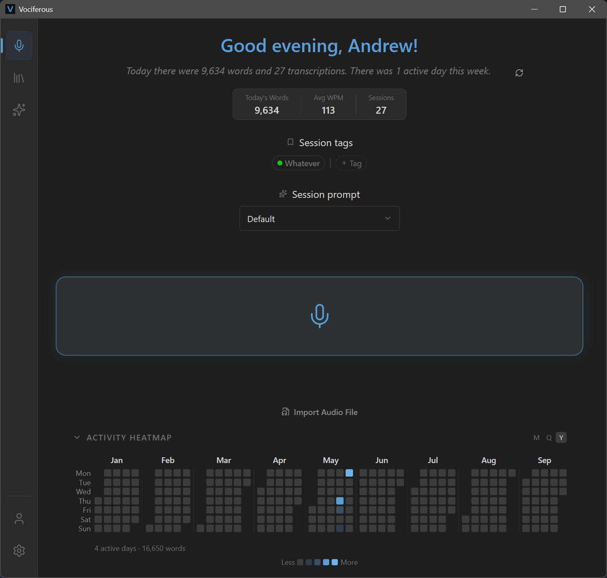

<div align="center">

## Vociferous v6.6.0

**May 2026**


# Vociferous

**Cross-platform speech-to-text with local transcription and optional AI refinement.**

[](LICENSE)
[](https://python.org)
[](https://svelte.dev)
[](#platform-support)

</div>

---

## Why Vociferous Exists

Vociferous started with a simple problem: I think faster than I type.

Whether I was writing homework, drafting articles on Medium, or trying to get my thoughts in order for a book I've been wanting to write, I needed a way to get ideas out of my head faster than my fingers could manage. Several dictation tools existed on Windows, but nothing worked well across all three major operating systems—and nothing came close to what I needed as a free, open-source solution powered entirely by other open-source software.

What began on September 17, 2025 as a quick passion project called *ChatterBug* to harness the power of [faster-whisper](https://github.com/SYSTRAN/faster-whisper) turned into something I never expected. A complete architectural transformation. A shift in perspective about what I wanted to build and why I wanted to build it. Work didn't begin in earnest until November 21, and the developer I was at that point had no idea how to accomplish what I've since done.

Approaching nearly 600 hours invested, Vociferous—*Voci*, as I've come to call it—has transformed my entire work process. It has taught me more about AI, model inference, systems design, frontend engineering, and software architecture than I could have learned any other way. What started as a neat side project has become a production-grade personal productivity system, free for all users.

This program is a hallmark of what I've learned to do and what I'm capable of doing. It's representative of me as a developer. I'm very proud of it.

— **Andrew Brown**, sole developer

---

## What It Does

Vociferous captures audio from your microphone, transcribes it in real-time using [faster-whisper](https://github.com/SYSTRAN/faster-whisper) (CTranslate2 Whisper backend), and optionally refines the output with a Small Language Model. By default, transcription and refinement run locally. Advanced users can point refinement at an OpenAI-compatible local server such as [LM Studio](https://lmstudio.ai/) and can optionally send transcription to Groq's Whisper-compatible API.

Record. Transcribe. Refine. Copy. That's the core loop. The rest is infrastructure to make that loop fast, reliable, and pleasant to use every single day.

---

## Screenshots

<table>
  <tr>
    <td align="center"><strong>Transcribe — Recording</strong></td>
    <td align="center"><strong>Transcriptions Library</strong></td>
  </tr>
  <tr>
    <td></td>
    <td></td>
  </tr>
  <tr>
    <td align="center"><strong>Refine — AI Comparison</strong></td>
    <td align="center"><strong>Edit — Markdown Rendered</strong></td>
  </tr>
  <tr>
    <td></td>
    <td></td>
  </tr>
  <tr>
    <td align="center"><strong>Transcribe — Fresh Install</strong></td>
    <td align="center"><strong>User Dashboard</strong></td>
  </tr>
  <tr>
    <td></td>
    <td></td>
  </tr>
</table>

---

## Features

### Core Workflow
- **Real-time speech-to-text** — Record via mic button or system-wide global hotkey. Transcription runs on a dedicated background thread using faster-whisper with int8 quantization, or through Groq when explicitly selected.
- **AI-powered refinement** — SLM cleanup for grammar, filler words, and sentence structure. Run refinement locally through CTranslate2, through LM Studio's local OpenAI-compatible server, or through a configured external provider.
- **Smart refinement control** — Optional skip logic can avoid refinement for transcripts with minimal errors. It is off by default so refinement behavior stays under explicit user control.
- **Audio file import** — Drag in WAV, MP3, M4A, FLAC, OGG, or WEBM files for transcription.
- **Continue recording** — Append new audio to any existing transcript. Pick up where you left off.
- **Auto-refine** — Optionally refine every new transcription automatically, no clicks required.
- **Copy to clipboard** — One click. That's the whole feature.

### Organization
- **Full-text search** — SQLite FTS5 across all transcript text and titles.
- **Tag system** — Color-coded tags with create, rename, recolor, delete. Filter by ANY or ALL matching tags.
- **Saved prompts** — Store custom refinement instructions as tagged transcripts. Load them in the Refine view.
- **Multi-select** — Ctrl+Click, Shift+Click range selection with bulk operations: delete, refine, tag toggle, export.
- **Export** — Markdown, JSON, CSV, or plain text. Single or batch. Native file dialog.
- **Sortable library** — By date, duration, word count, silence, or title. Paginated with configurable page size.

### Analytics
- **Personal dashboard** — Time saved vs. manual typing, words captured, average speaking speed, recording streaks.
- **Speech quality metrics** — Filler word tracking with per-word breakdown, vocabulary diversity ratio, pause analysis from VAD data.
- **Readability analysis** — Flesch-Kincaid grade level for raw vs. refined text with delta tracking.
- **Processing performance** — Transcription speed (realtime multiplier), SLM throughput (words per minute), inference timing.
- **Activity heatmap** — GitHub-style calendar grid of recording activity.
- **AI-generated insights** — SLM produces personalized observations about your usage patterns.

### Technical
- **Offline by default** — Local ASR and local CTranslate2 refinement require no network access after model download. External transcription and refinement providers are opt-in and only used when explicitly selected in Settings.
- **Cross-platform** — Linux, macOS, and Windows with native window shells.
- **Audio caching** — Configurable on-disk audio buffer (0–480 minutes) for re-transcription after model upgrades.
- **Auto-titling** — SLM generates descriptive titles for new transcripts.
- **Markdown rendering** — Toggle rendered markdown preview in the editor.
- **Configurable hotkey** — Push-to-toggle or hold-to-record modes. Works system-wide via evdev (Linux) or pynput (macOS/Windows).
- **Per-transcript analytics exclusion** — Omit test recordings from your stats.

---

## Platform Support

| Platform | Shell | Status |
|:---------|:------|:-------|
| Linux | GTK + WebKitGTK (pywebview) | **Primary** — actively developed |
| macOS | Cocoa + WebKit (pywebview) | Supported |
| Windows | EdgeChromium (pywebview) | Supported |

## Stack

| Layer | Technology |
|-------|------------|
| Window Shell | [pywebview](https://pywebview.flowrl.com/) |
| Frontend | Svelte 5 + Tailwind CSS v4 + Vite |
| Backend API | Litestar (REST + WebSocket) |
| ASR Engine | faster-whisper (CTranslate2 Whisper backend), or Groq Whisper API |
| Refinement Engine | CTranslate2 Generator + tokenizers, or OpenAI-compatible HTTP provider |
| Database | SQLite with WAL mode + FTS5 |
| Config | Pydantic Settings (JSON persistence, atomic writes) |

---

## Engineering Notes

- CPU-only refinement roadmap: [`docs/cpu-refinement-speedup-plan.md`](docs/cpu-refinement-speedup-plan.md)

---

## Quick Start

### Prerequisites

- Python 3.12+
- Node.js 18+ and npm
- System packages (`libportaudio2`, `xclip`, `libsecret-tools` on Linux)
- On Linux, stored provider API keys and encrypted audio vault keys require a working Secret Service backend such as GNOME Keyring, KWallet, or another compatible keyring provider.
- **For Windows GPU acceleration**: an NVIDIA driver is not enough by itself. You also need a usable CUDA 12 runtime for CTranslate2. The Windows installer can install the pinned Python CUDA runtime wheels into the app venv when it detects a driver but cannot load the CUDA DLL stack.

### Linux (Debian/Ubuntu)

```bash
# Full setup: system deps, venv, frontend build, model provisioning
bash scripts/install.sh

# Launch
./vociferous.sh
```

The install script handles everything including interactive model provisioning. If you prefer manual control:

It also verifies that `secret-tool` is installed and probes Linux secret-store readiness when run interactively. If your desktop session does not expose an unlocked Secret Service backend, environment variables such as `GROQ_API_KEY` still work, but stored provider keys and encrypted audio vault keys will not.

```bash
bash scripts/install.sh    # System deps + venv + frontend build
make provision             # Download models separately
```

### macOS

```bash
bash scripts/install_mac.sh
make provision
./vociferous.sh
```

### Windows

#### 1. Install Prerequisites

You need **Python 3.12+** and **Node.js 18+**. If you don't have them,
[winget](https://learn.microsoft.com/en-us/windows/package-manager/winget/) is the easiest route:

```powershell
winget install --id Python.Python.3.12 --accept-package-agreements
winget install --id OpenJS.NodeJS.LTS --accept-package-agreements
```

> **No PATH configuration required.** The install script automatically finds Python and Node.js
> in their standard install locations even if they aren't on your PATH — including the common case
> where `python` on PATH is the inert Microsoft Store stub. Just install them and run the script.

#### 2. Set Execution Policy (One-Time)

PowerShell's default policy blocks script execution. Allow locally-created scripts:

```powershell
Set-ExecutionPolicy RemoteSigned -Scope CurrentUser
```

#### 3. Clone and Install

```powershell
git clone https://github.com/wanderingastronomer/Vociferous.git
cd Vociferous
.\scripts\install_windows.ps1
```

The install script will:
- Verify Python 3.12+ and Visual C++ Build Tools
- Create a `.venv` virtual environment
- Install all Python dependencies from `requirements.txt`
- Build the Svelte frontend (`frontend/dist`)
- Verify critical imports (ctranslate2, faster-whisper, pywebview, etc.)
- Detect NVIDIA GPU availability and probe whether CTranslate2 can actually use CUDA
- Verify Microsoft Edge WebView2 Runtime
- **Download AI models** (ASR ~780 MB, SLM ~5.8 GB, VAD ~2 MB) — interactive prompt
- **Create Desktop and Start Menu shortcuts** with the Vociferous icon — interactive prompt

#### 4. Launch

```powershell
.\vociferous.bat
```

Or directly:

```powershell
.venv\Scripts\python.exe -m src.main
```

If you skipped model provisioning during install, the app will auto-navigate to Settings on first
launch where you can download models via the UI.

#### GPU Acceleration (Optional)

CPU inference works out of the box. For GPU acceleration with NVIDIA cards:

1. Install the latest [NVIDIA Game Ready or Studio driver](https://www.nvidia.com/download/index.aspx)
2. Install a usable CUDA 12 runtime yourself. Vociferous does **not** assume it can do this reliably for you on Windows. CTranslate2 currently ships against CUDA 12 — do not install CUDA 13, it is not yet supported by this build. Use one of these paths:
  - Recommended system install: [CUDA Toolkit 12.x](https://developer.nvidia.com/cuda-downloads) plus [cuDNN 9](https://developer.nvidia.com/cudnn-downloads)
  - Python-only runtime inside the venv:

```powershell
.\.venv\Scripts\python.exe -m pip install nvidia-cuda-runtime-cu12 nvidia-cuda-nvrtc-cu12 nvidia-cublas-cu12 nvidia-cudnn-cu12
```

3. Verify CUDA DLLs such as `cublas64_12.dll` and `cudnn64_9.dll` are discoverable, either from the Python environment's `site-packages\nvidia\*\bin` directories or from a CUDA Toolkit install such as `C:\Program Files\NVIDIA GPU Computing Toolkit\CUDA\v12.x\bin`
4. Verify with: `nvidia-smi` (should show your GPU). If you installed the full CUDA Toolkit, `nvcc --version` should also report CUDA 12.x

The Windows installer now distinguishes between "NVIDIA driver detected" and "CTranslate2 can actually use CUDA." If it sees a driver but the CUDA runtime is still unusable, it will tell you exactly that and prompt before continuing with CPU fallback.

#### Uninstall

Remove shortcuts: `.\scripts\uninstall_windows_shortcut.ps1`

Remove everything else: delete the `Vociferous` directory and optionally
`%LOCALAPPDATA%\vociferous` (settings, database, cached models).

### Desktop Shortcuts

The Windows install script offers to create shortcuts automatically. For other platforms, or to
create/remove them manually:

| Platform | Install | Remove |
|----------|---------|--------|
| Linux | `make install-desktop` | `make uninstall-desktop` |
| macOS | `make install-shortcut-mac` | `make uninstall-shortcut-mac` |
| Windows | `.\scripts\install_windows_shortcut.ps1` | `.\scripts\uninstall_windows_shortcut.ps1` |

### Optional: LM Studio Refinement

Vociferous can use [LM Studio](https://lmstudio.ai/) as a local OpenAI-compatible refinement backend. This is useful if you already manage local GGUF models in LM Studio, want to experiment with models outside Vociferous' bundled CTranslate2 registry, or do not want the app to own SLM model downloads.

LM Studio's current OpenAI-compatible docs list `GET /v1/models` and `POST /v1/chat/completions` as supported endpoints, and their examples use `http://localhost:1234/v1` as the local base URL. Vociferous uses those two endpoints for model discovery and refinement calls.

#### 1. Prepare LM Studio

1. Install and open LM Studio.
2. Download a chat/instruct model from LM Studio's Discover view. A 4-bit quantized model is usually the sane starting point unless your machine has plenty of RAM/VRAM.
3. Load the model in LM Studio.
4. Start LM Studio's local server on port `1234`. From the CLI, the equivalent is:

```bash
lms server start --port 1234
```

#### 2. Configure Vociferous

1. Open **Settings** -> **Refinement**.
2. Enable refinement if it is disabled.
3. Set **Refinement Provider** to **LM Studio**.
4. Set **Provider Base URL** to:

```text
http://localhost:1234/v1
```

5. Click the refresh button beside **Provider Model** to query LM Studio's `/v1/models` endpoint, then select or type the model ID LM Studio reports.
6. Leave **API Key Env Var** empty unless you enabled authentication on the LM Studio server.
7. Click **Test**. If the connection is ready, save settings and restart the engine when prompted.

#### Troubleshooting

- **Connection refused**: LM Studio's server is not running, is using a different port, or is bound somewhere other than `localhost`.
- **No models returned**: Load a model in LM Studio first, then refresh the model list in Vociferous.
- **404 or model not found**: The model ID in Vociferous must match the identifier returned by LM Studio's `/v1/models` endpoint.
- **Slow refinement**: LM Studio is doing the inference. Pick a smaller quantized model, move the model to GPU in LM Studio if your hardware supports it, or switch Vociferous back to the local CTranslate2 provider.
- **Privacy boundary**: LM Studio on `localhost` keeps refinement local. If you point the base URL at a remote LM Studio server, transcript text is sent to that machine.

### Optional: External Transcription

Vociferous can send speech recognition to Groq's OpenAI-compatible `audio/transcriptions` endpoint. Local faster-whisper remains the default. Groq transcription is opt-in from **Settings** -> **Speech Recognition**.

Groq documents `POST https://api.groq.com/openai/v1/audio/transcriptions` with `whisper-large-v3` and `whisper-large-v3-turbo`. Vociferous uploads VAD-cleaned 16 kHz mono WAV audio, requests `verbose_json`, and uses segment timestamps when the provider returns them.

Set **ASR Provider** to **Groq**, keep the base URL at:

```text
https://api.groq.com/openai/v1
```

Then set the model to `whisper-large-v3-turbo` or `whisper-large-v3`, and provide the API key through `GROQ_API_KEY` or the local stored-key field. Stored provider keys are kept in the platform secret backend and are not written to `settings.json`.

Groq transcription sends audio to Groq's API. LM Studio is supported for refinement only; it does not natively expose Whisper transcription services.

### Docker (Linux only — requires X11/Wayland)

```bash
docker compose build

# Provision models (first run only — persisted in named volume)
docker compose run --rm --entrypoint python3 vociferous scripts/provision_models.py install large-v3-turbo-int8
docker compose run --rm --entrypoint python3 vociferous scripts/provision_models.py install qwen4b

# CPU mode
docker compose up

# NVIDIA GPU mode (requires nvidia-container-toolkit)
docker compose --profile gpu up vociferous-gpu
```

> Docker requires a display server (Wayland/X11), PulseAudio (or PipeWire compat) for mic access, and `input` group membership for global hotkeys via evdev. See `docker-compose.yml` for environment overrides.

---

## NVIDIA GPU Troubleshooting

### Long Transcription Times (CPU Fallback)

If a 30-second clip takes 2 minutes even with an RTX card, you're on CPU-only wheels.

**Windows**: Verify CUDA Toolkit is installed (`nvcc --version` in a terminal). The Game Ready
driver alone doesn't make CTranslate2 GPU inference usable. Install [CUDA Toolkit 12.x](https://developer.nvidia.com/cuda-downloads) plus [cuDNN 9](https://developer.nvidia.com/cudnn-downloads), or install the Python runtime packages into the venv manually:

```powershell
.\.venv\Scripts\python.exe -m pip install nvidia-cuda-runtime-cu12 nvidia-cuda-nvrtc-cu12 nvidia-cublas-cu12 nvidia-cudnn-cu12
```

If Vociferous reports "NVIDIA driver detected" but also says the CUDA runtime is unusable, that is not cosmetic. The app will run on CPU until that runtime gap is fixed.

**Linux**:
1. Ensure `nvcc` is in your `$PATH` before running `install.sh`
2. Force rebuild if needed:
    ```bash
    rm -rf .venv
    bash scripts/install.sh
    ```

### UVM Kernel Module Issues (Debian/Ubuntu)

If GPU inference fails with CUDA errors after a kernel update:

```bash
sudo bash scripts/fix_gpu.sh   # or: make fix-gpu
```

This loads the `nvidia-uvm` module, creates the device node, fixes permissions, and verifies CUDA availability.

### WebKitGTK + NVIDIA DRM Workaround

The `vociferous.sh` launcher sets two environment variables to prevent a **kernel panic** caused by the NVIDIA 550.x DRM driver conflicting with WebKitGTK's GPU compositing on Wayland:

```bash
export WEBKIT_DISABLE_COMPOSITING_MODE=1
export WEBKIT_DISABLE_DMABUF_RENDERER=1
```

The GPU is reserved for inference — WebKitGTK doesn't need it.

---

## Architecture

State changes follow the **H-Pattern** (Intent-Driven Interaction):

```
Frontend UI → POST /api/intents → CommandBus → Service Logic → EventBus → WebSocket → Frontend Store
```

- API handlers dispatch Intents — they never call services directly
- The `ApplicationCoordinator` is the Composition Root (owns all lifecycle)
- ASR inference runs in a dedicated background thread (faster-whisper / CTranslate2)
- SLM inference runs in a dedicated background thread with a mutex lock (CTranslate2 Generator)
- The main/UI thread runs pywebview — zero blocking operations allowed

## Project Structure

```
src/
├── api/              # Litestar REST + WebSocket controllers
├── core/             # Application plumbing
│   ├── application_coordinator.py  # Composition Root
│   ├── command_bus.py              # Intent dispatch
│   ├── event_bus.py                # Pub/sub event system
│   ├── settings.py                 # Pydantic configuration
│   ├── handlers/                   # Domain handler classes
│   └── intents/                    # Intent dataclass definitions
├── database/         # SQLite with raw sqlite3 + dataclasses
├── input_handler/    # Global hotkey detection (evdev/pynput)
├── provisioning/     # Model download from HuggingFace Hub
├── refinement/       # SLM inference engine + prompt builder
└── services/         # Audio capture, transcription, SLM runtime

frontend/
├── src/
│   ├── lib/          # Shared components, API client, stores, utilities
│   └── views/        # Page-level Svelte 5 components (6 views)
└── public/           # Static assets

scripts/              # Install, provisioning, GPU fix scripts
tests/                # Unit + integration + contract tests (582 tests)
```

---

## Model Provisioning

Both ASR and SLM use CTranslate2-format models downloaded from HuggingFace Hub.

```bash
make provision    # Download default models
```

Default models:

- **ASR**: `faster-whisper-large-v3-turbo-int8-ct2` (~780 MB)
- **SLM**: `Qwen3-4B-ct2-int8` (~3.8 GB)

Models are cached in `~/.cache/vociferous/models/` (XDG-compliant).

---

## Development

```bash
make lint       # Ruff + frontend type check
make format     # Ruff format + frontend format
make test       # pytest (582 tests across 3 tiers)
make build      # Vite production build
make clean      # Remove build artifacts
```

```bash
# Frontend dev server (hot reload)
cd frontend && npm run dev
```

---

## Contributing

This project is maintained by a single developer. Process ceremony is minimal by design.

- Fork, branch, PR — standard GitHub workflow
- Ensure `make lint` and `make test` pass
- Follow the H-Pattern for new features (see `.github/copilot-instructions.md` for architectural invariants)

---

## License

[AGPL-3.0-or-later](LICENSE)

---

## Changelog

See [CHANGELOG.md](CHANGELOG.md) for version history.
