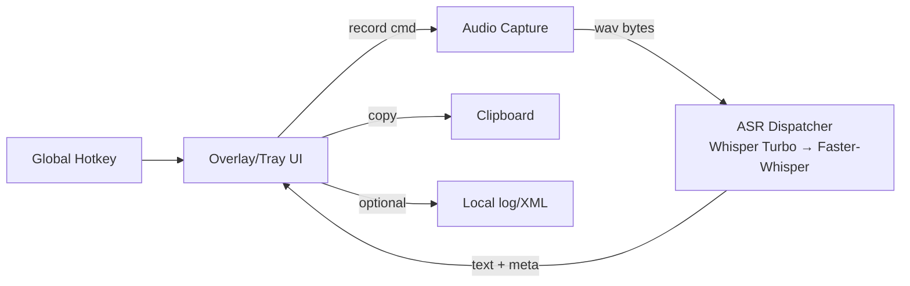

ChatterBug

Design and Development of a Cross-Platform Local Dictation Assistant  
Author: Andrew Brown  
Date: 2025-11-21  
Version: Draft v3.2 (hotkey-first, Whisper Turbo primary)

---

## Abstract
ChatterBug is a single-user, Python-based desktop dictation tool for Linux/Windows/macOS. It is hotkey-first: press a global shortcut to record, press again to stop, get a transcript copied to the clipboard and shown in a minimal overlay/tray UI. All transcription runs locally. The primary engine is Whisper Large v3 Turbo (loaded via transformers); an optional Faster-Whisper small/int8 engine provides a lightweight fallback. Models are placed manually (with an opt-in downloader); no automatic network calls are made in the core loop.

---

## 1. Introduction

### 1.1 Purpose
This document realigns ChatterBug around a cross-platform, hotkey-first workflow with local-only ASR. It replaces the earlier Linux-first/Tkinter-first framing with a stricter focus on latency, privacy, and tight modules that can swap engines without UI churn.

### 1.2 Problem Statement
Users need highly accurate, private transcription for short dictations (≤60 s) without cloud dependencies. The target hardware is a single 24 GB GPU; the system must stay within that envelope while remaining responsive on CPU-only fallbacks.

### 1.3 Product Overview (MVP)
- Entry point: `python3 main.py` (currently runs a Tk stub; overlay/tray hotkey shell is planned next).
- Flow: Global hotkey start → speak → hotkey stop → transcribe → clipboard + overlay display.
- Engines: Whisper Large v3 Turbo (transformers) primary; Faster-Whisper small/int8 fallback.
- Models: Local-only, dropped into `models/` (see Section 4.6).
- Scope: Minimal UI, no telemetry, no cloud APIs, no auto-downloads.

### 1.4 Principles
- Local-only: No network calls in the core; explicit consent before any download or system-level change.
- Accuracy-first within resource cap: Default to Whisper Large v3 Turbo FP16/on-GPU; Faster-Whisper small/int8 fallback for constrained environments.
- Hotkey-first: UI is an unobtrusive overlay/tray, not a heavy window.
- Cross-platform: Linux/Windows/macOS parity for the core loop (audio, hotkey, clipboard).
- Simplicity: Small, composable modules; defaults that “just work” for one user.

### 1.5 Out of Scope (for MVP)
- Cloud services, telemetry, or analytics.
- Encryption/summarization/embeddings, diarization.
- Multi-user, sync, mobile, or plugin frameworks.
- Large configuration surfaces or device pickers beyond essentials.
- XML logging as a user feature (kept only as a simple dev log for now).

### 1.6 Success Criteria (MVP)
- Stop→text ≤8–10 s on GPU for 10–30 s clips; stable ≤60 s dictations.
- Clipboard updated automatically with the final transcript.
- Overlay/tray UI responsive; UI thread never blocks on ASR.
- Fallback activates automatically on engine load/oom errors.
- No network calls or unsolicited downloads.

---

## 2. Constraints and Expectations
- Hardware: single GPU; Whisper Large v3 Turbo fits comfortably on modern GPUs (≥12 GB VRAM). Faster-Whisper small/int8 serves CPU-or-small-GPU environments.
- Privacy: local-only execution; no telemetry or cloud calls.
- Consent: any large download, autostart, or global hotkey registration requires explicit user approval.
- Style: PEP 8 with type hints; functions short and single-purpose; stable public interfaces.
- Docs: README + design doc must stay in sync with behavior; DEVDIARY records changes.

---

## 3. Architecture Overview

### 3.1 System Context
Single Python process. Audio/ASR work happens off the UI thread. Engines are swapped via config. Models live under `models/` by default.

### 3.2 Modules and Responsibilities
- **UI (`ui.py`, future overlay shell)**: Drive hotkey state machine (Idle/Recording/Transcribing/Error), show status + last transcript, trigger copy.
- **Audio (`audio.py`)**: Capture 16 kHz mono PCM, enforce max duration, return WAV bytes + duration.
- **ASR (`asr.py`)**: Config-driven dispatcher. Primary Whisper Large v3 Turbo (transformers); falls back to Faster-Whisper small/int8 if needed. Returns text + metadata.
- **Storage (`storage.py`)**: Minimal XML append for dev logging; future default will be JSON/text history with search.

### 3.3 Data Flow (Happy Path)
1. Hotkey pressed → record.
2. Hotkey pressed again → stop recording → WAV bytes.
3. ASR dispatcher transcribes via selected engine.
4. UI shows transcript, copies to clipboard, logs locally.

### 3.4 Concurrency
- UI loop must stay responsive; recording and ASR run on background threads.
- ASR load/generation is off the UI thread; results marshalled back via event/queue.

### 3.5 Error Handling and Fallbacks
- Engine load/OOM/import failure → mark engine unavailable → try the next fallback.
- Audio failure (device loss) → auto-stop + banner; keep UI responsive.
- Storage failure → keep UI/clipboard working; surface a non-blocking error.
- Model missing → clear message pointing to `models/<engine>` drop location.

---

## 4. ASR Plan

### 4.1 Engines
- **Primary**: Whisper Large v3 Turbo (transformers HF checkpoint).
- **Fallback**: Faster-Whisper small/int8 (converted weights).

### 4.2 Quantization and Memory
- Whisper Large v3 Turbo: FP16 fits typical 12–24 GB GPUs (~6–7 GB). Defaults to FP16 on GPU, FP32 on CPU.
- Faster-Whisper small: int8 weights for portability.

### 4.3 Configuration
- Config file: `~/.chatterbug/config.toml` (if absent, defaults are used).
- Keys:
  - `engine`: `whisper_large_v3_turbo` or another HF Whisper variant.
  - `fallbacks`: ordered list (default `["faster_whisper_small"]`).
  - `models_root`: defaults to `./models`
  - Per-engine overrides: `local_dir`, `format` (`hf_whisper` or `fw`), `max_new_tokens`, `compute_type`.

### 4.4 Engine Interface
`transcribe_wav(wav_bytes: bytes, language_hint: str | None = None) -> (str, dict)`  
Meta includes: engine, model_id, quantization, duration_s, latency_s, rtf, device, error (optional).

### 4.5 Failure Policy
- Any engine exception marks that engine unavailable for the session.
- Next call uses the next fallback in config order (Whisper → Faster-Whisper).
- Clear logging for: missing model dir, missing dependencies, OOM, bad audio.

### 4.6 Model Placement
- Default root: `models/` in the repo. User places weights manually (no auto-downloads).
- Expected subdirs:
  - `models/whisper-large-v3-turbo/` → HF checkpoint (safetensors + config) [default primary]
  - `models/faster_whisper_small/` → Faster-Whisper small/int8 conversion
- Config can point elsewhere if desired.
- Opt-in downloader: `python -m download --model whisper-large-v3-turbo` (prompts before download; `--yes` to skip). Add `--model faster-whisper-small-int8` for the fallback.

---

## 5. UI Plan (Hotkey-First)
- Global hotkey toggles record/stop; secondary hotkey to cancel.
- Overlay/tray shows: status (Idle/Recording/Transcribing/Error), last transcript (read-only), concise errors.
- Clipboard auto-copy after successful transcript.
- UI never blocks on model load/run; ASR work is backgrounded.
- Minimal preferences: choose engine, hotkey, max duration. Heavy device pickers deferred.

---

## 6. Implementation Plan (Sequenced)
1. **Phase 0 — Docs reset**: Align README/design doc with hotkey-first, cross-platform, Whisper Turbo primary plan; document model drop dirs and consent policies. ✅
2. **Phase 1 — Audio + CLI prototype**: Stable capture helper, CLI entry for quick testing; stub ASR OK initially.
3. **Phase 2 — ASR dispatcher**: Config-driven engine selection, Whisper Large v3 Turbo primary, Faster-Whisper fallback, lazy loading, clear error surfacing.
4. **Phase 3 — Hotkey overlay/tray**: Replace Tk stub with hotkey shell; clipboard and status updates.
5. **Phase 4 — Packaging**: Optional PyInstaller/Briefcase packaging; keep local model cache under control.

Definition of done: stop→text latency target met, fallback verified, clipboard + UI responsive, no network traffic, basic logging in place.

---

## 7. Testing & Validation
- Unit: audio duration calculation; config parsing; dispatcher fallback logic; storage append.
- Integration: end-to-end WAV → transcript (with real engines when available); ensure fallback triggers on forced failure.
- Performance: log cold-start and warm latencies; track GPU memory for Whisper Large v3 Turbo (primary) and Faster-Whisper fallback.
- Cross-platform checks: audio/hotkey/clipboard sanity on Linux/Windows/macOS (manual initially).
- Mark GPU/slow tests; default CI should run CPU-safe fast tests only.

---

## 8. Operational Notes
- No automatic downloads. Prompt the user before any large fetch or system change.
- Model storage defaults to `./models`; optional override to `~/.chatterbug/models`.
- Logging should stay terse; avoid spam that hides errors.
- Keep public interfaces stable (`audio.record`, `asr.transcribe_wav`, storage append) to minimize UI churn.

---

## 9. Current Status
- Tk stub UI remains; audio/storage helpers exist; ASR dispatcher is implemented with Whisper Large v3 Turbo as default and Faster-Whisper fallback.
- Docs and repo structure reflect the hotkey-first, cross-platform plan with Whisper Turbo as primary.
- Next: wire UI shell (hotkey overlay/tray), validate downloads/models, and exercise dispatcher end-to-end.
