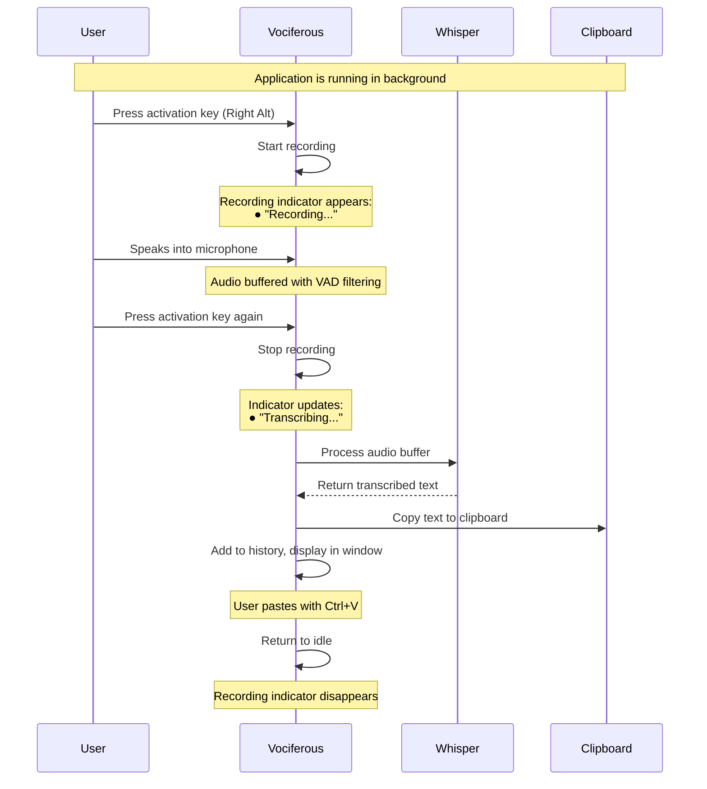
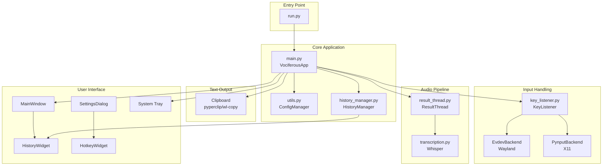
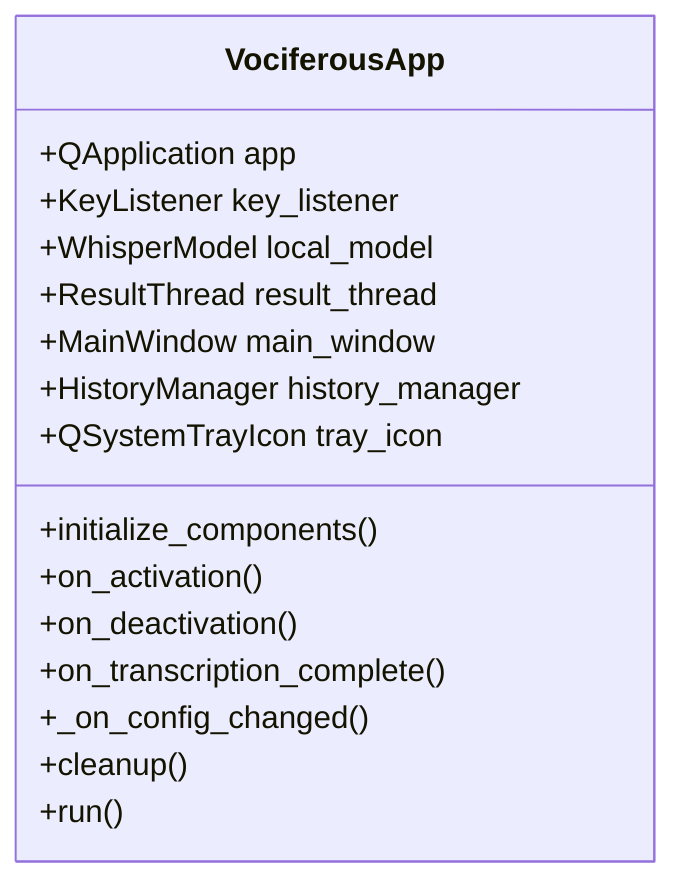
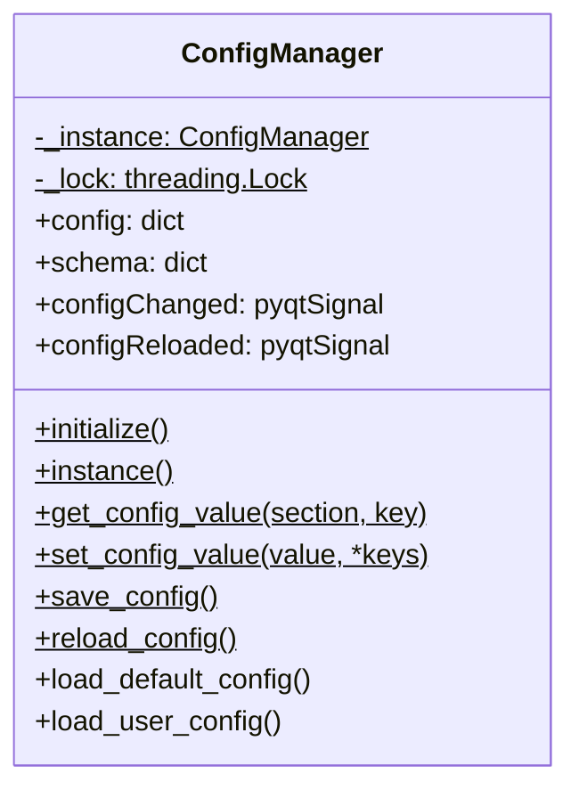
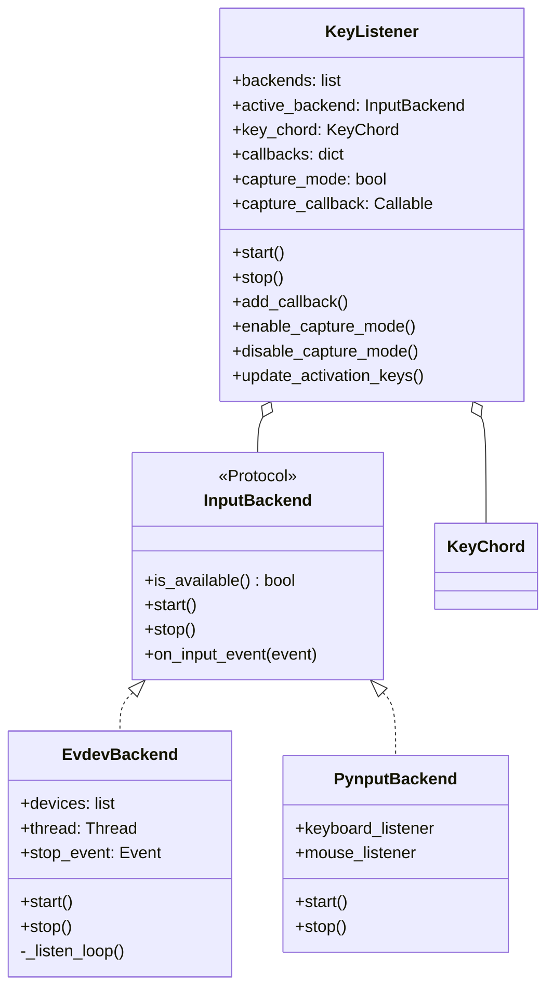
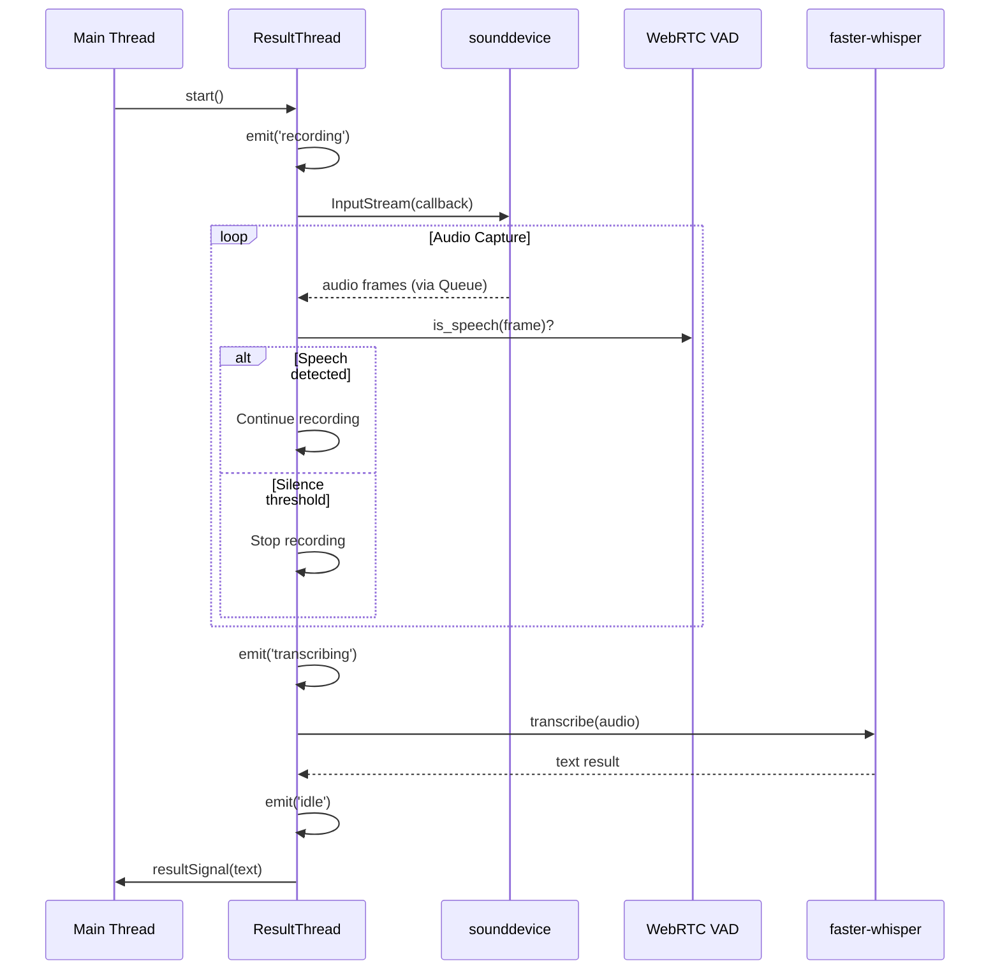
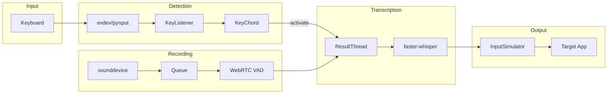
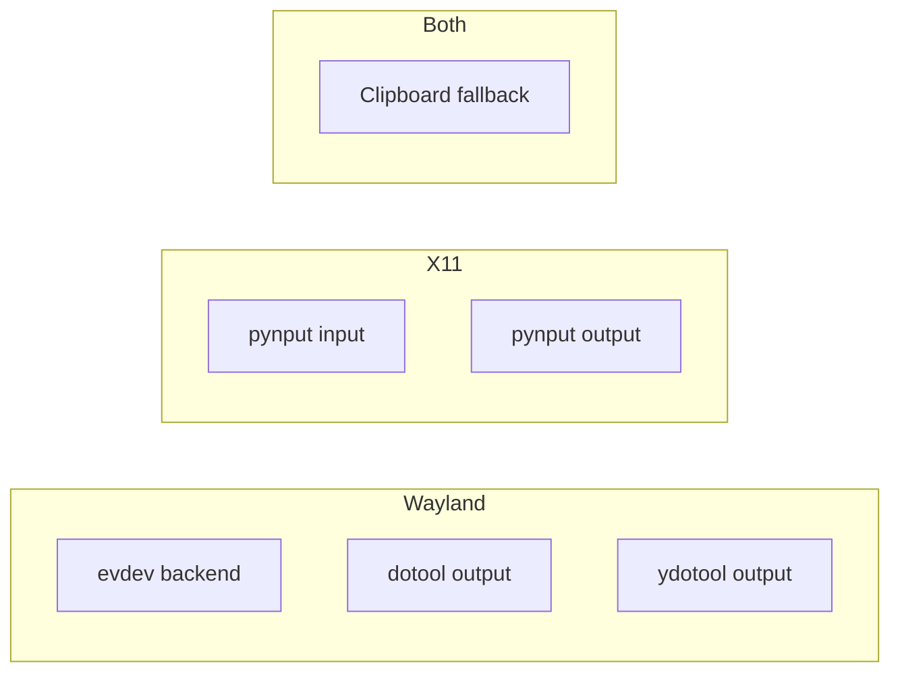
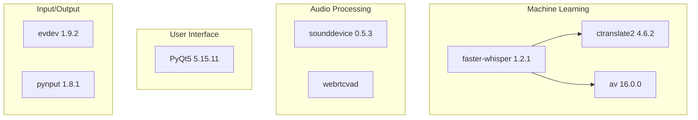
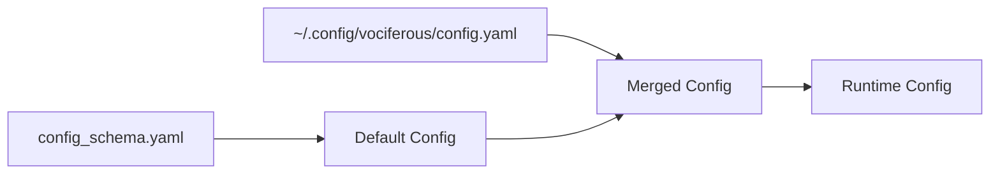

# Vociferous Architecture Guide

> A comprehensive guide to the design, patterns, and implementation of Vociferous - a modern Python speech-to-text dictation application.

## Table of Contents

1. [Overview](#overview)
2. [User Experience](#user-experience)
3. [High-Level Architecture](#high-level-architecture)
4. [Module Reference](#module-reference)
5. [Design Patterns](#design-patterns)
6. [Data Flow](#data-flow)
7. [Threading Model](#threading-model)
8. [Platform Compatibility](#platform-compatibility)
9. [Dependencies](#dependencies)
10. [Configuration System](#configuration-system)
11. [Python 3.12+ Features](#python-312-features)

---

## Overview

Vociferous is a speech-to-text dictation tool for Linux. Press a hotkey to start recording, press again to transcribe your speech. The text is copied to clipboard for pasting into any application.

### Key Characteristics

- **Wayland-first**: Works on modern Linux (Wayland and X11)
- **GPU-accelerated**: Uses faster-whisper with CUDA for real-time transcription
- **Full-featured UI**: Main window with history, settings dialog, system tray
- **Modern Python**: Leverages Python 3.12+ features throughout

---

## User Experience

### Typical Usage Flow



### Step-by-Step Workflow

#### 1. Launch & Initialization

```bash
./vociferous.sh  # or python run.py
```

**What happens:**
- GPU libraries configured (if CUDA available)
- Whisper model loaded into memory (~1-2GB VRAM for distil-large-v3)
- Main window appears with history sidebar
- System tray icon appears
- Hotkey listener starts monitoring keyboard
- Status: **Idle** (waiting for activation)

#### 2. Start Recording

**User action:** Press activation key (default: Right Alt)

**What happens:**
- Recording indicator appears in main window (● Recording)
- Indicator pulses with opacity animation
- Audio capture begins (16kHz mono, buffered in queue)
- VAD (Voice Activity Detection) monitors for speech
- Status: **Recording**

#### 3. Speaking

**User action:** Speak naturally into microphone

**What happens:**
- Audio frames continuously captured by sounddevice
- WebRTC VAD analyzes each 30ms frame for speech
- Speech frames added to buffer, silence trimmed
- Recording continues until user stops (or VAD timeout in voice_activity_detection mode)

**Recording modes:**
- **press_to_toggle** (default): Press once to start, again to stop
- **hold_to_record**: Hold key down, release to stop
- **voice_activity_detection**: Auto-stops after 900ms silence

#### 4. Stop Recording

**User action:** Press activation key again

**What happens:**
- Audio capture stops
- Indicator changes to orange "● Transcribing..."
- Audio buffer sent to Whisper model
- Status: **Transcribing**

#### 5. Transcription Processing

**What happens behind the scenes:**
- Audio converted from int16 → float32
- VAD filter applied (removes silence)
- Whisper processes audio in segments
- Text segments combined and post-processed
- Trailing space added (if configured)

**Timing:**
- Short phrase (5 seconds): ~0.5-1 second
- Long recording (30 seconds): ~2-4 seconds
- GPU (float16) is ~4x faster than CPU

#### 6. Output to Clipboard

**What happens:**
- Transcribed text copied to system clipboard
- Text displayed in "Current Transcription" panel
- Entry added to history with timestamp
- User pastes with Ctrl+V in target application

**Example:**
```
You said: "Hello world, this is a test."
Clipboard: Hello world, this is a test. 
History: [10:03 a.m.] Hello world, this is a test.
```

#### 7. Return to Idle

**What happens:**
- Recording indicator disappears
- Main window remains with history visible
- Hotkey listener continues monitoring
- Ready for next dictation
- Status: **Idle**

### Configuration Options

Users can customize behavior via Settings → Preferences or `~/.config/vociferous/config.yaml`:

```yaml
recording_options:
  activation_key: alt_right        # Default: Right Alt
  recording_mode: press_to_toggle  # or hold_to_record, voice_activity_detection
  silence_duration: 900            # Auto-stop after 900ms silence (VAD mode)
  input_backend: auto              # or evdev, pynput

model_options:
  model: distil-large-v3           # Fast, accurate distilled model
  device: auto                     # or cpu, cuda
  compute_type: float16            # or float32, int8

output_options:
  max_history_entries: 1000        # Rotation limit
  add_trailing_space: true         # Space after transcription
```

### Common Usage Patterns

#### Email Composition
1. Open email client, click in message body
2. Press activation key
3. Dictate: "Hi team, I wanted to follow up on yesterday's meeting..."
4. Press activation key
5. Text appears in email

#### Terminal Commands
1. Open terminal
2. Press activation key
3. Dictate: "git commit dash m fix bug in authentication module"
4. Press activation key
5. Edit the injected text as needed

#### Document Writing
1. Open text editor
2. Press activation key repeatedly for paragraphs
3. Dictate each paragraph, pause between
4. Minimal editing needed due to Whisper's accuracy

### Error Handling

**No microphone detected:**
- Error logged to terminal
- Status window shows error state briefly
- Returns to idle

**CUDA libraries missing:**
- App falls back to CPU automatically
- Warning logged, but continues working

**Input simulation fails (Wayland permission issue):**
- Falls back to clipboard method
- User pastes with Ctrl+V manually
- Logs suggest running with input group or using dotool

**Model download needed:**
- First run downloads model from Hugging Face
- Progress bar shown in terminal
- Cached in `~/.cache/huggingface/` for subsequent runs

### Performance Characteristics

| Scenario | GPU (float16) | CPU (float32) |
|----------|---------------|---------------|
| 5-second clip | ~0.5 sec | ~2 sec |
| 30-second clip | ~2 sec | ~8 sec |
| Memory usage | 2GB VRAM | 4GB RAM |
| First-time load | 3-5 sec | 5-10 sec |

### Background Operation

Vociferous runs continuously in the background:

- **System Resources**: ~200MB RAM idle, 1-2GB during transcription
- **CPU Usage**: Near-zero when idle, spikes during transcription
- **GPU Usage**: 0% idle, 20-40% during transcription
- **No Polling**: Event-driven architecture (no CPU wasted checking for keys)

---

## High-Level Architecture



---

## Module Reference

### `scripts/run.py` - Application Entry Point

**Purpose**: Bootstrap the application with correct environment setup.

**Key Responsibilities**:
- Configure LD_LIBRARY_PATH for CUDA libraries (re-exec pattern)
- Set up Python path for `src/` imports
- Configure logging
- Suppress Qt Wayland warnings
- Launch main application

**Why it exists**: LD_LIBRARY_PATH must be set *before* Python loads CUDA libraries. This requires process re-execution.

---

### `src/main.py` - Application Orchestrator

**Purpose**: Wire all components together and manage lifecycle.

**Key Classes**:
- `VociferousApp(QObject)` - Main application coordinator

**Responsibilities**:
- Create and manage all components
- Handle hotkey callbacks
- Route signals between components
- System tray management
- Clipboard operations
- Configuration change handling



---

### `src/utils.py` - Configuration Management

**Purpose**: Thread-safe, singleton configuration manager with schema validation and change notifications.

**Key Classes**:
- `ConfigManager(QObject)` - Singleton configuration manager with Qt signals

**Design Patterns**:
- **Singleton**: One global configuration instance
- **Double-Checked Locking**: Thread-safe initialization
- **Schema-Driven**: YAML schema defines valid configuration
- **Observer (Qt Signals)**: Notify listeners when config changes



**Signals**:
- `configChanged(section, key, value)` - Emitted when any config value changes
- `configReloaded()` - Emitted when config is reloaded from disk

---

### `src/key_listener.py` - Hotkey Detection

**Purpose**: Monitor keyboard for activation hotkey across display servers.

**Key Classes**:
- `InputBackend(Protocol)` - Interface for input backends
- `KeyChord` - Represents key combination
- `KeyListener` - Manages backends and chord detection
- `EvdevBackend` - Linux evdev implementation (Wayland)
- `PynputBackend` - pynput implementation (X11)

**Design Patterns**:
- **Strategy Pattern**: Swappable input backends
- **Protocol (Structural Typing)**: Duck-typed backend interface
- **Observer Pattern**: Callback-based activation notification

**Capture Mode**:
For hotkey rebinding, `KeyListener` supports capture mode:
- `enable_capture_mode(callback)` - Divert all input events to callback
- `disable_capture_mode()` - Resume normal hotkey handling



---

### `src/result_thread.py` - Audio Recording & Transcription

**Purpose**: Handle audio capture and transcription in background thread.

**Key Classes**:
- `ResultThread(QThread)` - Background worker for audio pipeline

**Key Features**:
- WebRTC VAD for voice activity detection
- Queue-based audio buffering
- Qt signals for cross-thread communication



---

### `src/transcription.py` - Whisper Integration

**Purpose**: Interface with faster-whisper for speech-to-text.

**Key Functions**:
- `create_local_model()` - Factory for WhisperModel
- `transcribe()` - Convert audio to text
- `post_process_transcription()` - Clean up output

**Features**:
- GPU/CPU auto-selection
- VAD filtering in Whisper
- Configurable model size and compute type

---

### `src/input_simulation.py` - Text Injection

**Purpose**: Type transcribed text into the focused application.

**Key Classes**:
- `InputSimulator` - Multi-backend text injector

**Supported Backends**:
| Backend | Protocol | How It Works |
|---------|----------|--------------|
| pynput | X11 | XTEST extension |
| ydotool | Wayland | Virtual uinput device |
| dotool | Wayland | Persistent uinput process |
| clipboard | Any | Copy for manual paste |

---

### `src/history_manager.py` - Transcription History Storage

**Purpose**: Persistent storage and export of transcription history.

**Key Classes**:
- `HistoryEntry` - Dataclass representing single transcription entry
- `HistoryManager` - JSONL-based storage and retrieval

**Features**:
- JSONL storage at `~/.config/vociferous/history.jsonl`
- Configurable entry limit with automatic cleanup
- Export to multiple formats (txt, csv, md)
- Markdown export with day/time heading hierarchy

```python
@dataclass(slots=True)
class HistoryEntry:
    timestamp: str  # ISO8601 format
    text: str
    duration_ms: int
```

**Export Formats**:
| Format | Structure |
|--------|-----------|
| txt | Timestamped entries, one per block |
| csv | Columns: Timestamp, Text, Duration (ms) |
| md | Day headers (##), time headers (###), text content |

---

### `src/ui/main_window.py` - Primary Application Window

**Purpose**: Full application window with history panel and transcription display.

**Key Classes**:
- `MainWindow(QMainWindow)` - Primary application window

**Features**:
- Dark theme (#1e1e1e background, #5a9fd4 accents)
- Fixed 50/50 horizontal layout (no resize handle)
- Recording indicator with pulse animation
- Editable transcription with Save button
- System tray integration
- Settings dialog access

**Layout Structure**:
```
┌────────────────────────────────────────────────────────────┐
│                        MainWindow                          │
├──────────────────────────┬─────────────────────────────────┤
│    History Panel         │      Current Transcription      │
│  ┌────────────────────┐  │   ┌─────────────────────────┐   │
│  │   HistoryWidget    │  │   │   Recording Indicator   │   │
│  │   (collapsible     │  │   │   (pulse animation)     │   │
│  │    day groups)     │  │   ├─────────────────────────┤   │
│  ├────────────────────┤  │   │                         │   │
│  │ Export │ Clear All │  │   │   Transcription Text    │   │
│  └────────────────────┘  │   │   (editable + Save)     │   │
└──────────────────────────┴─────────────────────────────────┘
```

**Recording States**:
- `idle` - Ready state, no indicator visible
- `recording` - Pulsing red indicator
- `transcribing` - Static indicator

---

### `src/ui/history_widget.py` - Collapsible History List

**Purpose**: Display transcription history with collapsible day grouping.

**Key Classes**:
- `HistoryDelegate(QStyledItemDelegate)` - Custom rendering with blue timestamps
- `HistoryWidget(QListWidget)` - Custom list with day headers

**Features**:
- Day grouping with collapsible headers (auto-collapse past days)
- Blue timestamps ("10:03 a.m.") with preview text
- Single-click to load entry into editor for editing
- Double-click to copy to clipboard
- Right-click context menu (Copy, Delete)
- Custom delegate for styled rendering

**Custom Data Roles**:
```python
ROLE_DAY_KEY = Qt.UserRole + 1       # Day identifier for grouping
ROLE_IS_HEADER = Qt.UserRole + 2     # Boolean: is this a header item?
ROLE_TIME = Qt.UserRole + 3          # Formatted timestamp string
ROLE_TIMESTAMP_ISO = Qt.UserRole + 4 # ISO timestamp for editing
```

**Signals**:
- `entrySelected(text, timestamp)` - Emitted when entry clicked for editing

---

### `src/ui/settings_dialog.py` - Preferences Dialog

**Purpose**: Schema-driven settings interface.

**Key Classes**:
- `SettingsDialog(QDialog)` - Tabbed preferences dialog

**Features**:
- Dynamically built from `config_schema.yaml`
- Filters internal options (`_internal: true`)
- Per-type widget generation (bool→checkbox, str→text/combo)
- Live hotkey rebinding via HotkeyWidget

**Widget Mapping**:
| Schema Type | Widget |
|-------------|--------|
| `bool` | QCheckBox |
| `str` with `options` | QComboBox |
| `str` (activation_key) | HotkeyWidget |
| `str` | QLineEdit |
| `int` | QSpinBox |

---

### `src/ui/hotkey_widget.py` - Hotkey Capture

**Purpose**: Interactive hotkey input with live capture mode.

**Key Classes**:
- `HotkeyWidget(QWidget)` - Hotkey display and capture

**Features**:
- Display current hotkey in readable format
- "Press to set..." capture mode
- Validation (requires non-modifier key)
- Esc to cancel capture

**Capture Flow**:
```
┌─────────────┐     click     ┌────────────────┐
│ Display     │ ─────────────▶│ Capture Mode   │
│ "Alt+R"     │               │ "Press key..." │
└─────────────┘               └───────┬────────┘
                                      │ key press
                    ┌─────────────────┴─────────────────┐
                    ▼                                   ▼
            ┌──────────────┐                   ┌──────────────┐
            │ Valid combo  │                   │ Invalid/Esc  │
            │ → Save       │                   │ → Revert     │
            └──────────────┘                   └──────────────┘
```

---

### `src/ui/keycode_mapping.py` - KeyCode String Utilities

**Purpose**: Convert between KeyCode enum values and display/config strings.

**Key Functions**:
- `keycode_to_display_name(keycode)` - Human-readable format
- `keycode_to_config_name(keycode)` - Config file format
- `normalize_hotkey_string(string)` - Standardize hotkey representation
- `keycodes_to_strings(keycodes)` - Convert set of keycodes

**Modifier Ordering**:
```python
MODIFIER_ORDER = ['CTRL', 'ALT', 'SHIFT', 'META']
# Ensures consistent display: "Ctrl+Alt+S" not "Alt+Ctrl+S"
```

---

## Design Patterns

### 1. Singleton Pattern (ConfigManager)

```python
class ConfigManager:
    _instance = None
    _lock = threading.Lock()

    @classmethod
    def initialize(cls):
        if cls._instance is None:
            with cls._lock:  # Double-checked locking
                if cls._instance is None:
                    cls._instance = cls()
```

**Why**: Configuration should be consistent across the entire application. A singleton ensures all modules see the same config.

---

### 2. Strategy Pattern (Input Backends)

```python
class KeyListener:
    def __init__(self):
        self.backends = [cls() for cls in [EvdevBackend, PynputBackend]
                        if cls.is_available()]
        self.active_backend = self.backends[0]
```

**Why**: Different display servers (X11, Wayland) require different input methods. Strategy pattern lets us swap implementations without changing the KeyListener.

---

### 3. Protocol (Structural Typing)

```python
@runtime_checkable
class InputBackend(Protocol):
    def start(self) -> None: ...
    def stop(self) -> None: ...
```

**Why**: More Pythonic than ABC. Classes don't need to inherit from Protocol - they just need matching methods. Enables easy mocking in tests.

---

### 4. Observer Pattern (Callbacks)

```python
class KeyListener:
    def add_callback(self, event: str, callback: Callable):
        self.callbacks[event].append(callback)

    def _trigger_callbacks(self, event: str):
        for callback in self.callbacks.get(event, []):
            callback()
```

**Why**: Decouples the key listener from the main app. KeyListener doesn't know about VociferousApp - it just calls callbacks when events occur.

---

### 5. Mediator Pattern (VociferousApp)

```python
class VociferousApp:
    def __init__(self):
        self.key_listener.add_callback("on_activate", self.on_activation)
        self.result_thread.resultSignal.connect(self.on_transcription_complete)
```

**Why**: VociferousApp coordinates communication between components. KeyListener, ResultThread, StatusWindow don't know about each other - they communicate through VociferousApp.

---

## Data Flow



---

## Threading Model

```mermaid
graph TB
    subgraph MainThread["Main Thread (Qt Event Loop)"]
        App[VociferousApp]
        UI[StatusWindow]
        Tray[System Tray]
        Signals[Signal Handlers]
    end

    subgraph EvdevThread["Evdev Listener Thread (daemon)"]
        Listen[_listen_loop]
        Select[select() on devices]
    end

    subgraph AudioThread["OS Audio Thread"]
        Callback[audio_callback]
    end

    subgraph ResultThread["QThread"]
        Record[_record_audio]
        Transcribe[transcribe]
    end

    EvdevThread -->|callbacks| MainThread
    AudioThread -->|Queue| ResultThread
    ResultThread -->|Qt Signals| MainThread
```

### Thread Safety Mechanisms

| Mechanism | Used By | Purpose |
|-----------|---------|---------|
| `threading.Lock` | ConfigManager | Protect singleton init |
| `QMutex` | ResultThread | Protect is_running/is_recording |
| `Queue` | ResultThread | Thread-safe audio buffer |
| `threading.Event` | EvdevBackend | Graceful shutdown signal |
| Qt Signals | All | Cross-thread communication |

---

## Platform Compatibility

### Display Server Support



### Why Two Input Backends?

| Feature | evdev | pynput |
|---------|-------|--------|
| Works on Wayland | ✅ | ❌ (limited) |
| Requires `input` group | ✅ | ❌ |
| Works on X11 | ✅ | ✅ |
| Complexity | Higher | Lower |

**Decision**: Use evdev by default (Wayland support), fall back to pynput.

---

## Dependencies

### Core Dependencies



### Dependency Purposes

| Package | Purpose |
|---------|---------|
| **faster-whisper** | CTranslate2-based Whisper, 4x faster than original |
| **ctranslate2** | Optimized inference engine for transformers |
| **av** (PyAV) | Audio decoding (required by faster-whisper) |
| **sounddevice** | Cross-platform audio I/O |
| **webrtcvad** | Google's Voice Activity Detection |
| **PyQt5** | Cross-platform GUI framework |
| **evdev** | Linux input device interface |
| **pynput** | Cross-platform keyboard/mouse control |

---

## Configuration System

### Schema-Driven Configuration

The configuration is defined in `config_schema.yaml`:

```yaml
recording_options:
  activation_key:
    type: str
    default: "ctrl+shift+space"
  input_backend:
    type: str
    default: "auto"
    options: ["auto", "evdev", "pynput"]
```

### Configuration Flow



### Why Schema-Driven?

1. **Validation**: Invalid values caught at load time
2. **Defaults**: New settings get sensible defaults
3. **Documentation**: Schema serves as config reference
4. **Type Safety**: Schema defines expected types

### Settings Dialog

Vociferous provides a graphical settings dialog accessible via:

- **Menu bar**: Settings → Preferences...
- **System tray**: Right-click → Settings...

The dialog is dynamically built from `config_schema.yaml`:

- Each schema section becomes a tab (Model Options, Recording Options, etc.)
- Widget types are inferred from the schema (`bool` → checkbox, `str` with options → dropdown, etc.)
- Tooltips display the description from the schema
- Changes take effect immediately (Apply or OK) and are persisted to `config.yaml`

### Hotkey Rebinding

The activation key can be changed at runtime:

1. Open Settings dialog
2. Click **Change...** next to **Activation Key**
3. Press the desired key combination
4. Dialog validates the hotkey (blocks reserved shortcuts like Alt+F4)
5. Click **OK** or **Apply** – the new hotkey is active immediately

**Validation rules:**

- Modifier-only hotkeys (e.g., just Ctrl) are rejected
- Single alphanumeric keys require a modifier
- Reserved system shortcuts (Alt+F4, Ctrl+Alt+Delete) are blocked

### Live Configuration Updates

When settings change, the application responds without restart:

| Setting | Effect |
|---------|--------|
| `activation_key` | KeyListener reloads hotkey immediately |
| `input_backend` | KeyListener switches backend (evdev ↔ pynput) |
| `input_method` | InputSimulator reinitializes (e.g., pynput ↔ dotool) |
| `writing_key_press_delay` | InputSimulator updates typing speed |

**Implementation:**

`ConfigManager` emits a `configChanged(section, key, value)` signal. The main application connects handlers:

```python
ConfigManager.instance().configChanged.connect(self._on_config_changed)

def _on_config_changed(self, section: str, key: str, value) -> None:
    if section == 'recording_options' and key == 'activation_key':
        self.key_listener.update_activation_keys()
    if section == 'output_options' and key == 'input_method':
        self.input_simulator.reinitialize()
```

---

## Python 3.12+ Features

Vociferous uses modern Python features throughout:

### Match/Case Statements

```python
# Status handling
match status:
    case 'recording':
        self.show()
    case 'transcribing':
        self.icon_label.setPixmap(self.pencil_pixmap)
    case 'idle' | 'error':  # Pattern union
        self.close()

# Error handling with type matching
match error:
    case BlockingIOError() if error.errno == errno.EAGAIN:
        return True
    case OSError() if error.errno in (errno.EBADF, errno.ENODEV):
        return False
```

### Modern Type Hints

```python
# Union syntax (no Optional import needed)
local_model: WhisperModel | None = None

# Generic collections (no typing import needed)
backends: list[InputBackend] = []
callbacks: dict[str, list[Callable[[], None]]] = {}

# Complex unions
keys: set[KeyCode | frozenset[KeyCode]]
```

### Dataclasses with Slots

```python
@dataclass(slots=True)
class KeyChord:
    keys: set[KeyCode | frozenset[KeyCode]]
    pressed_keys: set[KeyCode] = field(default_factory=set)
```

### Protocol for Structural Typing

```python
@runtime_checkable
class InputBackend(Protocol):
    def start(self) -> None: ...
    def stop(self) -> None: ...
```

### Pathlib for Path Operations

```python
# Modern
venv_path = Path(__file__).parent / '.venv'
cudnn_lib = site_packages / 'nvidia' / 'cudnn' / 'lib'

# Instead of
venv_path = os.path.join(os.path.dirname(__file__), '.venv')
```

### contextlib.suppress

```python
# Clean exception suppression
from contextlib import suppress

with suppress(ProcessLookupError, OSError):
    proc.terminate()

# Instead of
try:
    proc.terminate()
except (ProcessLookupError, OSError):
    pass
```

---

## Directory Structure

```
vociferous/
├── run.py                    # Entry point (GPU setup, logging)
├── vociferous.sh             # Launcher script
├── src/
│   ├── main.py               # Application orchestrator
│   ├── utils.py              # ConfigManager singleton (QObject)
│   ├── key_listener.py       # Hotkey detection (evdev/pynput)
│   ├── result_thread.py      # Audio recording & transcription
│   ├── transcription.py      # Whisper integration
│   ├── input_simulation.py   # Text injection backends
│   ├── history_manager.py    # JSONL history storage
│   ├── config.yaml           # User configuration
│   ├── config_schema.yaml    # Configuration schema
│   └── ui/
│       ├── main_window.py    # Primary application window
│       ├── history_widget.py # Collapsible history list
│       ├── settings_dialog.py# Preferences dialog
│       ├── hotkey_widget.py  # Hotkey capture widget
│       └── keycode_mapping.py# KeyCode string utilities
├── tests/
│   ├── conftest.py           # Pytest fixtures
│   ├── test_config.py        # ConfigManager tests
│   ├── test_key_listener.py  # KeyListener tests
│   ├── test_input_simulation.py
│   ├── test_transcription.py
│   ├── test_wayland_compat.py
│   └── test_settings.py      # Settings dialog tests
└── docs/
    └── ARCHITECTURE.md       # This file
```

---

## Known Issues

### v1.0.0 Beta

1. **Button padding**: Slight padding issue between Export/Clear All buttons and history pane bottom edge.

2. **Recording indicator font**: The recording indicator text may appear slightly smaller than intended on some display configurations.

---

## Further Reading

- [faster-whisper documentation](https://github.com/guillaumekln/faster-whisper)
- [PyQt5 documentation](https://www.riverbankcomputing.com/static/Docs/PyQt5/)
- [evdev documentation](https://python-evdev.readthedocs.io/)
- [Python 3.12 release notes](https://docs.python.org/3.12/whatsnew/3.12.html)
