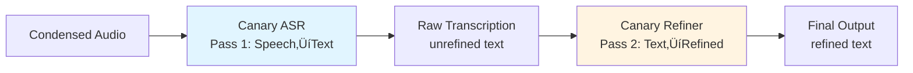

# Vociferous: Executive Architecture Philosophy & Design Principles

**Date:** December 2025
**Version:** 2.2
**Status:** Core Architecture Complete (v0.3.4 Alpha)

> **Note:** The authoritative specification is [Redesign.md](Redesign.md).
> If this document and the Redesign Document disagree, the Redesign Document wins.

## Module Implementation Status

| Module | Status | Notes |
|--------|--------|-------|
| **audio** | ✅ Implemented | Audio primitives (decoder, vad, condenser, recorder) - all contract tests passing |
| **engines** | ✅ Implemented | Canary-Qwen dual-pass working; Official OpenAI Whisper available as fallback |
| **refinement** | ✅ Implemented | Canary LLM refinement mode integrated and tested |
| **cli** | ✅ Implemented | Commands and interface adapters; two-tier help system |
| **app** | ✅ Implemented | Transparent workflow functions (no sessions, no arbiters) |
| **config** | ✅ Implemented | Config loading and management working |
| **domain** | ✅ Implemented | Core types, models, exceptions defined |
| **sources** | ✅ Implemented | File sources and microphone capture working |
| **gui** | ✅ Implemented | KivyMD GUI functional |

**Legend:** ✅ Implemented · 🚧 In Progress · ❌ Not Started · 🔄 Needs Refactor

### Domain Types and Contracts

- `TranscriptSegment` is a frozen dataclass with `id`, `start`, `end`, `raw_text`, and optional `refined_text`/`language`/`confidence`; legacy accessors `text`, `start_s`, and `end_s` remain for compatibility.
- `TranscriptionEngine` protocol: batch-only `transcribe_file(audio_path: Path, options: TranscriptionOptions | None = None) -> list[TranscriptSegment]` plus `metadata` for device/precision reporting.
- `RefinementEngine` protocol: `refine_segments(list[TranscriptSegment], instructions|None) -> list[TranscriptSegment]` for grammar/punctuation-only second pass.

### Audio Module Hardening

- Centralize audio utility exports from `vociferous.audio` (`chunk_pcm_bytes`, `apply_noise_gate`, etc.) to keep a single import surface.
- Decoder advertises format support only when FFmpeg is discoverable; WAV detection normalizes extensions consistently.
- Silero VAD path now fails fast when the dependency is missing or invalid parameters are provided.
- Silero VAD pads/merges spans and enforces ≤40s segments by default (configurable via `speech_pad_ms`/`max_speech_duration_s`).
- Recorder enforces configured sample width; condenser raises when called without timestamps and cleans temp concat lists via context; condensation uses seconds-based 40s chunking with silence-gap splitting.
- All audio contract tests use real files from `tests/audio/sample_audio/` - no mocks.

### Engines Module Updates

- **Canary-Qwen 2.5B is now the default production engine** with full dual-pass (ASR + refinement) working.
- **Critical VRAM fix implemented:** Explicit dtype handling prevents PyTorch's float32 auto-loading memory leak (20GB → 5GB).
- Shared `audio_loader` utility eliminates duplicate WAV-to-numpy logic and PCM scaling constants.
- Whisper Turbo remains available as a fallback engine for compatibility.
- Mock mode removed from Canary engine - real model only (no `use_mock` parameter).
- Cache manager validates inputs and minimum model size; hardware detection logs CUDA initialization failures.

### Refinement Module Updates

- Canary LLM refinement mode fully integrated - uses same model as ASR (no reload overhead).
- Rule-based refiner available as lightweight fallback.
- Refiner contract tests passing with real CLI invocations.

## Architecture Refactor Progress

**Completed (v0.2.0):**
- [x] Audio preprocessing pipeline (decode, vad, condense, record)
- [x] Real-file contract testing philosophy (no mocks)
- [x] Module-based test organization
- [x] Move CLI adapter components to cli.components (separation of concerns)
- [x] Two-tier help system implementation
- [x] Canary-Qwen dual-pass architecture with VRAM optimization
- [x] Remove SegmentArbiter over-engineering
- [x] Remove TranscriptionSession
- [x] Transparent transcribe workflow
- [x] Refinement module integrated (Canary LLM mode)
- [x] Test quality pass - removed 25 weak/mock tests, 64 high-value tests passing
- [x] NeMo + torch as required dependencies (not optional)
- [x] Single source of truth for dependencies (pyproject.toml only)

**Future Work:**
- [ ] Performance optimization for Canary-Qwen (currently slower than Whisper)
- [ ] Prompt engineering for better refinement quality
- [ ] `vociferous deps install` automated dependency installation
- [ ] `vociferous deps download` explicit model pre-download

---

## Core Philosophy

### **"Components, Not Monoliths"**

Vociferous is built on the principle that **every meaningful unit of functionality must be independently verifiable, composable, and debuggable.**

**Guiding Principle:**

> If you can't run it from the command line with real files and see real output, it's not a component—it's just code.

---

## Architectural Hierarchy

### **Three-Tier Structure**


### **Definitions**

| Term | Definition | CLI Accessible? | Example |
| --- | --- | --- | --- |
| **Module** | Collection of related components with unified purpose | No  | `audio`, `engines` |
| **Component** | Independently executable, testable, chainable unit | **Yes** | `vociferous decode`, `vociferous vad` |
| **Utility** | Internal helper used by components | No  | `VadWrapper`, `FFmpegHelper` |

---

## Component Design Principles

### **1. Independent Executability**

**Requirement:** Every component must be callable via CLI.

**Example:**

```bash
# Component: Decoder
vociferous decode audio.mp3
# ✅ Runs standalone, no dependencies on other components

# Component: VAD
vociferous vad audio_decoded.wav
# ✅ Runs standalone, operates on standardized input

# Component: Condenser
vociferous condense timestamps.json audio_decoded.wav
# ✅ Runs standalone, explicit dependencies
```

**Anti-pattern:**

```python
# ❌ This is NOT a component (no CLI interface)
class InternalAudioProcessor:
    def process(self, data): ...
```

---

### **2. Observable Outputs**

**Requirement:** Components must produce real, inspectable files.

**Example:**

```bash
vociferous decode input.mp3
# → Creates:  input_decoded.wav (you can listen to it)

vociferous vad input_decoded.wav
# → Creates: input_decoded_vad_timestamps.json (you can read it)

vociferous condense timestamps.json input_decoded.wav
# → Creates: input_decoded_condensed.wav (you can verify quality)
```

**Why:** If output is only in memory or internal state, you can't verify correctness.

---

### **3. Manual Chainability**

**Requirement:** Components must be manually chainable for debugging.

**Example:**

```bash
# Debug by running each step manually
vociferous decode lecture.mp3
vociferous vad lecture_decoded.wav
vociferous condense lecture_decoded_vad_timestamps.json lecture_decoded.wav
vlc lecture_decoded_condensed.wav  # ← Listen to verify!
vociferous transcribe lecture_decoded_condensed.wav
```

**Why:** When the pipeline fails, you can isolate exactly which component broke.

---

### **4. Automatic Composition**

**Requirement:** Provide convenience commands that chain components automatically.

**Example:**

```bash
# Convenience:  runs decode → vad → condense → transcribe → refine
vociferous transcribe lecture.mp3
```

**But:** Manual chaining must always remain possible.

---

### **5. Single Responsibility**

**Requirement:** Each component does exactly one thing.

| Component | Responsibility | NOT Responsible For |
| --- | --- | --- |
| **Decoder** | Normalize to PCM mono 16kHz | ❌ VAD, ❌ Transcription |
| **VAD** | Detect speech boundaries | ❌ Audio format, ❌ Silence removal |
| **Condenser** | Remove silence using timestamps | ❌ VAD detection, ❌ Decoding |
| **Recorder** | Capture microphone audio | ❌ Preprocessing, ❌ Transcription |
| **Refiner** | Improve grammar/punctuation using LLM | ❌ ASR decoding, ❌ Audio preprocessing |

**Note:** Engines are infrastructure modules called by workflows, not CLI-accessible components themselves. The CLI exposes workflow commands like `transcribe` which orchestrate engine usage internally.

**Anti-pattern:**

```python
# ❌ Engine doing VAD (violates single responsibility)
class WhisperEngine:
    def transcribe(self, audio):
        # Detect speech (❌ should be separate component)
        vad_segments = self.detect_speech(audio)
        # Remove silence (❌ should be separate component)
        clean_audio = self.remove_silence(audio, vad_segments)
        # Transcribe (✅ correct responsibility)
        return self.transcribe(clean_audio)
```

---

### **6. Fail Loudly**

**Requirement:** Components must fail with clear error messages, not silent failures.

**Example:**

```bash
$ vociferous condense missing. json audio.wav
❌ Error:  Timestamps file not found:  missing.json

$ vociferous decode invalid.txt
❌ Error: Not a valid audio file: invalid.txt
```

**Anti-pattern:**

```python
# ❌ Silent failure (returns empty, no error)
def detect_speech(audio):
    try:
        return vad.process(audio)
    except:
        return []  # ❌ Hides the problem!
```

---

## Testing Philosophy

### **"No Mocks, Real Files Only"**

**Problem Identified:**

- Had 100+ mock-based unit tests

- All tests passed ✅

- Program was completely broken 🔴


**Root Cause:** Tests tested mocks, not real behavior.

**Solution Implemented (December 2025):**
- Removed 25 weak/mock-based tests
- Kept 64 high-value contract tests using real files
- All tests use subprocess calls and real audio samples
- Test suite runs in ~4 minutes with CUDA GPU

---

### **New Testing Standard**

**Requirement:** Tests must use real files and subprocess calls.

**Example:**

```python
def test_vad_detects_speech():
    """VAD detects speech in real audio file."""

    # ✅ Real file from test fixtures
    audio_file = Path("tests/audio/sample_audio/ASR_Test.flac")

    # ✅ Real CLI call via subprocess
    result = subprocess.run(
        ["vociferous", "vad", str(audio_file)],
        capture_output=True,
        timeout=30,  # ← Catches hangs!
    )

    # ✅ Real output verification
    assert result.returncode == 0
    timestamps_file = Path("ASR_Test_vad_timestamps.json")
    assert timestamps_file.exists()

    with open(timestamps_file) as f:
        timestamps = json.load(f)
    assert len(timestamps) > 0
```

**Engine Tests Use Preprocessed Audio:**

```python
def test_canary_asr_mode():
    """Canary ASR produces transcript from preprocessed audio."""

    # ✅ Preprocessed audio (decoded → VAD → condensed)
    SAMPLE_WAV = Path("tests/audio/sample_audio/ASR_Test_preprocessed.wav")

    config = EngineConfig(
        model_name="nvidia/canary-qwen-2.5b",
        device="cuda",  # Canary requires CUDA
        compute_type="float16",
    )
    engine = CanaryQwenEngine(config)
    segments = engine.transcribe_file(SAMPLE_WAV, TranscriptionOptions(language="en"))

    assert segments, "No segments produced"
    for seg in segments:
        assert seg.text.strip()
```

**Why This Works:**

- If component hangs → timeout catches it

- If component fails → returncode ≠ 0

- If output wrong → file assertions fail

- **Tests prove real behavior, not mocked behavior**


---

### **Test Organization**


**Organization Principles:**

- Tests mirror the `src/` module structure
- Each module has its own test directory
- `artifacts/` subdirectories contain test outputs (overwritten each run)
- `tests/audio/sample_audio/` contains shared test audio/text fixtures
- `ASR_Test_preprocessed.wav` is the preprocessed (decoded → VAD → condensed) audio for engine tests
- `integration/` tests full workflows across modules
- **64 tests passing** - all use real files, no mocks

**Principle:** If a test passes, the component works. If it fails, the component is broken.

---

## Data Flow Architecture

### **Linear Pipeline, No Cycles**


**Key Principles:**

- Each stage produces a **file** (not just in-memory data)

- Each stage can be **run independently**

- No component depends on another component's **internal state**

- Data flows **forward only** (no backwards dependencies)

- Workflow orchestration is explicit and stateless—there is no `TranscriptionSession` or `SegmentArbiter`. Canary ASR receives condensed audio and must emit non-overlapping segments; refinement is a second pass over the resulting text.

### Canonical Workflow (app)

`transcribe_file_workflow(source, engine_profile, segmentation_profile, refine=True)` encodes the pipeline once:
- `source.resolve_to_path()` yields a real file (file/mic/etc.)
- `decode → vad → condense` with Silero parameters from `SegmentationProfile`, splitting to ≤40s chunks
- `EngineWorker` loads the chosen engine once and transcribes each condensed chunk (timestamps offset by chunk order)
- Optional refinement runs via the engine seam, which can later be swapped for an out-of-process worker.


---

## Canary-Qwen Dual-Pass Architecture

### **Two-Phase Processing**

The Canary-Qwen engine implements a sophisticated dual-pass design that separates speech recognition from text refinement:

**Pass 1: ASR Mode (Speech → Raw Text)**
- Model configured as Automatic Speech Recognition (ASR)
- Converts audio directly to raw transcribed text
- Fast, focused on accurate speech-to-text conversion
- Output: Unrefined text with potential artifacts

**Pass 2: LLM Mode (Raw Text → Refined Text)**
- Same model reconfigured as Language Model (LLM)
- Takes raw text as input and applies linguistic refinement
- Fixes grammar, punctuation, capitalization
- Output: Clean, publication-ready text

### **Key Optimization**

**Model stays loaded between passes.** This is critical for performance:
- No model reload overhead between ASR and refinement
- Memory footprint remains constant (single model in VRAM/RAM)
- Makes dual-pass practical for batch processing

### **VRAM Optimization (Critical Fix)**

**Problem Solved:** PyTorch's `from_pretrained()` defaults to loading models as float32, even when saved as bfloat16. This caused 2x memory inflation:
- Expected: 5GB for 2.5B params in float16
- Actual before fix: 20GB (float32 loading + device transfer overhead)

**Solution Implemented:**
```python
# Map compute_type to torch dtype to prevent float32 auto-loading
dtype_map = {"float32": torch.float32, "float16": torch.float16, "bfloat16": torch.bfloat16}
target_dtype = dtype_map.get(self.config.compute_type, torch.bfloat16)

# Convert to target dtype BEFORE moving to device
model = SALM.from_pretrained(self.model_name)
model = model.to(dtype=target_dtype)  # Convert first
model = model.to(device=device)       # Then move to GPU
```

**Result:** VRAM usage reduced from 20GB to ~5GB (75% reduction), enabling Canary-Qwen on consumer GPUs.

### **Architecture Diagram**



### **Usage**

```bash
# Run both passes (ASR + refinement)
vociferous transcribe audio.wav --engine canary_qwen --refine

# Run ASR only (skip refinement)
vociferous transcribe audio.wav --engine canary_qwen --no-refine

# Custom refinement instructions
vociferous transcribe audio.wav --engine canary_qwen --refine \
  --refinement-instructions "Medical terminology, formal tone"
```

### **Refinement Modes**

The refinement module now supports multiple named modes with centralized prompt templates:

**Available Modes:**
- `grammar_only` (default) - Fix grammar, punctuation, capitalization, remove fillers
- `summary` - Produce a concise summary of key points
- `bullet_points` - Convert to structured bullet points

**CLI Usage:**
```bash
# Default grammar refinement
vociferous refine transcript.txt

# Summary mode
vociferous refine transcript.txt --mode summary

# Custom instructions override
vociferous refine transcript.txt --instructions "Make it formal"
```

**Segment-Based Refinement:**

The refinement module operates on `list[TranscriptSegment]` to preserve timestamp alignment:
- Accepts segments with `raw_text`
- Returns same segments with `refined_text` filled in
- Never drops or reorders segments
- Maintains temporal alignment for downstream tools

### **Design Rationale**

1. **Separation of Concerns:** Speech recognition and text refinement are fundamentally different tasks
2. **Flexibility:** Users can skip refinement for speed or run it for quality
3. **Performance:** Single model load, dual-purpose usage maximizes efficiency
4. **Quality:** Dedicated refinement pass produces better results than single-pass ASR
5. **Alignment Preservation:** Segment-based refinement keeps timestamps intact for subtitle generation, etc.

---

## Provisioner & Engine Requirements

### **Explicit Dependency Management**

Vociferous follows a **fail-loud** principle: engines do not automatically install dependencies or download models. Instead, the system provides explicit provisioning commands to check and manage requirements.

**Core Principle:** No implicit installs, no silent downloads, no mocks in production.

### **Provisioner Commands**

The `vociferous deps` command group provides explicit dependency management:

```bash
# Check for missing dependencies and models
vociferous deps check --engine canary_qwen

# Example output shows missing packages and provides install commands
```

**Available Commands:**

| Command | Purpose | Behavior |
|---------|---------|----------|
| `deps check` | Detect missing Python packages and model weights | Non-invasive; reports status and provides actionable commands |
| `deps install` | (Future) Automated dependency installation | Will install required packages via pip |
| `deps download` | (Future) Explicit model download | Will pre-download models to cache |

**Exit Codes:**
- `0` - All dependencies satisfied
- `2` - Missing dependencies or models detected

**Philosophy:** Dependencies are managed explicitly by the user, not implicitly by the application. This prevents surprise installations, respects user control, and makes dependency issues visible immediately.

---

### **Engine Requirements Table**

Each engine declares its required packages and models explicitly. The `deps check` command inspects these requirements without triggering heavy imports.

| Engine | Required Packages | Model Repository | Model Cache Location |
|--------|------------------|------------------|---------------------|
| **canary_qwen** | `nemo_toolkit[asr,tts]>=2.1.0`<br/>`torch>=2.6.0`<br/>`sacrebleu>=2.0.0` | `nvidia/canary-qwen-2.5b` (NeMo SALM checkpoint) | `~/.cache/vociferous/models/` |
| **whisper_turbo** | `openai-whisper>=20240930` | `turbo` (official OpenAI model) | `~/.cache/vociferous/models/` |

**Notes:**
- **NeMo, torch, and sacrebleu are required dependencies** - included in `pyproject.toml` (not optional)
- **Whisper uses the official OpenAI Whisper package** (NOT faster-whisper, NOT CTranslate2)
- Package versions are minimum requirements; newer versions typically work
- Models are downloaded automatically on first use if not cached
- Canary-Qwen is a NeMo SpeechLM (SALM) model, not a Transformers checkpoint
- Cache location can be configured via `model_cache_dir` in `~/.config/vociferous/config.toml`
- **Canary-Qwen requires CUDA** - CPU mode is not supported for this engine
- Whisper Turbo works on both CPU and GPU

---

### **Cache Behavior**

**Model Cache Directory:** `~/.cache/vociferous/models/` (default)

**Behavior:**
- Models are downloaded on first use to the cache directory
- Subsequent runs reuse cached models (no re-download)
- Cache can be pre-populated using `deps download` (planned)
- Cache location is configurable via `config.toml`

**Hugging Face Cache Integration:**
- Models use Hugging Face Hub's cache structure
- Cache entries follow `models/hub/model--<org>--<name>/` pattern
- Compatible with `HF_HOME` environment variable

**Cache Verification:**
- `deps check` inspects cache for model presence
- Reports "CACHED" for available models, "NOT CACHED" otherwise
- Does not validate model integrity (assumes cached = valid)

---

### **Fail-Loud Contract**

**Principle:** If a dependency is missing, the system must fail immediately with a clear, actionable error message.

**What This Means:**
- ❌ **No implicit installs** - The system never runs `pip install` automatically
- ❌ **No silent downloads** - Model downloads are explicit and visible
- ❌ **No mock fallbacks** - Production code must use real implementations
- ✅ **Clear error messages** - Missing dependencies trigger errors with installation instructions
- ✅ **Explicit provisioning** - User controls when and how dependencies are installed

**Example Error Flow:**

```bash
$ vociferous transcribe audio.wav --engine canary_qwen

❌ Error: Missing dependencies for Canary-Qwen SALM. Install NeMo:
   pip install "nemo_toolkit[asr,tts]>=2.1.0"

Then run: vociferous deps check --engine canary_qwen
```

**Anti-Pattern (What We Don't Do):**

```python
# ❌ Silent fallback to mock (REMOVED - mock mode is disabled in production)
# Canary engine now raises ConfigurationError if use_mock=true is passed
try:
    from transformers import AutoModel
    use_mock = False
except ImportError:
    use_mock = True  # User doesn't know they're not getting real results!

# ❌ Implicit dependency installation (violates user control)
try:
    import torch
except ImportError:
    print("Installing torch...")
    subprocess.run(["pip", "install", "torch"])  # Surprise!
```

**Correct Pattern (What We Do):**

```python
# ✅ Explicit check with clear error
try:
    from nemo.collections.speechlm2.models import SALM
except ImportError:
    raise DependencyError(
        "Missing dependencies for Canary-Qwen SALM. Install NeMo:\n"
        "pip install nemo_toolkit[asr,tts]>=2.1.0\n"
        "Then run: vociferous deps check --engine canary_qwen"
    )

# ✅ Mock mode explicitly disabled
if _bool_param(params, "use_mock", False):
    raise ConfigurationError("Mock mode is disabled for Canary-Qwen. Remove params.use_mock=true.")
```

---

### **Developer Workflow**

**Setting Up for Canary-Qwen (Default Engine):**

1. **Install the package (includes all required dependencies):**
   ```bash
   pip install -e .
   # Installs: nemo_toolkit, torch>=2.6.0, sacrebleu, openai-whisper, etc.
   ```

2. **Check dependencies:**
   ```bash
   vociferous deps check --engine canary_qwen
   # Should show: ✓ All dependencies satisfied
   ```

3. **First run (downloads model ~5GB):**
   ```bash
   vociferous transcribe audio.wav
   # Model downloads to ~/.cache/vociferous/models/ on first use
   # Requires CUDA GPU with ~6GB free VRAM
   ```

**Setting Up for Whisper Turbo (Fallback/CPU):**

```bash
vociferous transcribe audio.wav --engine whisper_turbo
# Works on CPU, faster but less accurate than Canary
```

**CI/Offline Workflows:**

For environments without internet access:
1. Pre-populate model cache on a machine with internet
2. Copy `~/.cache/vociferous/models/` to offline environment
3. `deps check` verifies cached models are present
4. Transcription runs without network access

**Future Enhancements (Planned):**

```bash
# Explicit dependency installation (Issue #1 follow-up)
vociferous deps install --engine canary_qwen --yes

# Explicit model download (Issue #1 follow-up)
vociferous deps download --engine canary_qwen
```

---

## Module Architecture

### **Complete Module List**

Vociferous is organized into **9 modules**, each with a clear responsibility and visibility boundary:

| Module | Purpose | CLI Components? | Key Responsibilities |
|--------|---------|-----------------|---------------------|
| **audio** | Audio processing primitives | ❌ No (primitives only) | FfmpegDecoder, SileroVAD, FFmpegCondenser, SoundDeviceRecorder |
| **engines** | Speech-to-text conversion | ❌ No (infrastructure) | Canary-Qwen (default), Whisper Turbo (fallback) |
| **refinement** | Text post-processing via Canary LLM pass | ❌ No (internal) | Grammar/punctuation refinement, prompt handling |
| **cli** | Command-line interface | ✅ Yes | Typer commands, argument parsing, help system, interface adapters (cli.components) |
| **app** | Workflow orchestration | ❌ No | Transparent workflow functions (no sessions, no arbiters) |
| **config** | Configuration management | ❌ No | Settings, defaults, config file handling |
| **domain** | Core domain models & protocols | ❌ No | Typed data structures, contracts, errors |
| **sources** | Audio input abstractions | ❌ No | File/memory/microphone sources producing files (FileSource, MemorySource, MicSource) |
| **gui** | Graphical user interface | ❌ No (separate interface) | KivyMD GUI wrapper around workflows |

**Notes:**
- **Canary-Qwen is the default production engine** with dual-pass (ASR + refinement) fully working.
- Whisper Turbo is available as a fallback for CPU-only systems or faster processing.
- Engines and refinement are infrastructure invoked by workflows; not exposed as standalone CLI commands.
- The `app` module coordinates workflows explicitly—there is **no** `TranscriptionSession` or `SegmentArbiter`.
- **Audio module contains only primitives** (decoder, VAD, condenser, recorder classes); **CLI adapters** (DecoderComponent, VADComponent, etc.) are in `cli.components`.
- **Config module centralizes profiles**: engine profiles (kind, precision, model name) and segmentation profiles (Silero VAD/condense parameters) live in `~/.config/vociferous/config.toml` with defaults `canary_qwen_fp16` and `default`.

### **Module Organization Principles**

**1. CLI-Accessible Commands (via cli.components)**

These components can be invoked directly from the command line:
- `vociferous decode` - Audio format normalization (DecoderComponent)
- `vociferous vad` - Voice activity detection (VADComponent)
- `vociferous condense` - Silence removal (CondenserComponent)
- `vociferous record` - Microphone capture (RecorderComponent)

**2. Infrastructure Modules (engines, refinement)**

These modules are called by workflows, not directly by users:
- Engines provide transcription capabilities
- Refinement modules improve text quality
- Accessed through high-level commands like `transcribe`

**3. Support Modules (config, domain, sources)**

These modules provide supporting functionality:
- Configuration management
- Data structure definitions
- I/O abstractions that emit files for downstream processing (FileSource, MemorySource, MicSource)

**Sources Abstractions**

All sources are file-first and resolve to a concrete path before the audio pipeline runs:
- `FileSource(path)` – validates file input, feeds decode/VAD/condense
- `MemorySource(pcm, sample_rate, channels)` – wraps in-memory PCM into a temporary WAV
- `MicSource(duration_seconds, recorder=...)` – records a bounded clip (defaults to `SoundDeviceRecorder`, recorder injectable for tests)

Design principles:
- No streaming surfaces exposed beyond file outputs
- Duration-bound microphone capture to avoid interactive hangs
- Dependency injection for recorders enables hardware-free testing

---

## User Help vs Developer Help

### **Two-Tier Help System**

Vociferous provides separate help interfaces for users and developers:

**User-Facing Commands (`--help`)**

These are production-ready commands intended for end users:
- `vociferous transcribe` - Complete transcription workflow
- `vociferous bench` - Benchmark pipeline performance with RTF metrics
- `vociferous languages` - List supported languages
- `vociferous check` - Verify system dependencies

**Developer-Facing Commands (`--dev-help`)**

These are individual components for debugging and development:
- `vociferous decode` - Test audio decoding
- `vociferous vad` - Test voice activity detection
- `vociferous condense` - Test silence removal
- `vociferous refine` - Text-only refinement (Canary LLM mode)
- `vociferous record` - Test microphone capture
- `vociferous transcribe` - Full workflow orchestrator (shows how components chain)

**Rationale:**

- **Users** want simple, high-level workflows that "just work"
- **Developers** need access to individual components for debugging
- Separating help prevents overwhelming users with internal details
- Makes component-level testing possible without exposing complexity

---

## Benchmark & Performance Contracts

### **Bench Command**

The `bench` command provides performance testing and RTF (Real-Time Factor) measurement across audio corpora:

```bash
# Basic benchmark with default profiles
vociferous bench ./test_corpus/

# Custom engine and segmentation profiles
vociferous bench ./corpus/ \
  --engine-profile canary_qwen_bf16 \
  --segmentation-profile aggressive

# Enable refinement (increases processing time)
vociferous bench ./corpus/ --refine

# Benchmark specific file types
vociferous bench ./corpus/ --pattern "*.mp3"
```

**Metrics:**
- **RTF (Real-Time Factor):** `wall_clock_time / audio_duration` — lower is better
- **Throughput:** `total_audio_seconds / wall_clock_time` — how many seconds of audio processed per second
- **Per-file breakdown:** Duration, wall time, and RTF for each file
- **Aggregate statistics:** Total duration, total wall time, aggregate RTF, overall throughput

**Performance Rating:**
- RTF < 0.1: Excellent (>10x realtime) — green
- RTF < 0.5: Good (>2x realtime) — yellow  
- RTF ≥ 0.5: Below realtime — red

**Use Cases:**
- Validate engine configuration changes
- Compare profile performance (FP16 vs BF16, different VAD settings)
- Establish performance baselines before optimization
- Verify RTF targets (e.g., ≥30x realtime for 3090, ≥200x stretch goal)

**Future:** WER calculation support via `--reference-dir` (flagged for implementation)

---

## Artifact Management

### **Test Artifacts**

**Location:** `tests/<module>/artifacts/`

Tests produce artifacts (audio files, timestamps, transcripts) for verification:

```
tests/
  audio/
    artifacts/
      test_decode_output.wav
      test_vad_timestamps.json
  engines/
    artifacts/
      test_transcription.json
  integration/
    artifacts/
      test_full_pipeline_output.txt
```

**Fixtures:** Canonical audio/text inputs live in `tests/audio/sample_audio/` (moved from root `sample_audio/` to keep test inputs co-located with tests).

**Behavior:**
- Artifacts are **overwritten on each test run**
- Allows developers to inspect test outputs
- Not committed to git (in `.gitignore`)
- Helps debug test failures

### **User-Facing Artifacts**

**Default Behavior:** Temporary files

```bash
# Creates temp files, cleans up automatically
vociferous transcribe lecture.mp3
# → Uses /tmp/vociferous-XXXXX/ for intermediates
# → Only final output kept: lecture_transcript.txt
```

**Debugging Mode:** Keep intermediate files

```bash
# Keeps all intermediate files for inspection
vociferous transcribe lecture.mp3 --keep-intermediates
# → Creates: lecture_decoded.wav
# → Creates: lecture_vad_timestamps.json
# → Creates: lecture_condensed.wav
# → Creates: lecture_transcript.txt
```

### **Manual Component Execution**

When running components manually, files are **always kept**:

```bash
vociferous decode lecture.mp3
# → Creates lecture_decoded.wav (permanent file)

vociferous vad lecture_decoded.wav
# → Creates lecture_decoded_vad_timestamps.json (permanent file)

vociferous condense lecture_decoded_vad_timestamps.json lecture_decoded.wav
# → Creates lecture_decoded_condensed.wav (permanent file)
```

**Rationale:** When debugging, you want to inspect every step's output.

---

## Separation of Concerns

### **Audio Module vs Engine Module**

| Concern | Audio Module | Engine Module |
| --- | --- | --- |
| **Responsibility** | Prepare audio for transcription | Convert speech to text |
| **Operations** | Decode, VAD, condense, record | Transcribe (ASR), provide segments for refinement |
| **Output** | Clean audio files | Text segments (non-overlapping) |
| **No Overlap** | ❌ No transcription | ❌ No audio preprocessing |

**Anti-pattern (Old Architecture):**

```python
# ❌ Engine doing audio preprocessing
class WhisperEngine:
    def __init__(self, vad_service):  # ❌ Shouldn't have VAD
        self.vad = vad_service

    def transcribe(self, audio):
        # ❌ Engine shouldn't do VAD
        segments = self.vad.detect_speech(audio)
        # ❌ Engine shouldn't remove silence
        clean = self.remove_silence(audio, segments)
        return self.whisper_model.transcribe(clean)
```

**Correct Architecture:**

```python
# ✅ Audio Module handles preprocessing
decoded = decoder.decode("audio.mp3")
timestamps = vad.detect_speech(decoded)
condensed = condenser.condense(decoded, timestamps)

# ✅ Engine only transcribes
segments = engine.transcribe(condensed)
```

---

## Module Architecture

### **What is a Module?**

**Definition:** A module is a logical collection of related functionality that serves a specific architectural purpose. Not all modules need CLI-accessible components - some provide infrastructure (config, domain), orchestration (app), or interfaces (cli, gui).

**Key Characteristics:**
- **Cohesive Purpose:** All code in a module serves a unified architectural goal
- **Clear Boundaries:** Modules interact through well-defined interfaces
- **Varying Accessibility:** Some modules expose CLI components, others provide internal infrastructure

---

### **Complete Module Inventory**

| Module | Purpose | Contains Components? | Key Responsibilities |
| --- | --- | --- | --- |
| **audio** | Audio preprocessing | ✅ Yes | Decode, VAD, condense, record - prepares audio for transcription |
| **engines** | Speech-to-text transcription | ❌ No* | Canary-Qwen (default), Whisper Turbo (fallback) - invoked by workflows |
| **refinement** | Text post-processing via Canary LLM | ❌ No (internal) | Grammar/punctuation refinement, prompt handling |
| **cli** | Command-line interface | ✅ Yes (workflows) | Typer commands, argument parsing, help tiers |
| **app** | Workflow orchestration | ❌ No | Transparent workflow functions; no sessions, no arbiters |
| **config** | Configuration management | ❌ No | Load/validate settings from files and CLI arguments |
| **domain** | Core types and contracts | ❌ No | Models, exceptions, protocols, constants |
| **sources** | Audio input sources | ❌ No | File readers, memory buffers, microphone capture |
| **gui** | Graphical interface | ❌ No | KivyMD application, screens, UI components |

**\*Note:** Engines are not directly CLI-accessible. They are infrastructure called by workflow commands such as `transcribe`. Canary-Qwen is the default engine and requires CUDA GPU.

---

### **Module Categories**

Modules fall into four architectural categories:

#### **1. Processing Modules**
- **audio**: Transforms raw audio into standardized, preprocessed files
- **engines**: Converts preprocessed audio into text transcripts
- **refinement**: Runs Canary LLM refinement over transcripts

**Characteristic:** These modules perform domain transformations (audio → text → refined text)

#### **2. Interface Modules**
- **cli**: Command-line user interface
- **gui**: Graphical user interface

**Characteristic:** These modules expose functionality to users but don't contain business logic

#### **3. Infrastructure Modules**
- **config**: Manages system configuration
- **domain**: Defines core types and contracts
- **sources**: Provides audio input abstractions

**Characteristic:** These modules provide foundational services used by other modules

#### **4. Orchestration Modules**
- **app**: Coordinates workflows and manages execution

**Characteristic:** This module composes components from other modules into complete workflows

---

### **Module Boundaries and Interactions**

#### **What Belongs Where**

| If you're implementing... | It belongs in... | NOT in... |
| --- | --- | --- |
| Audio format conversion (primitive) | `audio` | ❌ `engines`, ❌ `app` |
| Speech detection (VAD primitive) | `audio` | ❌ `engines`, ❌ `cli` |
| File-IO adapter for audio primitives | `cli.components` | ❌ `audio`, ❌ `app` |
| Transcription algorithm | `engines` | ❌ `audio`, ❌ `app` |
| Text grammar fixes | `refinement` | ❌ `engines`, ❌ `audio` |
| Command parsing | `cli` | ❌ `app`, ❌ `audio` |
| Pipeline coordination | `app` | ❌ `cli`, ❌ `engines` |
| Configuration loading | `config` | ❌ `cli`, ❌ `app` |
| Data models | `domain` | ❌ Any specific module |
| File/microphone input | `sources` | ❌ `audio`, ❌ `cli` |
| UI screens | `gui` | ❌ `cli`, ❌ `app` |

#### **Module Interaction Flow**


**Data Flow Example:**
```
User Input (cli/gui)
    → app orchestrates workflow (no session objects)
    → sources provides audio input
    → audio preprocesses (decode → VAD → condense)
    → engines transcribe preprocessed audio
    → refinement improves transcript text via Canary LLM
    → app returns results to the user interface
```

---

### **Infrastructure vs Components Distinction**

**Critical Understanding:** Not all modules need CLI-accessible components.

**Modules WITH Components (CLI-accessible)**

**audio module:**
```bash
vociferous decode audio.mp3       # ✅ Component
vociferous vad audio.wav          # ✅ Component
vociferous condense timestamps.json audio.wav  # ✅ Component
vociferous record                 # ✅ Component
```

Recorder component implementation lives in `vociferous/cli/components/recorder.py` and wraps the low-level `SoundDeviceRecorder` primitive defined in `vociferous/audio/recorder.py`.

**cli module (workflows):**
```bash
vociferous transcribe audio.mp3   # ✅ Workflow orchestrator (calls components + engines)
vociferous refine transcript.txt  # ✅ Text-only refinement via Canary LLM
```

#### **Modules WITHOUT Components (Infrastructure)**

**engines module:**
```python
# ❌ NOT directly callable via CLI
# ✅ Called by app workflow functions
engine = build_engine("canary_qwen")
segments = engine.transcribe_file(audio_path)
```

**refinement module:**
```python
# ✅ Accessible via CLI with `vociferous refine`
# ✅ Also invoked by workflows for Canary LLM pass
refined = engine.refine_text(raw_text, instructions)
```

**config module:**
```python
# ❌ NOT a component
# ✅ Infrastructure used by all modules
config = load_config()
```

**domain module:**
```python
# ❌ NOT a component
# ✅ Core types used everywhere
segment = TranscriptSegment(text="...", start=0.0, end=1.0)
```

**sources module:**
```python
# ❌ NOT a component
# ✅ Infrastructure providing input abstractions
source = FileSource(path)
audio_data = source.read()
```

**gui module:**
```python
# ❌ NOT CLI-accessible (separate interface)
# ✅ Alternative UI layered on workflows
app = VociferousGUI()
app.run()
```

---

### **Module Design Guidelines**

When adding functionality, ask:

1. **Which module's purpose does this serve?**
   - Audio transformation → `audio`
   - Transcription → `engines`
    - Text refinement → `refinement`
   - User interaction → `cli` or `gui`
   - Workflow coordination → `app`
   - Configuration → `config`
   - Core types → `domain`
   - Input handling → `sources`
    - Persistence helpers → handled within workflows as needed (not a separate module)

2. **Does it need to be a CLI component?**
   - Independently testable operation → Consider making it a component
   - Infrastructure/helper → Keep it as internal module functionality
   - Workflow coordination → Keep in `app`, expose via `cli` component

3. **What are its dependencies?**
   - Depends on specific module → It might belong in that module
   - Used by multiple modules → Consider `domain` or infrastructure module
   - Orchestrates multiple modules → Belongs in `app`

4. **Is it independently verifiable?**
   - Yes, produces observable output → Strong candidate for component
   - No, internal transformation → Keep as module internal

---

## Batch vs Streaming

### **Design Decision: Batch Processing**

**What is Batch Processing?**

Batch processing means: **complete file in → complete result out**. The entire audio file is processed as a single unit, from start to finish, producing the complete transcription before returning.

**Use Case:**

Vociferous is designed for users who submit **complete audio files** for transcription, not continuous real-time streams. Examples:
- Pre-recorded lectures
- Meeting recordings
- Podcast episodes
- Completed interviews

**Why Batch is Correct for Vociferous:**

1. **Simpler Architecture:** No buffering state, no overlap handling, no partial results
2. **Matches ML APIs:** Whisper, Canary-Qwen, and similar models expect complete audio inputs
3. **Matches Use Case:** Users have complete files they want transcribed, not live microphone streams
4. **Eliminates Complexity:** No need to handle chunk boundaries, duplicates, or partial segments
5. **Easier to Test:** Deterministic input/output relationships

**Architecture:**

```python
# ✅ Simple batch interface
class TranscriptionEngine:
    def transcribe_file(self, audio_path: Path) -> list[TranscriptSegment]:
        """Transcribe entire file in one operation."""
        ...
```

**Anti-pattern (Old Architecture):**

```python
# ❌ Unnecessary streaming complexity for batch use case
class TranscriptionEngine:
    def start(self): ...
    def push_audio(self, chunk: bytes): ...  # Why chunks for complete files?
    def flush(): ...
    def poll_segments(): ...  # When to poll? How to handle overlaps?
```

**Guardrail:** Any `start/push_audio/flush/poll` API you see is legacy—do not reintroduce streaming abstractions. Engines take a **file path in** and return **full-sequence segments out**.

**Note:** While Vociferous uses batch processing, individual components like `record` can still capture audio from the microphone. The difference is that recording produces a **complete file** which is then processed in batch, rather than streaming audio chunks directly to the transcription engine.


---

## Configuration Philosophy

### **Sane Defaults, Explicit Overrides**

**Principle:** System should work out-of-the-box, but allow customization.

**Example:**

```bash
# ✅ Works with defaults
vociferous transcribe audio.mp3

# ✅ Override when needed
vociferous transcribe audio.mp3 \
  --engine canary_qwen \
  --language es \
  --refine
```

**Configuration Hierarchy:**

1. **Hardcoded defaults** (in code)

2. **Config file** (`~/.config/vociferous/config.toml`)

3. **CLI flags** (highest priority)


---

## Error Handling Strategy

### **Fail Fast, Fail Clear**

**Principle:** Better to crash with a clear error than continue silently broken.

**Example:**

```python
# ✅ Explicit validation
def condense(audio_path:  Path, timestamps_path: Path):
    if not timestamps_path.exists():
        raise FileNotFoundError(
            f"Timestamps file not found: {timestamps_path}\n"
            f"Run 'vociferous vad {audio_path}' first."
        )

    timestamps = json.loads(timestamps_path.read_text())
    if not timestamps:
        raise ValueError(
            f"No speech detected in {audio_path}.\n"
            f"Audio may be silent or VAD threshold too high."
        )

    # ... proceed with condensation
```

**Anti-pattern:**

```python
# ❌ Silent failure
def condense(audio_path, timestamps_path):
    try:
        timestamps = json.loads(timestamps_path.read_text())
    except:
        timestamps = []  # ❌ Hides the problem!

    if not timestamps:
        return audio_path  # ❌ No error, user doesn't know it failed
```

---

## Dependency Management

### **Components Declare Dependencies Explicitly**

**Principle:** If Component B needs Component A's output, it should **require the file**, not call Component A internally.

**Example:**

```bash
# ✅ Explicit dependency (user provides VAD output)
vociferous condense timestamps.json audio.wav

# ❌ Implicit dependency (condenser calls VAD internally)
# This would hide the VAD step and make debugging impossible
vociferous condense audio.wav  # Where are timestamps?
```

**Why:** Makes data flow visible and debuggable.

---

## Performance Optimization Strategy

### **Correctness First, Speed Second**

**Principle:** Optimize only after proving correctness.

**Workflow:**

1. Implement simple, correct version

2. Test thoroughly with real files

3. Profile to find bottlenecks

4. Optimize hot paths only

5. Re-test to ensure correctness preserved


**Example:**

```python
# Phase 1: Correct but slow
def condense(audio, timestamps):
    segments = []
    for start, end in timestamps:
        segment = extract_audio_range(audio, start, end)
        segments.append(segment)
    return concatenate(segments)

# Phase 2: Optimized (only after profiling showed this was slow)
def condense(audio, timestamps):
    # Use FFmpeg concat demuxer (O(n) instead of O(n²))
    return ffmpeg_concat_segments(audio, timestamps)
```

---

## Documentation Standards

### **Every Component Needs:**

1. **Purpose** - What does it do?

2. **CLI Usage** - How to run it?

3. **Input Format** - What does it expect?

4. **Output Format** - What does it produce?

5. **Example** - Real command with real files

6. **Error Cases** - What can go wrong?


**Example:**

````markdown
## Condenser Component

**Purpose:** Remove silence from audio using VAD timestamps.

**Usage:**
```bash
vociferous condense <timestamps.json> <audio.wav> [--output <path>]
````

**Input:**

- `timestamps.json`: Speech boundaries from VAD (format: `[{"start": 0.0, "end": 2.5}, ...]`)

- `audio.wav`: Decoded audio file (PCM mono 16kHz)


**Output:**

- Condensed WAV file with silence removed

**Example:**

```bash
vociferous vad lecture.wav
vociferous condense lecture_vad_timestamps.json lecture.wav
# → Creates lecture_condensed.wav
```

**Errors:**

- `FileNotFoundError`: Timestamps file doesn't exist

- `ValueError`: Timestamps list is empty (no speech detected)

---

## Version Control Strategy

### **Commit Message Standard**

**Format:**
Commit messages must follow this structure and be limited to a single affected file or logical change:

```markdown
[CREATE/UPDATE/DELETE]: file1, file2, ...
```

**Changes:**

- A bullet point description of what changed
- Why it changed
- Impact on system

**Testing:**

- A bullet point description of tests added/modified
- What scenarios are covered
- How it ensures correctness

**Example:**

```markdown
[CREATE]: vociferous/cli/components/vad.py, tests/audio/test_vad_contract.py

**Changes:**

- Added VAD component with CLI interface
- Implements speech boundary detection using Silero
- Returns timestamps as JSON for downstream components

**Testing:**

- Added contract test using real 30s audio sample
- Verifies JSON output format and timestamp validity
- Includes timeout protection (catches hangs)
```

---

## Deprecation Policy

### **Don't Break, Replace**

**Principle:** When refactoring, keep old interface working until new interface proven.

**Workflow:**

1. Implement new interface
2. Add tests for new interface
3. Mark old interface as deprecated
4. Run both in parallel for one release
5. Remove old interface only after new one stable

**Example:**

```python
# Old interface (deprecated but still works)
@deprecated("Use transcribe_file() instead")
def push_audio(self, chunk: bytes):
    # ...code

# New interface
def transcribe_file(self, audio_path: Path):
    # ... code
```

## CLI Design - Two-Tier Help System

### **Philosophy: User Convenience vs Developer Transparency**

**Problem:**

- End users want simple, focused commands for everyday transcription tasks
- Developers need access to low-level components for debugging and manual pipeline execution
- Showing all commands in default help creates clutter and overwhelms new users

**Solution:** Two separate help flags targeting different audiences.

---

### **`--help` (User-Facing)**

Shows only high-level commands for typical use cases.

**Target Audience:** End users who want to transcribe audio files.

**Commands Included:**

- `transcribe` - Main transcription workflow (audio → text)
- `languages` - List supported language codes
- `check` - Verify system prerequisites (ffmpeg, dependencies)

**Example Output:**

```bash
$ vociferous --help

Usage: vociferous [OPTIONS] COMMAND [ARGS]...

Vociferous - Local-first speech transcription. No cloud. No telemetry. Local engines only.

╭─ Options ──────────────────────────────────────────────────────╮
│ --dev-help          Show developer commands and components     │
│ --help              Show this message and exit.                │
╰────────────────────────────────────────────────────────────────╯
╭─ Core Commands ────────────────────────────────────────────────╮
│ transcribe   Transcribe an audio file to text using local ASR  │
╰────────────────────────────────────────────────────────────────╯
╭─ Utilities ────────────────────────────────────────────────────╮
│ check        Verify system prerequisites before transcribing.  │
│ languages    List all supported language codes                 │
╰────────────────────────────────────────────────────────────────╯

For developer tools (decode, vad, condense, record), use: vociferous --dev-help
```

**Design Goal:** Keep it simple - users see only what they need for daily work.

---

### **`--dev-help` (Developer-Facing)**

Shows all components including low-level debugging tools.

**Target Audience:** Developers debugging issues, building custom pipelines, or understanding internals.

**Commands Included:**

**Audio Components:**
- `decode` - Normalize audio to PCM mono 16kHz
- `vad` - Detect speech boundaries (Voice Activity Detection)
- `condense` - Remove silence using VAD timestamps
- `record` - Capture microphone audio

**Refinement Components:**
- `refine` - Text-only refinement (Canary LLM pass)

**Workflow Commands:**
- `transcribe` - Main transcription workflow (decode → VAD → condense → Canary ASR → Canary Refiner)

**Utilities:**
- `languages` - List supported language codes
- `check` - Verify system prerequisites

**Example Output:**

```bash
$ vociferous --dev-help

Usage: vociferous [OPTIONS] COMMAND [ARGS]...

Vociferous - Local-first speech transcription. No cloud. No telemetry. Local engines only.

╭─ Options ──────────────────────────────────────────────────────╮
│ --dev-help          Show developer commands and components     │
│ --help              Show this message and exit.                │
╰────────────────────────────────────────────────────────────────╯
╭─ Audio Components ─────────────────────────────────────────────╮
│ decode                                                         │
│ vad                                                            │
│ condense                                                       │
│ record                                                         │
╰────────────────────────────────────────────────────────────────╯
╭─ Refinement Components ────────────────────────────────────────╮
│ refine       Refine a transcript text file using refinement    │
╰────────────────────────────────────────────────────────────────╯
╭─ Core Commands ────────────────────────────────────────────────╮
│ transcribe   Transcribe an audio file to text using local ASR  │
╰────────────────────────────────────────────────────────────────╯
╭─ Utilities ────────────────────────────────────────────────────╮
│ check        Verify system prerequisites before transcribing.  │
│ languages    List all supported language codes                 │
╰────────────────────────────────────────────────────────────────╯

For developer tools (decode, vad, condense, record), use: vociferous --dev-help
```

**Design Goal:** Full transparency - developers see everything.

---

### **Command Categorization Criteria**

**User Help (`--help`) includes:**

- ✅ High-level workflows (transcribe audio → get text)
- ✅ Configuration/setup utilities (languages, check)
- ✅ Commands 90% of users need
- ❌ No low-level components
- ❌ No manual pipeline steps

**Developer Help (`--dev-help`) includes:**

- ✅ All commands from user help
- ✅ Low-level audio processing components (decode, vad, condense)
- ✅ Workflow orchestrators (transcribe) and refinement tools (`refine`)
- ✅ Recording and capture tools
- ✅ Everything needed for manual debugging

**Decision Rule:**

> *If a user needs to understand the internal pipeline to use it → Developer Help*
> *If a user just wants results without internal knowledge → User Help*

---

### **Implementation**

**Status:** ✅ Implemented (December 2025)

The two-tier help system is implemented via `DevHelpAwareGroup`, a custom Typer group class that dynamically hides/shows commands based on the presence of `--dev-help` in command-line arguments.

**Architecture:**

1. **Custom Group Class:** `DevHelpAwareGroup` extends `BrightTyperGroup`
2. **Dynamic Visibility:** Overrides `get_command()` to check `sys.argv` for `--dev-help`
3. **Command Marking:** Commands register as developer-only via `dev_only = True` attribute
4. **Rich Panels:** Typer's `rich_help_panel` provides visual grouping

**Code Pattern:**

```python
class DevHelpAwareGroup(BrightTyperGroup):
    """Extended TyperGroup that handles --dev-help command visibility."""

    def get_command(self, ctx: click.Context, cmd_name: str) -> click.Command | None:
        """Override command retrieval to apply dev-only hiding."""
        cmd = super().get_command(ctx, cmd_name)
        if cmd is None:
            return None

        # Check if we should show developer commands
        show_dev_help = "--dev-help" in sys.argv

        # Hide developer-only commands unless --dev-help is present
        if hasattr(cmd.callback, "dev_only") and cmd.callback.dev_only:
            if not show_dev_help:
                cmd.hidden = True
            else:
                cmd.hidden = False

        return cmd
```

**Command Registration:**

```python
# Developer-facing command (hidden from --help, shown in --dev-help)
def register_decode(app: typer.Typer) -> None:
    @app.command("decode", rich_help_panel="Audio Components")
    def decode_cmd(...):
        """Normalize audio to PCM mono 16kHz."""
        pass

    decode_cmd.dev_only = True  # Marks as developer-only
```

**Verification:**

- ✅ `vociferous --help` shows only user commands (transcribe, check, languages)
- ✅ `vociferous --dev-help` shows all commands including developer tools
- ✅ Both outputs use Rich panels for clear visual organization
- ✅ Commands remain fully functional regardless of visibility

---

### **User Experience Goals**

**For New Users:**

- See 3-5 essential commands, not 10+
- Understand "what can I do?" in 5 seconds
- Get hint about developer commands without overwhelming

**For Developers:**

- Access all components for debugging
- Understand component responsibilities
- Manually chain pipeline steps when needed

**For Everyone:**

- Consistent command naming and behavior
- Clear error messages explaining what went wrong
- Discoverable features through progressive disclosure

---

## Summary: Core Tenets

1. **Components over monoliths** - Every meaningful unit must be independently executable

2. **Real files over mocks** - Tests must use actual I/O to prove correctness

3. **Observable outputs** - Every component produces inspectable files

4. **Manual chainability** - Pipeline must be debuggable step-by-step

5. **Single responsibility** - Each component does exactly one thing

6. **Fail loudly** - Explicit errors over silent failures

7. **Batch over streaming** - Simpler architecture for preprocessed audio

8. **Separation of concerns** - Audio preprocessing ≠ transcription

9. **Correctness first** - Optimize only after proving correctness

10. **Sane defaults** - Works out-of-the-box, customizable when needed


---

## Architecture Diagram

### **Component vs Workflow Distinction**


**Legend:**
- **Solid Boxes (Blue)**: CLI-accessible components - users can run these directly
- **Dashed Box (Yellow)**: Workflow orchestrator - coordinates multiple operations
- **Rounded Boxes (Green)**: Internal components - called by workflows, not directly accessible
- **Solid Arrows**: Data flow - files passed between components
- **Dotted Arrows**: Orchestration - workflow calls and coordinates

**Key Principles:**
- CLI components produce **observable files** that can be inspected
- Workflows **coordinate** components but don't expose internal steps
- Internal components (Canary ASR, Refiner) are implementation details
- Each data flow arrow represents an **independently testable** transition

---

**Architecture Validation Checklist:**

Each arrow (→) represents a relationship that is:
- ✅ Independently testable
- ✅ Manually runnable (for components)
- ✅ Produces observable output
- ✅ Single responsibility

---

**This is the agreed architecture philosophy for Vociferous.** All future development must adhere to these principles.
