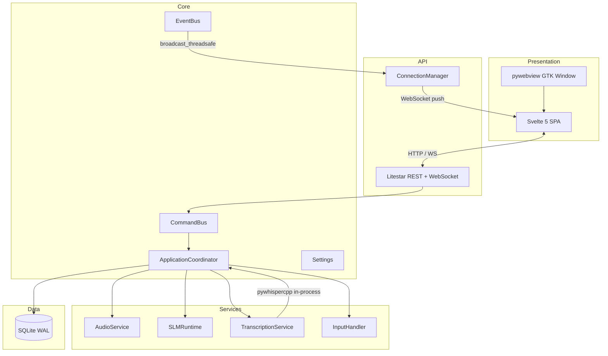

# Architecture

Vociferous uses a **layered architecture** with clear boundaries between presentation, API, services, and runtime. The design optimizes for a single constraint: **never block the UI thread with inference**.

## Layer Diagram



## Composition Root

`ApplicationCoordinator` is the single owner of all service lifecycles. It:

1. Creates `CommandBus`, `EventBus`, and `TranscriptDB`
2. Initializes ASR model, `SLMRuntime`, `AudioService`, and input handler
3. Registers intent handlers on the `CommandBus`
4. Starts the Litestar API server on a background thread
5. Blocks on the pywebview main window (GTK main loop)
6. On exit: tears down services in reverse order

No service creates or manages another service. All wiring happens in the coordinator.

## Communication Patterns

### User Actions (Command Bus)

User-driven state changes flow through **intents** dispatched via the `CommandBus`:

```text
Frontend → POST /api/intents → CommandBus.dispatch(intent) → handler method
```

The `CommandBus` is a synchronous dict mapping `type[InteractionIntent]` → handler callable. Handlers are methods on `ApplicationCoordinator`.

### Backend Events (Event Bus)

Service-to-frontend notifications flow through the `EventBus`:

```text
Service → EventBus.emit("event_type", data) → ConnectionManager.broadcast_threadsafe → WebSocket → Frontend
```

The `EventBus` is thread-safe pub/sub. The API layer's `_wire_event_bridge` subscribes EventBus events to the WebSocket broadcast.

### Transcription (In-Process)

ASR inference runs **in-process** via `pywhispercpp.Model` on a background thread:

```text
ApplicationCoordinator._recording_loop() → transcription_service.transcribe(audio, model)
    → pywhispercpp.Model.transcribe() → text result
```

The `pywhispercpp.Model` is loaded once at startup (warm load) and held for the process lifetime. Transcription is called from the recording background thread, so it never blocks the UI or API threads. The model instance is thread-safe for sequential calls.

> **Note:** The `core_runtime/` package is reserved for future subprocess isolation if inference stability or GPU memory management requires process-level separation. Currently empty.

## Process and Threading Model

| Thread / Process | Responsibility | Blocking Work |
| ----- | ----- | ----- |
| Main thread | pywebview GTK event loop | Never |
| API thread | Litestar / uvicorn (async) | Never |
| Recording thread | Audio capture + ASR inference | Yes (by design) |
| SLM thread | llama.cpp inference | Yes (by design) |
| Audio callback | sounddevice stream | Real-time |
| Input listener | evdev / pynput hotkey capture | Blocking read |

## Data Model

Three SQLite tables with WAL mode:

- **transcripts** — Raw captures with metadata (timestamp, duration, project)
- **transcript_variants** — Immutable variants (original, refined, edited) linked to transcripts
- **projects** — Organizational hierarchy with color coding

**Invariant:** Raw transcriptions are never overwritten. All modifications create new variants linked to the original.

## Configuration

Pydantic Settings with JSON persistence. Atomic writes via temp-file + rename. Eight typed sub-models covering ASR, recording, refinement levels, UI preferences, and voice calibration.
