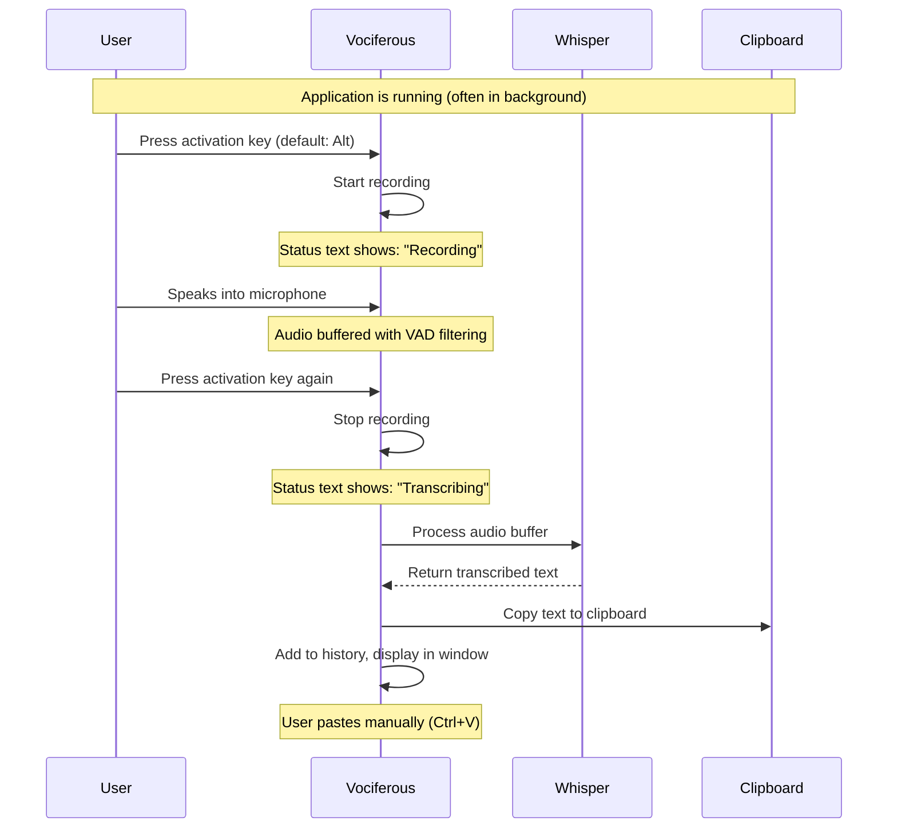
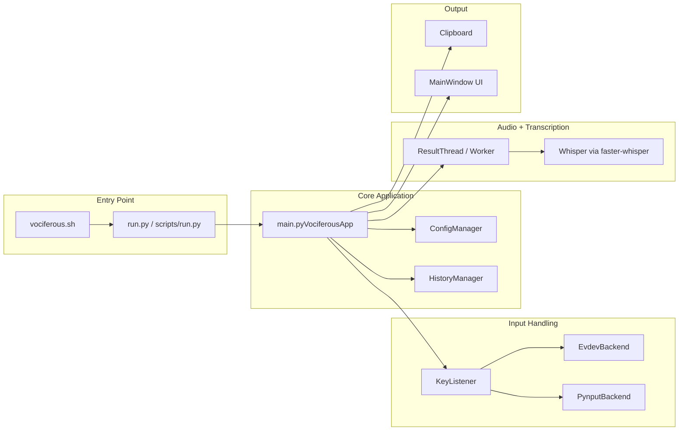
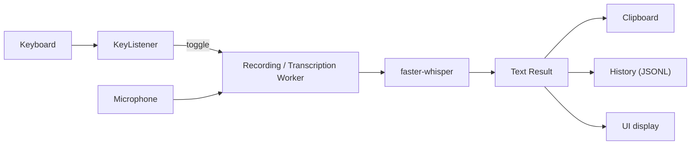
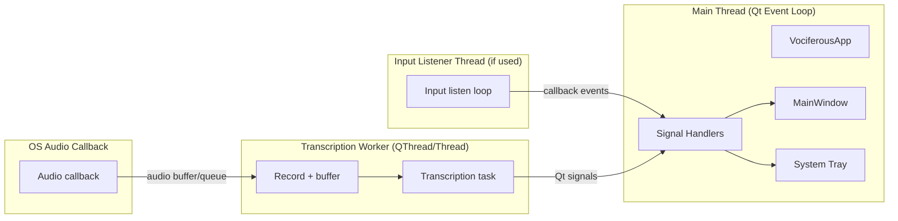

# Vociferous Architecture Guide (v1.1.1)

This document describes the design and implementation of Vociferous **as it behaves in beta 1.1** (with this file updated as a documentation patch). It focuses on what is implemented today, and avoids describing removed features.

## Table of Contents

0. [Gallery](#gallery)
1. [Overview](#overview)
2. [User Experience](#user-experience)
3. [High-Level Architecture](#high-level-architecture)
4. [Module Reference](#module-reference)
5. [Design Patterns](#design-patterns)
6. [Data Flow](#data-flow)
7. [Threading Model](#threading-model)
8. [Platform Compatibility](#platform-compatibility)
9. [Dependencies](#dependencies)
10. [Configuration System](#configuration-system)
11. [Python 3.12+ Features](#python-312-features)
12. [Directory Structure](#directory-structure)
13. [Known Issues / Planned Updates](#known-issues--planned-updates)
14. [Further Reading](#further-reading)

---

## Gallery

## Overview

Vociferous is a speech-to-text dictation tool for Linux. Press a hotkey to start recording, press again to stop and transcribe. The resulting text is copied to the clipboard for pasting into any application.

### Key Characteristics

- **Wayland-first**: Works on modern Linux (Wayland and X11)
- **GPU-accelerated (recommended)**: Uses faster-whisper with CUDA for practical, near real-time transcription on NVIDIA GPUs
- **CPU fallback supported**: If you do not have an NVIDIA GPU, Vociferous can run on CPU (slower)
- **Custom frameless window**: Unified title bar with menu, drag support, and window controls
- **Full-featured UI**: Main window with history, settings dialog, system tray
- **GUI framework**: **PyQt5** (planned upgrade to **PyQt6**)
- **Modern Python**: Leverages Python 3.12+ features

---

## User Experience

### Typical Usage Flow



### Step-by-Step Workflow

#### 1. Launch & Initialization

```bash
./vociferous.sh  # or python scripts/run.py
```

**What happens:**

- GPU libraries configured (if CUDA is available and used)
- Whisper model loaded into memory (VRAM usage matches model size)
- Main window appears (two panes: history left, current transcription right)
- System tray icon appears
- Hotkey listener starts monitoring keyboard

**Ready state behavior:**

- When idle/ready, the status text is **blank** (it does not display the word “Idle”)

#### 2. Start Recording

**User action:** Press activation key (default: **Alt**)

**What happens:**

- Audio capture begins (buffered)
- VAD monitors for speech
- Status text changes to **Recording**

**Important note on Alt default:**

- The default Alt binding currently registers **both** Alt keys in practice, which temporarily reduces normal Alt-key usability while the listener is active. This is expected in the current version and planned to be improved.

#### 3. Speaking

**User action:** Speak naturally into microphone

**What happens:**

- Audio frames captured by the audio backend
- VAD analyzes frames for speech
- Speech frames are buffered and silence is trimmed

**Recording mode support (current):**

- Only **press-to-toggle hotkey** is supported in the current version.

#### 4. Stop Recording

**User action:** Press activation key again (or allow VAD behavior to stop capture, if enabled)

**What happens:**

- Audio capture stops
- Status text changes to **Transcribing**
- Audio buffer is sent to the Whisper model

#### 5. Transcription Processing

**What happens behind the scenes:**

- Audio is prepared for inference
- Whisper processes audio in segments
- Text segments are combined and lightly post-processed
- **A trailing space is always appended** to the final text (current default behavior and not configurable)

**Timing (observed):**

- Short phrase (~5 seconds): ~0.5–1 second (GPU) / slower on CPU
- Longer recording (~30 seconds): ~2–4 seconds (GPU) / slower on CPU

#### 6. Output to Clipboard

**What happens:**

- Transcribed text is copied to the system clipboard
- Text is displayed in the “current transcription” pane
- Entry is added to history with timestamp
- User pastes with Ctrl+V in the target application

#### 7. Ready for Next Dictation

**What happens:**

- Status text clears (blank)
- Hotkey listener continues monitoring
- Ready for the next dictation cycle

---

### Configuration Options

Users can customize behavior via Settings → Preferences or `~/.config/vociferous/config.yaml`.

Example (illustrative; exact keys must match the repository schema):

```yaml
recording_options:
  activation_key: alt
  input_backend: auto

model_options:
  device: auto          # cpu | cuda | auto
  compute_type: float16 # float16 | float32 | int8
```

---

### Common Usage Patterns

#### Email Composition (Clipboard-First)

1. Open email client and click in message body
2. Press activation key, dictate, press again
3. Paste from clipboard into the email

#### Document Writing (Clipboard-First)

Same pattern as email composition: dictate, then paste into the editor.

(There is no special paragraph-handling behavior; pausing dictation does not create distinct paragraphs automatically.)

---

### Error Handling

**No microphone detected:**

- Error is logged
- UI indicates failure briefly where applicable
- App returns to ready state

**CUDA libraries missing / CUDA unavailable:**

- App runs on CPU (slower)
- Warnings may be logged depending on how the app is launched

**Model download needed:**

- First run downloads the model
- Subsequent runs load from cache

---

## High-Level Architecture

This diagram shows the current main components at a high level, with output constrained to clipboard + history.



---

## Module Reference

This section is intended to be accurate, but the repository is the source of truth for filenames and symbols.

### `scripts/run.py` (or `run.py`) — Application Entry Point

**Purpose**: Bootstrap the application and launch the main app.

**Common responsibilities**:

- Python path setup for `src/` imports
- Logging setup
- Launching the main Qt application

### `src/main.py` — Application Orchestrator

**Purpose**: Wire components together and manage lifecycle.

**Typical responsibilities**:

- Connect hotkey callbacks to start/stop recording
- Own the main window and tray icon
- Route transcription results to clipboard + history
- React to configuration changes

### `src/utils.py` (or equivalent) — Configuration Management

**Purpose**: Load, validate, and persist configuration; notify listeners when config changes.

### `src/key_listener.py` — Hotkey Detection

**Purpose**: Monitor keyboard for the activation hotkey across Wayland/X11.

**Important behavioral note**:

- Default Alt handling currently captures both Alt keys; this is planned to improve.

### `src/result_thread.py` — Audio Capture & Transcription Worker

**Purpose**: Capture audio, apply VAD, and run transcription off the UI thread.

### `src/transcription.py` — Whisper Integration

**Purpose**: Create and use the faster-whisper model for transcription, using GPU when available/selected, otherwise CPU.

### `src/history_manager.py` — Transcription History

**Purpose**: Persistent storage and export of transcription history (JSONL-backed).

### UI modules (`src/ui/*`)

**Main window layout (current):**

- Left: history
- Right: current transcription

If any UI docs in this file reference pulsing dots or explicit “Idle” status text, those references should be considered outdated for beta 1.1.

---

## Design Patterns

(These sections are kept because they remain useful, but any examples that imply typing injection should be treated as removed functionality.)

### Singleton Pattern (ConfigManager)

A single shared configuration instance ensures consistent runtime behavior across modules.

### Strategy Pattern (Input Backends)

Different display servers and permission constraints require multiple input backends; the app can select an appropriate backend at runtime.

### Observer Pattern (Qt Signals / Callbacks)

Used for configuration changes, background worker updates, and UI refresh.

---

## Data Flow

Clipboard-first output is the default.



---

## Threading Model

The main rule is: **UI stays on the Qt main thread**, audio/transcription runs off-thread.



---

## Platform Compatibility

### Display Server Support

- Wayland: typically uses evdev-based input handling (requires permissions / group membership)
- X11: can use pynput-based input handling

Clipboard output works on both.

---

## Dependencies

Core dependencies (as implemented):

- `faster-whisper` (CTranslate2 backend)
- `ctranslate2`
- `sounddevice`
- `webrtcvad`
- `PyQt5` (PyQt6 planned)
- `evdev` / `pynput`
- `PyYAML`

---

## Configuration System

Configuration is schema-driven (see repository schema for exact keys).

- Defaults come from the schema
- User overrides live under `~/.config/vociferous/config.yaml`
- The settings UI is generated from the schema and applies changes immediately

---

## Python 3.12+ Features

This section is retained as-is conceptually: match/case, modern type hints, dataclasses with slots, Protocols, pathlib, and contextlib utilities are all appropriate patterns for this codebase.

---

## Directory Structure

See the repository tree for the authoritative structure. If this document’s structure listing disagrees with the repo, the repo wins.

---

## Known Issues / Planned Updates (v1.1.1)

- Default Alt hotkey currently captures both Alt keys in practice
- A dedicated Start/Stop UI button is planned
- PyQt6 migration is planned
- Status text is currently blank when ready; this may be expanded later

---

## Further Reading

- faster-whisper documentation: https://github.com/guillaumekln/faster-whisper
- PyQt5 documentation: https://www.riverbankcomputing.com/static/Docs/PyQt5/
- evdev documentation: https://python-evdev.readthedocs.io/
- Python 3.12 release notes: https://docs.python.org/3.12/whatsnew/3.12.html