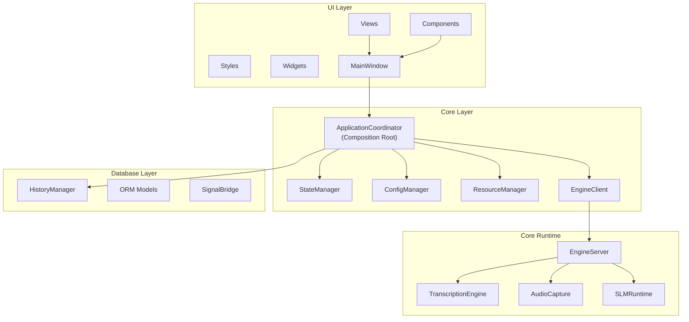
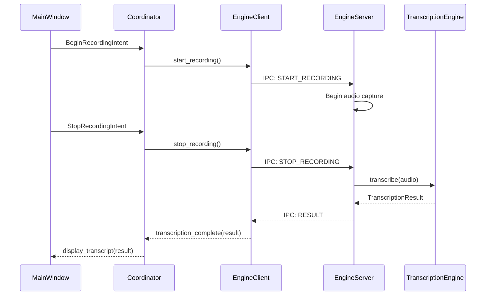
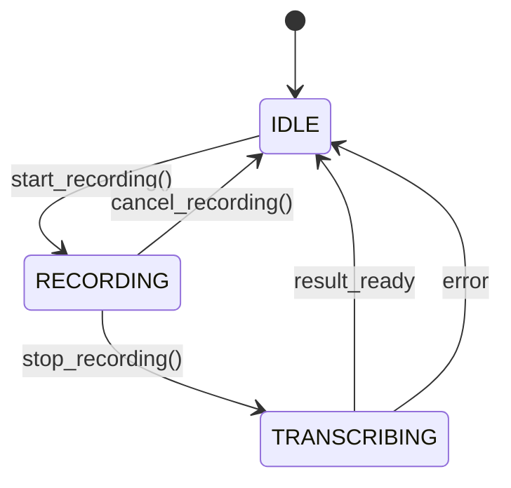
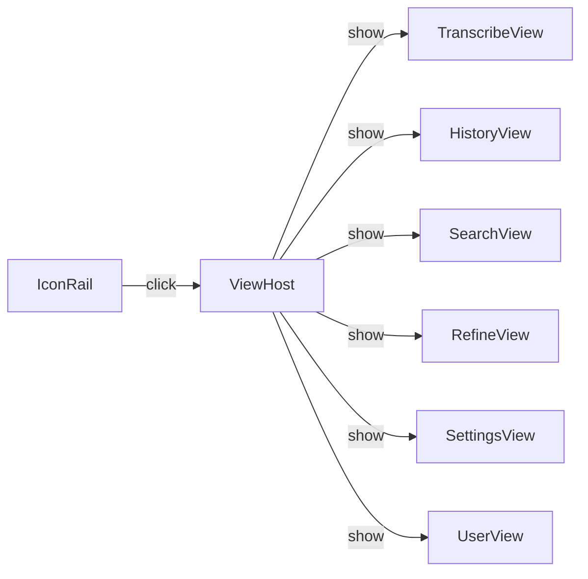
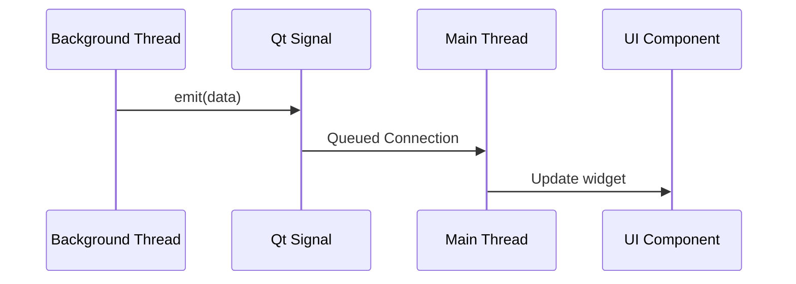

# Architecture

This page documents the architectural design of Vociferous, including component boundaries, communication patterns, and threading model.

---

## Overview

Vociferous follows a **layered architecture** with clear separation between:

1. **Core Layer** — Application coordination, configuration, exceptions
2. **Services Layer** — Business logic (transcription, refinement, audio)
3. **Database Layer** — Persistence and data access
4. **UI Layer** — PyQt6 views, components, and styling

The following diagram shows how components are organized across these layers:



**Trace:**
- `src/ui/components/main_window/main_window.py` — `MainWindow`
- `src/core/application_coordinator.py` — `ApplicationCoordinator`
- `src/core_runtime/client.py` — `EngineClient`
- `src/core_runtime/server.py` — `EngineServer`
- `src/core_runtime/engine.py` — `TranscriptionEngine`
- `src/services/slm_runtime.py` — `SLMRuntime`
- `src/database/history_manager.py` — `HistoryManager`

---

## ApplicationCoordinator

The `ApplicationCoordinator` is the **composition root** — the single point where all major components are instantiated and wired together.

### Location

`src/core/application_coordinator.py`

### Responsibilities

| Responsibility | Description |
|----------------|-------------|
| Component Instantiation | Create all services, managers, and UI |
| Signal Wiring | Connect Qt signals between components |
| Lifecycle Management | Handle startup, shutdown, restart |
| State Propagation | Push engine state to UI |

### Key Methods

```python
class ApplicationCoordinator:
    def __init__(self):
        # Create components
        self.config_manager = ConfigManager.instance()
        self.state_manager = StateManager()
        self.history_manager = HistoryManager()
        self.engine_client = EngineClient()
        # Use the lightweight runtime for refinement (no dedicated QThread)
        self.slm_runtime = SLMRuntime()
        self.main_window = MainWindow()
        
        # Wire signals
        self._connect_signals()
    
    def start(self):
        """Start core systems and show UI."""
        self.engine_client.start()
        # SLMRuntime runs tasks on a shared thread pool; no dedicated thread to start
        self.main_window.show()
    
    def shutdown(self):
        """Clean shutdown of all components."""
        # Gracefully disable the runtime to free resources
        self.slm_runtime.disable()
        self.engine_client.stop()
        self.history_manager.close()
```

### Invariant

> **The orchestrator is the ONLY entity allowed to push background engine state (Recording, Transcribing, Idle) into the UI layer.**

*Derived from implementation: Direct UI mutation from background components is forbidden.*

---

## Engine Client/Server Pattern

Vociferous uses an **IPC pattern** to separate the UI process from compute-intensive operations.

### Components

| Component | Location | Purpose |
|-----------|----------|---------|
| EngineClient | `src/core_runtime/client.py` | UI-side proxy |
| EngineServer | `src/core_runtime/server.py` | Worker process |
| TranscriptionEngine | `src/core_runtime/engine.py` | Whisper wrapper |

### Communication Flow



### State Machine



---

## Service Layer

Services encapsulate business logic and run on background threads or shared worker pools.

### SLMRuntime (formerly SLMService)

**Location:** `src/services/slm_runtime.py`

**Purpose:** Load provisioned refinement models, run inference, and manage runtime lifecycle.

**Threading:** No dedicated QThread. Uses a shared `QThreadPool` for background tasks and non-blocking operations.

**Notes:**
- The **provisioning** (download/convert/install) responsibilities were intentionally removed from the runtime to keep the runtime focused and lightweight. Provisioning is performed by separate tools (scripts/provision_models.py) or offline steps.
- GPU confirmation dialogs and long-lived request queueing/deduplication formerly handled by the legacy service were removed to simplify lifecycle; the `ApplicationCoordinator` now maps transcript IDs to `text_ready` events.

**Key Signals:**
- `state_changed(SLMState)` — State machine transition
- `progress(str)` — Progress messages
- `error(str)` — Error messages
- `text_ready(str)` — Refined text is available
- `motd_ready(str)` — Message-of-the-day (compat shim)

### WhisperTranscriptionEngine

**Location:** `src/core_runtime/engine.py`

**Purpose:** Wrap faster-whisper for transcription

**Thread:** Runs in EngineServer process

---

## UI Layer

### MainWindow

**Location:** `src/ui/components/main_window/main_window.py`

**Role:** Application shell containing navigation and view host


### View Architecture

All views extend `BaseView` and implement:

```python
class ViewInterface(Protocol):
    def get_view_id(self) -> str: ...
    def get_capabilities(self) -> Capabilities: ...
    def dispatch_action(self, action_id: ActionId) -> None: ...
    def get_selection(self) -> SelectionState: ...
```

### Navigation



---

## Threading Model

### Thread Inventory

| Thread | Owner | Purpose |
|--------|-------|---------|
| Main Thread | QApplication | UI event loop |
| Engine Server | Subprocess | Audio capture, transcription |
| SLM Thread | QThread | Refinement inference |
| Provisioning | QThreadPool | Model downloads |

### Thread Safety Rules

1. **Never block the Qt main thread**
2. **Never share mutable state across threads**
3. **All cross-thread communication via `pyqtSignal`**

### Signal-Based Communication



---

## Configuration

### ConfigManager

**Location:** `src/core/config_manager.py`

**Pattern:** Singleton with schema validation

**Schema:** `src/config_schema.yaml`

### Access Pattern

```python
# Read
value = ConfigManager.get_config_value("section", "key")

# Write
ConfigManager.set_config_value("section", "key", new_value)

# Listen for changes
config_manager.config_changed.connect(handler)
```
