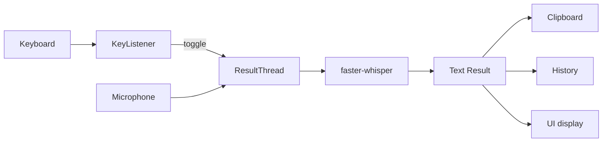

# Backend Architecture

Vociferous follows a modular architecture with clear separation of concerns.

## Module Overview

```
                    +-----------------------+
                    |  Vociferous (Python)  |
                    +-----------+-----------+
                                |
                                v
                       +------------------+
                       |   main.py        |
                       |(Orchestrator)    |
                       +---------+--------+
                                 |
             +-------------------+------------------+
             |                                      |
             v                                      v
     +---------------+                      +-------------------+
     | KeyListener   |                      | ResultThread      |
     | (Hotkeys)     |                      | (Worker Thread)   |
     +-------+-------+                      +--------+----------+
             |                                           |
             v                                           v
     +---------------+                        +-----------------+
     |      UI       |                        | Whisper Model   |
     |   (PyQt6)     |                        |    (ASR)        |
     +---------------+                        +-----------------+
```

## Core Modules

### main.py - Application Orchestrator

Central coordinator that wires all components together:

- Creates and manages `KeyListener`, `ResultThread`, UI components
- Connects signals between components
- Handles application lifecycle (startup, shutdown, cleanup)
- Manages system tray integration

### key_listener.py - Input Handling

Pluggable input backend system using Protocol pattern:

- `KeyListener`: Main class that manages backends and detects hotkey chords
- `EvdevBackend`: Linux evdev for Wayland (requires `input` group)
- `PynputBackend`: Cross-platform fallback for X11
- `KeyChord`: Tracks modifier + key combinations

### result_thread.py - Recording & Transcription

QThread that runs audio capture and transcription off the UI thread:

- Captures audio via sounddevice
- Applies Voice Activity Detection (WebRTC VAD)
- Sends audio to Whisper model
- Emits signals back to main thread with results
- Returns speech duration for metrics calculation

### transcription.py - Whisper Integration

Wrapper around faster-whisper:

- `create_local_model()`: Loads model with fallback (CUDA → CPU)
- `transcribe()`: Converts audio to text with VAD filtering
- Returns `(text, speech_duration_ms)` tuple for metrics
- `post_process_transcription()`: Applies user preferences (spacing)

### services/slm_service.py - Refinement Service

Manages the lifecycle of the post-processing refinement model:

- **Model**: Qwen3-4B-Instruct (CTranslate2 Int8)
- **Role**: Provisioning (Download/Convert), Loading, and Inference
- **Architecture**: Decoder-Only Instruction Following (See [Refinement Architecture](Refinement-Architecture.md))

### history_manager.py - Persistence

SQLite-backed storage for transcription history:

- `~/.config/vociferous/vociferous.db`
- Focus groups for transcript organization
- Dual-text architecture: `raw_text` (immutable) + `normalized_text` (editable)
- `speech_duration_ms` column for metrics
- Export to txt, csv, or markdown

### utils.py - Configuration

Thread-safe singleton ConfigManager:

- Schema-driven configuration from YAML
- Hot-reload support
- PyQt signals for live updates

## UI Architecture

The UI follows a component-based architecture under `src/ui/`:

```
ui/
├── components/           # Page-level components
│   ├── main_window/      # App shell, menu, sidebar animator
│   ├── settings/         # Settings dialog
│   ├── sidebar/          # Focus groups, search, transcript tree
│   ├── title_bar/        # Custom frameless title bar
│   └── workspace/        # Content area, controls, metrics
├── constants/            # Design system tokens
│   ├── colors.py         # 3-tier text hierarchy, accents
│   ├── dimensions.py     # Border radii, sizes
│   ├── spacing.py        # Non-linear spacing scale
│   └── typography.py     # Hand-crafted type scale
├── styles/
│   └── unified_stylesheet.py  # Single app-wide stylesheet
├── utils/                # Helpers (clipboard, error handling)
└── widgets/              # Reusable UI components
    ├── collapsible_section/
    ├── content_panel/
    ├── dialogs/
    ├── focus_group/
    ├── history_tree/
    ├── hotkey_widget/
    ├── metrics_strip/
    ├── styled_button/
    ├── transcript_item/
    └── waveform_visualizer/
```

## Design Patterns

### Protocol Pattern (Structural Typing)

```python
@runtime_checkable
class InputBackend(Protocol):
    @classmethod
    def is_available(cls) -> bool: ...
    def start(self) -> None: ...
    def stop(self) -> None: ...
```

Backends implement this interface without inheritance, enabling duck typing with type safety.

### Singleton with Double-Checked Locking

```python
@classmethod
def initialize(cls) -> None:
    if cls._instance is None:
        with cls._lock:
            if cls._instance is None:
                cls._instance = cls()
```

Thread-safe lazy initialization for ConfigManager.

### Signal/Slot (Observer Pattern)

All cross-thread communication uses PyQt signals:

```python
self.result_thread.resultSignal.connect(self.on_transcription_complete)
```

This ensures thread-safe updates without explicit locking.

## Data Flow



### Step by Step

1. **Keyboard** → KeyListener detects activation key
2. **KeyListener** → Triggers recording start/stop in VociferousApp
3. **Microphone** → Audio captured by ResultThread
4. **ResultThread** → Sends audio to faster-whisper
5. **faster-whisper** → Returns transcribed text
6. **Text Result** → Copied to clipboard, added to history, displayed in UI