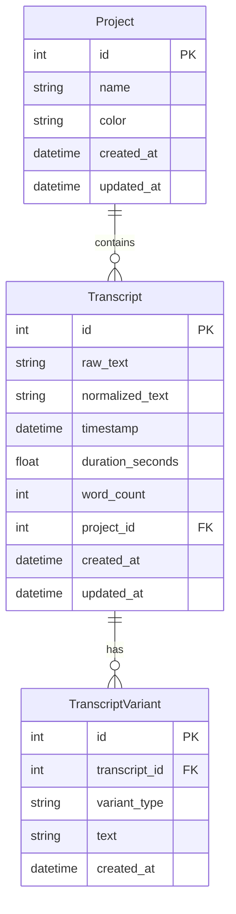
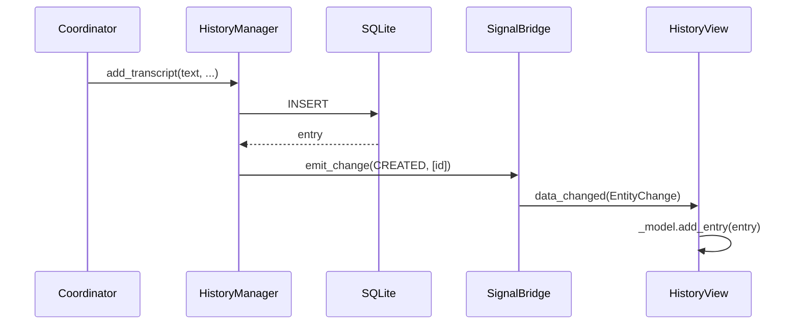
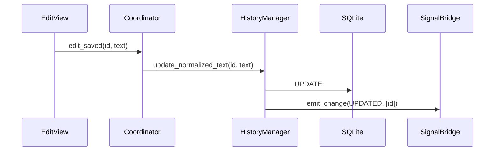

# Data and Persistence

This page documents the database layer, ORM models, data transfer objects, and persistence patterns used in Vociferous.

---

## Overview

Vociferous uses **SQLAlchemy 2.0+** with SQLite for persistent storage of transcripts, projects, and configuration.

### Database Location

```
~/.config/vociferous/vociferous.db
```

### Key Files

| File | Purpose |
|------|---------|
| `src/database/models.py` | SQLAlchemy ORM models |
| `src/database/dtos.py` | Data Transfer Objects |
| `src/database/history_manager.py` | Repository facade |
| `src/database/signal_bridge.py` | Change notification |
| `src/database/events.py` | Event types |

---

## Database Schema

### Entity-Relationship Diagram



---

## ORM Models

### Transcript

The primary entity representing a transcribed recording.

```python
class Transcript(Base):
    __tablename__ = "transcripts"
    
    id: Mapped[int] = mapped_column(primary_key=True)
    raw_text: Mapped[str] = mapped_column(Text, nullable=False)
    normalized_text: Mapped[str] = mapped_column(Text, nullable=False)
    timestamp: Mapped[datetime] = mapped_column(DateTime, default=datetime.utcnow)
    duration_seconds: Mapped[float] = mapped_column(Float, default=0.0)
    word_count: Mapped[int] = mapped_column(Integer, default=0)
    project_id: Mapped[int | None] = mapped_column(ForeignKey("projects.id"))
    
    # Relationships
    project: Mapped["Project"] = relationship(back_populates="transcripts")
    variants: Mapped[list["TranscriptVariant"]] = relationship(back_populates="transcript")
```

### Dual-Text Invariant

> **CRITICAL:** Each transcript maintains two distinct text representations:
> - **`raw_text`** — Immutable verbatim Whisper output. NEVER modified after creation.
> - **`normalized_text`** — Mutable user-facing text. May be edited, refined, or regenerated.

This separation preserves the original transcription while allowing user modifications.

### Project

Optional grouping for transcripts.

```python
class Project(Base):
    __tablename__ = "projects"
    
    id: Mapped[int] = mapped_column(primary_key=True)
    name: Mapped[str] = mapped_column(String(255), unique=True)
    color: Mapped[str] = mapped_column(String(7), default="#3B82F6")
    created_at: Mapped[datetime] = mapped_column(DateTime, default=datetime.utcnow)
    
    transcripts: Mapped[list["Transcript"]] = relationship(back_populates="project")
```

### TranscriptVariant

Alternative versions of a transcript (refinements, summaries, etc.).

```python
class TranscriptVariant(Base):
    __tablename__ = "transcript_variants"
    
    id: Mapped[int] = mapped_column(primary_key=True)
    transcript_id: Mapped[int] = mapped_column(ForeignKey("transcripts.id"))
    variant_type: Mapped[str] = mapped_column(String(50))  # "refined", "summary"
    text: Mapped[str] = mapped_column(Text)
    created_at: Mapped[datetime] = mapped_column(DateTime, default=datetime.utcnow)
    
    transcript: Mapped["Transcript"] = relationship(back_populates="variants")
```

---

## Data Transfer Objects

DTOs are immutable, slotted dataclasses used for passing data to the UI layer.

### HistoryEntry

```python
@dataclass(frozen=True, slots=True)
class HistoryEntry:
    id: int
    text: str                    # normalized_text for display
    raw_text: str                # Original Whisper output
    timestamp: datetime
    duration_seconds: float
    word_count: int
    project_id: int | None
    project_name: str | None
    project_color: str | None
    
    @property
    def display_name(self) -> str:
        """Human-readable title."""
        return self.timestamp.strftime("%Y-%m-%d %H:%M:%S")
```

### LifetimeMetrics

```python
@dataclass(frozen=True, slots=True)
class LifetimeMetrics:
    count: int
    total_duration_seconds: float
    total_word_count: int
```

---

## HistoryManager

The `HistoryManager` is the **repository facade** providing a clean API for all database operations.

### Location

`src/database/history_manager.py`

### Key Methods

| Method | Purpose |
|--------|---------|
| `add_transcript(raw_text, ...)` | Create new transcript |
| `get_entry(id)` | Retrieve single entry |
| `get_all_entries()` | List all entries |
| `update_normalized_text(id, text)` | Edit transcript |
| `delete_transcript(id)` | Remove transcript |
| `get_lifetime_metrics()` | Aggregate statistics |
| `export_to_csv(path)` | Export all data |
| `clear_all()` | Delete all transcripts |

### Usage Pattern

```python
# Inject into views
history_manager = HistoryManager()
view.set_history_manager(history_manager)

# Create transcript
entry = history_manager.add_transcript(
    raw_text="transcribed text",
    normalized_text="transcribed text",
    duration_seconds=45.2,
    word_count=120,
)

# Update
history_manager.update_normalized_text(entry.id, "edited text")

# Delete
history_manager.delete_transcript(entry.id)
```

### Invariant

> **UI code MUST NOT execute raw SQL.** All database access goes through `HistoryManager`.

---

## Signal Bridge

The `DatabaseSignalBridge` provides real-time change notifications to UI components.

### Location

`src/database/signal_bridge.py`

### Pattern

```python
class DatabaseSignalBridge(QObject):
    """Singleton signal emitter for database changes."""
    
    data_changed = pyqtSignal(EntityChange)
    
    @classmethod
    def instance(cls) -> "DatabaseSignalBridge":
        ...
    
    def emit_change(self, entity_type: str, action: ChangeAction, ids: list[int]):
        change = EntityChange(entity_type=entity_type, action=action, ids=ids)
        self.data_changed.emit(change)
```

### EntityChange

```python
@dataclass
class EntityChange:
    entity_type: str          # "transcription", "project"
    action: ChangeAction      # CREATED, UPDATED, DELETED
    ids: list[int]            # Affected entity IDs
```

### ChangeAction

```python
class ChangeAction(Enum):
    CREATED = "created"
    UPDATED = "updated"
    DELETED = "deleted"
```

### Usage in Views

```python
class HistoryView(BaseView):
    def set_history_manager(self, manager):
        self._history_manager = manager
        DatabaseSignalBridge().data_changed.connect(self._handle_data_changed)
    
    @pyqtSlot(EntityChange)
    def _handle_data_changed(self, change: EntityChange):
        if change.entity_type == "transcription":
            if change.action == ChangeAction.DELETED:
                self._model.remove_entries(change.ids)
            elif change.action == ChangeAction.CREATED:
                self._model.add_entries(change.ids)
```

---

## Data Flow

### Create Transcript



### Update Transcript



---

## Session Management

### Engine Configuration

```python
engine = create_engine(
    f"sqlite:///{db_path}",
    echo=False,
    pool_pre_ping=True,
)
```

### Session Factory

```python
Session = sessionmaker(bind=engine)

def get_session() -> Session:
    return Session()
```

### Context Manager Pattern

```python
with get_session() as session:
    transcript = session.get(Transcript, id)
    transcript.normalized_text = new_text
    session.commit()
```

---

## Schema Migrations

*Derived from implementation:* Vociferous uses simple schema versioning with automatic migrations on startup.

### Migration Pattern

```python
def _check_schema_version(engine):
    current_version = get_current_version(engine)
    
    if current_version < LATEST_VERSION:
        run_migrations(engine, current_version, LATEST_VERSION)
```

---

## Performance Considerations

### Indexing

- Primary key indexes on all `id` columns
- Foreign key indexes on `project_id`, `transcript_id`
- Timestamp index for chronological queries

### DTO Optimization

- All DTOs use `slots=True` for memory efficiency
- Frozen dataclasses prevent accidental mutation
- Lazy loading for relationships

### Query Patterns

- Avoid N+1 queries with eager loading
- Use pagination for large result sets
- Cache frequently accessed data

---

## Best Practices

### Do

- ✅ Use HistoryManager for all database operations
- ✅ Use DTOs when passing data to UI
- ✅ Connect to SignalBridge for reactive updates
- ✅ Use frozen dataclasses for immutability

### Don't

- ❌ Execute raw SQL from UI code
- ❌ Pass ORM models to UI layer
- ❌ Modify `raw_text` after creation
- ❌ Create sessions in UI components

---

## See Also

- [Architecture](Architecture) — System design
- [UI Views Overview](UI-Views-Overview) — View architecture
