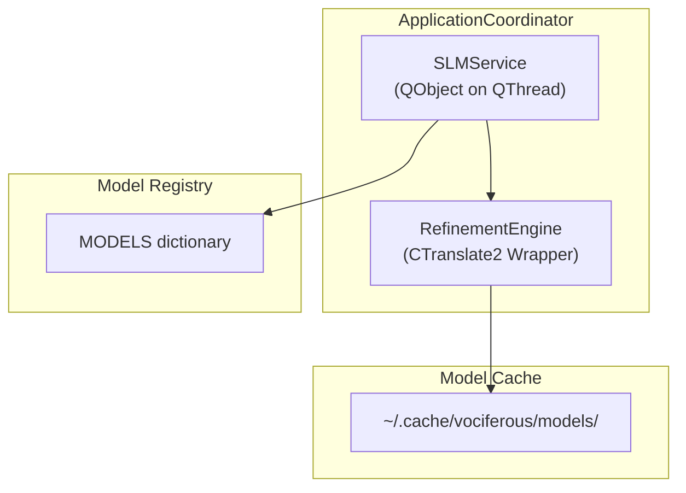
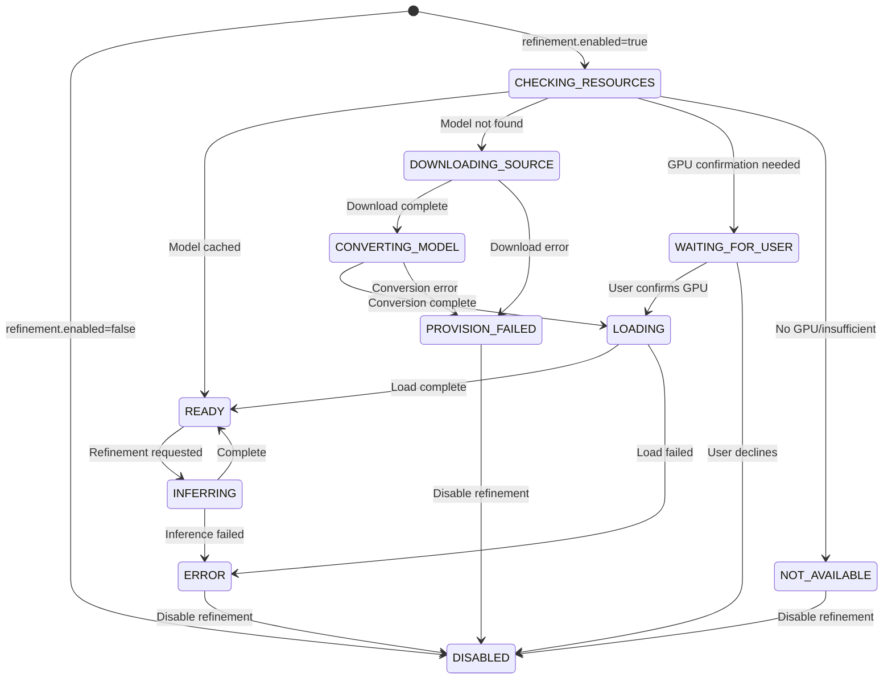
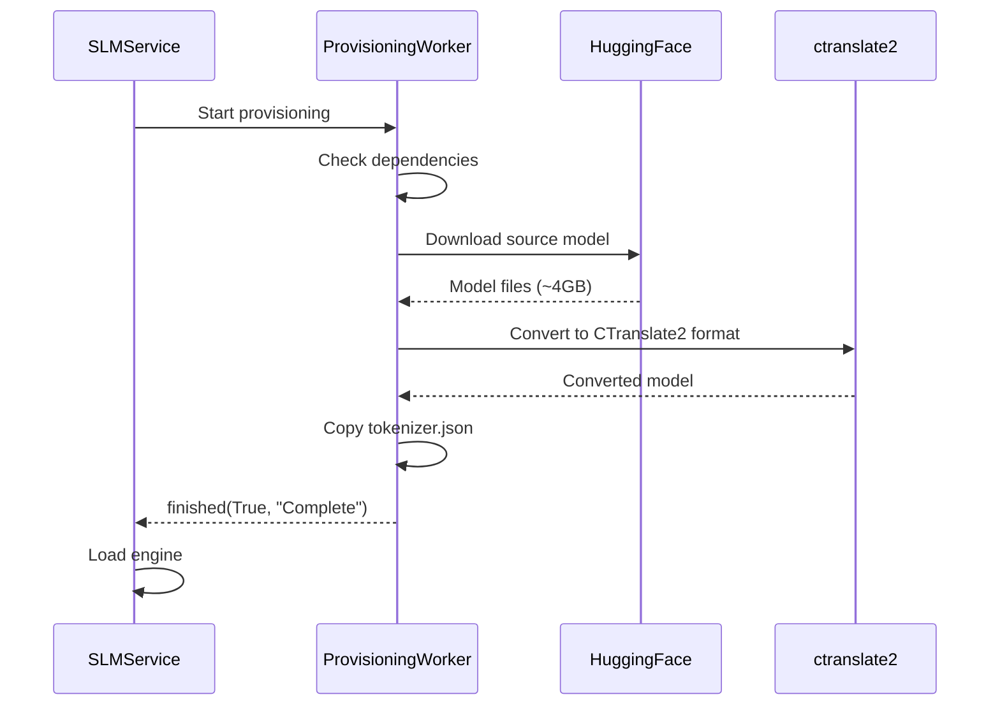
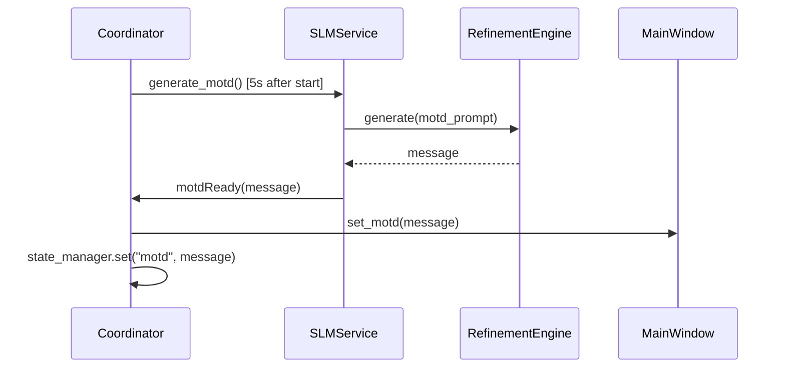
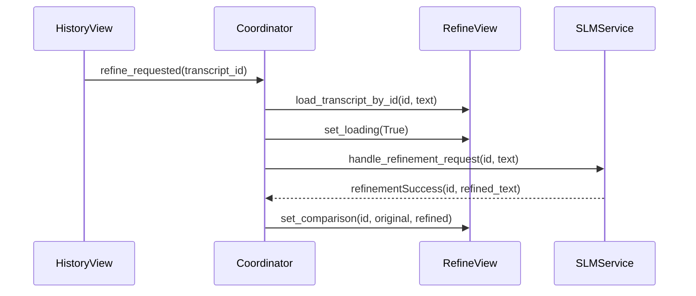
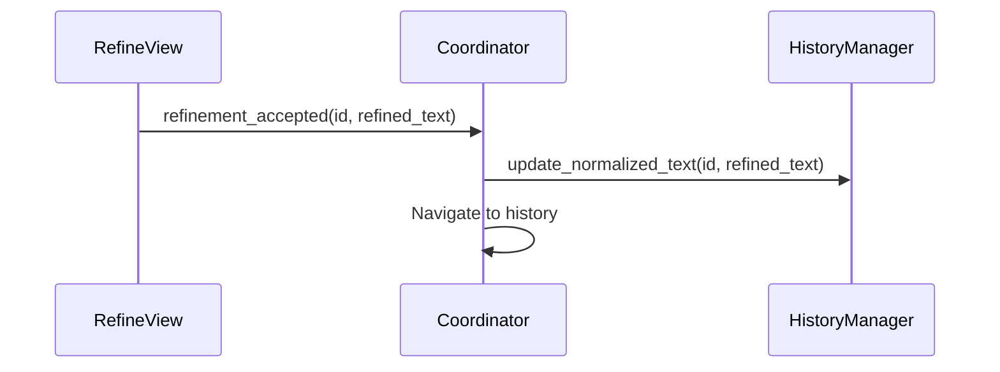

# Refinement System

This page documents the AI-powered text refinement system including the SLM service, model provisioning, and prompt engineering.

---

## Overview

The refinement system uses a local **Small Language Model (SLM)** to improve transcription quality by:
- Fixing grammar and punctuation
- Improving readability
- Following user-specified instructions

All processing happens locally—no data is sent to external servers.

---

## System Architecture

The following diagram shows the component hierarchy of the refinement system:



**Trace:**
- `src/core/application_coordinator.py:62` — `ApplicationCoordinator`
- `src/services/slm_service.py:44` — `SLMService`
- `src/refinement/engine.py` — `RefinementEngine`
- Model registry in `src/core/` constants

---

## SLMService

The `SLMService` manages the refinement model lifecycle and execution.

### Location

`src/services/slm_service.py`

### Responsibilities

| Responsibility | Description |
|----------------|-------------|
| Model Loading | Load CTranslate2 model to GPU/CPU |
| State Management | Track service state via state machine |
| Refinement Execution | Process text through SLM |
| MOTD Generation | Generate Message of the Day |
| Model Switching | Hot-swap between SLM models |

### Threading

SLMService runs on a dedicated `QThread`:

```python
self.slm_thread = QThread()
self.slm_service = SLMService()
self.slm_service.moveToThread(self.slm_thread)
self.slm_thread.start()
```

---

## State Machine

### SLMState Enum

```python
class SLMState(Enum):
    DISABLED = "Disabled"
    CHECKING_RESOURCES = "Checking Resources"
    WAITING_FOR_USER = "Waiting for User"
    PROVISION_FAILED = "Provisioning Failed"
    NOT_AVAILABLE = "Not Available"
    DOWNLOADING_SOURCE = "Downloading Source Model"
    CONVERTING_MODEL = "Converting Model"
    LOADING = "Loading Model"
    READY = "Ready"
    INFERRING = "Refining..."
    ERROR = "Error"
```

### State Diagram

The SLMService lifecycle is governed by the following state machine. All transitions are traceable to `src/services/slm_service.py`.



**Trace:**
- `src/services/slm_service.py:44-57` — `SLMState` enum definition
- `src/services/slm_service.py:529` — `CHECKING_RESOURCES` entry
- `src/services/slm_service.py:581` — `WAITING_FOR_USER` transition
- `src/services/slm_service.py:648-692` — `INFERRING ↔ READY` cycle

---

## Signals

### SLMService Signals

| Signal | Parameters | Purpose |
|--------|------------|---------|
| `stateChanged` | `SLMState` | State machine transition |
| `statusMessage` | `str` | Human-readable status |
| `refinementSuccess` | `int, str` | transcript_id, refined_text |
| `refinementError` | `int, str` | transcript_id, error_message |
| `motdReady` | `str` | Generated MOTD message |
| `serviceBusy` | `bool` | Blocking operation in progress |
| `askGPUConfirmation` | `int, int, int` | free, total, needed (MB) |

---

## Model Provisioning

### Provisioning Flow



### Dependency Installation

The provisioning worker automatically installs missing dependencies:
- `ctranslate2`
- `transformers`
- `torch`
- `huggingface_hub`
- `modelscope` (if source is ModelScope)

### Model Sources

| Source | Use Case |
|--------|----------|
| HuggingFace | Most models |
| ModelScope | China-accessible mirrors |

### Conversion

Models are converted to CTranslate2 format for optimal performance:

```bash
ct2-transformers-converter \
    --model <source_dir> \
    --output_dir <output_dir> \
    --quantization <int4_awq|int8>
```

---

## RefinementEngine

The `RefinementEngine` wraps CTranslate2 for text generation.

### Location

`src/refinement/engine.py`

### Initialization

```python
engine = RefinementEngine(
    model_path=Path("~/.cache/vociferous/models/qwen3-4b"),
    tokenizer_path=Path("~/.cache/vociferous/models/qwen3-4b"),
    system_prompt="You are a professional text editor...",
    device="cuda",
    device_index=0,
)
```

### Compute Types

| Device | Compute Type | Notes |
|--------|--------------|-------|
| CPU | `int8` | Quantized for speed |
| CUDA | `int8_float16` | INT8 weights + FP16 math |

---

## Model Registry

### Location

`src/core/model_registry.py`

### Registered SLM Models

| ID | Name | VRAM (MB) |
|----|------|-----------|
| `qwen3-4b` | Qwen3-4B-Instruct | ~4000 |
| `qwen2.5-3b` | Qwen2.5-3B-Instruct | ~3000 |
| `qwen2.5-1.5b` | Qwen2.5-1.5B-Instruct | ~1500 |

### Default Model

```python
DEFAULT_SLM_MODEL_ID = "qwen3-4b"
```

### SupportedModel Dataclass

```python
@dataclass
class SupportedModel:
    name: str
    repo_id: str
    dir_name: str
    revision: str | None
    quantization: str
    source: str  # "HuggingFace" or "ModelScope"
    vram_mb: int
```

---

## Prompt Engineering

### System Prompt

```
You are a professional text editor. Your task is to refine 
transcribed speech while preserving the speaker's original 
meaning and intent.
```

### Invariants

The prompt includes invariants the model must follow:
- Preserve the speaker's meaning exactly
- Fix grammar and punctuation only
- Do not add or remove content

### Refinement Levels

| Level | Name | Effect |
|-------|------|--------|
| 0 | Minimal | Grammar fixes only |
| 1 | Light | + Punctuation cleanup |
| 2 | Moderate | + Sentence flow |
| 3 | Thorough | + Paragraph structure |
| 4 | Aggressive | Full rewrite for clarity |

### ChatML Format

```
<|im_start|>system
{system_prompt}
{invariants}
{level_instructions}
<|im_end|>
<|im_start|>user
{user_instruct (if provided)}
Refine: {text}
<|im_end|>
<|im_start|>assistant
```

---

## GPU Memory Management

### VRAM Check

Before loading a model to GPU, the service checks available VRAM and prompts the user if headroom is low (<20%).

### Confirmation Dialog

When GPU memory is constrained, users choose:
- **GPU** — Faster inference, risk of OOM
- **CPU** — Safer, slower

### Device Selection

| Condition | Device | Notes |
|-----------|--------|-------|
| User confirms GPU | `cuda` | Fastest inference |
| User declines GPU | `cpu` | Safer, slower |
| No GPU available | `cpu` | Automatic fallback |

---

## MOTD Generation

### Purpose

Generate motivational "Message of the Day" messages using the SLM.

### Flow



### Caching

The MOTD is cached in `StateManager` for quick display on refresh.

---

## Configuration

### Config Schema

```yaml
refinement:
  enabled:
    value: false
    type: bool
    description: "Enable AI-powered text refinement"
  model_id:
    value: qwen3-4b
    type: str
    description: "SLM model for refinement"
```

### Hot-Swapping

When `refinement.model_id` changes, the coordinator triggers model reload via `QMetaObject.invokeMethod()` for thread safety.

---

## Error Handling

### Provisioning Errors

| Error | Handling |
|-------|----------|
| Download failure | Set `PROVISION_FAILED`, emit error |
| Conversion failure | Clean up output, emit error |
| Missing dependencies | Auto-install, retry |

### Inference Errors

| Error | Handling |
|-------|----------|
| Out of memory | Fall back to CPU, retry |
| Generation timeout | Emit `refinementError` |
| Invalid output | Parse failure handling |

---

## Token Limits

### Constants

```python
HARD_MAX_OUTPUT_TOKENS = 16384  # ~1 hour of speech
MIN_PADDING_TOKENS = 150
SCALING_FACTOR = 0.5  # 50% headroom
```

### Dynamic Calculation

Output token limit is calculated based on input length with 50% headroom to account for refinement expansion.

---

## RefineView Integration

### Refinement Flow



### Accept Flow



---

## See Also

- [View-Refine](View-Refine) — Refinement UI
- [Architecture](Architecture) — System design
- [View-Settings](View-Settings) — Configuration options

---


*Refinement interface showing original and refined text comparison*
