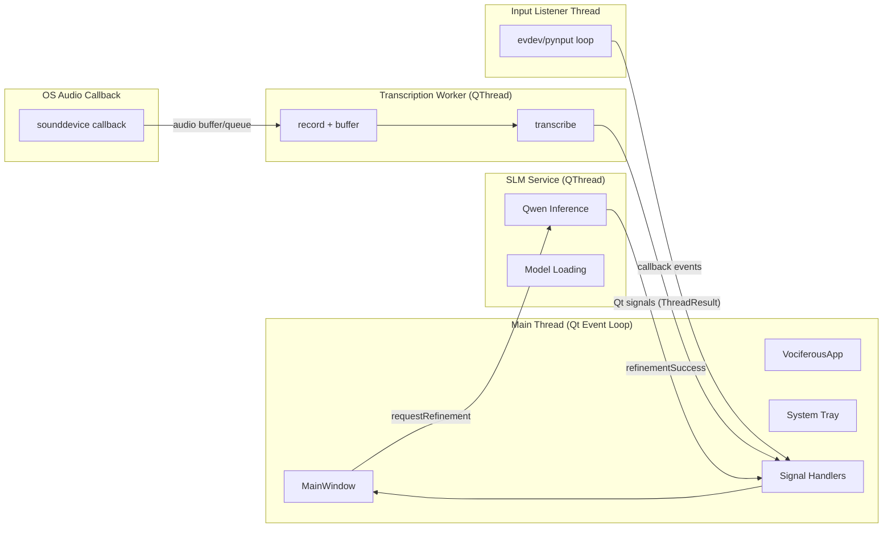

# Threading Model

Vociferous uses PyQt6's threading model with signals and slots for thread-safe communication.

## Thread Overview



**Key rule:** UI stays on the Qt main thread; heavy lifting (recording, ASR, LLM) runs off-thread.

## Signal/Slot Pattern

PyQt signals are the **only** safe way to communicate between threads:

```python
# Define signals in QThread subclass
class ResultThread(QThread):
    resultReady = pyqtSignal(ThreadResult)
    audioLevelUpdated = pyqtSignal(float)

    def run(self):
        # Worker code runs in separate thread
        self.resultReady.emit(ThreadResult(state=ThreadState.RECORDING))
        # ... do work ...
        self.resultReady.emit(ThreadResult(state=ThreadState.COMPLETE, text=result))
```

```python
# Connect in main thread
self.result_thread.resultReady.connect(self._handle_thread_result)
```

The connection automatically marshals the call to the receiver's thread.

## Connection Tracking

To prevent memory leaks and crashes, track signal connections:

```python
self._thread_connections = [
    (self.result_thread.statusSignal, self.update_status),
    (self.result_thread.resultSignal, self.on_complete),
]

for signal, slot in self._thread_connections:
    signal.connect(slot)
```

Clean up before destroying the thread:

```python
def _disconnect_thread_signals(self):
    for signal, slot in self._thread_connections:
        with suppress(TypeError, RuntimeError):
            signal.disconnect(slot)
    self._thread_connections.clear()
```

## QThread Lifecycle

```python
# Create thread
self.result_thread = ResultThread(model)

# Connect signals BEFORE starting
self.result_thread.resultSignal.connect(handler)

# Start thread (calls run() in new thread)
self.result_thread.start()

# Stop gracefully
self.result_thread.stop()        # Set flag
self.result_thread.wait(2000)    # Wait up to 2s

# Schedule deletion when event loop processes
self.result_thread.deleteLater()
```

## Thread Safety Rules

1. **Never access Qt widgets from worker threads** - emit signals instead
2. **Use signals for all cross-thread communication** - no shared mutable state
3. **Track connections for cleanup** - prevents dangling references
4. **Use deleteLater()** - not `del` - for QObject destruction
5. **ConfigManager is thread-safe** - uses lock in `set_config_value()`

## Audio Callback Thread

sounddevice runs its own callback thread:

```python
def audio_callback(indata, frames, time_info, status):
    # This runs in PortAudio's thread!
    audio_queue.put(indata[:, 0].copy())  # Thread-safe queue

with sd.InputStream(callback=audio_callback):
    while recording:
        frame = audio_queue.get(timeout=0.1)  # Consume in worker thread
```

The queue bridges the callback thread and the QThread worker.

## Common Pitfalls

### ❌ Direct UI update from thread

```python
def run(self):
    self.main_window.label.setText("Done")  # CRASH!
```

### ✅ Emit signal instead

```python
def run(self):
    self.statusSignal.emit("Done")
```

### ❌ Forget to disconnect

```python
self.thread.finished.connect(self.cleanup)
# Thread deleted but cleanup still referenced
```

### ✅ Track and disconnect

```python
self._connections.append((self.thread.finished, self.cleanup))
# Later: disconnect all before deletion
```