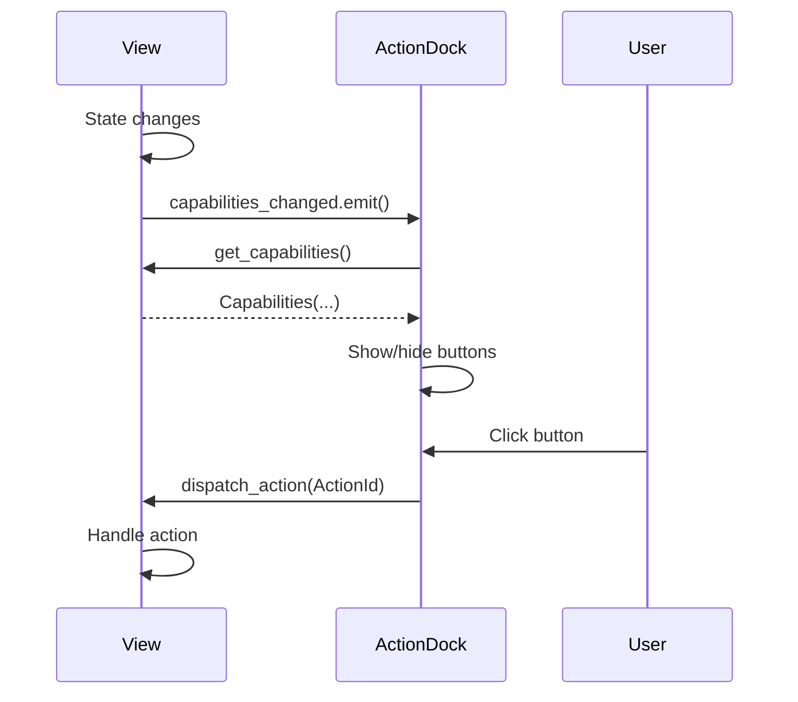
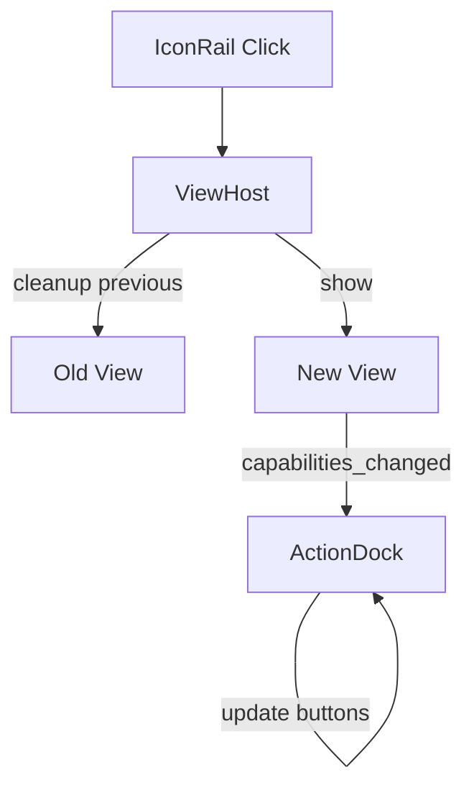

# UI Views Overview

This page documents the view architecture, capabilities system, and navigation patterns in Vociferous.

---

## View Architecture

Vociferous uses a **single-page application pattern** with a ViewHost that displays one view at a time.

### Layout


### Components

| Component | Purpose |
|-----------|---------|
| IconRail | Vertical navigation bar |
| ViewHost | Container for active view |
| ActionDock | Context-sensitive action buttons |

---

## View IDs

Each view has a unique string identifier:

| Constant | Value | View |
|----------|-------|------|
| `VIEW_TRANSCRIBE` | `"transcribe"` | TranscribeView |
| `VIEW_HISTORY` | `"history"` | HistoryView |
| `VIEW_SEARCH` | `"search"` | SearchView |
| `VIEW_REFINE` | `"refine"` | RefineView |
| `VIEW_SETTINGS` | `"settings"` | SettingsView |
| `VIEW_USER` | `"user"` | UserView |
| `VIEW_EDIT` | `"edit"` | EditView |
| `VIEW_PROJECTS` | `"projects"` | ProjectsView |

---

## BaseView Protocol

All views extend `BaseView` and implement the `ViewInterface` protocol:

```python
class ViewInterface(Protocol):
    capabilities_changed: pyqtSignal
    
    def get_view_id(self) -> str:
        """Return unique view identifier."""
        ...
    
    def get_capabilities(self) -> Capabilities:
        """Return current capabilities for ActionDock."""
        ...
    
    def dispatch_action(self, action_id: ActionId) -> None:
        """Handle action button click."""
        ...
    
    def get_selection(self) -> SelectionState:
        """Return current selection state."""
        ...
```

### BaseView Implementation

```python
class BaseView(QWidget):
    capabilities_changed = pyqtSignal()
    
    def get_view_id(self) -> str:
        raise NotImplementedError
    
    def get_capabilities(self) -> Capabilities:
        return Capabilities()
    
    def dispatch_action(self, action_id: ActionId) -> None:
        pass
    
    def get_selection(self) -> SelectionState:
        return SelectionState()
    
    def cleanup(self) -> None:
        """Override to disconnect signals and release resources."""
        pass
```

---

## Capabilities System

The capabilities system enables **dynamic action button visibility** based on view state.

### Capabilities Dataclass

```python
@dataclass(frozen=True, slots=True)
class Capabilities:
    can_copy: bool = False
    can_edit: bool = False
    can_delete: bool = False
    can_refine: bool = False
    can_move_to_project: bool = False
    can_preview: bool = False
    can_export: bool = False
    can_save: bool = False
    can_discard: bool = False
    can_cancel: bool = False
    can_start_recording: bool = False
    can_stop_recording: bool = False
```

### ActionId Enum

```python
class ActionId(Enum):
    COPY = "copy"
    EDIT = "edit"
    DELETE = "delete"
    REFINE = "refine"
    MOVE_TO_PROJECT = "move_to_project"
    PREVIEW = "preview"
    EXPORT = "export"
    SAVE = "save"
    DISCARD = "discard"
    CANCEL = "cancel"
    START_RECORDING = "start_recording"
    STOP_RECORDING = "stop_recording"
```

### Flow



---

## Navigation

### IconRail

The IconRail provides primary navigation between views:

| Icon | View | Always Visible |
|------|------|----------------|
| Microphone | Transcribe | Yes |
| Clock | History | Yes |
| Search | Search | Yes |
| Sparkles | Refine | When enabled |
| Gear | Settings | Yes |
| User | User | Yes |

### Navigation Flow



### Programmatic Navigation

```python
# In MainWindow or Coordinator
def navigate_to(self, view_id: str):
    self.view_host.show_view(view_id)
    self.icon_rail.set_active(view_id)
```

---

## View Catalog

### TranscribeView

**Purpose:** Live recording and transcript display

**Layout:** Hosts MainWorkspace with recording controls

**Capabilities:** Recording actions, Copy, Edit, Delete, Refine

[View-Transcribe](View-Transcribe)

---

### HistoryView

**Purpose:** Master-detail browser for past transcripts

**Layout:** Left list pane, right detail pane

**Capabilities:** Copy, Edit, Delete, Refine (selection-dependent)

[View-History](View-History)

---

### SearchView

**Purpose:** Tabular search interface with filtering

**Layout:** Search input, sortable table

**Capabilities:** Copy, Edit, Delete, Refine (selection-dependent)

[View-Search](View-Search)

---

### RefineView

**Purpose:** AI-powered text refinement comparison

**Layout:** Side-by-side original/refined panels, controls

**Capabilities:** Refine, Save, Discard, Copy

[View-Refine](View-Refine)

---

### SettingsView

**Purpose:** Configuration mutation surface

**Layout:** Scrollable settings cards, Apply/Cancel

**Capabilities:** None (configuration-only)

[View-Settings](View-Settings)

---

### UserView

**Purpose:** Informational metrics and about content

**Layout:** Metrics cards, explanations, links

**Capabilities:** None (informational-only)

[View-User](View-User)

---

## SelectionState

Views that support selection provide selection context:

```python
@dataclass(frozen=True, slots=True)
class SelectionState:
    selected_ids: tuple[int, ...] = ()
    primary_id: int | None = None
    
    @property
    def has_selection(self) -> bool:
        return len(self.selected_ids) > 0
    
    @property
    def is_multi_select(self) -> bool:
        return len(self.selected_ids) > 1
```

### Usage

```python
class HistoryView(BaseView):
    def get_selection(self) -> SelectionState:
        ids = self.history_list.get_selected_ids()
        return SelectionState(
            selected_ids=tuple(ids),
            primary_id=ids[0] if ids else None
        )
    
    def get_capabilities(self) -> Capabilities:
        selection = self.get_selection()
        return Capabilities(
            can_edit=len(selection.selected_ids) == 1,
            can_delete=selection.has_selection,
            can_refine=len(selection.selected_ids) == 1,
        )
```

---

## ActionDock

The ActionDock displays context-sensitive action buttons:

### Button Configuration

| ActionId | Icon | Label | Color |
|----------|------|-------|-------|
| COPY | copy | Copy | Default |
| EDIT | edit | Edit | Default |
| DELETE | delete | Delete | Red |
| REFINE | sparkles | Refine | Purple |
| SAVE | check | Save | Green |
| DISCARD | x | Discard | Default |

### Visibility Rules

1. Button shown only if corresponding capability is `True`
2. All buttons hidden if no capabilities
3. Recording buttons only shown in TranscribeView

---

## View Lifecycle

### Initialization

```python
class SomeView(BaseView):
    def __init__(self, parent=None):
        super().__init__(parent)
        self._setup_ui()
        self._connect_signals()
```

### Activation

When a view becomes visible:
1. `showEvent()` fires
2. View may refresh data
3. `capabilities_changed` emits

### Deactivation

When navigating away:
1. `hideEvent()` fires
2. View may reset state
3. `cleanup()` may be called

### Cleanup

```python
def cleanup(self) -> None:
    # Disconnect global signals
    try:
        DatabaseSignalBridge().data_changed.disconnect(self._handler)
    except (TypeError, RuntimeError):
        pass
    super().cleanup()
```

---

## Best Practices

### Do

- Implement all `ViewInterface` methods
- Emit `capabilities_changed` on state changes
- Override `cleanup()` to disconnect signals
- Use `SelectionState` for selection handling

### Don't

- Execute actions directly in views (use intents)
- Cache capabilities (recalculate each time)
- Connect to signals without disconnect in cleanup
- Access other views directly

---

## See Also

- [Architecture](Architecture) — System design
- [Design System](Design-System) — Styling tokens
- Individual view pages for detailed documentation
