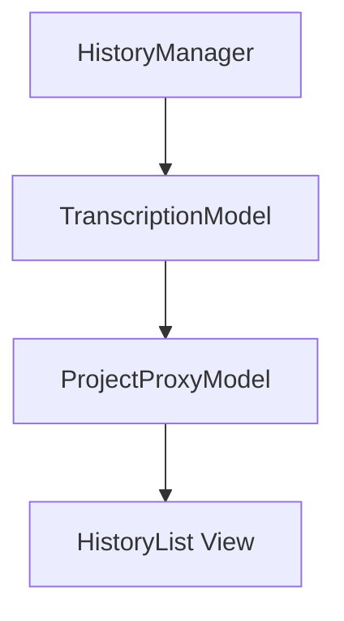
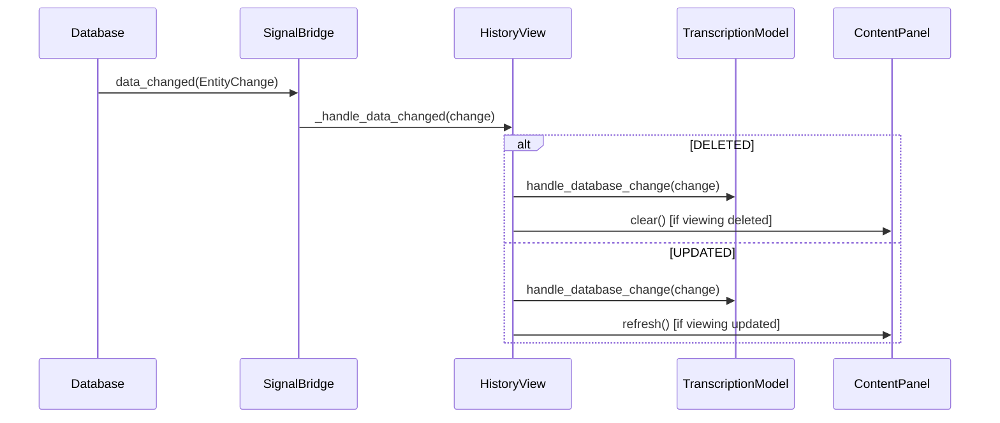

# History View

The History View provides a master-detail interface for browsing and managing past transcripts.

---

## Overview

The History View allows users to:
- Browse all past transcriptions chronologically
- View full transcript details
- Select transcripts for editing, refinement, or deletion
- Multi-select for batch operations


---

## Location

`src/ui/views/history_view.py`

**View ID:** `VIEW_HISTORY` = `"history"`

---

## Layout

The view uses a master-detail pattern:

```
┌────────────────────────────────────────────────────────┐
│                       History                           │
├────────────────────────┬───────────────────────────────┤
│                        │                               │
│   History List (40%)   │   Content Panel (60%)         │
│                        │                               │
│  ┌──────────────────┐  │  ┌─────────────────────────┐  │
│  │ 2026-01-19 14:32 │  │  │                         │  │
│  │ 2026-01-19 12:15 │◄─┼──│  Full transcript text   │  │
│  │ 2026-01-18 09:45 │  │  │  displayed here with    │  │
│  │ 2026-01-17 16:22 │  │  │  complete content...    │  │
│  │ ...              │  │  │                         │  │
│  └──────────────────┘  │  │  ─────────────────────  │  │
│                        │  │  Timestamp: 2026-01-19  │  │
│                        │  │  Duration: 0:45         │  │
│                        │  │  Words: 120             │  │
│                        │  └─────────────────────────┘  │
└────────────────────────┴───────────────────────────────┘
```

### Pane Ratios

| Pane | Weight | Purpose |
|------|--------|---------|
| Left (List) | 4 | History navigation |
| Right (Content) | 6 | Detail display |

---

## Components

### HistoryList

A custom QListView displaying transcript summaries:
- Timestamp display
- Preview text snippet
- Project color indicator (if assigned)
- Multi-selection support

### ContentPanel

A shared component showing:
- Full transcript text
- Metadata (timestamp, duration, word count)
- Read-only display

---

## Capabilities

The view advertises capabilities based on selection:

| Selection | can_edit | can_delete | can_refine | can_copy | can_move_to_project |
|-----------|----------|------------|------------|----------|---------------------|
| None | | | | | |
| Single | ✓ | ✓ | ✓* | ✓ | ✓ |
| Multiple | | ✓ | | | ✓ |

*\* Only when refinement is enabled*

---

## Signals

### Outbound Signals

| Signal | Parameters | Purpose |
|--------|------------|---------|
| `edit_requested` | `int` | Navigate to Edit view |
| `delete_requested` | `list[int]` | Request deletion of selected IDs |
| `refine_requested` | `int` | Navigate to Refine view |
| `data_changed` | — | Propagate changes to MainWindow |

---

## Selection Handling

### Single Selection

When a single transcript is selected:
1. Content panel displays full details
2. All single-item actions available

### Multi-Selection

When multiple transcripts are selected:
1. Content panel shows first selected
2. Only batch actions available (Delete, Move to Project)

### Getting Selection

```python
def get_selection(self) -> SelectionState:
    ids = self.history_list.get_selected_ids()
    return SelectionState(
        selected_ids=tuple(ids),
        primary_id=ids[0] if ids else None
    )
```

---

## Model Architecture

### Model Stack



### TranscriptionModel

Adapts `HistoryManager` data for Qt's Model/View framework:
- Provides `HistoryEntry` data to views
- Handles incremental updates
- Supports surgical database changes

---

## Database Reactivity

The view automatically updates when the database changes:

### Connection

```python
DatabaseSignalBridge().data_changed.connect(self._handle_data_changed)
```

### Change Handling



---

## Action Dispatch

| ActionId | Behavior |
|----------|----------|
| `EDIT` | Emit `edit_requested(primary_id)` |
| `DELETE` | Emit `delete_requested([ids])` |
| `REFINE` | Emit `refine_requested(primary_id)` |
| `COPY` | Copy entry text to clipboard |

---

## Refresh Behavior

### Manual Refresh

```python
def refresh(self) -> None:
    if self._model:
        self._model.refresh_from_manager()
    self.content_panel.clear()
```

### Incremental Updates

For efficiency, single entries can be added without full refresh:

```python
def add_entry(self, entry: HistoryEntry) -> None:
    if self._model:
        self._model.add_entry(entry)
```

---

## Cleanup

The view properly disconnects signals on cleanup:

```python
def cleanup(self) -> None:
    try:
        DatabaseSignalBridge().data_changed.disconnect(self._handle_data_changed)
    except (TypeError, RuntimeError):
        pass
    super().cleanup()
```

---

## Keyboard Navigation

| Key | Action |
|-----|--------|
| ↑/↓ | Navigate list |
| Enter | View selected transcript |
| Delete | Delete selected |
| Ctrl+A | Select all |

---

## Related Pages

- [View-Search](View-Search) — Alternative search interface
- [View-Refine](View-Refine) — Refinement interface
- [Data and Persistence](Data-and-Persistence) — Database layer
