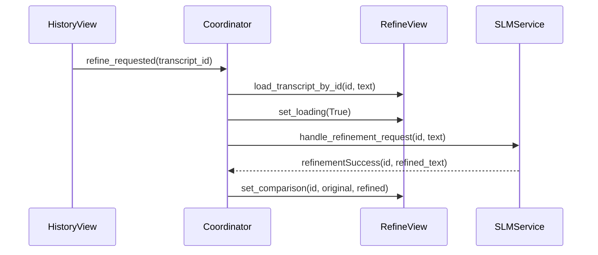
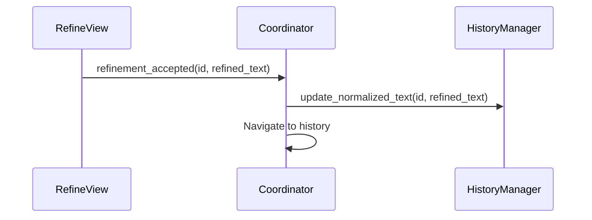
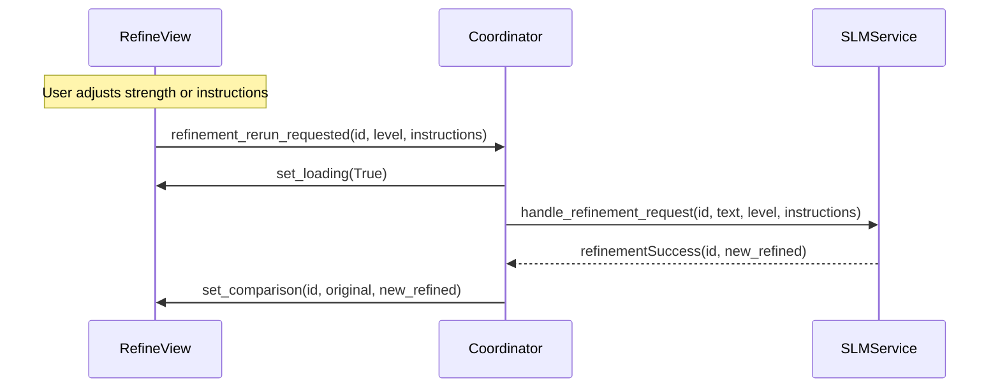

# Refine View

The Refine View provides an AI-powered interface for improving transcription quality.

---

## Overview

The Refine View allows users to:
- Compare original and AI-refined text side-by-side
- Adjust refinement strength
- Provide custom instructions
- Accept or discard refinements


---

## Location

`src/ui/views/refine_view.py`

**View ID:** `VIEW_REFINE` = `"refine"`

---

## Layout

```
┌─────────────────────────────────────────────────────────┐
│                   Comparison Area                        │
│  ┌───────────────────────┐   ┌───────────────────────┐  │
│  │ Original Transcript   │   │ Refined / AI Suggest. │  │
│  │                       │   │                       │  │
│  │ Your transcribed text │   │ Your transcribed text │  │
│  │ appears here with any │   │ appears here with     │  │
│  │ grammar issues or     │   │ improved grammar,     │  │
│  │ formatting problems.  │   │ punctuation, and      │  │
│  │                       │   │ formatting.           │  │
│  └───────────────────────┘   └───────────────────────┘  │
├─────────────────────────────────────────────────────────┤
│                   Footer Controls                        │
│  ┌─────────────────────────┐  ┌─────────────────────┐   │
│  │ Custom Instructions     │  │ Refinement Strength │   │
│  │                         │  │                     │   │
│  │ [Add specific          ]│  │  ○ ○ ○ ● ○         │   │
│  │ [instructions here...  ]│  │  Light → Aggressive │   │
│  └─────────────────────────┘  └─────────────────────┘   │
└─────────────────────────────────────────────────────────┘
```

---

## Components

### Comparison Panels

Two `ContentPanel` instances display:
- **Left:** Original transcript (immutable)
- **Right:** AI-refined result

### Strength Selector

Visual slider for refinement intensity:

| Level | Name | Effect |
|-------|------|--------|
| 0 | Minimal | Grammar fixes only |
| 1 | Light | + Punctuation cleanup |
| 2 | Moderate | + Sentence flow |
| 3 | Thorough | + Paragraph structure |
| 4 | Aggressive | Full rewrite |

### Custom Instructions

Free-form text input for guidance:

**Examples:**
- "Make it bullet points"
- "Fix technical jargon"
- "Summarize in 3 sentences"

### Loading Overlay

Shows "Refining..." during inference.

---

## Capabilities

| State | can_refine | can_copy | can_save | can_discard |
|-------|------------|----------|----------|-------------|
| Loading | | | | |
| No transcript | | | | ✓ |
| Has original | ✓ | | | ✓ |
| Has refined | ✓ | ✓ | ✓ | ✓ |

---

## Signals

### Outbound Signals

| Signal | Parameters | Purpose |
|--------|------------|---------|
| `refinement_accepted` | `int, str` | Commit refined text |
| `refinement_discarded` | — | Cancel and return |
| `refinement_rerun_requested` | `int, str, str` | Re-run with new params |

---

## Workflow

### Entry Flow



### Accept Flow



### Re-Run Flow



---

## Action Dispatch

| ActionId | Handler | Behavior |
|----------|---------|----------|
| `REFINE` | `_on_refine_clicked` | Re-run refinement |
| `SAVE` | `_on_accept` | Commit and save |
| `DISCARD` | `_on_discard` | Cancel and exit |
| `COPY` | Inline | Copy refined text |

---

## Loading State

During refinement:
1. Loading overlay visible
2. Controls disabled
3. Capabilities empty (no actions available)

```python
def set_loading(self, is_loading: bool) -> None:
    self._is_loading = is_loading
    self._lbl_loading.setVisible(is_loading)
    self._update_controls_state()
    self.capabilities_changed.emit()
```

---

## Internal State

| Field | Type | Purpose |
|-------|------|---------|
| `_current_transcript_id` | `int \| None` | Active transcript |
| `_original_text` | `str` | Source text |
| `_refined_text` | `str` | AI output |
| `_is_loading` | `bool` | Inference running |

---

## Using Refinement

### Basic Usage

1. Select a transcript in History or Search
2. Click **Refine** in the ActionDock
3. Wait for AI refinement
4. Review the comparison
5. Click **Save** to accept or **Discard** to cancel

### Adjusting Refinement

1. Change the **Strength** slider
2. Add **Custom Instructions** (optional)
3. Click **Refine** again
4. Review new result

### Custom Instructions Examples

| Instruction | Effect |
|-------------|--------|
| "Make it formal" | Professional tone |
| "Add paragraph breaks" | Better structure |
| "Fix medical terms" | Domain-specific corrections |
| "Summarize briefly" | Condensed version |

---

## Requirements

The Refine View requires:
- Refinement enabled in Settings
- SLM model loaded (Ready state)
- Sufficient GPU/CPU resources

If refinement is disabled, the view is hidden from navigation.

---

## Related Pages

- [Refinement System](Refinement-System) — Technical details
- [View-Settings](View-Settings) — Enable refinement
- [View-History](View-History) — Select transcripts
