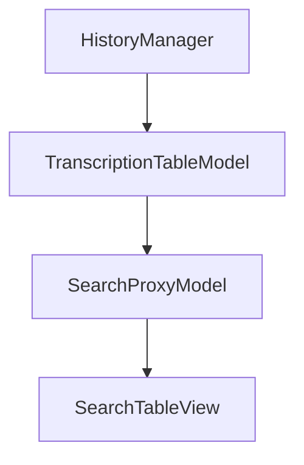

# Search View

The Search View provides a powerful tabular interface for filtering and finding transcripts.

---

## Overview

The Search View allows users to:
- Filter transcripts with real-time text search
- View results in a sortable table
- Multi-select for batch operations
- Preview full transcripts in an overlay


---

## Location

`src/ui/views/search_view.py`

**View ID:** `VIEW_SEARCH` = `"search"`

---

## Layout

```
┌───────────────────────────────────────────────────────┐
│              Search your transcripts                   │
├───────────────────────────────────────────────────────┤
│  [ Filter...                                      🔍 ] │
├───────────────────────────────────────────────────────┤
│ ID │ Timestamp      │ Project │ Duration │ Text      │
├────┼────────────────┼─────────┼──────────┼───────────┤
│  1 │ 2026-01-19     │ Default │ 0:45     │ Lorem...  │
│  2 │ 2026-01-18     │ Work    │ 1:23     │ Meeting...│
│  3 │ 2026-01-17     │ Default │ 0:12     │ Quick...  │
│  4 │ 2026-01-16     │ Personal│ 2:15     │ Notes...  │
│  . │ ...            │ ...     │ ...      │ ...       │
└───────────────────────────────────────────────────────┘
```

---

## Table Columns

| Column | Description | Sort | Resize |
|--------|-------------|------|--------|
| ID | Transcript ID | ✓ | Auto |
| Timestamp | Formatted date | ✓ | Auto |
| Project | Project name | ✓ | Auto |
| Duration | Recording length | ✓ | Auto |
| Text | Truncated transcript | ✓ | Stretch |

---

## Search Functionality

### Real-Time Filtering

As you type in the search box, results filter instantly:

```python
def _on_search_text_changed(self, text: str) -> None:
    self._proxy._search_pattern = text
    self._proxy.invalidateFilter()
```

### Multi-Column Search

The filter searches across **all columns**:
- ID
- Timestamp text
- Project name
- Transcript content

### Case-Insensitive

Search is case-insensitive for user convenience.

---

## Model Architecture

### Model Stack



### TranscriptionTableModel

Provides data for the table with custom roles:

| Role | Purpose |
|------|---------|
| `IdRole` | Raw transcript ID |
| `FullTextRole` | Complete transcript |
| `TimestampRole` | ISO timestamp |

### SearchProxyModel

Extends `QSortFilterProxyModel` for filtering:

```python
def filterAcceptsRow(self, source_row, source_parent):
    if not self._search_pattern:
        return True
    
    for col in range(model.columnCount()):
        data = model.data(model.index(source_row, col))
        if self._search_pattern.lower() in str(data).lower():
            return True
    return False
```

---

## Text Delegate

A custom delegate limits text column height:

| Property | Value |
|----------|-------|
| `MAX_LINES` | 6 |
| `PADDING` | 12px |

This ensures consistent row heights while showing enough text context.

---

## Capabilities

| Capability | With Selection |
|------------|----------------|
| `can_edit` | ✓ |
| `can_delete` | ✓ |
| `can_copy` | ✓ |
| `can_refine` | ✓* |

*\* Only when refinement is enabled*

---

## Selection

### Multi-Selection

The table supports extended selection:
- Click: Select single
- Shift+Click: Range select
- Ctrl+Click: Toggle select

### Getting Selection

```python
def get_selection(self) -> SelectionState:
    indexes = self._table.selectionModel().selectedRows()
    selected_ids = []
    for proxy_idx in indexes:
        source_idx = self._proxy.mapToSource(proxy_idx)
        t_id = source_idx.data(TranscriptionTableModel.IdRole)
        selected_ids.append(t_id)
    return SelectionState(selected_ids=tuple(selected_ids), ...)
```

---

## Preview Overlay

Double-clicking a row opens a preview overlay:

### Features

- Full transcript text display
- Scrollable content
- Close button
- Escape key dismissal

### Activation

```python
def _on_row_activated(self, index):
    full_text = source_idx.data(TranscriptionTableModel.FullTextRole)
    timestamp = source_idx.data(TranscriptionTableModel.TimestampRole)
    self._overlay.show_transcript(full_text, timestamp)
```

---

## Context Menu

Right-click shows a context menu with available actions:

| Action | Availability |
|--------|--------------|
| Copy | Single selection |
| Edit | Single selection |
| Delete | Any selection |
| Refine | Single + enabled |

---

## Keyboard Shortcuts

| Key | Action |
|-----|--------|
| Ctrl+C | Copy selected transcript |
| Enter | Open preview overlay |
| Delete | Delete selected |
| Escape | Clear search / close overlay |

---

## Signals

### Outbound Signals

| Signal | Parameters | Purpose |
|--------|------------|---------|
| `edit_requested` | `int` | Navigate to Edit view |
| `delete_requested` | `list[int]` | Request batch deletion |
| `refine_requested` | `int` | Navigate to Refine view |

---

## Database Reactivity

The view refreshes on database changes:

```python
@pyqtSlot(EntityChange)
def _handle_data_changed(self, change: EntityChange) -> None:
    if change.entity_type in ("transcription", "project"):
        self.refresh()
```

---

## Column Configuration

### Resize Modes

| Column | Mode |
|--------|------|
| ID | ResizeToContents |
| Timestamp | ResizeToContents |
| Project | ResizeToContents |
| Duration | ResizeToContents |
| Text | Stretch |

### Maximum Width

```python
header.setMaximumSectionSize(800)
```

Prevents columns from becoming excessively wide.

---

## Related Pages

- [View-History](View-History) — Alternative list interface
- [View-Refine](View-Refine) — Refinement interface
- [Data and Persistence](Data-and-Persistence) — Database layer
