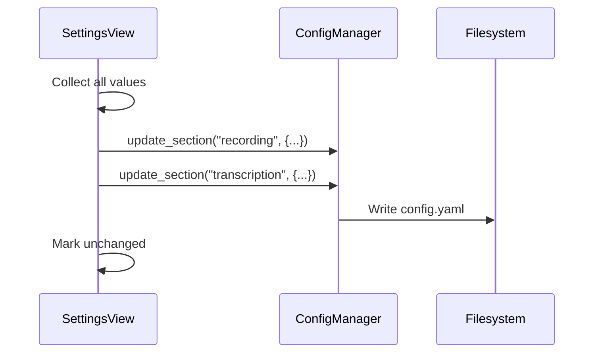
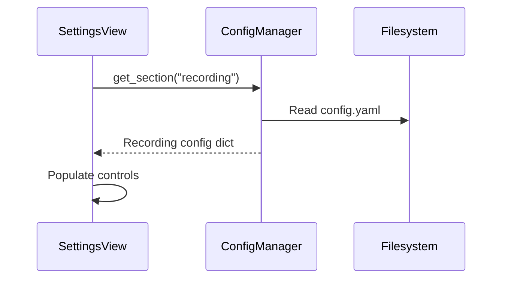

# Settings View

The Settings View provides comprehensive application configuration.

---

## Overview

The Settings View allows users to:
- Configure audio input/output
- Set recording hotkeys
- Select Whisper model and language
- Enable/disable refinement features
- Customize application behavior


---

## Location

`src/ui/views/settings_view.py`

**View ID:** `VIEW_SETTINGS` = `"settings"`

---

## Layout

Settings are organized into collapsible sections:

```
┌─────────────────────────────────────────────────────────┐
│ Settings                                                 │
├─────────────────────────────────────────────────────────┤
│ ▼ Recording Settings                                     │
│   ┌───────────────────────────────────────────────────┐ │
│   │ Audio Device       [Default Microphone       ▼]   │ │
│   │ Sample Rate        [44100 Hz                 ▼]   │ │
│   │ Push-to-Talk Key   [Super + Shift + V      🔄]   │ │
│   └───────────────────────────────────────────────────┘ │
├─────────────────────────────────────────────────────────┤
│ ▼ Transcription Settings                                 │
│   ┌───────────────────────────────────────────────────┐ │
│   │ Whisper Model      [large-v3                 ▼]   │ │
│   │ Compute Type       [float16                  ▼]   │ │
│   │ Language           [English                  ▼]   │ │
│   │ Beam Size          [5                        ▼]   │ │
│   └───────────────────────────────────────────────────┘ │
├─────────────────────────────────────────────────────────┤
│ ▼ Refinement Settings                                    │
│   ┌───────────────────────────────────────────────────┐ │
│   │ Enable Refinement  [═══════●]                     │ │
│   │ SLM Model          [Qwen3-4B-Instruct        ▼]   │ │
│   │ Default Strength   [○ ○ ● ○ ○]                    │ │
│   │ Auto-Load Model    [═══════●]                     │ │
│   └───────────────────────────────────────────────────┘ │
├─────────────────────────────────────────────────────────┤
│ ▼ Output Settings                                        │
│   ┌───────────────────────────────────────────────────┐ │
│   │ Auto Copy          [═══════●]                     │ │
│   │ Auto Paste         [═══════●]                     │ │
│   │ Output Target      [Active Window            ▼]   │ │
│   └───────────────────────────────────────────────────┘ │
├─────────────────────────────────────────────────────────┤
│ ▼ Interface Settings                                     │
│   ┌───────────────────────────────────────────────────┐ │
│   │ Start Minimized    [═══════○]                     │ │
│   │ Show Notifications [═══════●]                     │ │
│   │ Theme              [Dark                     ▼]   │ │
│   └───────────────────────────────────────────────────┘ │
└─────────────────────────────────────────────────────────┘
```

---

## Configuration Sections

### Recording Settings

Controls audio capture behavior.

| Setting | Type | Options | Default |
|---------|------|---------|---------|
| Audio Device | Dropdown | System devices | Default |
| Sample Rate | Dropdown | 16000, 44100, 48000 | 44100 |
| Push-to-Talk Key | Hotkey | Any key combo | Super+Shift+V |

### Transcription Settings

Configures Whisper model behavior.

| Setting | Type | Options | Default |
|---------|------|---------|---------|
| Model | Dropdown | tiny, base, small, medium, large-v3 | large-v3 |
| Compute Type | Dropdown | float16, float32, int8 | float16 |
| Language | Dropdown | Auto, English, ... | Auto |
| Beam Size | Spinner | 1-10 | 5 |

### Refinement Settings

Manages SLM-based text refinement.

| Setting | Type | Options | Default |
|---------|------|---------|---------|
| Enable Refinement | Toggle | On/Off | On |
| SLM Model | Dropdown | Available models | Qwen3-4B-Instruct |
| Default Strength | Selector | 0-4 | 2 (Moderate) |
| Auto-Load | Toggle | On/Off | Off |

### Output Settings

Defines post-transcription behavior.

| Setting | Type | Options | Default |
|---------|------|---------|---------|
| Auto Copy | Toggle | On/Off | On |
| Auto Paste | Toggle | On/Off | On |
| Output Target | Dropdown | Clipboard, Active Window | Active Window |

### Interface Settings

Application appearance and behavior.

| Setting | Type | Options | Default |
|---------|------|---------|---------|
| Start Minimized | Toggle | On/Off | Off |
| Show Notifications | Toggle | On/Off | On |
| Theme | Dropdown | Dark, Light | Dark |

---

## Custom Widgets

### ToggleSwitch

A macOS-style toggle switch.

```python
class ToggleSwitch(QAbstractButton):
    """Animated on/off toggle with pill track."""
```

**Visual States:**
- Off: Gray track, left-positioned circle
- On: Blue track, right-positioned circle

**Signals:**
- `toggled(bool)` — State changed

---

### HotkeyWidget

Captures keyboard shortcuts.

```python
class HotkeyWidget(QLineEdit):
    """Press-to-capture hotkey input field."""
```

**Features:**
- Click to start capture
- Shows "Press keys..." prompt
- Validates modifier requirements
- Reset button support

**Signals:**
- `hotkeyChanged(str)` — New hotkey string

---

### StrengthSelector

Refinement strength picker.

```python
class StrengthSelector(QWidget):
    """Visual strength level selector (0-4)."""
```

**Appearance:** Five circular buttons, active one highlighted

**Signals:**
- `strengthChanged(int)` — Level 0-4

---

## Validation

### Input Validation

| Field | Rule | Error Message |
|-------|------|---------------|
| Hotkey | Requires modifier | "Modifier key required" |
| Beam Size | Range 1-10 | "Must be between 1-10" |
| Audio Device | Must exist | "Device not found" |

### Model Validation

```python
def _validate_model_selection(self, model_id: str) -> bool:
    """Check if model is available in registry."""
    return self._slm_service.is_model_available(model_id)
```

---

## Capabilities

| State | can_save | can_reset | can_apply |
|-------|----------|-----------|-----------|
| Unchanged | | | |
| Modified | ✓ | ✓ | ✓ |
| Invalid | | ✓ | |

---

## Persistence Flow

### Save Settings



### Load Settings



---

## Action Dispatch

| ActionId | Handler | Behavior |
|----------|---------|----------|
| `SAVE` | `_save_settings` | Persist to config.yaml |
| `RESET` | `_reset_to_defaults` | Restore default values |
| `APPLY` | `_apply_changes` | Apply without saving |

---

## Configuration Schema

Settings map to `src/config_schema.yaml`:

```yaml
recording:
  device: str | null
  sample_rate: int
  hotkey: str

transcription:
  model: str
  compute_type: str
  language: str
  beam_size: int

refinement:
  enabled: bool
  model: str
  default_strength: int
  auto_load: bool

output:
  auto_copy: bool
  auto_paste: bool
  target: str

interface:
  start_minimized: bool
  notifications: bool
  theme: str
```

---

## Change Detection

The view tracks modifications:

```python
def _on_setting_changed(self) -> None:
    """Called when any setting changes."""
    self._has_changes = self._detect_changes()
    self.capabilities_changed.emit()
```

**Dirty tracking** enables:
- Save button only when changed
- Confirmation on navigate away
- Visual change indicators

---

## Device Enumeration

Audio devices are enumerated at view load:

```python
def _populate_devices(self) -> None:
    """Scan and list available audio input devices."""
    devices = self._audio_service.list_input_devices()
    for device in devices:
        self._cb_device.addItem(device.name, device.id)
```

---

## Hotkey Capture

### Capture Flow

1. User clicks hotkey field
2. Field shows "Press keys..."
3. User presses key combination
4. Field validates (modifier required)
5. Field displays formatted shortcut

### Hotkey Format

| Keys Pressed | Display Format |
|--------------|----------------|
| Ctrl + Shift + A | Ctrl+Shift+A |
| Super + V | Super+V |
| Alt + F2 | Alt+F2 |

---

## Related Pages

- [Architecture](Architecture) — ConfigManager details
- [View-Refine](View-Refine) — Refinement settings effect
- [Getting-Started](Getting-Started) — Initial configuration
