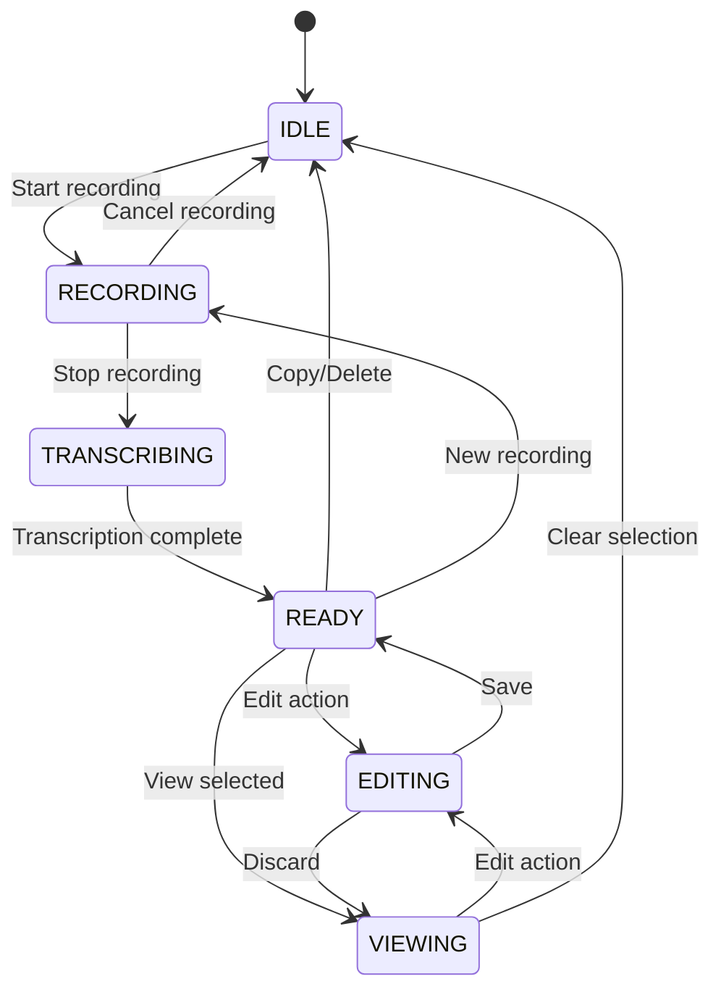
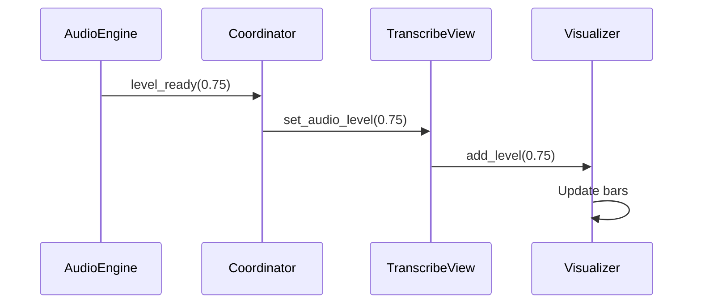

# Transcribe View

The Transcribe View is the primary recording and live dictation surface in Vociferous.

---

## Overview

The Transcribe View is where users:
- Initiate and stop recordings
- See real-time audio visualization
- View transcription results
- Take action on completed transcripts


---

## Location

`src/ui/views/transcribe_view.py`

**View ID:** `VIEW_TRANSCRIBE` = `"transcribe"`

---

## Layout

The TranscribeView hosts the `MainWorkspace` component:

```
┌──────────────────────────────────────────────────┐
│                    Header                         │
│            [Message of the Day]                   │
├──────────────────────────────────────────────────┤
│                                                   │
│                  Visualizer                       │
│              ▁▂▃▅▇▅▃▂▁▂▃▅▇▅▃▂▁                  │
│                                                   │
├──────────────────────────────────────────────────┤
│                                                   │
│               Transcript Area                     │
│                                                   │
│   "Your transcribed text appears here..."        │
│                                                   │
│                                                   │
└──────────────────────────────────────────────────┘
```

---

## State Machine

The view tracks workspace state:

| State | Description |
|-------|-------------|
| `IDLE` | Ready to record, no active content |
| `RECORDING` | Audio capture in progress |
| `TRANSCRIBING` | Whisper inference running |
| `READY` | Result available for action |
| `EDITING` | User modifying transcript |
| `VIEWING` | Read-only display |

### State Diagram

The following shows the workspace state transitions. States correspond exactly to the `WorkspaceState` enum in `src/ui/constants/enums.py`.



**Trace:**
- `src/ui/constants/enums.py:10` — `WorkspaceState` enum definition

---

## Capabilities

The view advertises capabilities based on current state:

| Capability | IDLE | RECORDING | TRANSCRIBING | READY | EDITING |
|------------|------|-----------|--------------|-------|---------|
| Start Recording | ✓ | | | ✓ | |
| Stop Recording | | ✓ | | | |
| Cancel | | ✓ | | | |
| Copy | | | | ✓ | |
| Edit | | | | ✓ | |
| Delete | | | | ✓ | |
| Refine | | | | ✓* | |
| Save | | | | | ✓ |
| Discard | | | | | ✓ |

*\* Only when refinement is enabled in Settings*

---

## Signals

### Outbound Signals

| Signal | Parameters | Purpose |
|--------|------------|---------|
| `edit_normalized_text` | `int, str` | Save edited text |
| `edit_requested` | `int` | Navigate to Edit view |
| `delete_requested` | — | Request deletion |
| `refine_requested` | `int` | Navigate to Refine view |
| `motd_refresh_requested` | — | Request new MOTD |

### Inbound Slots

| Slot | Parameters | Purpose |
|------|------------|---------|
| `update_for_recording_state` | `bool` | Start/stop visualization |
| `pause_visualization` | — | Pause during transcription |
| `set_live_text` | `str` | Update streaming text |
| `set_audio_level` | `float` | Update visualizer amplitude |
| `set_audio_spectrum` | `list[float]` | Update FFT bands |

---

## Audio Visualization

During recording, the view displays real-time audio feedback:

### Waveform Display

The visualizer shows audio amplitude levels:
- Bars animate based on microphone input
- FFT bands show frequency distribution
- Pauses during transcription

### Data Flow



---

## MOTD Integration

The Message of the Day displays in the workspace header:

### Setting MOTD

```python
def set_motd(self, text: str) -> None:
    self.workspace.header.set_motd(text)
```

### Refresh

When users click the refresh button, a new MOTD is generated by the SLM.

---

## Action Dispatch

The view handles actions from the ActionDock:

| ActionId | Handler |
|----------|---------|
| `START_RECORDING` | Emit `BeginRecordingIntent` |
| `STOP_RECORDING` | Emit `StopRecordingIntent` |
| `COPY` | Copy text, reset to IDLE |
| `DELETE` | Emit `DeleteTranscriptIntent` |
| `EDIT` | Emit `EditTranscriptIntent` |
| `SAVE` | Emit `CommitEditsIntent` |
| `DISCARD` | Emit `DiscardEditsIntent` |
| `CANCEL` | Emit `CancelRecordingIntent` |
| `REFINE` | Route to refine via signal |

---

## Navigation Behavior

### Leaving the View

When navigating away from Transcribe:
1. `hideEvent()` fires
2. State resets to IDLE (if in READY, EDITING, or VIEWING)
3. Transcript content persists in database

### Returning

When returning to Transcribe:
1. View shows IDLE state
2. Ready for new recording

---

## Keyboard Shortcuts

| Key | Action |
|-----|--------|
| Hotkey (F4) | Toggle recording |
| Escape | Cancel recording or editing |
| Ctrl+S | Save edits |

---

## Related Pages

- [Architecture](Architecture) — System design
- [UI Views Overview](UI-Views-Overview) — View architecture
- [View-Refine](View-Refine) — Refinement interface
