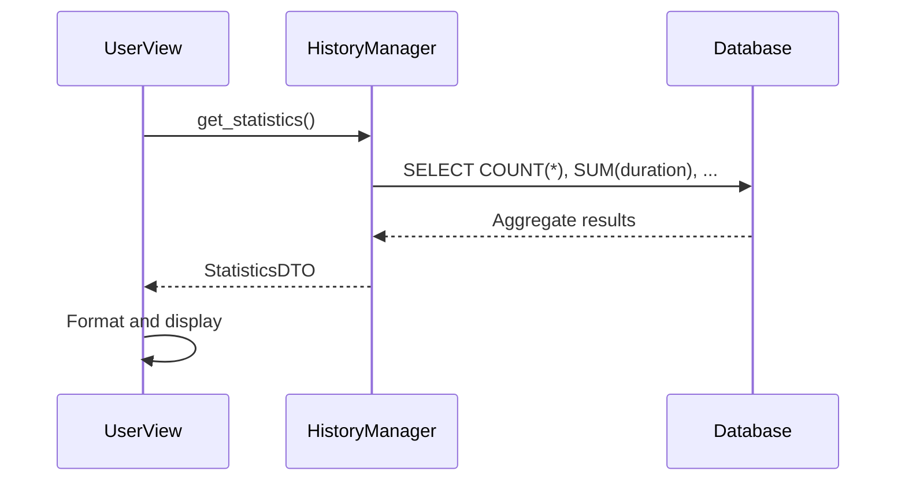

# User View

The User View provides usage metrics and application information.

---

## Overview

The User View displays:
- Transcription statistics
- Usage patterns
- Version information
- Application credits


---

## Location

`src/ui/views/user_view.py`

**View ID:** `VIEW_USER` = `"user"`

---

## Layout

```
┌─────────────────────────────────────────────────────────┐
│                      User Profile                        │
├─────────────────────────────────────────────────────────┤
│                                                          │
│  ┌─────────────────────────────────────────────────────┐│
│  │              📊 Usage Statistics                     ││
│  │                                                      ││
│  │  Total Transcriptions    │  1,247                   ││
│  │  Total Words            │  458,921                  ││
│  │  Total Audio Duration   │  42h 15m                  ││
│  │  Average Length         │  2m 45s                   ││
│  │                                                      ││
│  │  This Month             │  89 transcriptions        ││
│  │  Most Active Day        │  Wednesday                ││
│  │  First Transcription    │  2024-01-15               ││
│  └─────────────────────────────────────────────────────┘│
│                                                          │
│  ┌─────────────────────────────────────────────────────┐│
│  │              🔧 Application Info                     ││
│  │                                                      ││
│  │  Version               │  3.0.0                     ││
│  │  Python                │  3.12.4                    ││
│  │  PyQt6                 │  6.7.0                     ││
│  │  faster-whisper        │  1.0.3                     ││
│  │  CTranslate2           │  4.4.0                     ││
│  │                                                      ││
│  │  Config Path           │  ~/.config/vociferous/    ││
│  │  Database              │  vociferous.db            ││
│  │  Log File              │  vociferous.log           ││
│  └─────────────────────────────────────────────────────┘│
│                                                          │
│  ┌─────────────────────────────────────────────────────┐│
│  │              ❤️ Credits                              ││
│  │                                                      ││
│  │  Vociferous is free, open-source software.          ││
│  │                                                      ││
│  │  • faster-whisper by SYSTRAN                        ││
│  │  • CTranslate2 for inference                        ││
│  │  • Qwen3 models by Alibaba                          ││
│  │  • PyQt6 by Riverbank Computing                     ││
│  │                                                      ││
│  │  [GitHub Repository]  [Report Issue]                ││
│  └─────────────────────────────────────────────────────┘│
│                                                          │
└─────────────────────────────────────────────────────────┘
```

---

## Metrics Display

### Usage Statistics

| Metric | Source | Calculation |
|--------|--------|-------------|
| Total Transcriptions | HistoryManager | `count_all()` |
| Total Words | Aggregation | Sum of word counts |
| Total Audio Duration | Aggregation | Sum of durations |
| Average Length | Derived | Duration / Count |
| This Month | Filtered | Date range query |
| Most Active Day | Aggregation | Day grouping |
| First Transcription | Query | Oldest entry |

### Statistics Calculation



---

## Insights Generation

The view generates contextual insights:

### Example Insights

| Condition | Insight Text |
|-----------|--------------|
| > 1000 transcriptions | "Power user! You've transcribed over 1000 recordings." |
| > 10h audio | "You've captured over 10 hours of audio." |
| First week | "Welcome to Vociferous!" |
| Inactive 7+ days | "Haven't seen you in a while!" |

### Insight Logic

```python
def _generate_insights(self, stats: StatisticsDTO) -> list[str]:
    """Generate personalized usage insights."""
    insights = []
    
    if stats.total_count > 1000:
        insights.append("Power user! Over 1000 transcriptions.")
    
    if stats.total_duration_hours > 10:
        insights.append(f"You've captured {stats.total_duration_hours:.1f} hours.")
    
    return insights
```

---

## Application Information

### Version Details

| Field | Source |
|-------|--------|
| Version | `__version__` from package |
| Python | `sys.version_info` |
| PyQt6 | `PyQt6.QtCore.PYQT_VERSION_STR` |
| faster-whisper | `importlib.metadata` |
| CTranslate2 | `ctranslate2.__version__` |

### Paths Display

| Path | Value |
|------|-------|
| Config | `~/.config/vociferous/` |
| Database | `~/.config/vociferous/vociferous.db` |
| Logs | `~/.config/vociferous/vociferous.log` |
| Models | `~/.cache/vociferous/models/` |

---

## Credits Section

Acknowledges open-source dependencies:

| Project | Purpose |
|---------|---------|
| faster-whisper | Whisper inference |
| CTranslate2 | Efficient inference engine |
| Qwen3 | Refinement language model |
| PyQt6 | GUI framework |
| SQLAlchemy | Database ORM |

### External Links

| Link | URL |
|------|-----|
| GitHub Repository | Project homepage |
| Report Issue | GitHub issues page |
| Documentation | Wiki pages |

---

## Capabilities

The User View is read-only:

| State | can_refresh | can_export |
|-------|-------------|------------|
| Loaded | ✓ | ✓ |
| Loading | | |

---

## Refresh Behavior

Statistics refresh on view activation:

```python
def activate(self) -> None:
    """Called when view becomes active."""
    self._load_statistics()

def _load_statistics(self) -> None:
    """Fetch and display current statistics."""
    stats = self._history_manager.get_statistics()
    self._update_display(stats)
```

---

## Data Export

Users can export their statistics:

### Export Format

```json
{
  "vociferous_stats": {
    "version": "3.0.0",
    "exported_at": "2024-12-01T10:30:00Z",
    "statistics": {
      "total_transcriptions": 1247,
      "total_words": 458921,
      "total_duration_seconds": 152100,
      "first_transcription": "2024-01-15",
      "last_transcription": "2024-12-01"
    }
  }
}
```

---

## Personalization

### Usage Badges

| Badge | Requirement |
|-------|-------------|
| 🌱 Newcomer | < 10 transcriptions |
| 📝 Regular | 10-99 transcriptions |
| 🎤 Active | 100-999 transcriptions |
| ⭐ Power User | 1000+ transcriptions |

### Time-Based Greetings

| Time | Greeting |
|------|----------|
| 5:00-11:59 | "Good morning" |
| 12:00-17:59 | "Good afternoon" |
| 18:00-21:59 | "Good evening" |
| 22:00-4:59 | "Working late?" |

---

## Layout Structure

The view uses a scrollable vertical layout:

```python
def _build_ui(self) -> None:
    layout = QVBoxLayout(self)
    
    # Statistics card
    self._stats_card = StatisticsCard()
    layout.addWidget(self._stats_card)
    
    # Application info card
    self._info_card = ApplicationInfoCard()
    layout.addWidget(self._info_card)
    
    # Credits card
    self._credits_card = CreditsCard()
    layout.addWidget(self._credits_card)
    
    layout.addStretch()
```

---

## Action Dispatch

| ActionId | Handler | Behavior |
|----------|---------|----------|
| `REFRESH` | `_load_statistics` | Reload metrics |
| `EXPORT` | `_export_stats` | Save to JSON |

---

## Related Pages

- [Architecture](Architecture) — Statistics aggregation
- [Data-and-Persistence](Data-and-Persistence) — HistoryManager queries
- [View-History](View-History) — Source data for metrics
